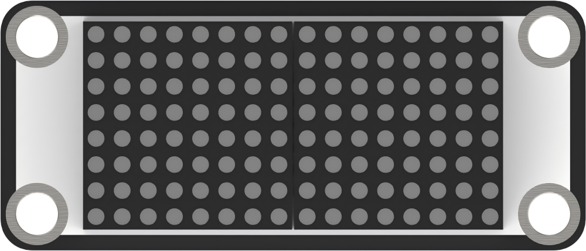
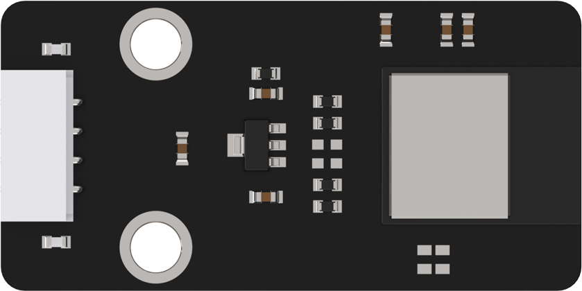
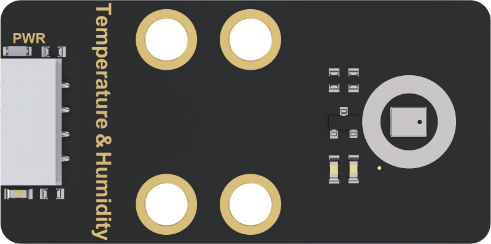
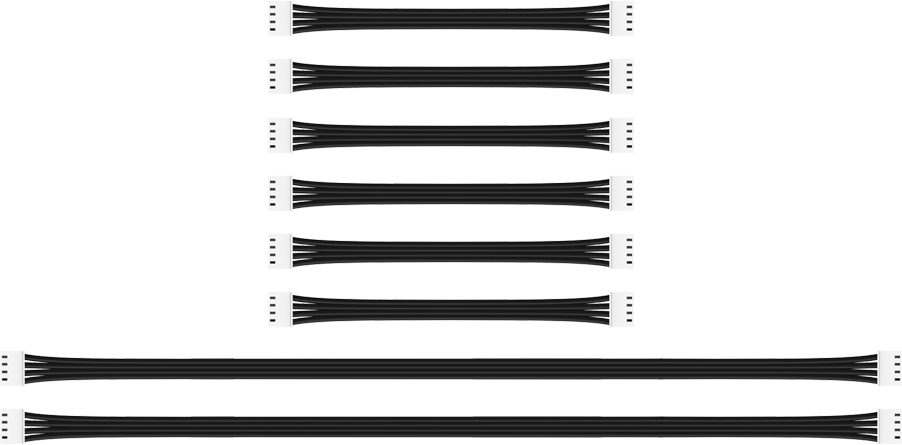
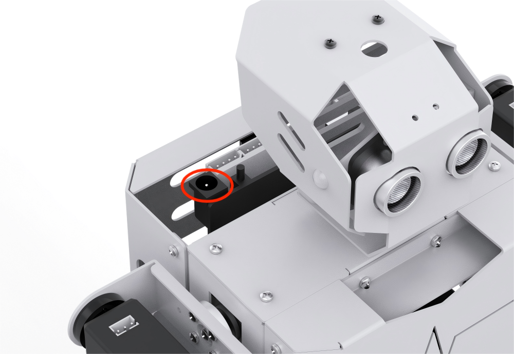
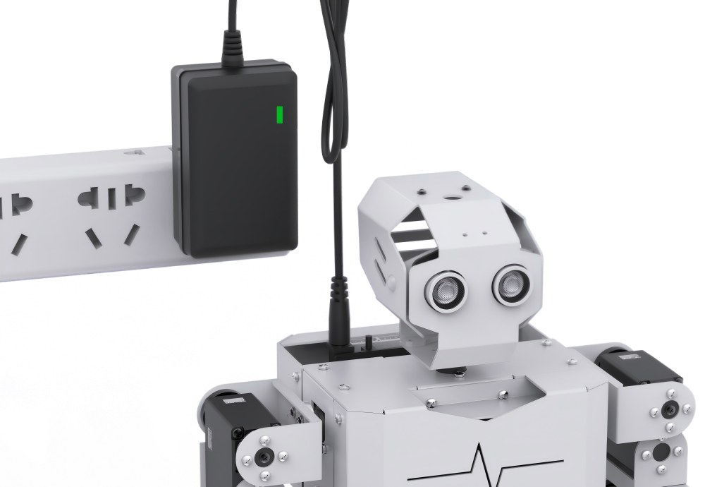

# 1. Getting Ready

## 1.1 Introduction to Tonybot

**1.1.1 Product Introduction**

Tonybot is a versatile, programmable humanoid robot powered by the ESP32 chip. Designed with 16 high-torque servos, it offers more than 50 pre-programmed actions, enabling movements such as walking, dancing, gymnastics, and more. Equipped with advanced sensors, including ultrasonic for distance measurement, and an accelerometer for fall detection and recovery, Tonybot ensures smooth interaction with its environment. Optional voice and vision modules enhance its capabilities, supporting features like voice control, facial recognition, and visual line tracking for an even more interactive experience.

**1.1.2 Usage and Storage Instructions**

(1) This product contains small parts and sharp components, making it unsuitable for children under 12 years old.

(2) Minors should use the product only with adult supervision and guidance.

(3) The product includes small, sharp pieces. Avoid swallowing or applying pressure to prevent injury.

(4) The product contains conductive parts. Do not touch them with metallic objects while powered on.

(5) After powering on the robot, avoid forcefully moving or bending any parts to prevent damage to the servos.

(6) If the product will not be in use for an extended period, please fully charge the battery, remove it, and store the product in a cool, dry place.

**1.1.3 Copyright Notice**

This manual is the property of Shenzhen Hiwonder Technology Co., Ltd. All rights are reserved. Unauthorized reproduction, copying, translation, or distribution of any part of this manual is prohibited without prior written consent.

In the event of copyright infringement, we reserve the right to take appropriate legal action.

**1.1.4 Disclaimer**

The products described in this manual (including hardware, software, etc.) are provided "**as-is**". While we make every effort to ensure the accuracy of the content at the time of publication, we do not guarantee that the manual is free from errors or omissions. The information will be periodically reviewed and updated, and we welcome user feedback for improvements.

Please note that as the product evolves with version upgrades, the details provided in this manual may change. For the most up-to-date information, we recommend contacting customer service before placing an order.

Unless explicitly stated by Shenzhen Hiwonder Technology Co., Ltd., we are not responsible for any damages or malfunctions resulting from the use of the product in extreme conditions or for unintended purposes.

## 1.2 Packing List

(1) Tonybot Standard Packing List

| No.  |             **Components**             | **Quantity** |                                    **Picture**                                     |
|:----:|:--------------------------------------:|:------------:|:----------------------------------------------------------------------------------:|
|  1   | Tonybot humanoid robot (assembled) |      1       |  |
|  2   |        12.6V 2A Battery charger        |      1       |  |
|  3   |       Type-C cable (1000mm)        |      1       |  |
|  4   |              Screwdriver               |      1       |  |
|  5   |              User Manual               |      1       |  |

(2) Tonybot Advanced Packing List

| No.  |              **Components**               | **Quantity** |                                                                               **Picture**                                                                                |
|:----:|:-----------------------------------------:|:------------:|:------------------------------------------------------------------------------------------------------------------------------------------------------------------------:|
|  1   |  Tonybot humanoid robot (assembled)   |      1       |                                                                                        |
|  2   |         12.6V 2A Battery charger          |      1       |                                                                                        |
|  3   |         Type-C cable (1000mm)         |      2       |                                                                                        |
|  4   |                 EVA balls                 |      1       |                                                                                       |
|  5   |                User Manual                |      1       |                                                                                        |
|  6   |         ESP32 S3 AI vision module         |      1       |                                                                                        |
|  7   |                Fan module                 |      1       |                                                                                        |
|  8   |               Touch sensor                |      1       |                                                                                        |
|  9   |             Dot matrix module             |      1       |                                                                                        |
|  10  | Voice interaction module (WonderEcho) |      1       |                                                                                       |
|  11  |                WiFi module                |      1       |                                                                                       |
|  12  |      Temperature and humidity sensor      |      1       |                                                                                       |
|  13  |          Vision module brackets           |      2       |  |
|  14  |        Shoulder expansion brackets        |      2       |                                                                                       |
|  15  |        Hand expansion brackets        |      2       |                                                                                       |
|  16  |                4Pin wires                 |              |                                                                                       |
|  17  |                Screwdriver                |      1       |                                                                                        |
|  18  |               Accessory bag               |      1       |                                                                                       |

## 1.3 Battery Charging Instructions and Usage Guidelines

**1.3.1 Battery Charging Instructions**

To ensure optimal performance, please fully charge the lithium battery before using the product for the first time, as it is not fully charged due to shipping regulations. Follow these steps:

(1) Connect the battery, ensuring the red wire goes to the red terminal and the black wire to the black terminal. (Note: The connector is designed with an anti-reverse feature, so do not force it if it doesn't fit.)

(2) Plug the charger into the side charging port.

(3) The red indicator light will show that charging is in progress.

(4) Once the charging is complete, the green indicator light will turn on. Charging typically takes around 3 hours.

**1.3.2 Battery Usage Guidelines**

(1) Always use the charger provided in the kit to charge the battery.

(2) For optimal performance, keep the battery level above 10V. A low battery may impact the robot's movement.

(3) When charging, the indicator light will be red. Once fully charged, it will turn green. Be sure to disconnect the charger once the battery is fully charged to prevent overcharging.

(4) If you don't plan to use the robot for an extended period, fully charge the battery, disconnect the connector, and store it in a cool, dry place.

(5) Do not modify, solder, or tamper with the battery, charger, or lithium battery in any way.

(6) Keep the battery away from high temperatures and liquids to avoid overheating, fire, or moisture damage, which can reduce performance.

:::{Note}

The company is not responsible for any damage, loss, or safety incidents resulting from misuse or failure to follow these guidelines.

:::

**1.3.3 Device Usage Tips**

(1) Avoid forcing the servos after powering on. Forcing movement can damage the servos.

(2) Don't keep the servos in extreme positions for too long. This could cause them to stall.

(3) Keep fingers away from the robot's joints to avoid accidental pinching.

(4) Servos are delicate and wear out over time. If used excessively, they may need to be replaced.

(5) Avoid continuous detection of objects that are too close with the ultrasonic sensors.

(6) Be careful of the robot falling from high edges during movement—it could get damaged.

(7) Give the robot a break if it's been running for a while. Servos can overheat, so let the robot cool down before resuming.

(8) When transferring programs, make sure to copy the entire folder. Missing files can cause errors during download.