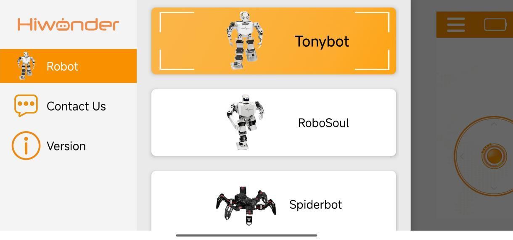
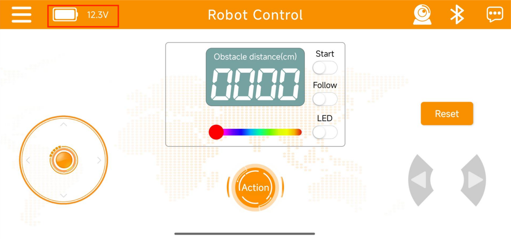

# 2. APP Control

**Tonybot comes with the app control program already pre-installed, so you can start using it right away.**

## 2.1 App Installation

For iOS users: Simply download [Wonderbot](https://apps.apple.com/us/app/wonderbot-robot/id1519146341) from the App Store.

For Android users: Download "**Wonderbot**" from the Google Play Store using this link: <https://play.google.com/store/apps/details?id=com.Wonder.bot>

## 2.2 App Connection

:::{Note}

* Before using the app, ensure that Bluetooth and location services are enabled in your phone's settings.

* Pair the device using the Bluetooth button within the app. Do not attempt to pair it through your phone's settings with a passkey.

:::

(1) Turn ON the robot.

(2) Open the Wonderbot app and tap-on  and select Tonybot from the available robot models.

(3) Once you're in the game control interface, tap the flashing Bluetooth icon  and select Tonybot from the list to complete the connection.

:::{Note}

If you can't find the device, tap the Search button to locate it.

:::

(4) Once the connection is successful, the Bluetooth icon will stay lit, and the battery level will be shown on the left side.

## 2.3 Feature Overview

The app enables you to control Tonybot's movements, ultrasonic obstacle avoidance, ultrasonic following, action groups, and the **"Reset"** function, all with a simple tap of a button.  

The interface is organized into two sections, as illustrated in the image below:

(1) Menu Bar

|                           **Icon**                           |                       **Description**                        |
| :----------------------------------------------------------: | :----------------------------------------------------------: |
|  |    Return to the main interface to select the robot model    |
|  |    Displays Tonybot's current battery level in real-time     |
|  | Camera feed: View the live video stream from the ESP32 camera. |
|  | Bluetooth connection: The icon flashes when disconnected and stays solid once connected. |
|  |                       More information                       |

(2) Control Zone

<table  class="docutils-nobg" style="margin:0 auto" border="1">
<colgroup>
<col  />
<col  />
</colgroup>
<tbody>
<tr>
<td ><strong>Icon</strong></td>
<td ><strong>Description</strong></td>
</tr>
<tr>
<td ></td>
<td >Control Tonybot's movement</td>
</tr>
<tr>
<td ></td>
<td >View ultrasonic distance while in obstacle avoidance mode</td>
</tr>
<tr>
<td ></td>
<td >Turn the ultrasonic obstacle avoidance feature on or off</td>
</tr>
<tr>
<td ></td>
<td >Enable or disable the ultrasonic following feature</td>
</tr>
<tr>
<td ></td>
<td >Switch the ultrasonic RGB lights on or off</td>
</tr>
<tr>
<td ></td>
<td >Adjust the color of the ultrasonic RGB lights</td>
</tr>
<tr>
<td ></td>
<td ><strong>Tap to trigger an action group on Tonybot.</strong> 
(This includes both preset and custom action groups.)</td>
</tr>
<tr>
<td ></td>
<td >Control Tonybot's rotation in place</td>
</tr>
<tr>
<td ></td>
<td >Reset Tonybot's pose</td>
</tr>
</tbody>
</table>

## 2.4 App Control Program Download (Optional)

[mian.py](../_static/source_code/main.zip)

Tonybot comes pre-installed with the app control program. If you download other custom programs, the app control functionality will be overwritten. To restore the app control feature, you can use one of the following methods:

**2.4.1 Restore Program**

The default factory program includes a self-recovery feature. To restore the app control, simply use the Python editor to connect to the device, delete the **"main.py"** program, and restart the device. Follow these steps:

(1) Open the **Hiwonder Python Editor** software.；

(2) Click the Connect button  in the menu. Once the connection is established, the icon will turn green .

(3) In the **"Device (Connected)"** section, right-click the **"main.py"** file and select **Delete**. Afterward, restart the device to complete the process.

**2.4.2 Redownload the App Control Program**

(1) Open the **Hiwonder Python Editor** software .

(2) Click the **Connect** button  in the menu. The icon will turn green once the connection is successfully established .

(3) Drag the **"main.py"** file into the Python editor.

(4) Click  to download the program to the device. After the download is complete, restart the device to finalize the process.

