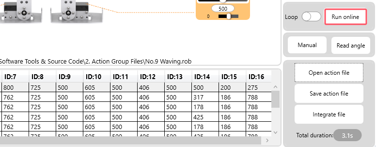

# 3. PC Software Action Control Course

## 3.1 PC Software Function Description

### 3.1.1 Software Installation

(1) Open the installation file located in this folder.

(2) In the pop-up window, choose your preferred installation language and click “**OK**”.

(3) The option to “**Create a desktop shortcut**” is selected by default. Click “**Next**” to proceed.

(4) Once the installation begins, wait for the completion prompt. When it appears, click “**Finish**” to complete the installation.

### 3.1.2 Device Connection

(1) **Charge the battery fully** and ensure the connector is properly connected. (If not, connect the red wire to the red terminal and the black wire to the black terminal.)

(2) **Connect the robot controller to the computer** using a Type-C cable.

(3) Power on the device, then double-click to open the PC software. In the software interface, click on "**Human Mode**" at the top.

(4) Once the device powers on successfully, the software will automatically establish a connection. After the connection is made, the top-right corner of the main screen will display **“Wired Connected”**, and the robot’s eyes in the interface will turn green.

Once connected, the system will automatically detect the device and install the required drivers.

### 3.1.3 Function Description

① Device Connection Status

|                           **Icon**                           |                   **Function Description**                   |
| :----------------------------------------------------------: | :----------------------------------------------------------: |
|  | This indicator shows the device connection status. When connected successfully, it will display green. If the connection is not established or is disconnected, it will turn red and display “**Wired Not Connected**.” |

② Servo Control Zone

The servo control area displays the icon of the selected servo. You can adjust the servo's position by modifying the corresponding slider value.

|                           **Icon**                           |                   **Function Description**                   |
| :----------------------------------------------------------: | :----------------------------------------------------------: |
|  | This represents the servo's ID number, with 1 shown as an example. |
|  | Position Adjustment: The value can be set between 0 (minimum) and 1000 (maximum). |
|  | Deviation Adjustment: The value can range from -100 (minimum) to 100 (maximum). |

③ Action List

The Action List displays the execution time of each action in the current action sequence, along with the servo values for each servo in each action.

|                           **Icon**                           |                   **Function Description**                   |
| :----------------------------------------------------------: | :----------------------------------------------------------: |
|  | Action Group ID: There are a total of 230 action groups, with each group allowing up to 510 actions. If the limit is exceeded, you will be notified that the actions can only be run online and cannot be downloaded. |
|  | Action Duration: This refers to the time it takes to execute the action. |
|  | **Servo Values for Corresponding ID**: These are the servo values for each action. You can double-click the value below  to edit it directly. |

④ Action Group Setting Area

<table  class="docutils-nobg"  border="1">
<colgroup>
<col  />
<col  />
</colgroup>
<tbody>
<tr>
<td ><strong>Icon</strong></td>
<td ><strong>Function Description</strong></td>
</tr>
<tr>
<td ></td>
<td ><strong>Action Group Selection Button</strong>: Click to choose an action group number between 0 and 230. Typically, action group 0 is used for the "Stand" action.</td>
</tr>
<tr>
<td ></td>
<td ><strong>Download Current Actions to Controller</strong>: Downloads the actions from the current list to the controller, overwriting the existing actions in the selected action group.</td>
</tr>
<tr>
<td ></td>
<td ><strong>(Warning)</strong>: This will delete all data in the selected action group (0-230).</td>
</tr>
<tr>
<td ></td>
<td ><strong>Execute Selected Action (Sequence Number)</strong>: Executes the action corresponding to the selected action group number once.</td>
</tr>
<tr>
<td ></td>
<td ><strong>Stop Running Action Group</strong>: Stops the currently running action group.</td>
</tr>
<tr>
<td ></td>
<td ><strong>Add Servo Values as Action</strong>: Adds the current servo values from the servo control area as a new action to the end of the action details list.</td>
</tr>
<tr>
<td ></td>
<td ><strong>Delete Selected Action</strong>: Deletes the selected action from the action details list.</td>
</tr>
<tr>
<td ></td>
<td ><strong>Replace Angle Values in Selected Action</strong>: Replaces the angle values in the selected action with the servo values from the middle servo control area. The action duration will be replaced by the time set in the "Action Time (ms)" field.</td>
</tr>
<tr>
<td ></td>
<td ><strong>Insert New Action Above</strong>: Inserts a new action above the selected one. The time for the new action is determined by the "Action Time (ms)" field, and the angle values are taken from the middle servo control area.</td>
</tr>
<tr>
<td ></td>
<td ><strong>Load Action Group Data</strong>: Click to select the action group you want to load, and its data will be imported into the action details list. 
(Note: Action group files are located in "6. Appendix -&gt; 4. Action Group Files.")</td>
</tr>
<tr>
<td ></td>
<td ><strong>Save Current Action Details</strong>: Saves the current actions from the action details list to a specified location.</td>
</tr>
<tr>
<td ></td>
<td ><strong>Integrate Action Group Files</strong>: After opening one action group, click this button to open and chain another action group file, combining them into a new action group.</td>
</tr>
<tr>
<td ></td>
<td ><strong>Run Action Group</strong>: Click to run the actions from the action details list once. (If "Loop" is checked, the robot will repeat the actions.)</td>
</tr>
<tr>
<td ></td>
<td ><strong>Loosen Robot Joints</strong>: Click to loosen the robot’s joints, allowing you to manually adjust the robot into the desired pose.</td>
</tr>
<tr>
<td ></td>
<td ><strong>Read Posed Angle Information</strong>: This feature reads the angle information from the adjusted pose. (This works in conjunction with the  button.)</td>
</tr>
</tbody>
</table>

⑤ Servo Settings Area: (Feel free to explore the function buttons in this section.)

<table  class="docutils-nobg"  border="1">
<colgroup>
<col  />
<col  />
</colgroup>
<tbody>
<tr>
<td ><strong>Icon</strong></td>
<td ><strong>Function Description</strong></td>
</tr>
<tr>
<td ></td>
<td ><strong>Language Settings</strong>: Click here to choose between Simplified Chinese, Traditional Chinese, or English for the interface.</td>
</tr>
<tr>
<td ></td>
<td ><strong>Reset Servo Icons</strong>: If the servo icons get mixed up, simply click this button to restore them to their original layout. (Works in General Mode)</td>
</tr>
<tr>
<td ></td>
<td ><strong>Clear Selected Servos</strong>: Click to deselect all selected servos and clear the list. (Works in General Mode)</td>
</tr>
<tr>
<td ></td>
<td ><strong>Center All Servos</strong>: Click to bring all servos back to their neutral positions.</td>
</tr>
<tr>
<td ></td>
<td ><strong>Read Servo Deviations</strong>: Click to automatically retrieve the deviation data saved on the controller board.</td>
</tr>
<tr>
<td ></td>
<td ><strong>Download Servo Deviations</strong>: Click to upload the adjusted deviation data from your PC to the robot.</td>
</tr>
<tr>
<td ></td>
<td ><strong>Clear Deviations on PC</strong>: Click to remove the deviation data on the PC, while keeping the data stored on the controller board unchanged.</td>
</tr>
<tr>
<td ></td>
<td >
<strong>Servo ID Display</strong>: The number here represents the servo’s ID. When you see a "√" in the checkbox next to the ID, the corresponding servo’s debug icon will appear in the servo control area.

The robot uses servos with IDs 1-16. In "Humanoid Mode," other IDs cannot be selected.
</td>
</tr>
</tbody>
</table>
## 3.2 Action Invoking

This lesson will cover how to invoke action groups using the PC Software and how to download them to the robot's control board.

###  3.2.1 Open Action Files

(1) Power on the device, then double-click to open the PC software. Once the software is open, click on "Human Mode" at the top of the interface.

(2) After the device powers on successfully, the software will automatically attempt to connect. Once connected, the top-right corner of the main interface will display “Wired Connected,” and the robot’s “eyes” in the interface will turn green.

**The system will then automatically recognize the device and install the necessary drivers.**

(3) Click on “**Open Action File**.”

(4) Navigate to the folder path [Appendix ->2. Action Group Files]() and locate the action group titled **“Wave No. 9.”** Click **“Open.”**

(5) The opened action file will now appear in the action list.

###  3.2.2 Run Action Groups Online

Click **“Run Online”** to initiate the execution of the action group.

###  3.2.3 Download Action Groups

To run the action group offline or call it in future programs, you can download it to an action group slot.

(1) Click the dropdown menu next to the action group number and choose a number (Note: Some numbers between 0 and 110 are already assigned. To avoid overwriting existing action groups, select a number greater than 110. For example, 130 is used here). Then, click “Download.”

(2) After the download is complete, a **“Download Complete”** window will appear. Click **“OK”** to confirm.

(3) Choose the action group number and click **“Run Action Group”** to execute it.

(4) When you want to use this action group in future programs, just update the action group number accordingly.

## 3.3 Action Editing

In this lesson, we will create an action group made up of 7 actions, enabling the robot to perform a 'greeting' sequence.

### 3.3.1 Action Implementation

(1) Double-click the PC software and switch to "Humanoid Mode" from the main interface.

(2) In the action group settings area, click the “**Open Action File**” button to open action group 0 from the path “[Appendix -\> 2. Action Group Files]()” 

:::{Note}

Action groups 1-4 are basic robot movements and are encrypted; they can only be downloaded, not edited or run online.

:::

(3) Once the first action is loaded, click the “**Run Online**” button to update the servo values in the corresponding control area.

(4) Next, edit the second action. Based on the servo ID distribution on the left, slide the servo 8 slider to the left, which will raise the robot’s left arm.

Hold down the left mouse button and click the slider quickly for fine adjustments.

(5) Click “**Add Action**” to add the raised left arm action to the action list on the right.

(6) Now, let’s slightly bend the left arm. Slide the servo 6 slider to the 740 position and click **“Add Action”** to include this action.

(7) To make the arm swing, move the servo 6 slider to the 570 position and add the action as before.

(8) After the arm swings, slide servo 6 to the 735 position and add it as the fifth action.

(9) Then, move servo 6 to the 575 position, completing the second swing, and add it as the sixth action.

(10) After the arm completes its swings, lower the arm and return the robot to a standing position. Right-click action 1 and select **“Copy,”** then right-click on action 6 and choose “Paste Down” to successfully copy action 1.

(11) The action group list is now complete, recording the necessary servo rotation parameters for each action.

### 3.3.2 Action Download

(1) After editing the action, save it locally for future debugging. Click the **“Save Action File”** button. In the pop-up window, enter a file name and serial number (e.g., “Action Group 81”), then click **“Save”** as shown in the image below.

(2) Once saved, download the action to the designated action group. On the right side of the interface, select action group number 81, then click the **“Download”** button.

(3) When the download is complete, the robot will emit a **“beep”** sound as a reminder, and a **“Download Complete”** message will appear. Click **“OK”** to close the prompt.

## 3.4 Integrate Action Files

In this lesson, we will introduce the function of integrating action files on the robot, enabling the merging of multiple action groups.

(1) Launch the PC software and connect to the serial port. Then, click the "**Integrate Action Files**" button in the action group settings section and open action group 9 from the “[Appendix -\> 2. Action Group Files]()” directory.

(2) You’ll see the details of action group 9 displayed in the action group list.

(3) Click the "**Integrate Action Files**" button again and select action group 10 to link it.

(4) To see the results, you can click "**Run Online**" to execute the newly chained action group.

(5) Click the **"Save"** button to save the newly created action group for future use. We’ll call it **“82-Wave and Bow.”**

:::{Note }

If the action list exceeds 510 actions, the software will warn you that the limit has been exceeded. In such cases, the action group can only be run online, not downloaded to the control board.

:::

## 3.5 Offline Running

This lesson explains how to disconnect the robot from computer-based control and trigger actions using a button.

(1) Open an action group file from the directory [Appendix -\> 2. Action Group Files](), such as action group 7, “**Push-up**.”

(2) On the right side, select action group number 100 and click “**Download**.”

:::{Note}

The robot is pre-configured with action group 100 as the starting action group for offline mode. Other action group numbers, such as 98, will not work as the starting number for offline actions.

:::

(3) After the action is downloaded, a success message will appear on the host computer. Click “**OK**” to close the message.

(4) Place the robot on a flat surface, turn on the power, and briefly press the black elastic button at the back of the robot’s head to run action group 100 offline.

To make the action group loop continuously, press and hold the elastic button for 3 seconds.
