# 4. Scratch Programming Projects

## 4.1 WonderCode User Guide

### 4.1.1 WonderCode Software Overview and Installation

WonderCode is a Scratch-based programming tool designed specifically for Hiwonder products. It supports the automatic conversion between graphical command blocks and Python code. By simply dragging and dropping command blocks, users can easily write programs, making it a great choice for beginners learning to program.

(1) Locate and open the installation file "[**WonderCode setup.exe**](https://drive.google.com/drive/folders/1DvebM-ic0hn_MFobA7cVo24GZoXOLTgP?usp=sharing)" in the same folder as this document, or find it in the "**Appendix**".

(2) In the "**Select Installation Language**" window, choose "**English**," then click "**OK**."

(3) Select your preferred installation location. You can either use the default folder or choose a custom path. Once done, click **"Next."**

(4) The **"Additional Tasks"** window will appear. The option to **"Create Desktop Shortcut"** is selected by default. You can leave this as is and click **"Next"** to continue.

(5) Click the **"Install"** button to begin the installation process.

(6) The installation will begin, and a progress bar will be displayed to show the status.

(7) Once the installation is finished, click **"Finish"** to complete the process.

(8) After installation, the **"WonderCode"** icon will appear on your desktop.

### 4.1.2 Device Connection

(1) Connect your device and double-click to launch the "[**WonderCode**](https://drive.google.com/drive/folders/1DvebM-ic0hn_MFobA7cVo24GZoXOLTgP?usp=sharing)" software.

(2) Before you can connect, you'll need to add the device's extension package. Without it, the connection won't work. To add the extension, click the "**Add Extension**" button  located in the bottom-left corner of the main interface. In the pop-up window, select **"Robot -&gt; Tonybot"** in order.

(3) After that, click the "**Connect**" button and choose the correct port for the connection.

:::{Note}

The port number can vary based on your system's setup. For instance, in this case, the port number used is "**COM4**", but avoid using "**COM1**", as it's typically the system's communication port.

:::

If you're connecting multiple USB devices and aren't sure which port to use, you can find it by opening **"This PC"** on your desktop. Then go to **"Properties -\> Device Manager,"** where you'll find the port corresponding to the Tonybot controller (it will show as "**CH340**").

(4) Once the device and software are successfully paired, you should see a confirmation message indicating the connection was successful.

### 4.1.3 Function Description

The image below illustrates the functional areas of the "**WonderCode**" software:  

① Menu Bar, 

② Command Area, 

③ Script Area,

④ Code Display and Upload Area.

The functions corresponding to each area are listed in the table below:

|                           **Icon**                           |                                                                                                                                                                 **Function**                                                                                                                                                                  |
| :----------------------------------------------------------: |:---------------------------------------------------------------------------------------------------------------------------------------------------------------------------------------------------------------------------------------------------------------------------------------------------------------------------------------------:|
|  |                                                                                                                   **Create, Save, and Open Program Files**: This option allows you to create, save, and open program files.                                                                                                                   |
|  |                                                                                                              **Online Mode (Reference Only)**: This section is for understanding the online mode. No need to master it for now.                                                                                                               |
|  |                                                                                                               **Connect Device and Software**: Use this to connect your device to the software and choose the appropriate port.                                                                                                               |
|  |                                                                                                                **Help, Updates, and Driver Installation**: Access help, check for updates, or install necessary drivers here.                                                                                                                 |
|  |                                                                                   **Program File Name Display**: Displays the name of the program file. If you haven't started programming or the file isn't saved yet, it will show "**Scratch Project**".                                                                                   |
|  | **Switch Between Modes**: Use this button to toggle between "Online Mode" and "Upload Mode." Be sure to save your work before switching, as unsaved files will be lost (Note: Online Mode is used for activities like playing animations and making games, while Upload Mode is for interacting with your device and utilizing its features). |
|  |                                                                                                      **Language Options**: Choose the language for the interface, with options for English, Simplified Chinese, and Traditional Chinese.                                                                                                      |
|  |                                                                                                                                      **Undo and Redo**: Easily undo or redo actions during programming.                                                                                                                                       |
|  |                                                                          **Switch Editing Modes**: Toggle between "**Auto Transcoding**", which converts block-based programming into Python, and "**Python Programming**", where you can directly edit with Python.                                                                          |
|  |                                                                                                                                       **Save as Python Code**: Save your program in Python code format.                                                                                                                                       |
|  |                                                                                                                                    **Open Saved Python Files**: Open Python files you've previously saved.                                                                                                                                    |
|  |                                                                                                                        **Device Interaction**: Download your program to the main control board for device interaction.                                                                                                                        |
|  |                                                                                                                               **Add Device Extension Package**: Add necessary extensions for your device here.                                                                                                                                |
|  |                                                                                                                     **Zoom Controls**: Adjust the zoom for your code editing interface, or reset it to the default size.                                                                                                                      |

### 4.1.4 Programming Instructions

Here's an example to guide you through programming to light up the ultrasonic RGB LEDs:

(1) Find the **"Tonybot Main Program"** block within the Tonybot command set and drag it into the code editing area.

:::{Note}

If you want to remove a block, simply drag it back to the command set area from the code editing section.

:::

(2) Next, drag the "**Repeat**" block from the control command set and place it below the previous block.

(3) In the lower-left corner, add the **"Glowy Ultrasonic Sensor"** extension package.

(4) From the sensor command set, drag out the block to set the color of the ultrasonic LED lights. Place it inside the **"Repeat"** block and configure all LEDs to glow red.

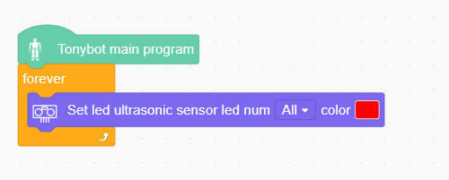

(5) Once you're done, click **"Upload"** to transfer the program to the main controller.

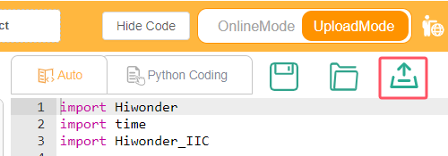

(6) To save your work, click "**File -\> Save to Computer**" in the top-left corner.

## 4.2 Secondary Development Course

### 4.2.1 Breathing Light Project

* **Project Introduction**

In this lesson, we will make the RGB LED on the ultrasonic sensor blink.

* **Program Implementation Process**

* **Introduction to Glowy Ultrasonic Sensor**

This is a glowy ultrasonic distance sensor module that communicates via I2C. It reads the distance measured by the ultrasonic sensor using the I2C protocol.

When measuring distance, the module sends out 8 pulses of 40kHz square waves and checks for any returning signals. If a signal is detected, the module outputs a high-level signal, and the duration of this high signal corresponds to the time taken for the ultrasonic waves to travel to the target and back.

The ultrasonic sensor is pre-installed on the robot when it leaves the factory.

* **Program Download**

[Breathing Light Program](../_static/source_code/04/Breathing%20Light%20Program.zip)

(1) Open the WonderCode software 

(2) Drag the **"02 Breathing Light Program.sb3"** file from the same folder as this document into WonderCode.

(3) In the menu bar, click on **"Connect device"** and select the correct COM port (e.g., COM7). Once the connection is successful, you'll see a **"Connect Success"** message.

(4) Hit the Upload button  on the right to transfer the program to the Tonybot. Wait for the confirmation that the upload is complete.

* Achieved Effect

:::{Note}

For optimal experience, it is recommended to use this feature in a dimly lit environment.  

:::

The RGB lights on the ultrasonic device will emit blue light and flash every 2 seconds.

* **Program Analysis**

[Breathing Light Program](../_static/source_code/04/Breathing%20Light%20Program.zip)

(1) Initialize the posture of Tonybot and configure the flags for the buttons and actions.

(2) In the main program, set the color and cycle period for the ultrasonic RGB lights.

* **Function Extension**

To modify the color and cycle duration of the ultrasonic device, simply adjust the color settings and cycle time (in seconds). Additionally, the left and right RGB lights of the device can be set to different colors.

### 4.2.2 Distance Ranging & Display Project

* **Assembly**

* **Project Introduction**

This section utilizes the ultrasonic module to measure the distance to an obstacle. The measured distance is displayed on the LED dot matrix, and the RGB light color of the ultrasonic module is adjusted accordingly.

* **Program Implementation Process**

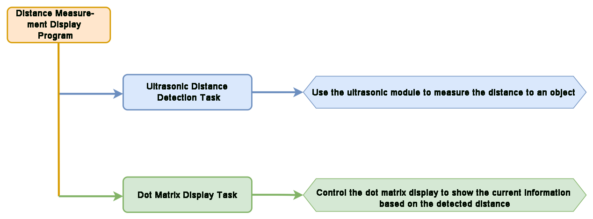

* **Sensor Introduction**

**(1) Glowy Ultrasonic Sensor**

This is a light-emitting ultrasonic distance sensor module that communicates via I2C. It reads the distance measured by the ultrasonic sensor using the I2C protocol.

When measuring distance, the module sends out 8 pulses of 40kHz square waves and checks for any returning signals. If a signal is detected, the module outputs a high-level signal, and the duration of this high signal corresponds to the time taken for the ultrasonic waves to travel to the target and back.

**(2) LED Dot Matrix Display**

The LED dot matrix module utilizes an LED display screen that offers high brightness, flicker-free performance, and easy wiring. It is capable of displaying numbers, text, patterns, and other content. The module consists of two red 8x8 LED matrices and is controlled by the TM640B driver chip, which enables efficient control of the dot matrix screen.

For a detailed introduction to the installation and assembly process, please refer to the tutorial video.

* **Program Download**

[Distance Ranging & Display Program](../_static/source_code/04/Distance%20Ranging%20&%20Display%20Program.zip)

(1) Open the WonderCode software 

(2) Drag the **"03 Distance Ranging & Display.sb3"** file from the same folder as this document into WonderCode.

(3) In the menu bar, click on **"Connect device"** and select the correct COM port (e.g., COM7). Once the connection is successful, you'll see a **"Connect Success"** message.

(4) Hit the Upload button  on the right to transfer the program to the Tonybot. Wait for the confirmation that the upload is complete.

* **Achieved Effect**

Slowly bring the object closer to the glowy ultrasonic sensor. As the distance decreases, the ultrasonic light will shift towards red, and as the distance increases, it will become greener. The LED dot matrix display will update in real-time to show the measured distance.

* **Program Analysis**

[Distance Ranging & Display Program](../_static/source_code/04/Distance%20Ranging%20&%20Display%20Program.zip)

(1) Initialize Tonybot's posture, set up the dot matrix, and configure the initial action sequence.

(2) In the main program, assign the detected obstacle distance to the variable **'distance,'** display this distance numerically on the dot matrix screen, and introduce a 0.1-second delay.

* **FAQ**

**Q: Why is the ultrasound distance measurement sometimes accurate and sometimes inaccurate?** 

**A:** For optimal accuracy, please use smooth, flat surfaces when measuring distance, and avoid prolonged close-range measurements of obstacles.

### 4.2.3  Distance-Controlled Walking Project

* **Project Introduction**

In this lesson, the ultrasonic sensor is used to measure obstacles in front of the robot. When the detected distance falls within the predefined range set by the program, the robot will move forward or backward accordingly.

* **Program Implementation Process**

* **Sensor Introduction**

This is a light-emitting ultrasonic distance sensor module that communicates via I2C. It reads the distance measured by the ultrasonic sensor using the I2C protocol.

When measuring distance, the module sends out 8 pulses of 40kHz square waves and checks for any returning signals. If a signal is detected, the module outputs a high-level signal, and the duration of this high signal corresponds to the time taken for the ultrasonic waves to travel to the target and back.

* **Program Download**

[Distance-Controlled Walking Program](../_static/source_code/04/Distance-Controlled%20Walking%20Program.zip)

(1) Open the WonderCode software 

(2) Drag the "02 Distance-Controlled Walking.sb3" file from the same folder as this document into WonderCode.

(3) In the menu bar, click on **"Connect"** and select the correct COM port (e.g., COM7). Once the connection is successful, you'll see a "Connection Successful" message.

(4) Hit the Upload button  on the right to transfer the program to the Tonybot. Wait for the confirmation that the upload is complete.

* **Achieved Effect**

:::{Note}

Avoid using the ultrasonic sensor to continuously detect objects that are extremely close.

:::

Place a cardboard box in front of the ultrasonic sensor. When the distance is between 28 and 40 cm, the robot will move forward. When the distance is between 3 and 18 cm, the robot will move backward.

* **Program Analysis**

[Distance-Controlled Walking Program](../_static/source_code/04/Distance-Controlled%20Walking%20Program.zip)

(1) Initialize the Tonybot's posture and set the initial action.

(2) In the main program, initiate an infinite loop. The Distance variable stores the current measurement between the sensor and the obstacle. When the step variable is set to 0, the program will proceed with the subsequent actions. If the measured distance to the obstacle meets the specified condition, the robot will execute either a forward or backward movement.

(3) When the step variable is 1, if the detected distance is greater than 3 and less than 18, or if the have_move variable equals 1, then initialize the have_move variable and run action group 22 once. If the conditions are not met, update the step to 3.

### 4.2.4 Treasure Hunt Project

* **Project Introduction**

In this lesson, the robot's servo controlling the ultrasonic sensor will rotate back and forth. When the set conditions are met, the robot will turn in the corresponding direction.

* **Program Implementation Process**

* **Sensor Introduction**

This is a light-emitting ultrasonic distance sensor module that communicates via I2C. It reads the distance measured by the ultrasonic sensor using the I2C protocol.

When measuring distance, the module sends out 8 pulses of 40kHz square waves and checks for any returning signals. If a signal is detected, the module outputs a high-level signal, and the duration of this high signal corresponds to the time taken for the ultrasonic waves to travel to the target and back.

* **Program Download**

[Treasure Hunt Program](../_static/source_code/04/Treasure%20Hunt%20Program.zip)

(1) Open the WonderCode software 

(2) Drag the **"02 Treasure Hunt.sb3"** file from the same folder as this document into WonderCode.

(3) In the menu bar, click on **"Connect"** and select the correct COM port (e.g., COM7). Once the connection is successful, you'll see a **"Connection Successful"** message.

(4) Hit the Upload button  on the right to transfer the program to the Tonybot. Wait for the confirmation that the upload is complete.

* **Achieved Effect**

The servo beneath the ultrasonic sensor will first rotate back and forth, simultaneously measuring the distance between the robot and any obstacles. The distances will then be compared.

If the distance on one side is relatively closer to the robot, the robot will turn in the corresponding direction. In other words, if the distance on the left is shorter, the robot will turn left; if the distance on the right is shorter, the robot will turn right.

* **Program Analysis**

[Treasure Hunt Program](../_static/source_code/04/Treasure%20Hunt%20Program.zip)

(1) Initialize the posture of Tonybot and set the initial actions.

(2) In the main program, declare the required global variables. Then, the program enters an infinite loop, continuously reading distance data from the ultrasonic sensor and performing corresponding actions based on different conditions.

**First iteration (step = 0):**

① The program executes the logic for step = 0, using the measured distance to control the ultrasonic RGB module, which lights up in different colors depending on the distance.

② If the forward distance to the treasure box falls within a moderate range (30–350), the logic for step = 1 is executed (while step remains 0). If the distance is too large, step is set to 1, prompting the program in the next loop to search for the direction closest to the treasure box.

**Second iteration (step = 1):**

① The program rotates the servo to detect the distance from four directions: 45° (front-left), 0° (left), 145° (front-right), and 180° (right).

② It then updates step to 2, allowing the program to proceed to directional decision-making in the next loop.

**Third iteration (step = 2):**

① The program first processes and normalizes the distance values. If the sensor cannot detect the treasure box in a given direction (returns 0), that direction is treated as having an infinite distance, standardized to 9999.

② It then compares the distances from all directions to determine the shortest path to the treasure box. If the closest direction is on the left, the RGB module lights up blue; if on the right, it lights up red. The robot then performs a series of turns to align itself with the selected direction.

:::{Note}

If the forward direction still yields the shortest distance despite being large, the robot will not perform any turning motion. In this case, the RGB light will remain green, as set during step = 0.

:::

(3) Through this three-step cycle, the function’s complete detection and decision-making process is executed.

(4) In this code block, once step is updated to 2, the program evaluates the conditions and executes the corresponding actions—such as changing the color of the ultrasonic RGB light and triggering Action Group 34.

* **Function Extension**

(1) Adjusting the Detection Range

① To modify the detection range, simply update the code within the highlighted section, as shown below:

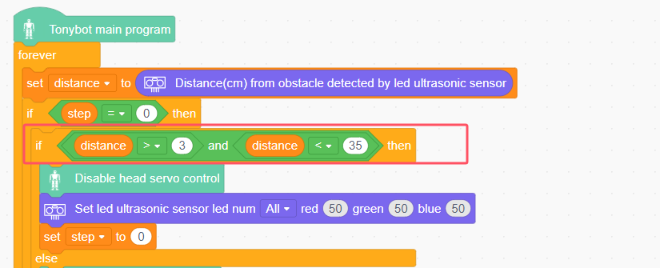

② When the detected distance between an object and the robot is greater than 3 cm but less than 35 cm, the system identifies the presence of a "treasure box" and triggers the treasure-hunting action. You can adjust the detection range by changing the condition in the distance check, as shown below:

(2) Modifying the Turning Conditions

① To adjust the turning conditions, update the code in the specified section of the program, as illustrated below:

② The program first evaluates the 5 measured directions and determines which one has the shortest distance. It then checks if this distance is within the defined detection range. If it is, the robot will perform the corresponding turning action.

③ To modify the detection range, you can adjust the distance values in each directional check. For example, when the left side is the closest and the distance is under 400, the robot will turn left, as shown below:

### 4.2.5 Low-Altitude Navigation Project

* **Project Introduction**

When the ultrasonic sensor detects an obstacle ahead, the robot will move forward a short distance in a crouching posture. Afterward, it will return to an upright position and continue moving forward in its normal stance.

* **Program Implementation Process**

* **Sensor Introduction**

This is a light-emitting ultrasonic distance sensor module that communicates via I2C. It reads the distance measured by the ultrasonic sensor using the I2C protocol.

When measuring distance, the module sends out 8 pulses of 40kHz square waves and checks for any returning signals. If a signal is detected, the module outputs a high-level signal, and the duration of this high signal corresponds to the time taken for the ultrasonic waves to travel to the target and back.

* **Program Download**

[Low-Altitude Navigation Program](../_static/source_code/04/Low-Altitude%20Navigation%20Program.zip)

(1) Open the WonderCode software 

(2) Drag the **"02 Low-Altitude Navigation.sb3"** file from the same folder as this document into WonderCode.

(3) In the menu bar, click on **"Connect"** and select the correct COM port (e.g., COM7). Once the connection is successful, you'll see a "**Connection Successful**" message.

(4) Hit the Upload button  on the right to transfer the program to the Tonybot. Wait for the confirmation that the upload is complete.

* **Achieved Effect**

:::{Note}

Avoid using the ultrasonic sensor to continuously detect objects that are too close.

:::

You can create a **"small tunnel"** using several cardboard boxes. As the robot moves forward, if the ultrasonic sensor detects an obstacle ahead, it will emit a beeping sound as an alert. Simultaneously, the RGB light on the ultrasonic sensor will change from green to red.

The robot will then move forward a short distance in a crouching posture. After passing through the obstacle, it will return to an upright position and continue moving forward in its normal stance.

* **Program Analysis**

[Low-Altitude Navigation Program](../_static/source_code/04/Low-Altitude%20Navigation%20Program.zip)

(1) Initialize the posture of Tonybot and set the initial actions.

(2) Initialize global variables, such as distance (distance), step (step), DLC (distance threshold), DL (another distance threshold), and others.

(3) Enter a loop to continuously read the distance values from the ultrasonic sensor. Based on the distance values and the current step (step), execute the corresponding actions and update the step accordingly.

(4) Within the loop, the robot executes different movement behaviors based on the current step value:

**First Iteration (step = 0):**

①　The program runs the logic for step = 0. If the measured distance is greater than the predefined threshold (i.e., no obstacle is detected and the distance value is 0), the robot executes a specific action group, lights up green, and transitions to the logic for the second iteration on the next loop cycle.

②　If the measured distance is less than the threshold, the robot remains in the step = 0 logic branch during the next loop cycle.

**Second Iteration (step = 1):**

①　If, during the time between the previous and current iterations, the newly measured distance falls below the threshold, the robot performs two action groups, lights up red, and activates the buzzer as an alert. It then shifts to a low-stance standing position and proceeds to step = 2 in the next cycle.

②　If the distance remains above the threshold, the robot performs a high-stance walking action and stays in the step = 1 branch in the following loop.

**Third Iteration (step = 2):**

①　If the newly measured distance is still below the threshold, the robot executes two action groups, lights up blue, and transitions from a stationary low stance to low-stance forward movement.

②　If the distance exceeds the threshold, the robot maintains its low-stance standing position and remains in the step = 2 logic on the next cycle.

**Fourth Iteration (step = 3):**

①　The robot first performs a low-stance standing action to stop any ongoing low-stance movement, then transitions to a high-stance standing state.

②　On the next loop cycle, the program resets and returns to the logic branch for step = 0.

### 4.2.6 Head-Shaking Obstacle Avoidance

* **Project Introduction**

When the ultrasonic sensor detects an obstacle ahead, the robot will move to avoid the obstacle, implementing intelligent obstacle avoidance.

* **Program Implementation Process**

* **Sensor Introduction**

This is a light-emitting ultrasonic distance sensor module that communicates via I2C. It reads the distance measured by the ultrasonic sensor using the I2C protocol.

When measuring distance, the module sends out 8 pulses of 40kHz square waves and checks for any returning signals. If a signal is detected, the module outputs a high-level signal, and the duration of this high signal corresponds to the time taken for the ultrasonic waves to travel to the target and back.

* **Program Download**

[Head-Shaking Obstacle Avoidance Program](../_static/source_code/04/Head-Shaking%20Obstacle%20Avoidance%20Program.zip)

(1) Open the WonderCode software 

(2) Drag the **"Head-Shaking Obstacle Avoidance.sb3"** file from the same folder as this document into WonderCode.

(3) In the menu bar, click on "**Connect**" and select the correct COM port (e.g., COM7). Once the connection is successful, you'll see a "Connection Successful" message.

(4) Hit the Upload button  on the right to transfer the program to the Tonybot. Wait for the confirmation that the upload is complete.

* **Achieved Effect**

:::{Note}

Avoid using the ultrasonic sensor to continuously detect objects that are too close.

:::

When an obstacle is detected ahead, the robot will stop and perform a head-shaking motion to check for obstacles on the left and right. Based on the detection results, the robot will turn in the direction where no obstacle is present and continue moving forward.

* **Program Analysis**

[Head-Shaking Obstacle Avoidance Program](../_static/source_code/04/Head-Shaking%20Obstacle%20Avoidance%20Program.zip)

(1) Initialize the Tonybot's posture and set the initial motion.

(2) Execute specific actions to avoid obstacles based on the distance measurements obtained from the ultrasonic sensor.

### 4.2.7 Fall and Recover Program Project

* **Project Introduction**

This section utilizes an accelerometer to monitor the current state. Upon detecting a fall, the robot will initiate the action to stand up.

* **Program Implementation Process**

* **Sensor Introduction**

This section makes use of the onboard QMI8658 motion sensor, which has a wide range of applications, including handheld gaming devices, 3D controllers, and portable navigation systems.

It integrates a 3-axis MEMS gyroscope, a 3-axis MEMS accelerometer, and an expandable Digital Motion Processor (DMP).

* **Program Download**

[Fall and Recover Program](../_static/source_code/04/Fall%20and%20Recover%20Program.zip)

(1) Open the WonderCode software 

(2) Drag the **"Fall and Recover.sb3"** file from the same folder as this document into WonderCode.

(3) In the menu bar, click on **"Connect"** and select the correct COM port (e.g., COM7). Once the connection is successful, you'll see a **"Connection Successful"** message.

(4) Hit the Upload button  on the right to transfer the program to the Tonybot. Wait for the confirmation that the upload is complete.

* **Achieved Effect**

:::{Note}

In the fall and recover mode, when the robot is powered on or restarted, the IMU will initialize. Wait for the 'beep' sound to confirm that initialization is complete.

:::

After turning on the robot, place it flat either on its front or back. After a brief moment, the robot will automatically perform the standing action. (The standing action differs depending on whether the robot is placed face up or face down.)

* **Program Analysis**

[Fall and Recover Program](../_static/source_code/04/Fall%20and%20Recover%20Program.zip)

(1) Initialize the Tonybot's posture and set the initial action.

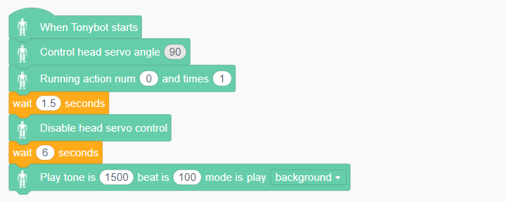

(2) Read the IMU sensor's angles. By obtaining the roll angle values, detect whether the robot is in a **"fallen"** state, and execute the standing action group based on this status.

### 4.2.8 Smart Fan Project

* **Sensor Installation & Wiring**

* **Project Introduction**

This section utilizes a glowy ultrasonic sensor to measure the distance to obstacles. Based on the detected distance, the arm is raised, the fan is activated, and the color of the ultrasonic RGB LED changes accordingly.

* **Program Implementation Process**

* **Sensor Introduction**

**(1) Glowy Ultrasonic Sensor**

This is a light-emitting ultrasonic distance sensor module that communicates via I2C. It reads the distance measured by the ultrasonic sensor using the I2C protocol.

When measuring distance, the module sends out 8 pulses of 40kHz square waves and checks for any returning signals. If a signal is detected, the module outputs a high-level signal, and the duration of this high signal corresponds to the time taken for the ultrasonic waves to travel to the target and back.

**(2) Fan Module**

The fan module is a sensor that operates without the need for an external motor driver board, utilizing PWM (pulse-width modulation) to control its movement. The direction of the fan's rotation is managed by PWM pulse waveforms in both directions, while the fan speed is adjustable by modifying the duty cycle of the PWM signal.

For module installation and wiring, please refer to the section 1 in the same folder.

* **Program Download**

[Smart Fan Program](../_static/source_code/04/Smart%20Fan%20Program.zip)

(1) Open the WonderCode software 

(2) Drag the **"Smart Fan.sb3"** file from the same folder as this document into WonderCode.

(3) In the menu bar, click on **"Connect"** and select the correct COM port (e.g., COM7). Once the connection is successful, you'll see a **"Connection Successful"** message.

(4) Hit the Upload button  on the right to transfer the program to the Tonybot. Wait for the confirmation that the upload is complete.

* **Achieved Effect**

Slowly move the object closer to the glowy ultrasonic sensor. If the distance is less than 300mm, the robot will extend its right hand and activate the fan. If the distance exceeds 300mm, the right hand will lower, and the fan will be deactivated.

* **Program Analysis**

[Smart Fan Program](../_static/source_code/04/Smart%20Fan%20Program.zip)

(1) Initialize the Tonybot's posture, set the initial action, and initialize the ultrasonic RGB lights.

(2) Infinite loop:  

Within the loop, different actions are performed based on the distance between the device and obstacles, with movements triggered by the angle. For example, when the distance is less than 30 cm, the ultrasonic RGB lights will turn green. Then, Servo 16 will execute an action lasting 500 ms, followed by a 0.5-second pause before the loop repeats.

### 4.2.9 Touch Control Project

* **Sensor Installation & Wiring**

* **Project Introduction**

Touch the capacitive pad on the touch sensor, and Tonybot will perform a bowing motion.

* **Program Implementation Process**

* **Sensor Introduction**

The touch sensor operates based on capacitive sensing technology, detecting the presence of human skin or metal through its gold-plated contact surface.

When no human or metal is in contact with the surface, the signal output is high. Upon contact with a human or metal, the signal output becomes low. Additionally, the sensor can detect contact through materials such as plastic or paper. The sensitivity of detection is influenced by the size of the contact surface and the thickness of the covering material.

For module installation and wiring, please refer to the section 1 in the same directory.

* **Program Download**

[Touch Control Program](../_static/source_code/04/Touch%20Control%20Program.zip)

(1) Open the WonderCode software 

(2) Drag the "**Touch Control.sb3**" file from the same folder as this document into WonderCode.

(3) In the menu bar, click on **"Connect"** and select the correct COM port (e.g., COM7). Once the connection is successful, you'll see a **"Connection Successful"** message.

(4) Hit the Upload button  on the right to transfer the program to the Tonybot. Wait for the confirmation that the upload is complete.

* **Achieved Effect**

Tap the capacitive pad on the touch sensor, and Tonybot will perform a bowing motion.

* **Program Analysis**

[Touch Control Program](../_static/source_code/04/Touch%20Control%20Program.zip)

(1) Initialize the touch sensor interface and configure Tonybot's initial posture.

(2) If the touch sensor is pressed and the enter_flag is 0, set enter_flag to 1 and execute action group 10 once. If the touch sensor is not pressed, set enter_flag to 0, wait for 0.05 seconds, and then continue repeating the process.

* **Function Extension**

Here's a clear example of how to change the action group from bowing to twisting:

Find the part of the code that executes the action group. Replace the reference to action group 10 (bowing) with action group 50 (twisting). This modification will allow the twisting action group to be triggered by the touch sensor instead of the bowing action.

* **FAQ**

Q: Why isn't the touch sensor responding after uploading the code?  

A: Please ensure that the touch sensor is connected to the correct port. For proper connection, refer to section 2.3.

### 4.2.10 Temperature and Humidity Detection Project

* **Sensor Installation & Wiring**

* **Project Introduction**

Once the mode is activated, Tonybot will monitor the temperature and humidity, and display the data on the matrix module.

* **Program Implementation Process**

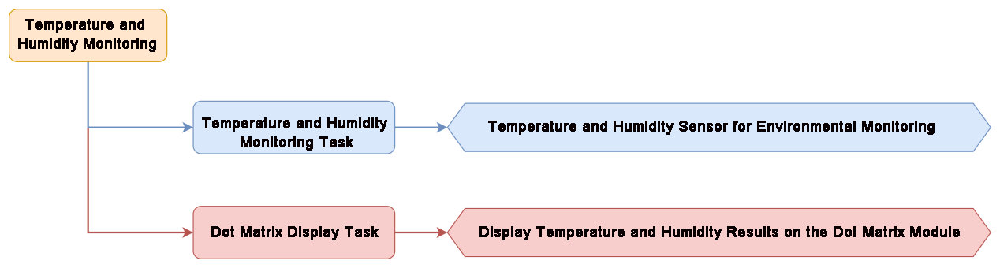

* **Sensor Introduction**

(1) Temperature and Humidity Sensor

This sensor detects the temperature and humidity of the environment and provides accurate readings.

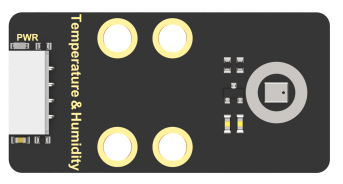

The AHT10 module converts the air's temperature and humidity into digital signals, which are then sent to the control board via I2C communication.

(2) LED Dot Matrix Module

The LED dot matrix module uses an 8x8 LED display, known for its high brightness, flicker-free display, and easy wiring. It can display numbers, text, patterns, and more. The module consists of two red 8x8 LED arrays and is controlled by the driver chip TM640B, enabling full control of the dot matrix screen.

For installation and wiring details, refer to the section "**01 Sensor Assembly and Wiring**" in this directory.

* **Program Download**

[Temperature and Humidity Detection Program](../_static/source_code/04/Temperature%20and%20Humidity%20Detection%20Program.zip)

(1) Open the **WonderCode** software .

(2) Locate the **"02 temp_humidity_detection.sb3"** file in the same directory as this document, then drag and drop it into **WonderCode**.

(3) In the menu bar, click **"Connect"**, then select the appropriate **COM port** (e.g., COM7 in this example). A **"Connection Successful"** message will appear once the connection is established.

(4) Click  on the right to transfer the program to **Tonybot**. Wait for the confirmation message indicating a successful upload.

* **Achieved Effect**

Once the temperature and humidity are detected, the dot matrix module will display them individually.

* **Program Analysis**

(1) Initialize the dot matrix module interface and set Tonybot to its default posture.

(2) First, obtain the temperature reading from the temperature and humidity sensor and display it on the dot matrix module.

(3) Then, obtain the humidity reading from the sensor and display it on the dot matrix module.

## 4.3 Voice Interaction Course

### 4.3.1 WonderEcho Introduction & Assembly

* **Assembly**

* **Introduction and Working Principle**

(1) Introduction

The voice interaction module is built on embedded voice recognition technology. It consists of a voice recognition chip and supporting circuits, designed for seamless communication with the main control chip. This module enables both voice recognition and voice playback functionalities. Developers can easily integrate it into their products to enable voice interaction capabilities.

(2) Working Principle

The module communicates via I2C and functions as a slave device, allowing communication with a master device. When the microphone on the module detects sound, it processes the audio and sends the result back to the master device.

The module operates in a keyword wake-up mode, requiring a specific trigger word to initiate recognition. By default, the wake-up keyword is "**Hello Hiwonder**". Once recognition is complete, if further recognition is required, the module must be re-activated by the wake-up keyword after a 15-second delay.

* **Interface Description**

For detailed specifications and chip diagrams, please refer to the "**3. Chip Manual**".

**Type-C Interface**: Used for powering the module and for firmware programming.

**I2C Interface**: Used for communication with host devices.

| **PIN** | **Function Description** |
| :-----: | :----------------------: |
|   5V    |       Power input        |
|   GND   |       Power ground       |
|   SDA   |      I2C data cable      |
|   SCL   |     I2C clock cable      |

* **Important Notes**

(1) Ensure the voltage does not exceed the rated range during use.

(2) The environment should be quiet, as noise may impact recognition performance.

(3) When speaking the trigger phrase, make sure your voice is clear and loud, and avoid speaking too quickly. It is recommended to maintain a distance of no more than 5 meters from the module.

### 4.3.2 Distance Ranging & Announcement Project

* **Project Introduction**

This section utilizes the glowy ultrasonic module to measure the distance to an obstacle. Based on the detected distance, it controls the voice interaction module to announce messages and triggers the robot to perform specific action groups.

* **Program Implementation Process**

* **Sensor Introduction**

(1) Glowy Ultrasonic Sensor 

This is a light-emitting ultrasonic distance sensor module that communicates via I2C. It reads the distance measured by the ultrasonic sensor using the I2C protocol.

When measuring distance, the module sends out 8 pulses of 40kHz square waves and checks for any returning signals. If a signal is detected, the module outputs a high-level signal, and the duration of this high signal corresponds to the time taken for the ultrasonic waves to travel to the target and back.

(2) Voice Interaction Module

The voice interaction module is built on embedded voice recognition technology. It consists of a voice recognition chip and supporting circuits, designed for seamless communication with the main control chip. This module enables both voice recognition and voice playback functionalities. Developers can easily integrate it into their products to enable voice interaction capabilities.

For instructions on module installation and wiring, please refer to assembly guide saved in the same directory.

* **Program Download**

[Distance Ranging & Announcement Program](../_static/source_code/04/Distance%20Ranging%20&%20Announcement%20Program.zip)

(1) Open the WonderCode software 

(2) Drag the "Distance Ranging & Result Broadcasting.sb3" file from the same folder as this document into WonderCode.

(3) In the menu bar, click on "**Connect**" and select the correct COM port (e.g., COM7). Once the connection is successful, you'll see a "**Connection Successful**" message.

(4) Hit the Upload button  on the right to transfer the program to the Tonybot. Wait for the confirmation that the upload is complete.

* **Achieved Effect**

Once the Tonybot is powered on, slowly move the object towards the glowy ultrasonic sensor. When the distance falls below 200mm, action group 9 will be triggered, and a greeting will be broadcast: "**Hello, welcome**".

* **Program Analysis**

[Distance Ranging & Announcement Program](../_static/source_code/04/Distance%20Ranging%20&%20Announcement%20Program.zip)

(1) Initialize the posture of the Tonybot and the voice module interface.

(2) Set the variable distance to the distance between the glowy ultrasonic sensor and the obstacle. If this distance is less than 20, set have_move to 1 and change the color of the two ultrasonic sensor lights to blue. Then, execute action group 9 once, wait 0.5 seconds, broadcast the phrase via the voice module, wait for 2 seconds, and repeat the cycle.

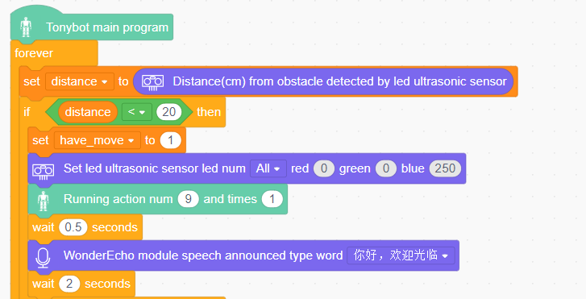

(3) If the distance variable is greater than 20, set have_home to 1, change the color of the ultrasonic sensor lights to green, execute action group 0 once, wait 0.1 seconds, and continue looping through the previous code block.

### 4.3.3 Human-Robot Interaction Project

* **Project Introduction**

The voice interaction module recognizes trigger phrases, which then control the Tonybot to execute the corresponding actions.

* **Program Implementation Process**

* **Sensor Introduction**

The voice interaction module is built on embedded voice recognition technology. It consists of a voice recognition chip and supporting circuits, designed for seamless communication with the main control chip. This module enables both voice recognition and voice playback functionalities. Developers can easily integrate it into their products to enable voice interaction capabilities.

For instructions on module installation and wiring, please refer to assembly guide saved in the same directory.

* **Program Download**

[Human-Robot Interaction Program](../_static/source_code/04/Human-Robot%20Interaction%20Program.zip)

(1) Open the WonderCode software 

(2) Drag the **"Human-Robot Interaction.sb3"** file from the same folder as this document into WonderCode.

(3) In the menu bar, click on **"Connect"** and select the correct COM port (e.g., COM7). Once the connection is successful, you'll see a **"Connection Successful"** message.

(4) Hit the Upload button  on the right to transfer the program to the Tonybot. Wait for the confirmation that the upload is complete.

* **Achieved Effect**

Activate the voice interaction module by saying **"Hello Hiwonder"**. Once activated, the robot will perform the corresponding actions based on the trigger phrases listed below.

| NO.  | Command Phrase     | Corresponding Action    |
| ---- | ------------------ | ----------------------- |
| 36   | HELLO              | Bow                     |
| 37   | INTRODUCE-YOURSELF | Say hello               |
| 38   | SHOW-A-SKIII       | Spread arms             |
| 41   | DIVE-FORWARD       | Go forward              |
| 30   | SHAKE-IT-OFF       | Control servo to rotate |

* **Program Analysis**

[Human-Robot Interaction Program](../_static/source_code/04/Human-Robot%20Interaction%20Program.zip)

(1) Initialize the posture of the Tonybot, the voice module interface, and configure the flags for the buttons and actions.

(2) Initialize the result variable. When the value received from the voice module is 26 (which corresponds to "**Hello**", and so on), execute action group 10 once. If the value is 27, execute action group 48 once. If the value is 28, execute action group 17 once.

(3) When the value is 29, wait for one second, then execute action group 18 once, followed by action group 21 three times. Afterward, execute action group 18 once more, followed by action group 19 once. The timeout for this sequence is the total duration required for action group 18, which is 2000ms.

(4) If the value received is 30, Tonybot will trigger the servo motor to perform the corresponding action after a 0.5-second delay. Once the action is completed, the servo will be disabled, and the main program will restart the cycle.

* **Function Extension**

In the program, we can add new entries and perform new actions. For example, to add the **"sit-up"** action:

(1) Add the **"if"** statement block at the end of the program.

(2) Set the condition to result = 114.

(3) If the condition is true, execute Action Group 8 once, which corresponds to the **"sit-up"** action.

* **FAQ**

**Q:**The voice interaction module is not responding.

**A:** Please check if you have activated the module by saying "**Hello Hiwonder**" If the module is already activated, verify that it is connected correctly.

### 4.3.4 Voice Control Project

* **Project Introduction**

In this section, the voice interaction module is used to control Tonybot's movements, including moving forward, backward, and turning left or right.

* **Program Implementation Process**

* **Sensor Introduction**

The voice interaction module is built on embedded voice recognition technology. It consists of a voice recognition chip and supporting circuits, designed for seamless communication with the main control chip. This module enables both voice recognition and voice playback functionalities. Developers can easily integrate it into their products to enable voice interaction capabilities.

For instructions on module installation and wiring, please refer to assembly guide saved in the same directory.

* **Program Download**

[Voice Control Program](../_static/source_code/04/Voice%20Control%20Program.zip)

(1) Open the WonderCode software 

(2) Drag the **"Voice Control.sb3"** file from the same folder as this document into WonderCode.

(3) In the menu bar, click on **"Connect"** and select the correct COM port (e.g., COM7). Once the connection is successful, you'll see a **"Connection Successful"** message.

(4) Hit the **"Upload"** button  on the right to transfer the program to the Tonybot. Wait for the confirmation that the upload is complete.

* **Achieved Effect**

To activate the voice recognition module, simply say "**Hello Hiwonder**" You can then use commands like 'move forward', 'move backward', 'turn left' and 'turn right' to control Tonybot's movements. For a complete list of available commands, please refer to the table below.

| Command Phrase  | Returned Value | Command Phrase | Returned Value |
| --------------- | -------------- | -------------- | -------------- |
| GO-STRAIGHT     | 0x01           | GO-BACKWARD    | 0x02           |
| TURN LEFT       | 0x03           | TURN RIGHT     | 0x04           |
| LEFT-FOOT-SHOOT | 0x6E           | TWIST          | 0x71           |
| SIT-UP          | 0x72           | BOW            | 0x73           |
| SPREAD ARMS     | 0x74           | WAVE HAND      | 0x75           |
| MARCH-IN-PLACE  | 0x76           | RIGHT-HOOK     | 0x7A           |

* **Program Analysis**

[ Voice Control Program](../_static/source_code/04/Voice%20Control%20Program.zip)

(1) Initialize Tonybot's posture and voice module, and set the flags for the buttons and actions.

(2) Initialize the variable result. If the value received from the voice module is 113, execute action group 50 once. If the value is 114, execute action group 8 once.

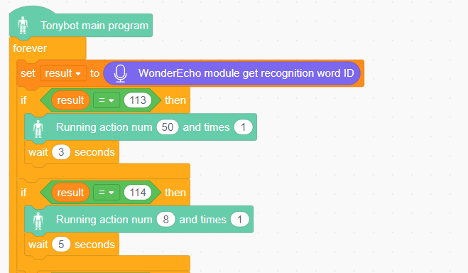

(3) When the value received is 1, execute action group 18 once, followed by action group 21 three times. Then, execute action group 18 again once, and finally, execute action group 19 once. The total timeout duration should be set to 2000ms, which is the runtime of action group 18.

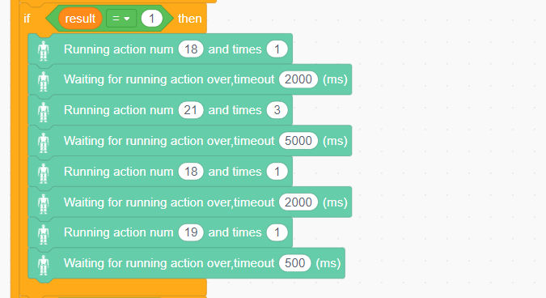

### 4.3.5 Fall Recovery Project

* **Project Introduction**

After the robot falls, say the command 'fall recovery' to make the robot stand up.

* **Program Implementation Process**

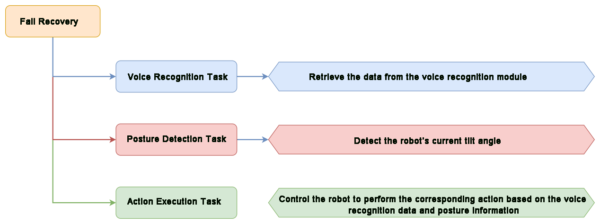

* **Sensor Introduction**

The voice interaction module is built on embedded voice recognition technology. It consists of a voice recognition chip and supporting circuits, designed for seamless communication with the main control chip. This module enables both voice recognition and voice playback functionalities. Developers can easily integrate it into their products to enable voice interaction capabilities.

For instructions on module installation and wiring, please refer to assembly guide saved in the same directory.

* **Program Download**

[Fall Recovery Program](../_static/source_code/04/Fall%20Recovery%20Program.zip)

(1) Open the WonderCode software 

(2) Drag the **"Fall Recovery.sb3"** file from the same folder as this document into WonderCode.

(3) In the menu bar, click on **"Connect"** and select the correct COM port (e.g., COM7). Once the connection is successful, you'll see a "**Connection Successful**" message.

(4) Hit the Upload button  on the right to transfer the program to the Tonybot. Wait for the confirmation that the upload is complete.

* **Achieved Effect**

If the robot is in a fallen state, say 'Hello Hiwonder' to activate the voice interaction module. Then, use the command 'fall recovery' to make the robot stand up.

* **Program Analysis**

[Fall Recovery Program](../_static/source_code/04/Fall%20Recovery%20Program.zip)

(1) Initialize Tonybot's posture, voice module interface, and set the flags for buttons and actions. If the head servo fails and remains inactive for 6 seconds, the system will begin playing audio in the background.

(2) Initialize the variable angle with the value obtained from the IMU sensor. If the value is between -30 and 60, the system will play audio in the background. After waiting for one second, action group 102 will be executed once.

(3) If the value is between 120 and 140, the system will play audio in the background. After waiting for one second, action group 101 will be executed once. Finally, the program will wait for 0.05 seconds before looping back to continue the main program.

## 4.4 AI Vision Course

### 4.4.1 Introduction to ESP32S3 Vision Module

* **Assembly**

  

* **Overview of the ESP32-S3**

The ESP32-S3 Vision Module is a compact camera module that can function as a standalone system. It captures images with its built-in camera, processes the data using the ESP32 microcontroller, and wirelessly transmits it via Wi-Fi. With support for various communication protocols and low-power features, this module is widely used in a range of IoT applications.

(1) Specification

<table>
<colgroup>
<col  />
<col  />
</colgroup>
<tbody>
<tr>
<td ><strong>Parameter</strong></td>
<td ><strong>Specification</strong></td>
</tr>
<tr>
<td >Size</td>
<td >59*43*17.5</td>
</tr>
<tr>
<td >Power Supply Range</td>
<td >4.75~5.25V</td>
</tr>
<tr>
<td >Operating Temperature</td>
<td >Ambient Temperature</td>
</tr>
<tr>
<td >Storage Environment</td>
<td >Ambient Temperature and Pressure</td>
</tr>
<tr>
<td >SPI Flash</td>
<td >Supports up to 16MB</td>
</tr>
<tr>
<td >RAM</td>
<td >512KB Internal + 16MB External PSRAM</td>
</tr>
<tr>
<td >Bluetooth</td>
<td >Suppport Bluetooth 5 and Bluetooth Mesh</td>
</tr>
<tr>
<td >WiFi</td>
<td >802.11 b/g/n</td>
</tr>
<tr>
<td >Supported Interfaces</td>
<td >UART、I2C</td>
</tr>
<tr>
<td >Serial Baud Rate</td>
<td >Default 115200</td>
</tr>
<tr>
<td >Image Output Format</td>
<td >JPEG (only supported by OV2640), BMP, Grayscale</td>
</tr>
<tr>
<td >Frequency Range</td>
<td >2412~2484MHz</td>
</tr>
<tr>
<td >Antenna Type</td>
<td >Onboard PCB Antenna</td>
</tr>
<tr>
<td >Transmit Power</td>
<td >
802.11b:20.5 dBm(@11Mbps)

802.11g:18 dBm(@54Mbps)

802.11n:17 dBm(@MCS7)
</td>
</tr>
<tr>
<td >Receive Sensitivity</td>
<td >
802.11b:-88.5 dBm(@11Mbps)

802.11g:-76.2 dBm(@54Mbps)

802.11n:-74.2dBm(@MCS7 HT20)

-71.2dBm(@MCS7 HT40)
</td>
</tr>
<tr>
<td >Power Consumption (assuming peripherals are on)</td>
<td >
Active (RF On): TX: 285-355mA @ 3.3V RX:95-97mA@3.3V

Deep-sleep:8uA@5V

Modem-sleep:47.6-107.6mA@5V 240MHZ

Light-sleep:240uA@5V
</td>
</tr>
<tr>
<td >Security</td>
<td >RSA/AES/SHA/HMAC/XTS-AES</td>
</tr>
</tbody>
</table>

**Kind Reminder:** The product specifications are theoretical values and are for reference only. Please rely on actual performance for precise details.

(2) Interface Description

| **Interface Name** |                  **Interface Description**                   |
| :----------------: | :----------------------------------------------------------: |
|  USB Serial Port   |          Serial communication, firmware programming          |
|   Custom Button    |       Allows customization of the button event in code       |
|   IIC Interface    | Secondary development interface, connects with the main controller |

* **ESP32-S3 Image Coordinate Framework**

Here are a few important points to note about the module's image coordinate system:

(1) The origin is positioned at the center of the screen, not at the top-left corner.

(2) The Y-axis direction is opposite to that of a typical Cartesian coordinate system.

* **Important Notes:**

(1) Ensure that the module is supplied with at least 5V 2A to avoid potential image distortion.

(2) The module comes with the default firmware pre-installed, which supports image transmission. No additional downloads are provided. If you need to reflash with different firmware, please proceed carefully.

### 4.4.2 Image Transmission

:::{Note}

The image transmission firmware is pre-installed at the factory. If you flash other firmware for different functionalities, you will need to reflash the image transmission firmware to enable this feature.

:::

In this section, connect to the hotspot created by the ESP32-S3 vision module and visit the provided URL to view the real-time video feed from the camera.

* **Program Download**

(1) ESP32-S3 Vision Module Firmware Download

① Connect the ESP32-S3 vision module to your computer using a Type-C data cable.

② Extract the ZIP file "[**Image Transmission Firmware & Flash Tool/flash_download_tool_3.9.7**](https://drive.google.com/drive/folders/1Jv6wpYZ8M8bFpxN0J3se8jfuXv7tMco2?usp=sharing)", then double-click **"flash_download_tool_3.9.7.exe"** to open the program.

③ In the opened window, configure it as shown below.

④ In the flashing interface, click  to select the firmware file ("**Image Transmission Firmware & Flash Tool/image_transmit.bin**"), then configure the settings according to the image below.

⑤ Choose the correct port number (do not select COM1, as this will cause the flashing to fail).

⑥ Click **"ERASE"** to erase the existing firmware (this step is essential), then click "**START**" to begin the flashing process.

⑦ Wait for a completion message to appear.

⑧ Once flashing is complete, disconnect the Type-C data cable and restart the device.

(2) Program Download 

[Image Transmission Scratch Example.sb3](../_static/source_code/04/Image%20Transmission%20Scratch%20Example.zip)

① Open the program file **"03 Image Transmission Scratch Example.sb3"** located in the same folder as this document in the WonderCode programming software.

② Power on the device and connect it to the computer via the Type-C data cable.

③ Click the "**Connect**" button and select the corresponding port.

:::{Note}
The port number may vary depending on the computer's actual connection. For example, the port number used in this section is "**COM4**". However, do not select "**COM1**", as it is typically reserved for system communication.

:::

④ When the device successfully pairs with the software, a successful connection message will appear.

* **Device Connection**

(1) Power on the device (ensure the vision module has been installed on the robot according to the instructions in "**[6.4.1 Overview and Installation of ESP32S3 Vision Module](https://docs.hiwonder.com/projects/Tonybot/en/latest/docs/6.Arduino_programming_projects.html#overview-and-installation-of-esp32s3-vision-module)**" before powering it on).

(2) Locate and connect to the hotspot generated by the module: **HW_ESP32S3CAM**.

(3) Image Transmission Implementation

Open a browser (this works on both mobile and PC browsers; we'll use a PC as an example) and enter "**192.168.5.1**" in the address bar, then press Enter. On the resulting page, click  to access the camera's live transmission interface.

### 4.4.3 Color Recognition Project

* **Project Introduction**

Tonybot, equipped with the ESP32-S3 vision module, can recognize red, green, and blue objects, while also controlling the RGB lights and displaying information on the dot matrix display.

* **Program Implementation Process**

* **Module Introduction**

(1) ESP32-S3 Vision Module

The ESP32-S3 Vision Module is a compact camera module that can function as a standalone system. It captures images with its built-in camera, processes the data using the ESP32 microcontroller, and wirelessly transmits it via Wi-Fi. With support for various communication protocols and low-power features, this module is widely used in a range of IoT applications.

To get the detailed installation guide, please refer to '[4.4.1 Overview and Installation of ESP32S3 Vision Module](#anchor_4_4_1)'.

(2) LED Dot Matrix Module

The LED dot matrix module features a high-brightness display, flicker-free operation, and easy wiring. It is capable of displaying numbers, text, graphics, and other content. The module consists of two 8x8 red LED matrices, controlled by the TM640B driver chip, enabling full control of the display.

For installation and wiring details, please refer to "**01 Dot Matrix Display Installation**" in this directory.

* **Program Download**

[ESP32S3 Color Recognition Example](../_static/source_code/04/ESP32S3%20Color%20Recognition%20Example.zip)

(1) ESP32-S3 Vision Module Program Download

① Connect the ESP32-S3 to your computer using a Type-C data cable.

② Open the program file **"ESP32S3 Color Recognition Example/ESP32S3_ColorDetection/ESP32S3_ColorDetection.ino"** located in the same directory as this document.

③ Select the **"ESP32S3 Dev Module"** as the target board.

④ In the **"Tools"** menu, configure the ESP32-S3 development board settings as shown in the image below. (This configuration is only required for the first use. It does not need to be repeated for subsequent uses.)

⑤ Click  to transfer the code to the ESP32-S3 and wait for the flashing process to complete.

* **Program Download**

[Color Recognition Scratch Program.sb3](../_static/source_code/04/Color%20Recognition%20Scratch%20Program.zip)

(1) Locate and open the program file **"04 Color Recognition Scratch Program.sb3"** from the same directory as this document.

(2) Power on the device and connect it to your computer using a Type-C data cable.

(3) Click the **"Connect"** button and select the appropriate port.

:::{Note }

The port number may vary depending on your computer's configuration. For example, in this section, the port used is "**COM4**". However, avoid selecting "**COM1**", as it is typically reserved for system communication.

:::

(4) Once the device successfully pairs with the software, a confirmation message will appear, indicating that the connection was successful.

* **Achieved Effect**

① When the vision module detects red, the RGB light on the ultrasonic sensor turns red, and the dot matrix module displays the scrolling text "**Red**".

② When the vision module detects blue, the RGB light on the ultrasonic sensor turns blue, and the dot matrix module displays the scrolling text "**Blue**".

③ When the vision module detects green, the RGB light on the ultrasonic sensor turns green, and the dot matrix module displays the scrolling text "**Green**".

④ When no color is detected, both the RGB light on the ultrasonic sensor and the dot matrix module turn off.

* **Program Analysis**

(1) Initialize the dot matrix interface, ESP32-S3 vision module, ultrasonic module, and servos.

(2) In the main program, repeatedly call the custom colorDetect function to obtain color recognition results. Use the color_num variable to identify the recognized color ID and display the corresponding color name in English on the dot matrix screen.

(3) Within the colorDetect function, retrieve data for color IDs 1 through 3. When the vision module returns data for a color, check if the second element (representing the width of the detected color) is greater than 0. If so, the color is considered detected, and the color_num variable is updated with the corresponding color ID.

* **FAQ**

**Q:** The colors detected by the camera are inaccurate or misidentified.

**A:** To improve accuracy, reduce background noise and distractions. Using a solid-color or simpler background environment can help the camera detect colors more reliably.

### 4.4.4 Color Tracking Project

* **Project Introduction**

Tonybot, equipped with the ESP32-S3 vision module, tracks a red ball while the robot's head follows the ball's movement direction.

* **Program Implementation Process**

* **Module Introduction**

The ESP32-S3 Vision Module is a compact camera module that can function as a standalone system. It captures images with its built-in camera, processes the data using the ESP32 microcontroller, and wirelessly transmits it via Wi-Fi. With support for various communication protocols and low-power features, this module is widely used in a range of IoT applications.

To get the detailed installation guide, please refer to '[4.4.1 Introduction to ESP32S3 Vision Module](#anchor_4_4_1)'.

* **Program Download**

[ESP32S3 Color Recognition Example](../_static/source_code/04/ESP32S3%20Color%20Recognition%20Example.zip)

**(1) ESP32-S3 Vision Module Program Download**

① Connect the ESP32-S3 to your computer using a Type-C data cable.

② Open the program file **"03 ESP32S3 Color Recognition Example/ESP32S3_ColorDetection/ESP32S3_ColorDetection.ino"** located in the same directory as this document.

③ Select the **"ESP32S3 Dev Module"** as the target board.

④ In the **"Tools"** menu, configure the ESP32-S3 development board settings as shown in the image below. (This configuration is only required for the first use. It does not need to be repeated for subsequent uses.)

⑤ Click  to transfer the code to the ESP32-S3 and wait for the flashing process to complete.

⑥ After the flashing is complete, disconnect the Type-C data cable.

**(2) Program Download**

[Color Tracking Scratch Example.sb3](../_static/source_code/04/Color%20Tracking%20Scratch%20Example.zip)

① Locate and open the program file **"03 Color Tracking Scratch Program.sb3"** from the same directory as this document.

② Power on the device and connect it to your computer using a Type-C data cable.

③ Click the **"Connect"** button and select the appropriate port.

:::{Note}
The port number may vary depending on your computer's configuration. For example, in this section, the port used is "**COM4**". However, avoid selecting "**COM1**", as it is typically reserved for system communication.

:::

④ Once the device successfully pairs with the software, a confirmation message will appear, indicating that the connection was successful.

* **Achieved Effect**

When we move the red ball in front of the ESP32-S3 vision module camera, the robot's head will follow the ball's movement.

* **Program Analysis**

[Color Tracking Scratch Example.sb3](../_static/source_code/04/Color%20Tracking%20Scratch%20Example.zip)

(1) Initialize the ESP32-S3 vision module, disable the RGB lights on the ultrasonic module (to avoid misdetection), and set the head servo to 90° (facing forward). Then, execute the standing motion sequence to make the robot stand.

(2) In the main program, retrieve the data for color ID 1 and set *x* as the x-coordinate of the color region's center. If *x* \> 150, this indicates that the color block is positioned toward the right of the vision module's field of view. In this case, adjust the servo to rotate right, ensuring the color block remains centered in the camera's view.

(3) If *x* \< 90, this means the color block is positioned toward the left. Adjust the servo to rotate left, again ensuring the block stays centered. Finally, if the angle exceeds 180, set it to 180 to prevent the servo from rotating beyond its limit.

* **FAQ**

Q: The colors detected by the camera are inaccurate or misidentified.

A: To improve accuracy, reduce background noise and distractions. Using a solid-color or simpler background environment can help the camera detect colors more reliably.

### 4.4.5 Face Detection Project

* **Project Introduction**

This section demonstrates how the ESP32-S3 vision module detects faces. When a face is recognized, the robot performs a waving gesture to greet the person.

* **Program Implementation Process**

* **Module Introduction**

The ESP32-S3 Vision Module is a compact camera module that can function as a standalone system. It captures images with its built-in camera, processes the data using the ESP32 microcontroller, and wirelessly transmits it via Wi-Fi. With support for various communication protocols and low-power features, this module is widely used in a range of IoT applications.

To get the detailed installation guide, please refer to '[4.4.1 Overview and Installation of ESP32S3 Vision Module](#anchor_4_4_1)'.

* **Program Download**

[ESP32S3 Face Detection Example](../_static/source_code/04/ESP32S3%20Face%20Detection%20Example.zip)

(1) ESP32-S3 Vision Module Program Download

① Connect the ESP32-S3 to your computer using a Type-C data cable.

② Open the program file **"02 ESP32S3 Face Detection Example/ESP32S3_FaceDetection/ESP32S3_FaceDetection.ino"** located in the same directory as this document.

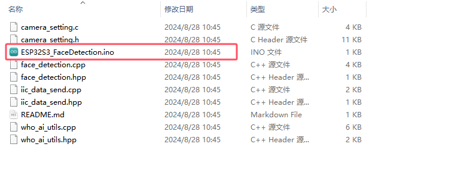

③ Select the **"ESP32S3 Dev Module"** as the target board.

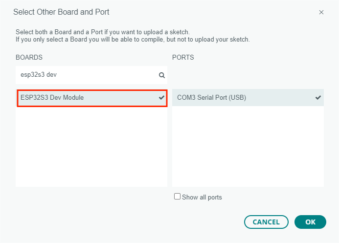

④ In the "Tools" menu, configure the ESP32-S3 development board settings as shown in the image below. (**This configuration is only required for the first use. It does not need to be repeated for subsequent uses.**)

⑤ Click  to transfer the code to the ESP32-S3 and wait for the flashing process to complete.

⑥ After the flashing is complete, disconnect the Type-C data cable.

(2) Program Download

[Face Detection Scratch Example.sb3](../_static/source_code/04/Face%20Detection%20Scratch%20Example.zip)

① Locate and open the program file **"03 Face Detection Scratch Program.sb3"** from the same directory as this document.

② Power on the device and connect it to your computer using a Type-C data cable.

③ Click the **"Connect"** button and select the appropriate port.

:::{Note}

The port number may vary depending on your computer's configuration. For example, in this section, the port used is "**COM4**". However, avoid selecting "**COM1**". as it is typically reserved for system communication.

:::

④ Once the device successfully pairs with the software, a confirmation message will appear, indicating that the connection was successful.

* **Achieved Effect**

When a face is detected, the robot will greet the person by performing a waving gesture.

* **Program Analysis**

(1) Initialize the ESP32-S3 vision module, turn off the ultrasonic RGB lights (to prevent false detections), and set the robot to a standing position.

(2) In the main program, retrieve the face detection data from the vision module. When a face is detected, execute action group 9 (the waving gesture).

### 4.4.6 Vision Line Following Project

* **Project Introduction**

Tonybot, equipped with the ESP32-S3 vision module, detects red lines and follows their path. The robot moves accordingly, adjusting its position to stay aligned with the detected lines in its field of view.

* **Program Implementation Process**

* **Module Introduction**

The ESP32-S3 Vision Module is a compact camera module that can function as a standalone system. It captures images with its built-in camera, processes the data using the ESP32 microcontroller, and wirelessly transmits it via Wi-Fi. With support for various communication protocols and low-power features, this module is widely used in a range of IoT applications.

To get the detailed installation guide, please refer to '[4.4.1 Introduction to ESP32S3 Vision Module](#anchor_4_4_1)'.

* **Program Download**

[ESP32S3 Color Recognition Example](../_static/source_code/04/ESP32S3%20Color%20Recognition%20Example.zip)

**(1) ESP32-S3 Vision Module Program Download**

① Connect the ESP32-S3 to your computer using a Type-C data cable.

② Open the program file **"02 ESP32S3 Color Recognition Example/ESP32S3_ColorDetection/ESP32S3_ColorDetection.ino"** located in the same directory as this document.

③ Select the **"ESP32S3 Dev Module"** as the target board.

④ In the **"Tools"** menu, configure the ESP32-S3 development board settings as shown in the image below. (**This configuration is only required for the first use. It does not need to be repeated for subsequent uses.**)

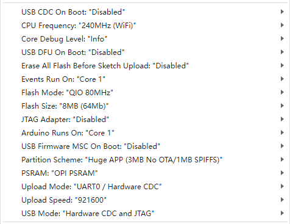

⑤ Click  to transfer the code to the ESP32-S3 and wait for the flashing process to complete.

⑥ After the flashing is complete, disconnect the Type-C data cable.

**(2) Program Download**

[Vision Line Following Scratch Example.sb3](../_static/source_code/04/Vision%20Line%20Following%20Scratch%20Example.zip)

① Locate and open the program file **"03 Vision Line Following Scratch Program.sb3"** from the same directory as this document.

② Power on the device and connect it to your computer using a Type-C data cable.

③ Click the **"Connect"** button and select the appropriate port.

:::{Note}

The port number may vary depending on your computer's configuration. For example, in this section, the port used is "**COM4**". However, avoid selecting "**COM1**", as it is typically reserved for system communication.

:::

④ Once the device successfully pairs with the software, a confirmation message will appear, indicating that the connection was successful.

* **Achieved Effect**

When a face is detected, the robot will greet the person by performing a waving gesture.

* **Program Analysis**

(1) Initialize the ESP32-S3 vision module, disable the ultrasonic RGB lights (to prevent false detection), and execute the standing action to make the robot upright.

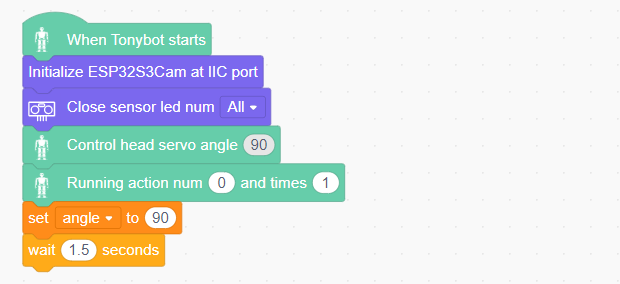

(2) First, retrieve the data for color ID 1, and set the variable **"x"** to the x-coordinate of the detected color's center. If no action group is currently running, and if the x-coordinate is between 110 and 190, it indicates that the robot is on the line. In this case, execute action group 63 to make the robot move forward.

(3) If the x-coordinate is between 0 and 110, it means the line is to the robot's left. In this case, run action group 65 twice to make the robot turn left, and set the variable "**step**" to 1. The "**step**" variable controls the robot's movements: when set to 0, the robot moves forward; when set to 1, it turns left; when set to 2, it turns right.

(4) If the line is detected to be on the robot's right (x \> 190), execute action group 66 twice to make the robot turn right, and set "**step**" to 2.

(5) When step = 1, if the line is still on the left, continue running action group 65 once to make the robot turn left. If the line is no longer on the left, execute action group 63 once to move the robot forward.

(6) When step = 2, if the line is still on the right, continue running action group 66 once to make the robot turn right. If the line is no longer on the right, execute action group 63 once to move the robot forward.

* **FAQ**

Q: The colors detected by the camera are inaccurate or misidentified.

A: To improve accuracy, reduce background noise and distractions. Using a solid-color or simpler background environment can help the camera detect colors more reliably.

## 4.5 IOT (Internet of Things) Course

[ Tonybot IOT Example.sb3](../_static/source_code/04/Tonybot%20IOT%20Example.zip)

### 4.5.1 Module Installation & Wiring

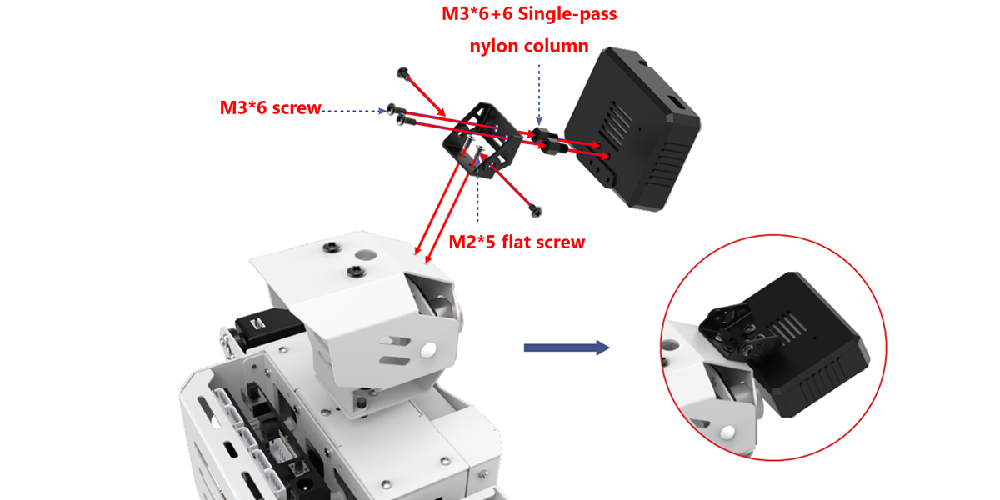

### 4.5.2 Program Download

* **Vision Module Program Download**

This section provides a step-by-step guide for downloading the ESP32-S3 vision module program, using the face detection program as an example. The process for downloading the color recognition program is identical to that of the face detection program.

(1) Program Download

① Connect the ESP32-S3 to your computer using a Type-C data cable.

② Open the program file "**02 Face Detection Porgram/FaceDetection/FaceDetection.ino**" located in the same directory as this document.

③ Select the **"ESP32S3 Dev Module"** as the target board.

④ In the **"Tools"** menu, configure the ESP32-S3 development board settings as shown in the image below. (**This configuration is only required for the first use. It does not need to be repeated for subsequent uses.**)

⑤ Click  to transfer the code to the ESP32-S3 and wait for the flashing process to complete.

⑥ After the flashing is complete, disconnect the Type-C data cable.

* **Tonybot IOT Program Download**

(1) Preparation and Precautions

Before downloading the program, ensure that Tonybot is powered on and connected via a Type-C data cable. Otherwise, there may be an issue where the port cannot be detected.

(2) Program Download

[ Tonybot IOT Example.sb3](../_static/source_code/04/Tonybot%20IOT%20Example.zip)

① Connect the ESP32-S3 to the computer using a Type-C data cable.

② Open the "02 Tonybot IOT Example.sb3" program file, which is located in the same directory as this document.

③ Power on the device and connect it to the computer via the Type-C data cable.

④ Click the "Connect" button and select the correct port.

:::{Note}

The port number may vary depending on the computer. For example, the port number in this section is "**COM4**". Avoid using "**COM1**", as it is typically reserved for system communication.

:::

⑤ Once the device is successfully paired with the software, a connection success message will appear.

(3) Program Operation Results

After launching the mobile app, you can control Tonybot to perform functions such as face detection alerts, unknown object alerts, and collision alerts for unidentified items. For detailed information on how the program works, please refer to section "**[5.5.3 App Installation](https://docs.hiwonder.com/projects/Tonybot/en/latest/docs/5.python_programming_projects.html#app-usage-instruction)**".

### 4.5.3 App Usage Instruction

* **App Installation**

For iOS users: Simply search for "[**IoT Control**](https://apps.apple.com/us/app/iot-control-hiwonder/id6738712087)" in the App Store and download it.

For Android users: You can find the "[**IoT Control**](https://play.google.com/store/apps/details?id=com.hiwonder.mechdogiot)", or refer to the appendix to download and install it on your phone.

* **App Connection**

:::{Note}

Before using the app, make sure that Wi-Fi and location services are enabled in your phone's settings. This section demonstrates using the Android version of the app, but the steps are the same for the iOS version.

:::

(1) Power on the Tonybot, then open the **"IoT Control"** app on your phone.

(2) Tap  in the top-right corner, select **"IOT_Tonybot"** from the Wi-Fi list, and enter the password **"12345678"** to connect.

(3) Once connected, the Wi-Fi icon in the top-right corner will become solid.

* **Control Overview**

The app provides 8 different modes: Face Detection Alert, Unknown Object Alert, Unknown Impact Alert, Remote Warning, Color Detection, Distance Detection, RGB Light Control, and Robot Control.  

A detailed description of each function is provided in the table below:

<table>
<colgroup>
<col  />
<col  />
</colgroup>
<tbody>
<tr>
<td ><strong>Icon</strong></td>
<td ><strong>Function</strong></td>
</tr>
<tr>
<td ></td>
<td >When the Tonybot vision module detects a face, the phone will vibrate. 
(<strong>Note: This feature requires the face detection program to be pre-installed on the vision module.</strong>)</td>
</tr>
<tr>
<td ></td>
<td >When the Tonybot ultrasonic module detects an object, the buzzer will sound.</td>
</tr>
<tr>
<td ></td>
<td >When an unknown object causes Tonybot to fall, the buzzer will sound.</td>
</tr>
<tr>
<td ></td>
<td >Once activated, the buzzer will continue to sound until Tonybot is upright again.</td>
</tr>
<tr>
<td ></td>
<td >When the Tonybot vision module detects a specific color, the corresponding color will be displayed in the circle below. 
(Note: This feature requires the color detection program to be pre-installed on the vision module.)</td>
</tr>
<tr>
<td ></td>
<td >With the Remote Distance Measurement feature enabled, the detected distance will be shown below.</td>
</tr>
<tr>
<td ></td>
<td >Controls the color of the RGB light on the Tonybot ultrasonic module.</td>
</tr>
<tr>
<td ></td>
<td >Controls Tonybot to execute various action groups.</td>
</tr>
</tbody>
</table>

### 4.5.4 Face Detection Alert Project

* **Project Introduction**

In this section, Tonybot utilizes the ESP32-S3 vision module to detect faces and triggers a vibration alert on the phone upon face detection.

* **Program Implementation Process**

* **Module Introduction**

(1) ESP32-S3 Vision Module

The ESP32-S3 Vision Module is a compact camera module that can function as a standalone system. It captures images with its built-in camera, processes the data using the ESP32 microcontroller, and wirelessly transmits it via Wi-Fi. With support for various communication protocols and low-power features, this module is widely used in a range of IoT applications.

To get the detailed installation guide, please refer to '4.5 IoT (Internet of Things) Course/ 4.5.1 WiFi Module Installation & Wiring'.

* **Program Download**

For details on downloading the vision module and Tonybot program, please refer to [4.5.2 Program Download](#anchor_4_5_2).

* **Achieved Effect**

When Tonybot detects a face, the phone will vibrate as an alert.

* **Program Analysis**

(1) Initialize the Wi-Fi module interface and set the Wi-Fi module's name. Then, initialize the ESP32-S3 vision module, set the head servo angle to 90°, and execute the standing action sequence. Once initialization is complete, the buzzer will emit a sound as a reminder.

(2) Retrieve the functionality of the ESP32-S3 vision module. First, read the color recognition results. If the x-coordinate of the detected color region is not 0 and the x-coordinate is equal to its width, set esp32s3_type to 1 for face detection mode. If these conditions are not met, set esp32s3_type to 2 for color recognition mode.

(3) In the main program, if the vision module is set to face detection mode, check the onoff_face flag to determine if the face detection alert function is enabled. If enabled, obtain the face detection data from the vision module. When a face is detected, set warn_face to 1.

(4) In another section of the main program, send the face detection alert, unknown object collision warning, and unknown object detection alert to the mobile app.

### 4.5.5 Unknown Impact Alert

* **Project Introduction**

In this section, Tonybot will trigger a vibration alert on the phone when an object is detected by the IMU sensor.

* **Program Implementation Process**

* **IMU Sensor**

Tonybot is equipped with an on-board IMU sensor, widely used in applications such as handheld gaming devices, 3D controllers, and portable navigation systems. This sensor integrates a 3-axis MEMS gyroscope, a 3-axis MEMS accelerometer, and a Digital Motion Processor (DMP) for advanced motion detection and processing.

* **S3 Vision Module Program Download**

For details on downloading the vision module and Tonybot program, please refer to [4.5.2 Program Download](#anchor_4_5_2).

* **Achieved Effect**

When Tonybot is knocked over by an unknown object, the phone will vibrate.

* **Program Analysis**

(1) Initialize the Wi-Fi module interface and configure the Wi-Fi module's name. Then, initialize the ESP32-S3 vision module, set the head servo angle to 90°, and execute the standing action group. After the initialization is complete, the buzzer will sound to signal the completion.

(2) Retrieve the ESP32-S3 vision module's functionality. First, read the color recognition result. If the x-coordinate of the detected color region is not 0 and the x-coordinate matches the width of the detected color region, set esp32s3_type to 1 (face recognition mode). If not, set esp32s3_type to 2 (color recognition mode).

(3) When the unknown object collision detection feature is enabled (onoff_hit = 1), retrieve the IMU's roll angle data. If the roll angle is less than 70° or greater than 110°, set the warn_hit flag to 1.

(4) In another main program, send the face detection warning, unknown object collision warning, and unknown object detection warning to the mobile app.

### 4.5.6 Unknown Object Alert

* **Project Introduction**

This section shows how Tonybot uses the ultrasonic sensor to detect objects and sends a vibration alert to the mobile phone.

* **Program Implementation Process**

* **Module Introduction**

This is a light-emitting ultrasonic distance sensor module that communicates via I2C. It reads the distance measured by the ultrasonic sensor using the I2C protocol.

When measuring distance, the module sends out 8 pulses of 40kHz square waves and checks for any returning signals. If a signal is detected, the module outputs a high-level signal, and the duration of this high signal corresponds to the time taken for the ultrasonic waves to travel to the target and back.

* **S3 Vision Module Program Download**

For details on downloading the vision module and Tonybot program, please refer to Section 4.5.2: Program Download.

* **Achieved Effect**

When Tonybot detects an object at a distance of less than 15 cm, the phone will vibrate.

* **Program Analysis**

(1) Initialize the Wi-Fi module interface and configure the Wi-Fi module name. Next, initialize the ESP32-S3 vision module, set the head servo angle to 90°, and execute the standing motion sequence. Once initialization is complete, the buzzer will sound as an indicator.

(2) Retrieve the functionality of the ESP32-S3 vision module. Start by reading the results of color recognition. If the x-coordinate of the detected color area is not 0 and the x-coordinate equals the width of the detected area, set esp32s3_type to 1 for face recognition mode. Otherwise, set esp32s3_type to 2 for color recognition mode.

(3) Measure the obstacle distance using the ultrasonic sensor. When the undefined object warning is enabled (onoff_undef_obj = 1), evaluate the obstacle distance. If it is less than 20 cm, set the warn_undef_obj flag to 1.

(4) In a separate main program, send the face detection alert, undefined object collision warning, and undefined object alert to the mobile app.

### 4.5.7 Color Detection Project

* **Project Introduction**

This section allows Tonybot, equipped with the ESP32-S3 vision module, to detect red, green, and blue colors and display the corresponding colors on the mobile phone.

* **Program Implementation Process**

* **Module Introduction**

(1) ESP32-S3 Vision Module

The ESP32-S3 Vision Module is a compact camera module that can function as a standalone system. It captures images with its built-in camera, processes the data using the ESP32 microcontroller, and wirelessly transmits it via Wi-Fi. With support for various communication protocols and low-power features, this module is widely used in a range of IoT applications.

To get the detailed installation guide, please refer to [4.5.1 Module Installation & Wiring](#anchor_4_5_1)

* **S3 Vision Module Program Download**

For details on downloading the vision module and Tonybot program, please refer to  [4.5.2 Program Download](#anchor_4_5_2).

* **Achieved Effect**

When Tonybot detects red, green, or blue, it sends the data to the app, which then displays the recognized color.

* **Program Analysis**

(1) Initialize the Wi-Fi module interface and configure the Wi-Fi module name. Then, initialize the ESP32-S3 vision module, set the head servo angle to 90°, and execute the standing motion sequence. Once initialization is complete, the buzzer will sound to indicate the process is finished.

(2) Retrieve the functionality of the ESP32-S3 vision module and read the color recognition results. If the x-coordinate of the detected color area is non-zero and the x-coordinate equals the width of the area, set esp32s3_type to 1 to enter face recognition mode. Otherwise, set esp32s3_type to 2 to enter color recognition mode.

(3) Check if the vision module is set to color recognition mode. When the onoff_color_detec flag is 1, remote color detection is enabled. Then, call the colorDetect function to retrieve the recognition result, which will be stored in the color_detec_num variable.

(4) In the color recognition function, retrieve the vision module's recognition result. If the second element of the color data is greater than 0, it indicates the detected color area has a width greater than 0, meaning a color has been recognized. Set the color_num variable to the recognized color ID.

(5) Finally, send the recognized color ID to the app.

### 4.5.8 Distance Detection

* **Project Introduction**

This section enables Tonybot to measure the obstacle distance using an ultrasonic sensor and display the distance on the app.

* **Program Implementation Process**

* **Module Introduction**

This is a light-emitting ultrasonic distance sensor module that communicates via I2C. It reads the distance measured by the ultrasonic sensor using the I2C protocol.

When measuring distance, the module sends out 8 pulses of 40kHz square waves and checks for any returning signals. If a signal is detected, the module outputs a high-level signal, and the duration of this high signal corresponds to the time taken for the ultrasonic waves to travel to the target and back.

* **S3 Vision Module Program Download**

For details on downloading the vision module and Tonybot program, please refer to Section 4.5.2: Program Download.

* **Achieved Effect**

Tonybot will continuously monitor the distance to objects and display the measurement on the app.

* **Program Analysis**

(1) Initialize the Wi-Fi module interface and configure the Wi-Fi module name. Then, initialize the ESP32-S3 vision module, set the head servo angle to 90°, and execute the standing motion. Once initialization is complete, the buzzer will sound to indicate the process has finished.

(2) Retrieve the functionality of the ESP32-S3 vision module and read the color recognition results. If the x-coordinate of the detected color area is not 0 and the x-coordinate equals the width of the area, set esp32s3_type to 1 to enter face recognition mode. Otherwise, set esp32s3_type to 2 to enter color recognition mode.

(3) Measure the obstacle distance using the ultrasonic sensor and store the result in the sensor_distance variable.

(4) In another main program, send the detected obstacle distance to the app.

### 4.5.9 RGB Light Control

* **Project Introduction**

This section allows you to control the RGB light color of Tonybot's ultrasonic sensor through the app.

* **Program Implementation Process**

* **Module Introduction**

This is a light-emitting ultrasonic distance sensor module that communicates via I2C. It reads the distance measured by the ultrasonic sensor using the I2C protocol.

When measuring distance, the module sends out 8 pulses of 40kHz square waves and checks for any returning signals. If a signal is detected, the module outputs a high-level signal, and the duration of this high signal corresponds to the time taken for the ultrasonic waves to travel to the target and back.

* **S3 Vision Module Program Download**

For details on downloading the vision module and Tonybot program, please refer to Section 4.5.2: Program Download.

* **Achieved Effect**

Tonybot will adjust the RGB light color of the ultrasonic sensor according to the commands sent from the app.

* **Program Analysis**

(1) Initialize the Wi-Fi module interface and configure the Wi-Fi module name. Then, initialize the ESP32-S3 vision module, set the head servo angle to 90°, and execute the standing motion. Once initialization is complete, the buzzer will sound to indicate the process has finished.

(2) Retrieve the functionality of the ESP32-S3 vision module and read the color recognition results. If the x-coordinate of the detected color area is non-zero and equals the width of the area, set esp32s3_type to 1 for face recognition mode. Otherwise, set esp32s3_type to 2 for color recognition mode.

(3) Use the Wi-Fi module to retrieve the data sent from the mobile app and store the parsed data in the cmd string.

(4) Using the first element of cmd, identify the command sent from the mobile app. When the command number is 4, it indicates a remote control command for the RGB light. We will then use the parsed data to control the ultrasonic RGB light and display the corresponding color.

### 4.5.10 Remote Warning

* **Project Introduction**

In this section, you will learn how to use the app to control Tonybot's buzzer and trigger sound.

* **Program Implementation Process**

* **Module Introduction**

Tonybot is equipped with a 5V buzzer. By adjusting the frequency of the PWM signal output, the buzzer can produce sounds of different pitches.

* **S3 Vision Module Program Download**

For details on downloading the vision module and Tonybot program, please refer to Section 4.5.2: Program Download.

* **Achieved Effect**

After enabling the remote warning feature, Tonybot's buzzer will sound.

* **Program Analysis**

(1) Initialize the Wi-Fi module interface and set the name for the Wi-Fi module. Then, initialize the ESP32S3 vision module, set the head servo angle to 90°, and run the standing motion group. After the initialization, the buzzer will sound to provide a notification.

(2) Retrieve the functions of the ESP32S3 vision module. First, read the results of color recognition. When the x-coordinate of the detected color region is not 0 and the x-coordinate of the detected color region equals its width, set the esp32s3_type to 1, indicating facial recognition mode. Otherwise, set esp32s3_type to 2, indicating color recognition mode.

(3) First, obtain the obstacle distance from the ultrasonic sensor and store it in the sensor_distance variable.

(4) Then, retrieve the data sent from the mobile app via the Wi-Fi module, and store the parsed data in the cmd string.

(5) When the first element of the parsed data is 5, set buzzer_flag to 0 to turn off the buzzer alarm. When the second element of the parsed data is greater than 0, indicating that the remote alert feature is enabled, set the buzzer_flag variable to 1.

(6) Finally, in another main program, run the buzzer alarm function. When the buzzer_flag variable is set to 1, control the buzzer to sound the alarm.

### 4.5.11 Robot Control

* **Project Introduction**

In this section, you'll use the mobile app to control Tonybot and make it perform a series of actions.

* **Program Implementation Process**

* **S3 Vision Module Program Download**

For details on downloading the vision module and Tonybot program, please refer to Section 4.5.2: Program Download.

* **Achieved Effect**

Tonybot includes 16 built-in action groups, and we can call these action groups to make Tonybot perform the corresponding actions. The specific action groups are shown in the table below:

| **Action Group Name** |          **Content**           |
| :-------------------: | :----------------------------: |
|    left_foot_kick     |         Left Foot Kick         |
|    right_foot_kick    |        Right Foot Kick         |
|    stand_four_legs    |       Four-Legged Stand        |
|       sit_dowm        |            Sit Down            |
|       go_prone        |            Lie Down            |
|    stand_two_legs     |        Two-Legged Stand        |
|       handshake       |           Handshake            |
|     scrape_a_bow      |              Bow               |
|    nodding_motion     |              Nod               |
|        boxing         |             Boxing             |
|    stretch_oneself    |            Stretch             |
|          pee          |            Urinate             |
|       press_up        |            Push-up             |
|    rotation_pitch     |          Rotate Pitch          |
|     rotation_roll     |          Rotate Roll           |
|    normal_attitude    | Attention (Stand at Attention) |

* **Program Analysis**

(1) First, initialize the Wi-Fi module interface and set its name. Then, initialize the ESP32S3 vision module, adjust the head servo angle to 90°, and run the standing action group. Once the initialization is complete, the buzzer will sound as a reminder.

(2) Access the functions of the ESP32S3 vision module and read the color recognition results. When the x-coordinate of the color region is not 0 and equals the width of the color region, set esp32s3_type to 1, indicating facial recognition mode. Otherwise, set esp32s3_type to 2, indicating color recognition mode.

(3) Retrieve data from the mobile app via the Wi-Fi module and store the parsed data in the cmd string.

(4) When the first element of the parsed data is 6, it indicates a remote control command. At this point, check if the robot is currently running an action group. If not, execute the designated action group. Then, determine if the action group requires a squat position. If it does, execute it directly. If not, first run action group 19 (Quick Attention), and then execute the target action group.

## 4.6 Serial Communication Course

### 4.6.1 Master-Slave Communication Principles

In this section, we'll explore how Tonybot communicates with various devices (like STM32, 51 microcontrollers, Arduino, Raspberry Pi, etc.) in a master-slave relationship. You'll learn how Tonybot functions as a slave device for data exchange, and how other devices act as masters to control Tonybot.  

Throughout this chapter, Tonybot operates as a slave device, using the UART serial port to exchange information with other devices.

* **Master-Slave Relationship**

In the master-slave control system, Tonybot functions as a slave, working alongside other devices (like microcontrollers) that act as the master to control the system.

(1) Tonybot's Functions as a Slave Device

① Receive and Parse Signals from the Master

Tonybot waits for incoming serial signals. Once data is received, it parses the information according to the communication protocol and calls the corresponding function based on the data.

② Execute Actions Triggered by the Received Data

After parsing the signal, Tonybot executes the required action, such as triggering a pre-set action group or reading data from the ultrasonic sensor.

③ Data Packaging and Feedback

When a read command is received, Tonybot calls the appropriate read function, retrieves the data, packages it according to the communication protocol, and sends it back to the master device.

(2) Other Devices as the Master

① Command Packaging and Sending

The master device packages control commands and relevant data into data packets according to the communication protocol and sends them to the device.

② Control Coordination

The master device is responsible for managing the system's operations, ensuring smooth communication between Tonybot and other devices, avoiding conflicts, and keeping the entire system stable.

③ Data Reception

When the master needs to read Tonybot's status, it sends the read command and then receives the status data from Tonybot. The master must ensure the data's integrity and accuracy, parse the data packets, and extract the useful information.

* **Hardware Connection**

For example, connecting Tonybot to a PC:

Connect the TXD, RXD, and GND pins of the USB-to-serial adapter to the D6, D7, and GND pins on Tonybot using DuPont wires, and then connect the USB adapter to the computer. (Note: The 5V connection is optional, but the GND connection is required.)

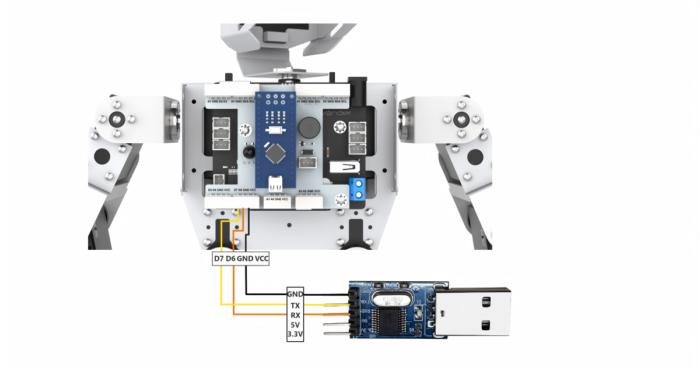

:::{Note}

* The power supplies for the master device and Tonybot can be different, but they must share a common ground to ensure stable communication levels.

* When wiring, ensure that the TX and RX pins of the UART serial port are crossed (TX to RX, RX to TX); otherwise, communication will not be possible.

:::

* **Data Transmission Format**

The default data transmission format for the UART serial port on Tonybot is as follows:

| Baud Rate  | 9600 |
| :--------: | :--: |
| Data Bits  |  8   |
| Parity Bit | None |
|  Stop Bit  |  1   |

* **Communication Protocol**

The command format sent from the master to Tonybot is as follows: it begins with "**CMD**", followed by command parameters separated by "**\|**". and ends with "**\$**".

### 4.6.2 PC Serial Port Control

This document demonstrates how to sequentially control Tonybot's action groups, head servo, read battery levels, capture ultrasonic data, and retrieve IMU data through the PC serial port.

* **Program Logic**

:::{Note}

To proceed with this section, make sure the Tonybot slave-side program is downloaded first. You can find the "**Tonybot Slave-side Program**" in the same directory as this document.

:::

(1) After connecting Tonybot to TTL for serial communication, it can be connected to a PC for UART communication. This enables serial control of Tonybot. The default UART data transmission format is as follows:

| Baud rate  | 9600 |
| :--------: | :--: |
|  Data bit  |  8   |
| Parity bit | None |
|  Stop bit  |  1   |

* **Communication protocol**

Next, we will explain the format of the protocol command packet. The format is as follows: it begins with "**CMD**", parameters are separated by "**\|**". and ends with "**\$**".

* **Preparation**

**(1) Hardware Preparation**

Connect the TXD, RXD, and GND pins of the USB-to-serial adapter to the IO27, IO19, and GND pins on Tonybot using DuPont wires. Then, plug the USB adapter into the computer. (Note: The 5V connection is optional, but the GND connection is mandatory.)

**(2) Software Preparation**

① First, navigate to the **"Serial Port Debugging Tool"** in the same folder as this section's content.

② Once you open the tool, make sure to set the baud rate to 9600, choose NONE for the parity bit, set data bits to 8, and stop bits to 1. Don't forget to check the "**Send as ASCII**" option. The configuration should look like the one shown below:

* **Function Implementation**

Control Tonybot by sending protocol commands:

(1) **Command Name:** Action Group Call

**Function Code:** 1

**Command Data:** Action group number, ranging from 0 to 255, corresponding to action groups 0-255.

**Description:** This command is used to instruct Tonybot to execute a specific action group.

**Example:** Sending the command "**CMD\|1\|0\|\$**" will make Tonybot perform the "**Stand at Attention**" action group.

(2) **Command Name:** Head Servo Control

**Function Code:** 2

**Command Data:** Servo angle, ranging from 0 to 180, corresponding to angles from 0° to 180°.

**Description:** This command controls the movement of Tonybot's head servo.  

**Example:** Sending the command "**CMD\|2\|90\|\$**" will rotate the head servo to a 90° position.

(3) **Command Name:** Battery Voltage

**Function Code:** 3

**Command Data:** This is a read operation, so no command data is needed.

**Description:** This command retrieves Tonybot's battery voltage, in millivolts (mV).  

**Example:** Sending the command "**CMD\|3\|\$**" will request the battery voltage.

After sending the data, Tonybot will return the requested information in the format:  

"**CMD\|Function Code\|data\|\$**", where "**data**" represents the retrieved value.

(4) **Command Name:** Ultrasonic Data

**Function Code:** 4

**Command Data:** This is a read operation, so no command data is required.

**Description:** This command retrieves the distance measured by Tonybot's ultrasonic sensor.  

**Example:** Sending the command "**CMD\|4\|\$**" will return the distance detected by the ultrasonic sensor, in millimeters (mm).

After sending the data, Tonybot will return the requested information in the format:  

"**CMD\|Function Code\|data\|\$**", where "**data**" represents the retrieved distance.

(5) **Command Name:** IMU Data

**Function Code:** 5

**Command Data:** This is a read operation, so no command data is needed.

**Description:** This command retrieves Tonybot's tilt angles along the X and Y axes, measured in degrees.  

**Example:** Sending the command "**CMD\|5\|\$**" will return the IMU data.

After sending the data, Tonybot will return the requested information in the format:  

"**CMD\|Function Code\|x\|y\|\$**", where "**x**" and "**y**" represent the tilt angles on the X and Y axes.

