# 6. Arduino Programming Projects

## 6.1 Programming Tool Installation and Overview

### 6.1.1 Arduino IDE Installation and Introduction

* **Arduino IDE Installation** 

Arduino IDE is a powerful software exclusively designed for Arduino microcontrollers. No matter which version it is, the same installation method can be used. This lesson will take the window version of [Arduino-2.2.1](https://www.arduino.cc/en/software/) as an example to illustrate:

(1) Locate the Arduino IDE installation package in the same folder as this document, as shown in the below figure, and double click to open it. (If you want to download the latest version of the software, you can download it through the Arduino official website <u>"<https://www.arduino.cc/en/software>"</u>.)


(2) Click **"I Agree"** to install. 


(3) Remain the default option, and click **"Next".**


(4) Click **"Browse"** to choose the installation path, and then click **"Install"**.


(5) Wait for the installation to complete.

:::{Note}

If you're prompted for the installation of the chip driver during the installation, please check "**Always trust software from Arduino LLC (A)**", then click "**Install**".

:::

(6) After the installation is complete, click **"Finish"**.


* **Software Instruction**

The main interface of Arduino IDE consists of 5 workplaces：


(1) **Menu bar**: it is responsible for Arduino IDE-related settings.

<table  class="docutils-nobg"  border="1">
<colgroup>
<col  />
<col  />
</colgroup>
<tbody>
<tr>
<td><strong>Icon</strong></td>
<td><strong>Function</strong></td>
</tr>
<tr>
<td></td>
<td>Create or open a project file, and customize preferences for the main interface.</td>
</tr>
<tr>
<td></td>
<td><p></p>
<p>Perform text editing such as commenting, indenting or searching for code.</p></td>
</tr>
<tr>
<td></td>
<td>Configure the entire project, including compiling, running, and adding the library files.</td>
</tr>
<tr>
<td></td>
<td>Select the development board and port, as well as obtain the board information.</td>
</tr>
<tr>
<td></td>
<td>Assist users with getting ready and offer solutions to common issues.</td>
</tr>
</tbody>
</table>


(2) **Tool bar**: some tools related to the project, including program compilation, programs download, serial monitor, etc.

| **Icon**                                                     | **Function**                                                 |
| ------------------------------------------------------------ | ------------------------------------------------------------ |
|  | Verification. Check if a program is written without errors. If it is fully correct, the compilation process will activate. |
|  | Download the program to the control board.                   |
|  | Debugging. Some development can be debugged through Arduino IDE in real time. |
|  | Select different boards for different development projects.  |
|  | Serial plotter, which can plot data printed to the Arduino serial port into graph. |
|  | Serial monitor, printing serial port information.            |

(3) **Editing area**: the area for editing code.

(4) **Status bar**: display the status of the current editor, such as the line and column of code, information about the development board, etc.

(5) **Sidebar:** the core of Arduino IDE is in charge of displaying the working folders, code debugging, library file installation, etc.

| **Icon**                                                     | **Function**                                                 |
| ------------------------------------------------------------ | ------------------------------------------------------------ |
|  | Management folder, display the files of current project.     |
|  | Development board manager, add the board tool package.       |
|  | Library management, add or delete the library files of the program. |
|  | Debugging, real-time debugging of the project.               |
|  | Search or replace the code or variables.                     |

### 6.1.2 Arduino IDE Instruction

* **Arduino IDE Interface Setting** 

(1) Modify the Chinese interface: select **"File -\> Preferences"** on the Arduino IDE interface. Then, choose Chinese from the **"Language"**, and click **"OK"**.


(2) You can modify the project file path, editor text size, color themes, etc by selecting **"File -\> Preferences"** in the pop-up window.


* **Arduino Download Program**

[Demo](../_static/source_code/Demo.zip)

(1) In this case, we will use an example that prints **"Hiwonder"** to illustrate. Open the example program Demo.ino .


(2) Connect Arduino board to the computer using Type-B cable.


(3) In the **"Select board"** option, find the corresponding Arduino development board. (Take **"Arduino Uno"** and **"COM5"** as en example to demonstrate. The COM port is not unique. You can can check the COM port number in the computer's device manager. )


(4) Click  button to compile the program, which can check if the program has syntax errors and other issues.


(5) After the compilation is complete, click  to upload the program into the Arduino development board.


(6) When the upload is done, click  to open the serial monitor. The word **"hiwonder"** is printed on the serial monitor.


* **Import Library File**

If the program requires importing the library files, you can refer to the following operations:

**Online Importing**

This method is usually used for importing some official Arduino library files. For example, the library file for servo control (Servo), the library file for PID control algorithm (PID), and the library file for driving the RGB light (FastLED).

Take the library file for driving the RGB light (FastLED) as an example to illustrate:

(1) Click  at the sidebar of Arduino IDE interface.

(2) In the pop-up library management bar, enter **"FastLED"** to automatically search for the library files, then click **"install"**.


(3) The prompt shown in the red box indicates the successful installation.


**Local Importing:**

This method is usually used for downloading library file or customizing the library file importing. Here will take the **"FastLED"** library file as an example to illustrate.

(1) Select **"Sketch -\> Include library -\> Add .ZIP library"**.


(2) Search for the "[**FastLED.zip**](../_static/source_code/Demo.zip)" file and open it.


(2) The prompt shown in the below red box indicates that the library file has been installed already.


(3) In the process of importing the library file in the local, if you encounter the below error during the process of importing library files locally, you can refer to the following solution.


Take the library file **"FastLED"** as example to illustrate. In Arduino IDE versions 1.8.5 and above, the error above may arise when importing this library file. You can solve this problem by extracting the library file and placing it directly into the 'libraries' folder in the path of the project. The specific solution is as follows:

(1) At first, extract the library file **"FastLED"**.


(2) Click **"File-\>Preferences"** in sequence.


(3) In the opening preferences, copy the path.


(4) Paste it in my computer, and then press **"Enter"** to access the path.


(5) Place the previously extracted library file into the **"libraries"** folder.


(6) Restart Arduino IDE. The library file has been located in the library of Arduino IDE.

## 6.2 Secondary Development Course

### 6.2.1 Introduction to Sensor-Related Libraries

During the development process, we use several libraries to facilitate program functionality and streamline the development process. These libraries include official Arduino libraries, such as **"Servo"** and **"SoftwareSerial,"** as well as our custom libraries, **"HWsensor"** and **"LobotServoController."**

This section provides an overview of the custom libraries used in our secondary development and explains how they are utilized in the main program. 

:::{Note}

The **LED_Matrix** library has already been encapsulated, and will not be further discussed in this section.

:::

* **Sensor Library (HWSensor)**

The HWSensor library provides functions for controlling the ultrasonic module's transmission and reception of information, setting the RGB light color on the module, and retrieving distance measurements. This library will be used in future applications, such as the smart fan and distance display features, to detect distances and manage the color changes of the module’s lights.

The following section explains some of the most commonly used functions.

(1) Member Function (HWSensor::ultrasoundColor)

{lineno-start=143}

```
void HWSensor::ultrasoundColor(uint8_t r1, uint8_t g1, uint8_t b1, uint8_t r2, uint8_t g2, uint8_t b2)
{
  uint8_t RGB[6]; 
  uint8_t value = RGB_WORK_SIMPLE_MODE;
  
  wireWriteDataArray(ULTRASOUND_I2C_ADDR, RGB_WORK_MODE,&value,1);
  RGB[0] = r1;RGB[1] = g1;RGB[2] = b1;//RGB1
  RGB[3] = r2;RGB[4] = g2;RGB[5] = b2;//RGB2
  wireWriteDataArray(ULTRASOUND_I2C_ADDR, RGB1_R,RGB,6);
}
```

The ultrasoundColor function is a member of the HWSensor class, designed to control the RGB lighting on the ultrasonic module. It takes six parameters: r1, g1, b1 for the RGB values of the left light, and r2, g2, b2 for the RGB values of the right light. Below is a detailed explanation of the function:

**HWSensor::ultrasoundColor()**

<table>
<colgroup>
<col  />
<col  />
<col  />
<col  />
</colgroup>
<tbody>
<tr>
<td colspan="4" ><strong>HWSensor::ultrasoundColor()</strong></td>
</tr>
<tr>
<td >Function Description</td>
<td colspan="3" >Control the RGB light of the glowy ultrasonic sensor</td>
</tr>
<tr>
<td >Parameter List</td>
<td >r1、g1、b1、r2、g2、b2</td>
<td >Return value</td>
<td >None</td>
</tr>
<tr>
<td >Usage Instructions</td>
<td colspan="3" >
<p>(1) HWSensor hws;（Create an ultrasonic object）</p>
<p>(2) hws.ultrasoundColor(0,0,255,0,0,255);</p>
</ol></td>
</tr>
</tbody>
</table>

This function uses wireWriteDataArray to send data to the ultrasonic sensor's I2C address. It first writes a byte of data corresponding to RGB_WORK_SIMPLE_MODE to the I2C address ULTRASOUND_I2C_ADDR. Then, it assigns the RGB values for the two lights (RGB1 and RGB2) to the first six elements of the RGB array. Finally, it sends the RGB values of both colors to the ultrasonic sensor using the I2C protocol with another wireWriteDataArray call.

(2) Member Function (HWSensor::ultrasoundGetDistance)

The ultrasoundGetDistance function is a member of the HWSensor class and is used to obtain distance data from the ultrasonic module.

This function utilizes wireReadDataArray to read data from the ultrasonic sensor’s I2C address. It starts reading from offset 0 of the address ULTRASOUND_I2C_ADDR, retrieving two bytes of data and storing it in the distance variable. The data corresponds to the measured distance from the ultrasonic module.

{lineno-start=155}

```
uint16_t HWSensor::ultrasoundGetDistance()
{
  uint16_t distance;
  wireReadDataArray(ULTRASOUND_I2C_ADDR, 0,(uint8_t *)&distance,2);
  return distance;
}
```

<table>
<colgroup>
<col  />
<col  />
<col  />
<col  />
</colgroup>
<tbody>
<tr>
<td colspan="4" ><strong>HWSensor::ultrasoundGetDistance()</strong></td>
</tr>
<tr>
<td >Function Description</td>
<td colspan="3" >Retrieves the distance measurement from the ultrasonic module.</td>
</tr>
<tr>
<td >Parameter List</td>
<td >None</td>
<td >Return Value</td>
<td >Returns a u16 type value representing the measured distance.</td>
</tr>
<tr>
<td >Usage Instructions</td>
<td colspan="3" >
<p>(1) HWSensor hws; (Create an ultrasonic object)</p>
<p>(2) hws.ultrasoundGetDistance(); (Returns the measured distance, including potential interference)</p>
</ol></td>
</tr>
</tbody>
</table>


* **Servo Controller Library (LobotServoController)（LobotServoController）**

The LobotServoController is a library used for controlling bus servos, enabling the robot to perform actions and action sequences. Below is an explanation of some commonly used functions.

(1) Member Function（LobotServoController::moveServo）

{lineno-start=52}

```
void LobotServoController::moveServo(uint8_t servoID, uint16_t Position, uint16_t Time)
{
	uint8_t buf[11];
	if (servoID > 31 || !(Time > 0)) { //舵机ID不能打于31,可根据对应控制板修改(Servo ID cannot be greater than 31. Modify as needed for your control board.)
		return;
	}
	buf[0] = FRAME_HEADER;                   //填充帧头(Set frame header)
	buf[1] = FRAME_HEADER;
	buf[2] = 8;                              //数据长度=要控制舵机数*3+5，此处=1*3+5(Data length = number of servos * 3 + 5. Here, it's 1 * 3 + 5)
	buf[3] = CMD_SERVO_MOVE;                 //填充舵机移动指令(Set servo movement command)
	buf[4] = 1;                              //要控制的舵机个数(Number of servos to control)
	buf[5] = GET_LOW_BYTE(Time);             //填充时间的低八位(Set the lower 8 bits of the duration)
	buf[6] = GET_HIGH_BYTE(Time);            //填充时间的高八位(Set the higher 8 bits of the duration)
	buf[7] = servoID;                        //舵机ID(Set the servo ID)
	buf[8] = GET_LOW_BYTE(Position);         //填充目标位置的低八位(Set the lower 8 bits of the target position)
	buf[9] = GET_HIGH_BYTE(Position);        //填充目标位置的高八位(Set the higher 8 bits of the target position)

	SerialX->write(buf, 10);
}
```

The moveServo function is a member of the LobotServoController class, and it is primarily used to control the position of a single bus servo. It takes three parameters: servoID, Position, and Time, which represent the servo ID, target position, and motion duration, respectively.

<table>
<colgroup>
<col  />
<col  />
<col  />
<col  />
</colgroup>
<tbody>
<tr>
<td colspan="4" ><strong>LobotServoController::moveServo()</strong></td>
</tr>
<tr>
<td >Function Description</td>
<td colspan="3" >Controls the movement of a single bus servo to a specified position</td>
</tr>
<tr>
<td >Parameter list</td>
<td >servoID、Position、Time</td>
<td >Return Value</td>
<td >None</td>
</tr>
<tr>
<td >Usage Example</td>
<td colspan="3" >
<p>(1) LobotServoController lsc(MySerial);（Creates a servo controller object）</p>
<p>(2) lsc.moveServo(16,670,500);(Moves the servo with ID 16 to position 670 over 500 milliseconds.)</p>
</ol></td>
</tr>
</tbody>
</table>


The function uses the write method to send data to the servo controller via the serial port. The command follows a specific protocol format: Frame Header + Data Length + Function Code + Data. The servo ID, target position, and movement time are sent to the controller in this format. Upon receiving the serial command, the controller will command the servo to move to the specified position.

(2) Member Function (LobotServoController::runActionGroup)

The runActionGroup function is a member of the LobotServoController class and is used to execute a predefined group of actions. It accepts two parameters: numOfAction and Times, which represent the action group number and the number of times the action group should be executed, respectively.

{lineno-start=145}

```
void LobotServoController::runActionGroup(uint8_t numOfAction, uint16_t Times)
{
	uint8_t buf[7];
	buf[0] = FRAME_HEADER;   //填充帧头(Set frame header)
	buf[1] = FRAME_HEADER;
	buf[2] = 5;      //数据长度，数据帧除帧头部分数据字节数，此命令固定为5(Data length, the number of data bytes excluding the frame header. This command always has a length of 5.)
	buf[3] = CMD_ACTION_GROUP_RUN; //填充运行动作组命令(Set the command to run the action group)
	buf[4] = numOfAction;      //填充要运行的动作组号(Set the action group number to run)
	buf[5] = GET_LOW_BYTE(Times); //取得要运行次数的低八位(Get the lower 8 bits of the number of executions)
	buf[6] = GET_HIGH_BYTE(Times); //取得要运行次数的高八位(Get the higher 8 bits of the number of executions)
	isRunning_ = true;
	SerialX->write(buf, 7);      //发送数据帧(Send the data frame)
}
```

<table>
<colgroup>
<col  />
<col  />
<col  />
<col  />
</colgroup>
<tbody>
<tr>
<td colspan="4" ><strong>LobotServoController::runActionGroup()</strong></td>
</tr>
<tr>
<td >Function description</td>
<td colspan="3" >Executes a specified action group for a given number of repetitions</td>
</tr>
<tr>
<td >Parameter list</td>
<td >numOfAction、Times</td>
<td >Return value</td>
<td >None</td>
</tr>
<tr>
<td >Usage example</td>
<td colspan="3" ><p>LobotServoController lsc(MySerial);（Creates a servo controller object）</p>
<p>lsc.runActionGroup(0,1);</p></td>
</tr>
</tbody>
</table>

### 6.2.2 Breathing Light Project

* **Project Introduction**

In this lesson, we will make the RGB LED on the ultrasonic sensor blink.

* **Program Implementation Process**


* **Introduction to Glowy Ultrasonic Sensor**


This is a glowy ultrasonic distance sensor module that communicates via I2C. It reads the distance measured by the ultrasonic sensor using the I2C protocol.

When measuring distance, the module sends out 8 pulses of 40kHz square waves and checks for any returning signals. If a signal is detected, the module outputs a high-level signal, and the duration of this high signal corresponds to the time taken for the ultrasonic waves to travel to the target and back.

The ultrasonic sensor is pre-installed on the robot when it leaves the factory.

* **Program Download**

[Breathing Light Program]()

(1) Locate and open the program file **“Breathing Light Program\Breathing\Breathing.ino”** in the directory corresponding to this section.


(2) Connect the ESP32 to the computer using a data cable.

(3) Select the **"Select Board"** option. The software will automatically detect the serial port of the connected ESP32. Click to establish the connection.


(4) Click  to upload the program to the ESP32. Wait for the upload to complete.


* **Expected Results**

:::{Note}

It is recommended to perform this activity in a dark environment for a better experience.

The RGB LED on the ultrasonic sensor will emit blue light and blink every 2 seconds.

:::

* **Program Analysis**

[Breathing Light Program]()

(1) Importing Libraries

Import the necessary libraries for servo control, sensor functionality, software serial communication, and other required communication libraries.

{lineno-start=6}

```
#include "base_config.h"
#include "HardwareSerial.h" //串口库(Serial communication library)
#include "LobotServoController.h" //舵机控制器库(Servo controller library)
#include "Arduino.h"
#include "Servo.h" //舵机库(Servo library)
#include "HWSensor.h" //传感器库(Sensor library)
#include "Hiwonder.hpp"
```

(2) Defining Pins and Creating Objects

Define the communication pins between the ESP32 and the servo controller. Then, instantiate the sensor class and the communication class for secondary development.

{lineno-start=14}

```
LobotServoController Controller(Serial2); //实例化二次开发通信库(Instantiate secondary development communication library)
HWSensor hwsensor;  //实例化传感器类(Instantiate sensor class)
Servo sonarServo; //超声波云台舵机控制类实例(Instantiate servo class for ultrasonic sensor pan-tilt control)
```

(3) Initialization Setup

In the setup() function, initialize the hardware devices. Set the baud rate for serial communication to 115200, and set the baud rate for the software serial port to 9600.  

Next, use the Controller.runActionGroup(0, 1) function to execute action group 0 once.

{lineno-start=18}

```
void setup() {
  // 初始化串口通信(Initialize serial communication)
  Serial.begin(115200);
  // 初始化与底板通信的串口(Initialize serial communication with the mainboard)
  Serial2.begin(9600 , SERIAL_8N1 , IO_BaseRX , IO_BaseTX);
  sonarServo.attach(IO_Servo);         //设定舵机控制io口(Set the servo control IO pin)
  sonarServo.write(90); 
  delay(200); //等待底板初始化完毕(Wait for the mainboard to initialize)
  sonarServo.detach();
  // 初始化机器人姿态(Initialize robot posture)
  Controller.runActionGroup(0 , 1);
  delay(1500);
  Serial.println("start.");
}
```

(4) Main Function

After initialization, the program enters the loop() function. Within the loop, call the function hwsensor.ultrasoundBreathing(0, 0, 20, 0, 0, 20) to trigger the ultrasound breathing light effect, causing the blue LED to gradually fade in and out every 2 seconds.

{lineno-start=33}

```
void loop() {
  hwsensor.ultrasoundBreathing(0, 0, 20, 0, 0, 20); //每隔2s蓝灯渐变一次(Blue light fades in and out every 2 seconds)
  delay(2000);  //注意需要给相应的延时(Ensure appropriate delay)
}
```

* **Function Extension**

(1) Modifying the Blinking Speed

① To modify the blinking speed, adjust the values within the code block in the program, as shown in the figure below:


② The ultrasoundBreathing method is located in the HWSensor.cpp file. Its six parameters correspond to the RGB lights of the ultrasonic sensor on the left and right sides. The values of these parameters determine the time for the breathing effect to fade in and out.


③ To change the blinking speed, modify the parameter values within the ultrasoundBreathing method. For example:


**(2) Modifying the Display Color**

To modify the display color, based on the changes made to the blinking speed, simply adjust the RGB values in the corresponding parameters of the ultrasoundBreathing method. The figure below illustrates how to modify these values.


###  6.2.3 Distance Ranging & Display Project

* **Project Introduction**

This section utilizes the ultrasonic module to measure the distance to an obstacle. The measured distance is displayed on the LED dot matrix, and the RGB light color of the ultrasonic module is adjusted accordingly.

* **Program Implementation Process**


* **Sensor Introduction**

(1) Glowy Ultrasonic Sensor


This is a light-emitting ultrasonic distance sensor module that communicates via I2C. It reads the distance measured by the ultrasonic sensor using the I2C protocol.

When measuring distance, the module sends out 8 pulses of 40kHz square waves and checks for any returning signals. If a signal is detected, the module outputs a high-level signal, and the duration of this high signal corresponds to the time taken for the ultrasonic waves to travel to the target and back.

(2) LED Dot Matrix Display

The LED dot matrix module utilizes an LED display screen that offers high brightness, flicker-free performance, and easy wiring. It is capable of displaying numbers, text, patterns, and other content. The module consists of two red 8x8 LED matrices and is controlled by the TM640B driver chip, which enables efficient control of the dot matrix screen.


For a detailed introduction to the installation and assembly process, please refer to the tutorial video.

* **Program Download**

[Distance Ranging & Display Program]()

(1) Locate and open the program file **“Distance Ranging & Display Program\LED_Matrix_display\LED_Matrix_display.ino”** in the directory corresponding to this section.


(2) Connect the ESP32 to the computer using a data cable.

(3) Select the **"Select Board"** option. The software will automatically detect the serial port of the connected ESP32. Click to establish the connection.


(4) Click  to upload the program to the ESP32. Wait for the upload to complete.


* **Expected Results**

Slowly bring the object closer to the glowy ultrasonic sensor. As the distance decreases, the ultrasonic light will shift towards red, and as the distance increases, it will become greener. The LED dot matrix display will update in real-time to show the measured distance.

* **Program Analysis**

[Distance Ranging & Display Program]()

(1) Importing Libraries

Import the necessary libraries for servo control, sensor functionality, software serial communication, and other communication libraries required for the application.

{lineno-start=1}

```
#include "base_config.h"
#include "HardwareSerial.h" //串口库(Serial library)
#include "LobotServoController.h" //舵机控制器库(Servo controller library)
#include "Arduino.h"
#include "Servo.h"
#include "HWSensor.h" //传感器库(Sensor library)
#include "Hiwonder.hpp"
#include "src/WMMatrixLed/WMMatrixLed.h"
```

(2) Defining Pins and Creating Objects

Define the communication serial pins for the ESP32 and the servo controller. Then, instantiate the sensor class, software serial class, and secondary development communication class. Additionally, initialize the LED dot matrix module.

{lineno-start=10}

```
LobotServoController Controller(Serial2); //实例化二次开发通信库(Instantiate the communication library for secondary development)
HWSensor hwsensor;  //实例化传感器类(Instantiate the sensor class)
Servo sonarServo; //超声波云台舵机控制类实例(Instantiate the ultrasonic pan-tilt servo control class)
#define DIN IO_2  //定义DIN(Define DIN)
#define CLK IO_5 //定义CLK(Define CLK)
// 初始化点阵对象(Initialize matrix object)
WMMatrixLed mx(CLK , DIN);
```

(3) Initialization Setup

In the setup() function, initialize the hardware devices. Set the baud rate for the serial communication to 115200 and the baud rate for the software serial communication to 9600.  

Next, use the Controller.runActionGroup(0, 1) function to execute action group 0 once. Finally, initialize the LED dot matrix module.

{lineno-start=28}

```
void setup() {
  // 初始化串口通信(Initialize serial communication)
  Serial.begin(115200);
  // 初始化与底板通信的串口(Initialize communication with the baseboard)
  Serial2.begin(9600 , SERIAL_8N1 , IO_BaseRX , IO_BaseTX);
  sonarServo.attach(IO_Servo);         //设定舵机控制io口(Set servo control I/O port)
  sonarServo.write(90); 
  delay(200); //等待底板初始化完毕(Wait for the baseboard to initialize)
  sonarServo.detach();
  // 初始化机器人姿态(Initialize robot posture)
  Controller.runActionGroup(0 , 1);
  mx.setColorIndex(1);//设置颜色(Set color)
  mx.setBrightness(4);//设置亮度8级可调(Set brightness (8-level adjustable))
  delay(1500);
  Serial.println("start.");
}
```

(4) Main Function

After initialization, the program enters the loop() function. In this loop, the Controller.receiveHandle() function is used to receive data from the controller. The ultrasonic distance data is stored in the distance variable using the getDistance() function.  

The hwsensor.ultrasoundColor() function maps the distance data to the RGB LEDs on the ultrasonic sensor, displaying the corresponding color. The six parameters in this function represent the color values for the RGB lights on the left and right sides of the sensor.  

Finally, the mx.showNum(2, distance) function displays the distance value on the dot matrix module.

{lineno-start=45}

```
void loop() {
  if(Serial.available()) {
    String command = Serial.readStringUntil('\n');
    command.trim(); //去除前后空格 (Remove leading and trailing spaces)
    handleCommand(command);
  }
}
```

(5) Ultrasonic Detection Function

This function defines three variables to store the ultrasonic distance data. The hwsensor.ultrasoundGetDistance() function retrieves the distance data from the ultrasonic sensor, and the function returns the average value of the three measured distances.

{lineno-start=53}

```
void handleCommand(String command) {
  if(command.startsWith("GET_DISTANCE")) {
    int distance = getDistance();
    distance = distance > 1000 ? 1000 : distance;
    Serial.println(distance);
  } else if(command.startsWith("SET_SERVO")) {
    int angle = command.substring(10).toInt(); //命令格式为 "SET_SERVO 90"(Command format: "SET_SERVO 90")
    if(angle >= 0 && angle <= 180) {
      sonarServo.attach(IO_Servo);
      sonarServo.write(angle);
      delay(200);
      sonarServo.detach();
      Serial.println("OK");
    } else {
      Serial.println("ERROR: Invalid angle");
    }
  } else if(command.startsWith("SHOW_COLOR")) {
    int r = command.substring(11, 13).toInt(); //命令格式为 "SHOW_COLOR 255 0 0"(Command format: "SHOW_COLOR 255 0 0")
    int g = command.substring(14, 16).toInt();
    int b = command.substring(17, 19).toInt();
    mx.setColor(r, g, b);
    Serial.println("OK");
  } else {
    Serial.println("ERROR: Unknown command");
  }
}
```

* **Function Extension**

This section demonstrates how to change the RGB gradient color from yellow to purple. Follow the steps below to modify the color:

(1) Locate the part of the program where the RGB LED color is mapped according to the distance. The color is adjusted based on the distance proportion. Initially, when the red (R) and green (G) components are mixed, the resulting gradient color is yellow.


(2) Replace the green (G) component in the mapping with the blue (B) component. This change will make the gradient color shift to purple as the red (R) and blue (B) components mix in response to the changing distance.


For more information on RGB colors, you can refer to the following link: [<u>https://www.bchrt.com/tools/rgbcolor/</u>](https://www.bchrt.com/tools/rgbcolor/)

* **FAQ**

**Q1: The distance measured by the ultrasonic sensor is always 0 after uploading the code.**  

**A1:** Please check if the 4-pin wire is properly connected to the correct I2C interface. Refer to section 2.3 for the correct wiring instructions.

**Q2: The distance measured by the ultrasonic sensor is sometimes accurate, but sometimes inaccurate.**  

**A2:** Ensure you are using smooth, flat objects for distance measurement. Also, avoid measuring obstacles at very close distances for extended periods of time.

### 6.2.4 Distance-Controlled Walking Project

* **Assembly**


* **Project Introduction**

In this lesson, the ultrasonic sensor is used to measure obstacles in front of the robot. When the detected distance falls within the predefined range set by the program, the robot will move forward or backward accordingly.

* **Program Implementation Process**


* **Sensor Introduction**


This is a light-emitting ultrasonic distance sensor module that communicates via I2C. It reads the distance measured by the ultrasonic sensor using the I2C protocol.

When measuring distance, the module sends out 8 pulses of 40kHz square waves and checks for any returning signals. If a signal is detected, the module outputs a high-level signal, and the duration of this high signal corresponds to the time taken for the ultrasonic waves to travel to the target and back.

* **Program Download**

[Distance-Controlled Walking Program]()

(1) Locate and open the program file **“Distance-Controlled Walking Program\Follow\Follow.ino”** in the directory corresponding to this section.


(2) Connect the ESP32 to the computer using a data cable.

(3) Select the **"Select Board"** option. The software will automatically detect the serial port of the connected ESP32. Click to establish the connection.


(4) Click  to upload the program to the ESP32. Wait for the upload to complete.


* **Expected Results**

:::{Note}

Please avoid using the ultrasonic sensor to continuously detect objects that are too close.  

:::

Place a cardboard box in front of the sensor. If the distance is between 28-40 cm, the robot will move forward. If the distance is between 3-18 cm, the robot will move backward.

* **Program Analysis**

[Distance-Controlled Walking Program]()

(1) Importing Libraries

{lineno-start=6}

```
#include "base_config.h"
#include "HardwareSerial.h" //串口库(Serial library)
#include "LobotServoController.h" //舵机控制器库(Servo controller library)
#include "Arduino.h"
#include "Servo.h"
#include "HWSensor.h" //传感器库(Sensor library)
#include "Hiwonder.hpp"
```

Import the necessary libraries for servo control, sensors, and communication protocols required by the program.

(2) Variable Definitions

{lineno-start=14}

```
LobotServoController Controller(Serial2); //实例化二次开发通信库(Instantiate the communication library for secondary development)
HWSensor hwsensor;  //实例化传感器类(Instantiate the sensor class)
Servo sonarServo; //超声波云台舵机控制类实例(Instantiate the ultrasonic gimbal servo control class)

uint16_t Distance = 0;
```

This section instantiates the pan-and-tilt servo and sensor classes, making it easier to call the methods of these classes through the created objects. A variable named distance is defined to store the distance data from the ultrasonic sensor.

(3) Initialization Function (setup)

{lineno-start=97}

```
void setup() {
  // 初始化串口通信(Initialize serial communication)
  Serial.begin(115200);
  // 初始化与底板通信的串口(Initialize serial communication with the baseboard)
  Serial2.begin(9600 , SERIAL_8N1 , IO_BaseRX , IO_BaseTX);
  sonarServo.attach(IO_Servo);         //设定舵机控制io口(Set the servo control IO pin)
  sonarServo.write(90); 
  delay(200); //等待底板初始化完毕(Wait for the baseboard to initialize)
  sonarServo.detach();
  // 初始化机器人姿态(Initialize the robot's posture)
  Controller.runActionGroup(0 , 1);
  delay(1500);
  Serial.println("start.");
}
```

① Initialize communication with the servo controller and the PC via serial communication on the ESP32.

② Bind the pan-and-tilt servo to pin 9 of the ESP32 using the sonarServo.attach() method.

③ Move the pan-and-tilt servo to 90 degrees using sonarServo.write(). Then, execute action group 0 once using the Controller.runActionGroup() method.

④ After a short delay, call sonarServo.detach() to reset the servo, then use Controller.waitForStop() to wait for the servo controller to complete the action group. The program waits for 2000 ms before continuing.

These actions form the default setup executed on power-up.

(4) Main Loop (loop)

{lineno-start=112}

```
void loop() {
  // 获取超声波测量距离(Get the ultrasonic measurement distance)
  getDistance();
  // 定距行走任务(Distance walking task)
  Distancewalking();
  delay(100);  //注意需要给相应的延时(Make sure to provide the necessary delay)
}
```

In the main loop, the ESP32 continuously calls the getDistance() function to measure the distance. Based on the measured distance, the program executes corresponding actions using the Distancewalking() function. Additionally, Controller.receiveHandle() monitors the status of the commands sent to the servo controller.

(5) Distance Measurement Function (getDistance)

{lineno-start=19}

```
uint16_t getDistance() {       //获得距离(Get the distance)
  uint16_t distance1, distance2, distance3;
  distance1 = hwsensor.ultrasoundGetDistance();
  distance2 = hwsensor.ultrasoundGetDistance();
  distance3 = hwsensor.ultrasoundGetDistance();

  Distance = (distance1 + distance2 + distance3)/3;
  return Distance;
}
```

① Data Type: The function returns a uint16_t value, an unsigned 16-bit integer representing the measured distance.

② Variable Declarations: The function declares three uint16_t variables: distance1, distance2, and distance3, to store three distance measurements.

③ Distance Retrieval: The function calls hwsensor.ultrasoundGetDistance() three times, storing the results in distance1, distance2, and distance3. This is a hardware-related function used to get distance values from the ultrasonic sensor.

④ Distance Calculation: The average of the three measurements is calculated with the formula (distance1 + distance2 + distance3) / 3, and the average value is stored in the Distance variable.

⑤ Return Value: The function returns the calculated average distance.

(6) Distance-Based Action Function (Distancewalking) 

{lineno-start=30}

```
bool have_move = false;
/*定距行走任务(Distance-controlled walking task)*/
void Distancewalking()
{
  static uint8_t step = 0;
  static uint32_t last_tick = 0;
  if(millis() <= last_tick)
  {
    return;
  }
  switch(step) {
    case 0:
        // 若距离过近(If the distance is too close)
        if (Distance > 30 && Distance < 180) {//亮红灯，执行过渡动作(Turn on the red light, perform transition action)         
          hwsensor.ultrasoundColor(50, 0, 0, 50, 0, 0);  
          Controller.runActionGroup(18, 1);
          last_tick = millis()+350;
          have_move = true;
          step = 1;
        }
        // 若距离过远(If the distance is too far)
```

① Entering the Function:

The function begins by calling Controller.isRunning() to check the status of the previous command. If this function returns TRUE, it means that the previous command is still being executed. In this case, the function exits without issuing a new movement command.

② If Controller.isRunning() Returns FALSE:

This means the servo controller is idle and ready to receive the next command. The function proceeds to the next steps.

**First Cycle of Execution:**

① The program first executes the case0 statement, which controls the RGB light on the ultrasonic module based on the measured distance. The robot then performs an action group, and the have_move flag is set to true.

② Based on the measured distance, the program will enter either case 1 (if the distance is between 30 and 180 cm), case 2 (if the distance is between 300 and 400 cm), or remain in the default state (if the distance is between 180 and 300 cm, with step remaining 0).

{lineno-start=65}

```
    case 1:
        if ((Distance > 30 && Distance < 180) || have_move) { //执行后退动作(Perform the backward movement)
          have_move = false;
          Controller.runActionGroup(22, 1);
          last_tick = millis()+1700;
        }
        else {
          step = 3;      
        }   
      break; 
    case 2:
        if ((Distance > 300 && Distance < 400) || have_move) { //执行前进动作(Perform the forward movement)
          have_move = false;
          Controller.runActionGroup(21, 1);
          last_tick = millis()+1300;
        }
        else {
          step = 3;      
        }   
      break;  
    case 3:
      Controller.runActionGroup(18, 1);//执行过渡动作(Perform the transition action)
      Controller.waitForStop(2000);//等待动作执行完成，参数大于动作组执行的时间(Wait for the action to complete, the parameter is greater than the time for the action group to complete)
      Controller.runActionGroup(19, 1);//执行快速立正动作(Perform the quick standing action)
      hwsensor.ultrasoundColor(0, 0, 50, 0, 0, 50); 
      have_move = false;
      step = 0;
      break;
  }
}
```

In case 1: If the condition ((Distance \> 30 && Distance \< 180) \|\| have_move) is true, the have_move flag is set to false, and a backward movement command is issued to the servo controller. The same logic applies to case 2.

After executing either case 1 or case 2, the program exits the Distancewalking() function.

**Second Cycle of Execution:**

① On the next call to the function, step retains its value from the previous cycle, so the switch statement directly jumps to the corresponding case.

② If step = 0, the program logic behaves the same as in the first cycle, as described earlier.

③ If step = 1 or step = 2, in case 1, the have_move flag was set to false in the previous cycle, so the condition ((Distance \> 30 && Distance \< 180) \|\| have_move) becomes false, and step is set to 3. The program moves to case 3. The same logic applies to case 2.

④ In case 3, the program controls the robot to perform action groups 18 and 19, and the ultrasonic module lights up blue. The step is reset to 0.

⑤ After two iterations of the Distancewalking() function, the program completes the full execution logic and processes all conditions and actions.

(7) Serial Receive Function (receiveHandle)

{lineno-start=278}

```
void LobotServoController::receiveHandle()
{
	uint8_t rx;
	static uint8_t buf[16];
	static bool isGetFrameHeader = false;
	static uint8_t frameHeaderCount = 0;
	static uint8_t dataLength = 2;
	static uint8_t dataCount = 0;
	
	while(SerialX->available() > 0)
	{
		rx = SerialX->read();
		if(!isGetFrameHeader)
		{
			if(rx == 0x55)
			{
				frameHeaderCount++;
				if(frameHeaderCount == 2)
				{
					frameHeaderCount = 0;
					isGetFrameHeader = true;
					dataCount = 1;
				}
			} else {
				isGetFrameHeader = false;
				dataCount = 0;
				frameHeaderCount = 0;
			}
		}
```

① The function starts by entering a while(SerialX-\>available() \> 0) loop, continuously checking if data is available on the serial port.

② Each iteration of the loop reads a byte of data from the serial port using SerialX-\>read() and stores it in the rx variable.

③ In the first stage of the loop: The isGetFrameHeader flag is set to false, and the program collects data bytes, looking for the frame header byte 0x55.

④ When a frame header byte is received, the frameHeaderCount counter is incremented.

⑤ If the received byte is not a frame header or the second byte after the frame header is missing, the frameHeaderCount is reset to 0.

⑥ When two consecutive frame header bytes are received, the program recognizes that a valid frame header has been received, sets the isGetFrameHeader flag to true, and transitions to the next stage of the loop.

{lineno-start=307}

```
		if(isGetFrameHeader)
		{
			buf[dataCount] = rx;
			if(dataCount == 2)
			{
				dataLength = buf[dataCount];
				if(dataLength < 2 || dataLength > 8)
				{
					dataLength = 2;
					isGetFrameHeader = false;
				}
			}
			dataCount++;
			if(dataCount == dataLength + 2)
			{
				isGetFrameHeader = false;
				switch(buf[3])
				{
					case BATTERY_VOLTAGE:
						batteryVoltage = BYTE_TO_HW(buf[5], buf[4]);
						isGetBatteryVolt = true;
						break;
					case ACTION_GROUP_RUNNING:
						isRunning_ = true;
						break;
					case ACTION_GROUP_COMPLETE:
					case ACTION_GROUP_STOPPED:
						isRunning_ = false;
						break;
					default:
						break;
				}
			}
		}
	}
}
```

⑦ In the second stage, the program stores each byte of data in the buf buffer.

⑧ The second byte of the received frame is the length of the frame. The program checks that the length is between 2 and 8 (excluding the two frame header bytes). If the length is invalid, the program returns to the first stage to wait for a valid frame header.

⑨ After the full frame is received, the program checks the fourth byte of the data frame to determine the function type and updates the relevant flags accordingly.

* **Function Extension**

(1) To modify the ultrasonic distance measurement range, simply change the values in the code as shown below:


(2) In the current implementation, the condition checks if the distance is greater than 30 mm and less than 180 mm, causing the robot to move backward. If the distance is greater than 300 mm and less than 400 mm, the robot will move forward. To adjust the ultrasonic measurement range, modify the threshold values in the conditional statements. For example:


### 6.2.5 Treasure Hunt Project

* **Project Introduction**

In this lesson, the robot's servo controlling the ultrasonic sensor will rotate back and forth. When the set conditions are met, the robot will turn in the corresponding direction.

* **Program Implementation Process**


* **Sensor Introduction**


This is a light-emitting ultrasonic distance sensor module that communicates via I2C. It reads the distance measured by the ultrasonic sensor using the I2C protocol.

When measuring distance, the module sends out 8 pulses of 40kHz square waves and checks for any returning signals. If a signal is detected, the module outputs a high-level signal, and the duration of this high signal corresponds to the time taken for the ultrasonic waves to travel to the target and back.

* **Program Download**

[Treasure Hunt Program]()

(1) Locate and open the program file **“02 Treasure Hunt\Follow\Follow.ino”** in the directory corresponding to this section.


(2) Connect the ESP32 to the computer using a data cable.

(3) Select the "Select Board" option. The software will automatically detect the serial port of the connected ESP32. Click to establish the connection.


(4) Click  to upload the program to the ESP32. Wait for the upload to complete.


* **Expected Results**

The servo below the ultrasonic sensor will rotate back and forth while measuring the distance between the robot and nearby obstacles. The robot compares the distances on both sides.  

If the distance on one side is shorter, the robot will turn in that direction. For example, if the left side is closer, the robot will turn left; if the right side is closer, it will turn right.

* **Program Analysis**

[Treasure Hunt Program]()

(1) Importing Libraries

{lineno-start=6}

```
#include "base_config.h"
#include "HardwareSerial.h" //串口库(Serial library)
#include "LobotServoController.h" //舵机控制器库(Servo controller library)
#include "Arduino.h"
#include "Servo.h"
#include "HWSensor.h" //传感器库(Sensor library)
#include "Hiwonder.hpp"
```

Import the necessary libraries for controlling servos and sensors are imported at this stage.

{lineno-start=14}

```
#define TURN_RIGHT  35     /*右转动作组(Right turn action group)*/
#define TURN_LEFT   34     /*左转动作组(Left turn action group)*/
#define B 0               /*舵机偏差，根据实际情况调整大小以使超声波朝向正前方 -响右 +向左(Servo offset, adjust the value as needed to make the ultrasonic sensor face forward - positive for right, negative for left)*/
```

① Action groups for turning left and right are assigned unique numbers. These action groups will be referenced later using macros, improving code clarity and maintainability.

② The deviation value for the pan-tilt servo is defined. This allows users to measure and account for any differences between the expected and actual angles of the servo. The deviation value will be factored into future servo control algorithms.

(2) Variable Definitions

{lineno-start=18}

```
LobotServoController Controller(Serial2); //实例化二次开发通信库(Instantiate the communication library for secondary development)
HWSensor hwsensor;  //实例化传感器类(Instantiate the sensor class)
Servo sonarServo; //超声波云台舵机控制类实例(Instantiate the ultrasonic pan/tilt servo control class)
```

① The pan-tilt servo and sensor classes are instantiated here to enable the use of their methods later in the program.

② The distance variable is defined to store the data measured by the ultrasonic sensor.

(3) Setup Function

{lineno-start=140}

```
void setup() {
  // 初始化串口通信(Initialize serial communication)
  Serial.begin(115200);
  // 初始化与底板通信的串口(Initialize serial communication with the baseboard)
  Serial2.begin(9600 , SERIAL_8N1 , IO_BaseRX , IO_BaseTX);
  sonarServo.attach(IO_Servo);         //设定舵机控制io口(Set the servo control IO pin)
  sonarServo.write(90); 
  delay(200); //等待底板初始化完毕(Wait for the baseboard to complete initialization)
  sonarServo.detach();
  // 初始化机器人姿态(Initialize the robot's posture)
  Controller.runActionGroup(0 , 1);
  delay(1500);
  Serial.println("start.");
}
```

① Serial.begin(115200); initializes the main serial communication at a baud rate of 115200, allowing data transmission between the ESP32 and the computer.

② The sonarServo.write() function is used to establish communication with the servo controller, setting the baud rate to 9600, using 8 data bits, no parity bit, and 1 stop bit. The pins for receiving and transmitting data (IO_BaseRX and IO_BaseTX) are specified here.

③ sonarServo.attach(IO_Servo); binds the sonarServo object to the specified pin (IO_Servo), enabling control of the servo through the sonarServo object.

④ sonarServo.write(90); delay(200); moves the servo to the 90-degree position and pauses for 200 milliseconds to ensure the servo reaches the desired position before using the ultrasonic sensor.

⑤ sonarServo.detach(); detaches the servo, stopping the Arduino from controlling it. This might be done for power-saving reasons or to avoid unnecessary servo movement.

⑥ Controller.runActionGroup(0, 1); delay(1500); triggers the execution of action group 0 for 1 second. The delay(1500) function ensures that the process has enough time to complete.

⑦ After the setup is complete, Serial.println("start."); prints "start." to the serial monitor, providing feedback for debugging.

(4) Loop Function

{lineno-start=155}

```
void loop() {
  find_(); //寻找宝盒任务(Execute the treasure box search task)
  delay(100);  //注意需要给相应的延时(Ensure an appropriate delay is given)
}
```

In the loop function:

① The ESP32 repeatedly calls the find\_ function to measure the distance, determine the best forward direction, and move the robot to align with that direction.

② Controller.receiveHandle() is used to monitor the status of the commands sent to the servo controller from the Distancewalking function and verify whether they have been successfully executed.

(5) Distance Measurement Function: getDistance

{lineno-start=23}

```
uint16_t getDistance() {       //获得距离(Get distance)
  uint16_t distance1, distance2, distance3;
  distance1 = hwsensor.ultrasoundGetDistance();
  distance2 = hwsensor.ultrasoundGetDistance();
  distance3 = hwsensor.ultrasoundGetDistance();

  distance1 = (distance1 + distance2 + distance3)/3;
  return distance1;
}
```

① Due to environmental factors that can cause sensor instability, the measurement results may sometimes show discrepancies. To improve accuracy and reliability, we take multiple measurements and calculate the average value. This helps to reduce errors and smooth out any fluctuations in the distance data.

② The getDistance function returns the average of three distance measurements taken during each cycle. This approach enhances the consistency and reliability of the measurement results.

(6) Optimal Movement Direction Decision Function: find\_

{lineno-start=33}

```
/*寻找宝盒任务(Treasure Hunt)*/
void find_(void)
{ 
  static uint8_t  step = 0;
  static uint16_t distance = 0;   //中间距离(Intermediate distance)
  static uint16_t distanceL = 0;  //左边距离(Left distance)
  static uint16_t distanceR = 0;  //右边距离(Right distance)
  static uint16_t distanceLC = 0;  //左上边距离(Left upper distance)
  static uint16_t distanceRC = 0;  //右上边距离(Right upper distance)
  static uint32_t last_tick = 0;
  
  if(millis() <= last_tick)
  {
    return;
  }
  // 获取距离(Get the distance)
  distance = getDistance();
  switch (step)
  {
    case 0:
      // 
      if (distance > 50 && distance <= 350)
      {
        sonarServo.detach();
        delay(100);
        hwsensor.ultrasoundColor(50, 50, 50, 50, 50, 50); //白色(White)
        step = 0;
      } 
      else {
        sonarServo.attach(IO_Servo);
        hwsensor.ultrasoundColor(0, 50, 0, 0, 50, 0); //绿(Green)
        step = 1;
      }
      break;
```

First Round Execution (step=0):

**Execute** case 0: In this step, the program executes case 0 based on the measured distance. It controls the RGB light on the ultrasound module to display different colors depending on the distance to the treasure box.

**Determine Next Action**:

① If the distance to the treasure box is within a reasonable range (30–350 cm), the program enters case 1, and step remains 0. This means the robot will continue in the current round to analyze the situation further.

② If the distance to the treasure box is too large (greater than 350 cm), step is set to 1. In the next round, the program will proceed to case 1 to determine the direction that leads to the closest point to the treasure box. This ensures that the robot checks other possible directions in subsequent rounds.

{lineno-start=67}

```
    case 1:  
      sonarServo.write(45 + B);  //转到右边(Turn to the right)
      delay(400);
      delay(200);
      distanceR = getDistance();//测量右边距离(Measure the right distance)
      
      sonarServo.write(0 + B);  //转到右上(Turn to the upper right)
      delay(400);
      delay(200);
      distanceRC = getDistance();//测量左上距离(Measure the upper left distance)
      
      sonarServo.write(145 + B); //转到左上(Turn to the upper left)
      delay(600);
      delay(200);
      distanceL = getDistance();//测量左边距离(Measure the left distance)

      sonarServo.write(180 + B);  //转到左边(Turn back to the left)
      delay(400);
      delay(200);
      distanceLC = getDistance();//测量左边距离(Measure the left distance)
              
      sonarServo.write(90 + B); //转回中间(Turn back to the center)
      delay(400);
      delay(200);
      step = 2;  //转到case 2(Move to case 2)
      break;
```

Second Round Execution (case 1):

① **Servo Control**: The program moves the servo to the following angles to measure the distance to the treasure box:

- 45° (left front)

- 0° (left side)

- 145° (right front)

- 180° (right side) These angles are used to determine the distance from the treasure box in each direction.

② **Step Update:** After measuring the distances from all four directions, the step variable is set to 2. In the next iteration, the program will proceed to case 2 to make the final decision on the best direction based on the measured distances.

{lineno-start=93}

```
    case 2:
      if (distanceL == 0)  //如果测到的距离等于0即代表距离超过设定的超声波量程，将距离指定为9999(If the measured distance is 0, it means the distance exceeds the set ultrasonic range, so set the distance to 9999)
        distanceL = 9999;
      if (distanceR == 0)
        distanceR = 9999;
      if (distance == 0)
        distance = 9999;
      if (distanceRC == 0)
        distanceRC = 9999;
      if (distanceLC == 0)
        distanceLC = 9999;
```

{lineno-start=104}

```
      if (distanceL < distance && distanceL < distanceR && distanceL < distanceLC && distanceL < distanceRC)  //左边的距离最小，左转(If the left side has the shortest distance, turn left)
      {
        if (distanceL < 400) {
          hwsensor.ultrasoundColor(0, 0, 50, 0, 0, 50);
          Controller.runActionGroup(TURN_LEFT, 2);
          last_tick = millis()+2500;
        }
      } else if (distanceR < distance && distanceR < distanceL && distanceR < distanceLC && distanceR < distanceRC)  //右边的距离最小，右转(If the right side has the shortest distance, turn right)
      {
        if (distanceR < 350) {
          hwsensor.ultrasoundColor(50, 0, 0, 50, 0, 0);
          Controller.runActionGroup(TURN_RIGHT, 2);
          last_tick = millis()+2500;
        }
      }
      if (distanceLC < distance && distanceLC < distanceR && distanceLC < distanceL && distanceLC < distanceRC)  //左上边的距离最小，左转(If the upper left side has the shortest distance, turn left)
      {
        if (distanceLC < 350) {
          hwsensor.ultrasoundColor(0, 0, 50, 0, 0, 50);
          Controller.runActionGroup(TURN_LEFT, 4);
          last_tick = millis()+5000;
        }
      } else if (distanceRC < distance && distanceRC < distanceL && distanceRC < distanceLC && distanceRC < distanceL)  //右上边的距离最小，右转(If the upper right side has the shortest distance, turn right)
      {
        if (distanceRC < 350) {
          hwsensor.ultrasoundColor(50, 0, 0, 50, 0, 0);
          Controller.runActionGroup(TURN_RIGHT, 4 );
          last_tick = millis()+5000;
        }
      }
      step = 0;
      break;
  }
}
```

Third Round Execution (case 2):

①  **Distance Normalization**: The program first normalizes the distances for the four directions. If no treasure box is detected in a given direction (sensor returns a value of 0), that direction’s distance is considered infinite, and it is set to a value of 9999.

② **Distance Comparison**: The program then compares the distances in all four directions and selects the one with the shortest distance to the treasure box. If the closest direction is on the left, the RGB ultrasonic light module will turn blue; if it’s on the right, the light will turn red. The robot will then perform a series of turns to align with that direction.

:::{Note}

There may be cases where the distance in front of the treasure box is large, but still smaller than the distance in other directions. In such cases, the robot will not execute any movement commands, and the RGB ultrasonic light will remain green as in case 0.

:::

Through three iterations of the find\_ function, we have fully traversed the logic of the function, allowing the robot to make an informed decision on how to approach the treasure box.

(7) Serial Receive Function receiveHandle

{lineno-start=272}

```
void LobotServoController::receiveHandle()
{
	uint8_t rx;
	static uint8_t buf[16];
	static bool isGetFrameHeader = false;
	static uint8_t frameHeaderCount = 0;
	static uint8_t dataLength = 2;
	static uint8_t dataCount = 0;
	
	while(SerialX->available() > 0)
	{
		rx = SerialX->read();
		if(!isGetFrameHeader)
		{
			if(rx == 0x55)
			{
				frameHeaderCount++;
				if(frameHeaderCount == 2)
				{
					frameHeaderCount = 0;
					isGetFrameHeader = true;
					dataCount = 1;
				}
			} else {
				isGetFrameHeader = false;
				dataCount = 0;
				frameHeaderCount = 0;
			}
```

① Function Entry:  

The function begins by executing a while(SerialX-\>available() \> 0) loop. This loop continuously checks if data is available in the soft serial buffer (SerialX) by calling the SerialX-\>available() method. The loop continues running as long as there is data to process.

② Data Reading:  

Inside the loop, the function calls SerialX-\>read() to read a byte of data from the serial input. This byte is then stored in the rx variable.

③ Phase 1 - Frame Header Detection: 

During the first phase, the isGetFrameHeader flag is initialized to false. The program enters a loop where it collects incoming bytes and checks if the byte matches the predefined frame header (0x55). The frame header marks the beginning of a valid data frame.

④ Increment Frame Header Count:  

When a valid frame header (0x55) is detected, the frameHeaderCount is incremented by 1. This indicates that part of the frame has been successfully received.

⑤ Reset on Invalid Frame Header:  

If a byte that is not a frame header is received, or if the first frame header (0x55) is followed by an incorrect byte, the frameHeaderCount is reset to 0. This ensures that the program starts searching for a valid frame header from scratch.

⑥ Frame Header Complete:  

Once two consecutive frame headers are detected (frameHeaderCount = 2), the program determines that a valid frame header has been fully received. The isGetFrameHeader flag is set to true, indicating that the program is ready to proceed to the next phase of data processing.

{lineno-start=301}

```
		if(isGetFrameHeader)
		{
			buf[dataCount] = rx;
			if(dataCount == 2)
			{
				dataLength = buf[dataCount];
				if(dataLength < 2 || dataLength > 8)
				{
					dataLength = 2;
					isGetFrameHeader = false;
				}
			}
			dataCount++;
			if(dataCount == dataLength + 2)
			{
				isGetFrameHeader = false;
				switch(buf[3])
				{
					case BATTERY_VOLTAGE:
						batteryVoltage = BYTE_TO_HW(buf[5], buf[4]);
						isGetBatteryVolt = true;
						break;
					case ACTION_GROUP_RUNNING:
						isRunning_ = true;
						break;
					case ACTION_GROUP_COMPLETE:
					case ACTION_GROUP_STOPPED:
						isRunning_ = false;
						break;
					default:
						break;
				}
			}
		}
	}
}

```

⑦ Phase 2 - Data Collection: 

In the second phase, the program collects the remaining data bytes from the serial input. These bytes are stored in the buf buffer for further processing.

⑧ Frame Length Validation:

The second byte in the data frame typically represents the length of the frame (excluding the two frame header bytes). The program verifies that the length is within a valid range (e.g., between 2 and 8 bytes). If the length is invalid, the function will revert to phase 1 and start looking for a new frame header.

⑨ Functionality Determination:  

After the entire frame has been received and its length validated, the program uses the fourth byte (or another relevant byte) of the frame to determine the frame's functionality or type. Based on the value of this byte, the program may update certain flags or perform specific actions as defined by the protocol.

* **Function Extension**

(1) Modify Detection Range

① Modify the Detection Range: To modify the detection range, you can change the relevant part of the code within the designated block, as illustrated below:


② Adjusting the Distance Conditions: By default, the program checks if the detected distance is between 30mm and 350mm to identify the presence of the "treasure box". If you need to adjust the detection range, simply update the condition in the distance check. For instance, if you wish to detect objects within a different range, update the condition as follows:


(2) Modifying Turn Conditions

Modifying the Turn Conditions: To modify the conditions for turning, you can update the relevant section of the code within the designated block, as shown below:


Evaluating the Nearest Detected Direction: The program evaluates the distances in five directions. It identifies the direction with the shortest distance and checks if this distance is smaller than the specified threshold range. If the distance is smaller, the robot executes a turn in that direction.


Adjusting the Detection Range: To change the detection range for each direction, simply modify the distance conditions for each direction check. For example, if the left side is the closest and its distance is less than 400mm, the robot will perform a left turn. Here’s how to modify the condition:


### 6.2.6 Low-Altitude Navigation Project

* **Project Introduction**

When the ultrasonic sensor detects an obstacle ahead, the robot will move forward a short distance in a crouching posture. Afterward, it will return to an upright position and continue moving forward in its normal stance.

* **Program Implementation Process**


* **Sensor Introduction**


This is a light-emitting ultrasonic distance sensor module that communicates via I2C. It reads the distance measured by the ultrasonic sensor using the I2C protocol.

When measuring distance, the module sends out 8 pulses of 40kHz square waves and checks for any returning signals. If a signal is detected, the module outputs a high-level signal, and the duration of this high signal corresponds to the time taken for the ultrasonic waves to travel to the target and back.

* **Program Download**

[ Low-Altitude Navigation Program]()

(1) Locate and open the program file **“01 Low-Altitude Navigation\Cross\Cross.ino”** in the directory corresponding to this section.

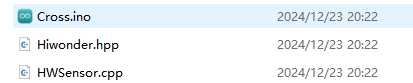

(2) Connect the ESP32 to the computer using a data cable.

(3) Select the "Select Board" option. The software will automatically detect the serial port of the connected ESP32. Click to establish the connection.


(4) Click  to upload the program to the ESP32. Wait for the upload to complete.


* **Expected Results**

:::{Note}

Avoid using the ultrasonic sensor to continuously detect objects that are very close.  

:::

You can set up a "small tunnel" using some cardboard boxes. As the robot moves forward, if the ultrasonic sensor detects an obstacle in its path, it will trigger a beeping sound as an alert. At the same time, the RGB light on the ultrasonic sensor will change from green to red.  

Then, the robot will enter a crouching posture and move forward a short distance. Once it passes through the obstacle, it will return to its upright position and continue moving forward normally.

* **Program Analysis**

[ Low-Altitude Navigation Program]()

(1) Importing Libraries

{lineno-start=6}

```
#include "base_config.h"
#include "HardwareSerial.h" //串口库(Serial communication library)
#include "LobotServoController.h" //舵机控制器库(Servo controller library)
#include "Arduino.h"
#include "Servo.h"
#include "HWSensor.h" //传感器库(Sensor library)
#include "Hiwonder.hpp"
```

Import the necessary libraries for controlling servos and sensors.

(2) Macro Definitions

{lineno-start=14}

```
#define H_STAND       0
#define L_STAND       30
#define H_GO_FORWARD  21
#define L_GO_FORWARD  31

#define MIN_DISTANCE 200//200mm
```

Here, the sequence numbers for the action groups of high posture standing, high posture walking, low posture standing, and low posture walking are defined.

(3) Variable Definitions

{lineno-start=21}

```
LobotServoController Controller(Serial2); //实例化二次开发通信库(Instantiate the servo controller library for secondary development)
Buzzer_t buzzer_obj; //初始化蜂鸣器(Initialize the buzzer)
HWSensor hwsensor;  //实例化传感器类(Instantiate the sensor class)
Servo sonarServo; //超声波云台舵机控制类实例(Instantiate the servo class for ultrasonic sensor control)

float Distance = 0;   //全局变量，距离(Global variable for distance)
```

In this section, the program instantiates classes for the pan-tilt servo, sensors, etc., making it easier to call methods from these classes through their respective objects later.  

Additionally, a variable named distance is defined to store the distance data detected by the ultrasonic module.

(4) Initialization Function (setup)

{lineno-start=100}

```
void setup() {
  // 初始化串口通信(Initialize serial communication)
  Serial.begin(115200);
  // 初始化蜂鸣器(Initialize the buzzer)
  buzzer_obj.init(IO_BUZZER);
  // 初始化与底板通信的串口(Initialize serial communication with the baseboard)
  Serial2.begin(9600 , SERIAL_8N1 , IO_BaseRX , IO_BaseTX);
  sonarServo.attach(IO_Servo);         //设定舵机控制io口(Set the servo control I/O pin)
  sonarServo.write(90); 
  delay(200); //等待底板初始化完毕(Wait for the baseboard initialization to complete)
  sonarServo.detach();
  // 初始化机器人姿态(Initialize the robot posture)
  Controller.runActionGroup(0 , 1);
  delay(1500);
  Serial.println("start.");
}
```

① Serial.begin(115200); This line initializes the main serial port (commonly used for communication with a computer) and sets the baud rate to 115200, enabling data transmission.

② Next, sonarServo.write() is used to establish communication with a specific baseboard, setting the baud rate to 9600, with 8 data bits, no parity bit, and 1 stop bit. It also specifies the pins for receiving and transmitting data (IO_BaseRX and IO_BaseTX).

③ sonarServo.attach(IO_Servo); This line binds the sonarServo object to a specific pin (IO_Servo), allowing the servo to be controlled through the sonarServo object in subsequent operations.

④ sonarServo.write(90); delay(200); This rotates the servo to a position of 90 degrees and then waits for 200 milliseconds, ensuring that the servo has enough time to complete the movement. This step is typically done to ensure that the servo is positioned correctly before the ultrasonic sensor starts working.

⑤ sonarServo.detach(); After setting the servo's initial position, the detach() function is called, which disconnects the servo from the Arduino, potentially saving power or because the servo does not need to move further.

⑥ Controller.runActionGroup(0 , 1); delay(1500); This line calls the Controller object’s method to execute a specific action group (action group 0) for 1 second, followed by a 1500-millisecond delay, allowing time for the entire process to complete.

⑦ Serial.println("start."); Once the setup process is complete, this command prints "start." to the serial monitor, providing feedback on the program's execution status during debugging.

(5) Loop Function (loop)

{lineno-start=117}

```
void loop() {
  getDistance();              //测量距离(Measure distance)
  sonar();                    //逻辑实现(Logic implementation)
  delay(100);  //注意需要给相应的延时(Note: Appropriate delay is required)
}
```

In the loop function, the ESP32 continuously calls the getDistance function to measure the distance. Based on the measured distance, the program performs the corresponding operations in the sonar function. It also calls Controller.receiveHandle to monitor the execution status of the commands sent to the servo controller in the Distancewalking function.

(6) Distance Measurement Function getDistance

{lineno-start=27}

```
int getDistance()
{
  uint16_t distance1, distance2, distance3;
  distance1 = hwsensor.ultrasoundGetDistance();
  distance2 = hwsensor.ultrasoundGetDistance();
  distance3 = hwsensor.ultrasoundGetDistance();
  Distance = (distance1 + distance2 + distance3)/3;
  return Distance;
}
```

Due to the complexity of the environment, the sensor's performance may be unstable, leading to occasional measurement deviations. To improve the reliability of the data and ensure smoother distance values, we implement a strategy of taking multiple measurements and averaging the results.

① The final distance value, **Distance**, is calculated as the average of the current measurement and the previous two rounds of measurements.

② However, during the first execution of this function, there is no historical data (previous measurements) to process. To address this, we introduce the firstTime flag, which is only active during the first execution. In this case, the first collected measurement is treated as both the first and second rounds of distance measurements.

③ After the first execution, each new measurement is validated. If the measured value is 0 or 65522, the previously collected data will be discarded. The valid measurement count (index) will be reset to 0, and the count of invalid measurements (count) will be incremented. If three consecutive invalid measurements are recorded, the function will output Distance = 0.

④ When a valid measurement is collected, it is stored in the echTime array starting from the first element. The valid measurement count (index) is incremented. Once index reaches 3 (indicating three valid measurements have been collected), the final processed distance value will be assigned to the global variable Distance. Both index and count will then be reset to 0.

(7) Operation Function Based on Different Distances (sonar)

{lineno-start=37}

```
void sonar()  //逻辑(Logic)
{
  static uint8_t  step = 0;   //静态变量，用于记录步骤(Static variable to track the current step)  
  uint8_t RGB[6];
  uint8_t breathing[6];
  uint8_t value;
  static uint32_t last_tick = 0;

  switch (step)  //根据步骤step做分支(Branching based on the current step)
  {
    case 0:   //步骤0(Step 0)
      if (Distance > MIN_DISTANCE || Distance == 0) //如果测到距离大于指定距离(If the measured distance is greater than the specified threshold)
      {  
        hwsensor.ultrasoundColor(0, 50, 0, 0, 50, 0); //绿色(Green)
        Controller.runActionGroup(18, 1);
        delay(400);
        step = 1;
      }
      break;
      
    case 1:
      if (Distance < MIN_DISTANCE  && Distance > 0) //如果测得距离小于指定距离(If the measured distance is less than the specified threshold)
      {
        Controller.runActionGroup(18, 1);
        delay(2000);
        Controller.runActionGroup(19, 1);
        delay(2000);
        hwsensor.ultrasoundColor(50, 0, 0, 50, 0, 0); //红色(Red)
        buzzer_obj.blink(1500 , 100 , 100 , 1);
        Controller.runActionGroup(L_STAND, 1); //运行下蹲(Execute squat action)
        delay(1300);
        step = 2;  //转移到步骤2(Move to step 2)
      }else{
        Controller.runActionGroup(H_GO_FORWARD, 1); //正常前进(Continue moving forward)
        delay(1200);
      }
      break;
```

**Entering the Function**:

① The first step is to call Controller.isRunning() to check the execution status of the previous instruction. If the function returns TRUE, it means the previous instruction is still being processed, so the next movement command cannot be issued, and the function exits immediately.

② If the function returns FALSE, it means the servo controller is idle and ready to accept the next command.

**First Round of Execution:**

① First, execute the instructions in case 0. If the measured distance is greater than the specified threshold (indicating no obstacle in front, distance = 0), the robot will perform an action group, turn on the green light, and proceed to the second round of execution logic in the next function call.

② If the measured distance is smaller than the specified threshold, the robot will stay in the first round of execution logic for the next function call.

**Second Round of Execution:**

① First, execute the instructions in case 1. If, during the time between the last execution and this round, the newly measured distance is smaller than the specified threshold, the robot will perform two action groups, turn on the red light, and activate the buzzer for a warning. The robot will then assume a crouching stance and stay in place. On the next function call, the logic will proceed to the third round.

② If the newly measured distance is still greater than the specified threshold, the robot will execute a high stance walking action. The next function call will remain in the second round of logic.

**Third Round of Execution:**

① First, execute the instructions in case 3. If the newly measured distance is still smaller than the specified threshold, the robot will perform two action groups, turn on the blue light, and transition from the crouching stance to low forward movement.

② If the newly measured distance is greater than the specified threshold, the robot will maintain the low stance and remain stationary. The next function call will stay in the third round of execution logic.

{lineno-start=84}

```
    case 3: //步骤3(Step 3)  
      Controller.runActionGroup(L_STAND, 1); //运行下蹲(Perform squat action)
      delay(2000);
      delay(200);
      Controller.runActionGroup(H_STAND, 1);  //正常立正(Return to standing posture)
      delay(2000);
      delay(200);
      step =  0;   //转动步骤0(Return to step 0)
      break;      
    default:
      step =  0;
      break;
  }
}
```

**Fourth Round of Execution:**

① First, the robot will perform the low stance standing action to end the previous low forward movement. Then, it will switch to the high stance standing and remain still.

② The next function call will return to the first round of execution logic.

(8) Serial Port Receiving Function receiveHandle

{lineno-start=272}

```
void LobotServoController::receiveHandle()
{
	uint8_t rx;
	static uint8_t buf[16];
	static bool isGetFrameHeader = false;
	static uint8_t frameHeaderCount = 0;
	static uint8_t dataLength = 2;
	static uint8_t dataCount = 0;
	
	while(SerialX->available() > 0)
	{
		rx = SerialX->read();
		if(!isGetFrameHeader)
		{
			if(rx == 0x55)
			{
				frameHeaderCount++;
				if(frameHeaderCount == 2)
				{
					frameHeaderCount = 0;
					isGetFrameHeader = true;
					dataCount = 1;
				}
			} else {
				isGetFrameHeader = false;
				dataCount = 0;
				frameHeaderCount = 0;
			}
		}
```

**Entering the Function**: The function first enters a while(SerialX-\>available() \> 0) loop. As long as the SerialX-\>available() method indicates that data is available on the soft serial port, the loop continues.

**Reading Data**: During each iteration of the loop, the SerialX-\>read() method is called to read the incoming data from the servo controller and store it in the rx buffer.

**First Stage of the Loop**: In this phase, the isGetFrameHeader flag is initially set to false. The program continuously reads data bytes and checks whether the byte corresponds to the frame header (0x55).

**Frame Header Detection**: Upon receiving the frame header (0x55), the frameHeaderCount variable is incremented by 1.

**Invalid Frame Header Handling**:If a byte other than the frame header (0x55) is received, or if the byte following a valid frame header is not another frame header, the frameHeaderCount is reset to 0.

**Complete Frame Header Detection**: If two consecutive frame header bytes are received (i.e., frameHeaderCount reaches 2), the program considers it a valid and complete frame header. The isGetFrameHeader flag is then set to true, and the program moves to the next stage of the loop.

{lineno-start=301}

```
		if(isGetFrameHeader)
		{
			buf[dataCount] = rx;
			if(dataCount == 2)
			{
				dataLength = buf[dataCount];
				if(dataLength < 2 || dataLength > 8)
				{
					dataLength = 2;
					isGetFrameHeader = false;
				}
			}
			dataCount++;
			if(dataCount == dataLength + 2)
			{
				isGetFrameHeader = false;
				switch(buf[3])
				{
					case BATTERY_VOLTAGE:
						batteryVoltage = BYTE_TO_HW(buf[5], buf[4]);
						isGetBatteryVolt = true;
						break;
					case ACTION_GROUP_RUNNING:
						isRunning_ = true;
						break;
					case ACTION_GROUP_COMPLETE:
					case ACTION_GROUP_STOPPED:
						isRunning_ = false;
						break;
					default:
						break;
				}
			}
		}
	}
}
```

**Second Stage of the Loop**: Once the frame header is detected, the program begins storing each incoming data byte into a buffer (buf).

**Length Validation**: The second byte received (after the header) is expected to indicate the length of the data frame (excluding the two frame headers). The program checks if the length is valid, typically between 2 and 8. If the length is invalid, the program returns to the first stage to start reading the frame header again.

**Function Type Determination**: After receiving a complete frame, the program inspects the fourth byte in the data frame to determine the function type. Based on the value of the fourth byte, corresponding flags are updated.

* **Function Extension**

(1) If you need to modify the obstacle detection threshold, you can easily do so by adjusting the value in the defined block of code in the program, as shown below:


(2) The macro definition currently used to determine the obstacle detection threshold is set to 150. If you need to modify this value, simply change the macro definition in the code, like so:


### 6.2.7 Head-Shaking Obstacle Avoidance Project

* **Project Introduction**

When the ultrasonic sensor detects an obstacle ahead, the robot will move to avoid the obstacle, implementing intelligent obstacle avoidance.

* **Program Implementation Process**


* **Sensor Introduction**


This is a light-emitting ultrasonic distance sensor module that communicates via I2C. It reads the distance measured by the ultrasonic sensor using the I2C protocol.

When measuring distance, the module sends out 8 pulses of 40kHz square waves and checks for any returning signals. If a signal is detected, the module outputs a high-level signal, and the duration of this high signal corresponds to the time taken for the ultrasonic waves to travel to the target and back.

* **Program Download**

[Head-Shaking Obstacle Avoidance Program]()

(1) Locate and open the program file **“01 Head-Shaking Obstacle Avoidance Program\Cross\Cross.ino”** in the directory corresponding to this section.


(2) Connect the ESP32 to the computer using a data cable.

(3) Select the **"Select Board"** option. The software will automatically detect the serial port of the connected ESP32. Click to establish the connection.


(4) Click  to upload the program to the ESP32. Wait for the upload to complete.


* **Expected Results**

:::{Note}

Avoid using the ultrasonic sensor to continuously detect objects that are very close.  

:::

When an obstacle is detected in front of the robot, it will stop and perform a head-shaking motion to check for obstacles on the left and right sides. Based on the results of this check, the robot will turn towards the direction with no obstacles and continue moving forward.

* **Program Analysis**

[Head-Shaking Obstacle Avoidance Program]()

(1) Importing Libraries

{lineno-start=6}

```
#include "base_config.h"
#include "HardwareSerial.h" //串口库(Serial library)
#include "LobotServoController.h" //舵机控制器库(Servo controller library)
#include "Arduino.h"
#include "Servo.h"
#include "HWSensor.h" //传感器库(Sensor library)
#include "Hiwonder.hpp"
```

Import the necessary libraries for controlling servos and sensors.

(2) Macro Definitions

{lineno-start=14}

```
#define GO_FORWARD  25     /*直走的动作组(Action group for going forward)*/
#define GO_BACK     22     /*后退动作组(Action group for going backward)*/
#define TURN_LEFT   23     /*左转动作组(Action group for turning left)*/
#define TURN_RIGHT  24     /*右转动作组(Action group for turning right)*/

#define MIN_DISTANCE_TURN 150  /*避障距离，就是小于多少距离的时候进行避障(Obstacle avoidance distance, the robot will avoid obstacles when the distance is below this threshold)*/
#define BIAS 0        /*舵机偏差，根据实际情况调整大小以使超声波朝向正前方 -右 +左(Servo bias, adjust to make the ultrasonic sensor point straight ahead - right + left)*/
```

Here, the sequence numbers for the action groups of high posture standing, high posture walking, low posture standing, and low posture walking are defined.

(3) Variable Definitions

{lineno-start=22}

```
LobotServoController Controller(Serial2); //实例化二次开发通信库(Instantiate communication library for secondary development)
HWSensor hwsensor;  //实例化传感器类(Instantiate sensor class)
Servo sonarServo; //超声波云台舵机控制类实例(Instantiate ultrasonic pan-tilt servo control class)
```


The program instantiates classes such as the pan-tilt servo class and sensor class, making it easier to call the methods of these classes through the instantiated objects later on.

(4) Initialization Function (setup)

{lineno-start=178}

```
void setup() {
  // 初始化串口通信(Initialize serial communication)
  Serial.begin(115200);
  // 初始化与底板通信的串口(Initialize serial communication with the baseboard)
  Serial2.begin(9600 , SERIAL_8N1 , IO_BaseRX , IO_BaseTX);
  sonarServo.attach(IO_Servo);         //设定舵机控制io口(Set the servo control I/O pin)
  sonarServo.write(90); 
  delay(200); //等待底板初始化完毕(Wait for the baseboard to initialize)
  // 初始化机器人姿态(Initialize robot posture)
  Controller.runActionGroup(0 , 1);
  delay(1500);
  Serial.println("start.");
}
```

① Serial.begin(115200); This line initializes the main serial port (commonly used for communication with a computer) and sets the baud rate to 115200, enabling data transmission.

② Next, sonarServo.write() is used to establish communication with a specific baseboard, setting the baud rate to 9600, with 8 data bits, no parity bit, and 1 stop bit. It also specifies the pins for receiving and transmitting data (IO_BaseRX and IO_BaseTX).

③ sonarServo.attach(IO_Servo); This line binds the sonarServo object to a specific pin (IO_Servo), allowing the servo to be controlled through the sonarServo object in subsequent operations.

④ sonarServo.write(90); delay(200); This rotates the servo to a position of 90 degrees and then waits for 200 milliseconds, ensuring that the servo has enough time to complete the movement. This step is typically done to ensure that the servo is positioned correctly before the ultrasonic sensor starts working.

⑤ sonarServo.detach(); After setting the servo's initial position, the detach() function is called, which disconnects the servo from the Arduino, potentially saving power or because the servo does not need to move further.

⑥ Controller.runActionGroup(0 , 1); delay(1500); This line calls the Controller object’s method to execute a specific action group (action group 0) for 1 second, followed by a 1500-millisecond delay, allowing time for the entire process to complete.

⑦ Serial.println("start."); Once the setup process is complete, this command prints "start." to the serial monitor, providing feedback on the program's execution status during debugging.

(5) Loop Function (loop)

{lineno-start=192}

```
void loop() {
  sonar();                    //避障逻辑实现(Obstacle avoidance logic implementation)
  delay(100);  //注意需要给相应的延时(Be sure to add appropriate delays)
}
```

sonar(); is a crucial part of the loop function. It calls the sonar function, which interacts with the ultrasonic sensor to execute obstacle avoidance logic. This includes detecting the current distance to obstacles and determining the robot's actions or adjustments based on that distance.  
The purpose of the entire loop function is to continuously monitor the surrounding environment for obstacles and take appropriate actions based on sensor feedback. The delay function ensures effective state monitoring without causing excessive fluctuations in the program.

(6) obstacle avoidance logic function sonar

{lineno-start=80}

```
void sonar()  //避障逻辑(Obstacle avoidance logic)
{
  static uint32_t timer = 0;   //静态变量，用于计时(Static variable to keep track of time)
  static uint8_t step = 0;     //静态变量，用于记录步骤(Static variable to track the current step)
  static bool have_move = false;

  if (timer > millis())  //如果设定时间大于当前毫秒数则返回，否侧继续后续操作(If the set time is greater than the current millisecond, return; otherwise, continue the next operations)
    return;
  switch (step)  //根据step分支(Branch based on the current step)
  {
    case 0:  //步骤0(Step 0)
      gDistance = getDistance();   //测量距离，保存到gDistance(Measure the distance and store it in gDistance)
      if (gDistance >= MIN_DISTANCE_TURN || gDistance == 0) {  //如果测得距离大于指定的避障距离，前进(If the measured distance is greater than the specified obstacle avoidance distance, move forward)
        hwsensor.ultrasoundColor(0, 50, 0, 0, 50, 0); //绿色(Green)
        Controller.runActionGroup(18, 1);
        delay(400);
        Controller.runActionGroup(GO_FORWARD, 0); //一直前进(Continuous going forward)
        timer = millis() + 1300;
        have_move = true;
        step = 1; //转移到步骤1(Move to step 1)
      }
      else {  //如果测得距离小于指定距离(If the measured distance is less than the specified distance)
        step = 2;  //转移到步骤2(Move to step 2)
      }
      break; //结束switch语句(End the switch statement)
    case 1:  //步骤1(Step 1)
      gDistance = getDistance(); //测量距离(Measure the distance)
      if (gDistance < MIN_DISTANCE_TURN && gDistance > 0) {  //如果测得距离小于指定的避障距离，则停止所有动作组，转移到步骤2(If the measured distance is less than the specified obstacle avoidance distance, stop all action groups and move to step 2)
          Controller.runActionGroup(GO_FORWARD, 1);
          delay(1300);
          Controller.runActionGroup(18, 1);
          delay(400);
          Controller.runActionGroup(19, 1);
          timer = millis() + 500;
          step = 2;
      }
      break; //结束switch语句(End the switch statement)
```

Upon entering the program, a simulated delay is implemented through an if statement to ensure that there is at least a fixed interval between each execution of the program.

After the first round of execution:

① First, we execute the statements for case 0. The distance ahead is measured. If the measured distance is greater than the specified distance (indicating no obstacle ahead, distance value = 0), and the underlying servo controller is idle and available, the ultrasonic module will be activated to display green and blue lights. The robot will then continue moving forward. In the next execution of the function, the program will enter the third round of the logical branch.

② If the measured distance is less than the specified distance, the next execution of this function will enter the second round of the logical branch.

After the second round of execution:

① First, we execute the statements in case 1. At this point, we measure the distance ahead. If the measured distance is smaller than the specified threshold, the robot will perform one more forward movement and then stop. Afterward, the two subsequent actions will be executed, and the next time the function is called, the logic for the third round will be executed.

② If the measured distance is greater than the specified threshold, no action will be performed. The next time the function is called, the logic for the second round will still be executed.

{lineno-start=117}

```
    case 2:  //步骤2(Step 2)
        getAllDistance();            //获得三个方向的距离(Measure distances in three directions)
        step = 3; //转移到步骤3(Move to step 3)
        //此处没有break，执行完后直接之心case 3(No break here, the next step will directly proceed to case 3)
      break;  //结束switch(End the switch statement)
```

**In the third round of executing subsequent statements:**

① We first execute the statements in case 2. Provided the underlying servo controller is idle and available, the robot will execute a series of actions to measure the distances in the left, front, and right directions. When the function is called again, it will enter the fourth round's logic branch.

② If the servo controller is still processing the previously issued instructions and is not available, no action will be performed. The next time the function is executed, it will remain in the third round's logic branch.

{lineno-start=133}

```
    case 3:  //步骤3(Step 3)
      static bool lastActionIsGoBack = false;   //静态变量，记录最后的动作是不是后退(Static variable to track if the last action was to move backward)
      hwsensor.ultrasoundColor(0, 0, 50, 0, 0, 50); //蓝(Blue)
      
      if (((gDistance > MIN_DISTANCE_TURN) || (gDistance == 0)) && lastActionIsGoBack == false) {
        Serial.println("111");
        //中间距离大于指定避障距离且最后的一个动作不是后退，那么就回到步骤0，(If the middle distance is greater than the specified obstacle avoidance distance and the last action was not a move backward, move back to step 0)
        //此处判断最后一个动作是不是后退，是避免程序陷入后退-》前进-》后退-》前进...这样的死循环(This check is to avoid the program getting stuck in a back-and-forth loop of "backward -> forward -> backward -> forward...")
        //当最后一步是后退是就不执行前进(When the last action was backward, do not execute forward)
        step = 0;
        lastActionIsGoBack = false;
      }
      else if ((((gLDistance > gRDistance) && (gLDistance > MIN_DISTANCE_TURN)) || gLDistance == 0) && gDistance > 50) {
        Serial.println("222");
      //超声波测得左侧的最小距离大于右侧的最小距离大于指定的避障距离，并且中间测得距离大于50mm时(If the minimum distance measured by the ultrasonic sensor on the left side is greater than the right side,)
      //检测中间的距离目的是避免有物体处于机器人两个前腿之间，导致机器人无法转向(greater than the specified obstacle avoidance distance, and the middle distance is greater than 50mm)
        if (have_move) {
          Controller.runActionGroup(36, 1);
          delay(600);
        }
        Controller.runActionGroup(TURN_LEFT, 4);  //左转4次，根据实际调节(Turn left 4 times, adjust based on actual needs)
        timer = millis() + 2200;
        lastActionIsGoBack = false;  //标识最后一个动作不是后退(Mark that the last action was not a backward movement)
        step = 2;  //转移到步骤2(Move to step 2)
      }
      else if ((((gRDistance > gLDistance) && (gRDistance > MIN_DISTANCE_TURN)) || gRDistance == 0) && gDistance > 50) {
        Serial.println("333");
      //超声波测得左侧的最小距离小于右侧的最小距离大于指定的避障距离，并且中间测得距离大于15时(If the minimum distance measured by the ultrasonic sensor on the left side is less than the right side, greater than the specified obstacle avoidance distance, and the middle distance is greater than 15mm)
        if (have_move) {
          Controller.runActionGroup(37, 1);
          delay(600);         
        }
        Controller.runActionGroup(TURN_RIGHT, 4);  //右转4次，根据实际调节(Turn right 4 times, adjust based on actual needs)
        timer = millis() + 2200;
        lastActionIsGoBack = false;  //标识最后一个动作不是后退(Mark that the last action was not a backward movement)
        step = 2;  //转移到步骤2(Move to step 2)
      }
```

In the fourth round of executing subsequent statements:

① We execute the statements in case 4. First, we check if, after the second round, the measured obstacle distance was smaller than the set threshold. In the current fourth round, we verify if the obstacle has moved (or disappeared), causing the measured distance to become greater than the threshold (or zero). If so, the program will return to the first round and control the robot to continue moving forward.

② It is necessary to add a condition inside the if statement to avoid a situation where the robot is instructed to move backward just enough to reach the threshold, causing a repetitive forward-backward loop.

③ If the current distance is still smaller than the set threshold, and if the left front distance (greater than the threshold) is farther from the obstacle, the robot will turn left. The next time the function is called, the program will return to the third round. After completing the left turn, the robot will treat the new direction as its front and measure the obstacle distances in three directions.

:::{Note}

To prevent the robot from being too close to the obstacle with no space to turn or maneuver, we also need to check the distance to the obstacle in front of the robot. If the obstacle is too close, this branch will not be executed, and the program will proceed with the subsequent branches.

:::

If the current distance is still smaller than the set threshold, and if the right front distance (greater than the threshold) is farther from the obstacle, the robot will turn right, and the same operation will be carried out as before.

If the current distance is still smaller than the threshold, and none of the previous conditions are met, the robot will be instructed to move backward to create space for turning. The next time the function is executed, the program will return to the third round.

(5) Distance Measurement Function getDistance

{lineno-start=27}

```
int getDistance() {       //获得距离(Get distance)
  uint16_t Distance, distance1, distance2, distance3;
  distance1 = hwsensor.ultrasoundGetDistance();
  distance2 = hwsensor.ultrasoundGetDistance();
  distance3 = hwsensor.ultrasoundGetDistance();
  Distance = (distance1 + distance2 + distance3)/3;
  return Distance;
}
```

① Due to the complexity of the environment, the sensor's performance may be unstable, and sometimes the measured data may have deviations. To address this, we use the method of multiple measurements and calculate the average value to increase the reliability of the data, making the distance values more stable and smooth.

② We take the average of three distance measurements as the final value for each round of the getDistance function.

(6) Multi-directional Distance Measurement Function getAllDistance

{lineno-start=40}

```
void getAllDistance()//获得前及左右三个方向的距离(Get distances for the front, left, and right directions)
{
  uint16_t tDistance;     //用于暂存测得距离(Temporary variable to store the measured distance)
  
  hwsensor.ultrasoundColor(0, 50, 50, 0, 50, 50); //蓝绿混(Blue-green mix)
  sonarServo.write(90 + BIAS);   //超声波云台舵机转到90度即中间位置(Move the ultrasonic pan-tilt servo to the 90-degree position (center))
  delay(100);                    //等待100ms，等待舵机转动到位(Wait for 100ms to allow the servo to position)
  delay(100);
  gDistance = getDistance();     //测量距离，保存到全局变脸gDistance(Measure distance and store it in the global variable gDistance)
  
  sonarServo.write(145 + BIAS);  //超声波云台舵机转到130度位置即机器人左面40度位置(Move the ultrasonic pan-tilt servo to the 130-degree position (robot's left side, 40 degrees))
  delay(400);     
  delay(100);//延时，等待舵机转动到位(Wait for the servo to position)
  tDistance = getDistance();     //测量距离，保存到 tDistance(Measure the distance and store it in tDistance)
  
  sonarServo.write(180 + BIAS);  //转动到170度，即机器人左侧80度位置(Move the ultrasonic pan-tilt servo to the 170-degree position (robot's left side, 80 degrees))
  delay(400); 
  delay(100);//延时，等待舵机转动到位(Wait for the servo to position)
  gLDistance = getDistance();    //测量距离，保存到gLDistance(Measure the distance and store it in gLDistance)
  
  if(tDistance < gLDistance)     //比较两个距离，将较小的一个保存到gLDistance(Compare the two distances and store the smaller one in gLDistance)
    gLDistance = tDistance;   
  
  sonarServo.write(45 + BIAS);   //超声波云台舵机转到50度位置即机器人右面40度位置 (Move the ultrasonic pan-tilt servo to the 50-degree position, which is the robot's right side at a 40-degree angle)    
  delay(600);                    //延时，等待舵机转动到位(Wait for the servo to position)
  delay(100);
  tDistance = getDistance();     //测量距离，保存到tDistance(Measure the distance and store it in tDistance)
  
```

This function first controls the servo to measure the obstacle distance in the forward direction and stores the result in gDistance. Then, it measures the obstacle distances in the left-front and left directions, and the smaller value is stored in the variable gLDistance as the final adopted distance for the left side. The same procedure is applied for the right side.

(7) Serial Port Receiving Function receiveHandle

{lineno-start=272}

```
void LobotServoController::receiveHandle()
{
	uint8_t rx;
	static uint8_t buf[16];
	static bool isGetFrameHeader = false;
	static uint8_t frameHeaderCount = 0;
	static uint8_t dataLength = 2;
	static uint8_t dataCount = 0;
	
	while(SerialX->available() > 0)
	{
		rx = SerialX->read();
		if(!isGetFrameHeader)
		{
			if(rx == 0x55)
			{
				frameHeaderCount++;
				if(frameHeaderCount == 2)
				{
					frameHeaderCount = 0;
					isGetFrameHeader = true;
					dataCount = 1;
				}
			} else {
				isGetFrameHeader = false;
				dataCount = 0;
				frameHeaderCount = 0;
			}
		}
```

① Upon entering this function, a while(SerialX-\>available() \> 0) loop is executed. As long as the SerialX-\>available() method indicates that the software serial port is available, the loop will continue.

② In each iteration of the loop, the SerialX-\>read() method is called to read data reported by the servo controller, which is then stored in rx.

③ In the first phase of the loop (as shown above), the isGetFrameHeader flag is set to false. The program will keep collecting data bytes, checking if they are the frame header byte 0x55.

④ Upon receiving one frame header byte, the frameHeaderCount is incremented by 1.

⑤ If the received byte is not a frame header or if, after receiving one frame header byte, the next byte is not a frame header, the frameHeaderCount is reset to 0.

⑥ If two consecutive frame header bytes are received (frameHeaderCount = 2), it is determined that a valid frame header has been received. The isGetFrameHeader flag is set to true, and the program proceeds to the next phase of the loop.

{lineno-start=301}

```
		if(isGetFrameHeader)
		{
			buf[dataCount] = rx;
			if(dataCount == 2)
			{
				dataLength = buf[dataCount];
				if(dataLength < 2 || dataLength > 8)
				{
					dataLength = 2;
					isGetFrameHeader = false;
				}
			}
			dataCount++;
			if(dataCount == dataLength + 2)
			{
				isGetFrameHeader = false;
				switch(buf[3])
				{
					case BATTERY_VOLTAGE:
						batteryVoltage = BYTE_TO_HW(buf[5], buf[4]);
						isGetBatteryVolt = true;
						break;
					case ACTION_GROUP_RUNNING:
						isRunning_ = true;
						break;
					case ACTION_GROUP_COMPLETE:
					case ACTION_GROUP_STOPPED:
						isRunning_ = false;
						break;
					default:
						break;
				}
			}
		}
	}
}
```

⑦ In the second phase of the loop, each received data byte is stored in buf.

⑧ The second byte received is theoretically the length of the data frame. The program checks the validity of this length (between 2 and 8, excluding the 2 frame header bytes). If the length is invalid, it returns to the first phase to collect the frame header again.

⑨ Once a complete frame is received, the program checks the fourth byte of the data frame to determine the function type of the frame and updates the corresponding flags accordingly.

* **Function Extension**

(1) To modify the obstacle avoidance actions, you can edit the code in the designated section, as shown below:


(2) We have used macro definitions to specify the action group numbers. These action group numbers correspond to the ones downloaded to the robot from the host computer. To change the obstacle avoidance actions, simply modify the relevant macro definition, as shown below:


### 6.2.8 Fall and Recover Project

* **Project Introduction**

This section utilizes an accelerometer to monitor the current state. Upon detecting a fall, the robot will initiate the action to stand up.

* **Program Implementation Process**


* **Sensor Introduction**

This section makes use of the onboard QMI8658 motion sensor, which has a wide range of applications, including handheld gaming devices, 3D controllers, and portable navigation systems.


It integrates a 3-axis MEMS gyroscope, a 3-axis MEMS accelerometer, and an expandable Digital Motion Processor (DMP).

* **Program Download**

[Fall and Recover Program]()

(1) Locate and open the program file **“02 Fall and Recover Program\up\up.ino”** in the directory corresponding to this section.


(2) Connect the ESP32 to the computer using a data cable.

(3) Select the "Select Board" option. The software will automatically detect the serial port of the connected ESP32. Click to establish the connection.


(4) Click  to upload the program to the ESP32. Wait for the upload to complete.


* **Expected Results**

:::{Note}

Place the robot on a hard surface. It can be placed either face up or face down, but do not place it on its side. When the robot is powered on or restarted, the IMU will initialize. Wait for a "beep" sound, which indicates the initialization is complete.

:::

After turning on the robot, place it face up or face down. After a short wait, the robot will automatically perform a standing action. (The standing action differs depending on whether it's face up or face down.)

* **Program Analysis**

[Fall and Recover Program]()

(1) Library Imports

{lineno-start=6}

```
#include "base_config.h"
#include "HardwareSerial.h" //串口库(Serial library)
#include "LobotServoController.h" //舵机控制器库(Servo controller library)
#include "Arduino.h"
#include "Servo.h"
#include "HWSensor.h" //传感器库(Sensor library)
#include "Hiwonder.hpp"
```

The necessary libraries for serial communication, sensors, and other functions required by this program are imported.

(2) Variable Definitions

{lineno-start=14}

```
float radianX;
float radianY;

LobotServoController Controller(Serial2); //实例化二次开发通信库(Instantiate communication library for secondary development)
IMU imu; //实例化IMU对象(Instantiate IMU object)
Buzzer_t buzzer_obj; //实例化蜂鸣器对象(Instantiate buzzer object)
HWSensor hwsensor;  //实例化传感器类(Instantiate sensor class)
Servo sonarServo; //超声波云台舵机控制类实例(Instantiate ultrasonic gimbal servo control class)
```

**float radianX** and **float radianY** are used to store the radian values related to the robot's posture or direction. The X value represents the forward tilt angle, while the Y value represents the backward tilt angle.

**LobotServoController** is a class used to control servos through serial communication via **Serial2**. Instantiating this controller allows the program to send commands to the servo for movement.

The **IMU (Inertial Measurement Unit)** object typically contains multiple sensors (e.g., accelerometers, gyroscopes) to monitor the robot's motion and orientation in real-time. The **imu** object helps detect posture or direction, enabling stable control and navigation.

The **Servo** class is used to control servos. In this case, **sonarServo** is an instance used to operate the ultrasonic sensor servo. By adjusting the servo's position, the robot can change the direction of the ultrasonic sensor and take distance measurements from various directions.

The program instantiates classes for the pan-tilt servo, sensors, and other components, allowing later calls to methods within those classes through these instantiated objects.

(3) Initialization Function setup

{lineno-start=89}

```
void setup() {
  // 初始化串口通信(Initialize serial communication)
  Serial.begin(115200);
  // 初始化IMU(Initialize IMU)
  imu.begin();
  // 初始化蜂鸣器(Initialize buzzer)
  buzzer_obj.init(IO_BUZZER);
  // 初始化与底板通信的串口(Initialize serial communication with the baseboard)
  Serial2.begin(9600 , SERIAL_8N1 , IO_BaseRX , IO_BaseTX);
  sonarServo.attach(IO_Servo);         //设定舵机控制io口(Set the servo control IO pin)
  sonarServo.write(90); 
  delay(200); //等待底板初始化完毕(Wait for the baseboard initialization to complete)
  sonarServo.detach();
  // 初始化机器人姿态(Initialize the robot's posture)
  Controller.runActionGroup(0 , 1);
  delay(1500);
  delay(6000); //等待IMU初始化完成(Wait for IMU initialization to complete)
  buzzer_obj.blink(1500 , 100 , 100 , 2);
  Serial.println("start.");
}
```

**Serial.begin(115200);** This line initializes the main serial port (typically for communication with a computer) with a baud rate of 115200, allowing data transmission.

The **sonarServo.write** command is used to communicate with a baseboard, setting the baud rate to 9600, with data format of 8 data bits, no parity bit, and 1 stop bit. It also specifies the pins (IO_BaseRX and IO_BaseTX) for data reception and transmission.

**sonarServo.attach(IO_Servo);** This line binds the **sonarServo** object to the specified pin (IO_Servo), enabling control of the servo via the **sonarServo** object.

**sonarServo.write(90); delay(200);** This command moves the servo to a 90-degree position and waits for 200 milliseconds to allow the servo to complete the movement. This ensures a proper starting position for the ultrasonic sensor.

**sonarServo.detach();** After setting the initial position, **detach()** is called to release control of the servo from the Arduino, possibly to save power or because further movement is unnecessary.

**Controller.runActionGroup(0, 1); delay(1500);** This line triggers the **Controller** object to run action group 0 for 1 second. Afterward, a 1500-millisecond delay is used to allow the action to complete.

**Serial.println("start.");** Once the setup is complete, this prints "start." to the serial monitor, which helps with debugging by confirming the program's progress.

(4) loop Function

{lineno-start=110}

```
void loop() {
  tumble(); //跌倒起立任务(Tumble recovery task)
  delay(50);  //注意需要给相应的延时(Note that appropriate delay is needed)
}
```

In the loop function, the ESP32 continuously calls the update_mpu6050 function to measure acceleration and angular velocity. The data is then processed in the tumble function for decision-making. Additionally, the Controller.receiveHandle function is called to monitor the execution status of commands sent to the servo controller in the Distancewalking function.

(5) Buzzer Control Function paly_buzzer

{lineno-start=}

```
```


① In this function, the ESP32 controls the pin connected to the buzzer by using the parameter f as the duration (in microseconds). It cycles the pin's high and low states to simulate a PWM signal, causing the buzzer to vibrate and produce sound. The resulting sound frequency is calculated as 1 \* 10^6 / 2 \* f, and the duration is 2 \* t \* f.

{lineno-start=}

```
```


② First, the program checks if the system is functioning correctly by using the millis function to obtain the current system time. It then compares this time with timer = 0 (the system's initial runtime). If the current system time is less than the initial runtime, the program exits.

③ Next, the program uses getMotion6 to retrieve the raw MPU6050 sensor data, which is stored in variables such as ax, gx, etc.

④ The raw data is then processed in two steps. In the first step, the current raw measurement values are weighted and summed with the previous round’s measurements (stored in ax0, gx0, etc.). The result becomes the final measurement for the current round, overwriting the previous data.

⑤ In the second step, calibration is performed. The acceleration data is calculated using the formula:

Acceleration data = Raw acceleration data / Acceleration sensitivity

Acceleration sensitivity = (216 / 2) / Acceleration range

Since the MPU6050 provides 16-bit acceleration and angular velocity data, it can represent values from -32768 to 32767 (2^15). The sensitivity is calculated based on the known range of acceleration or angular velocity along a specific axis.

⑥ During initialization, the MPU6050 is configured with an acceleration range of 4g. It is known that when the device is placed horizontally, there is a 1g acceleration component along the Z-axis. With the acceleration sensitivity = 8152 (2^13), the initial Z-axis acceleration data is 1 \* 8152 = 8152.

Since the angular velocity is not used later, no conversion is applied to it.

⑦ Finally, using geometric principles, the program performs inverse trigonometric calculations on the components of acceleration and angular velocity along each axis. The tilt angles (in radians) are stored in variables like radianX, which are then converted to degrees and updated accordingly.

**5.7 Action and Posture Adjustment Decision Function tumble**

{lineno-start=24}

```
void tumble(void)
{
  static uint32_t Time;  //定义静态变量Time， 用于计时(Define static variable Time for timing)
  static uint8_t step = 0;
  static uint8_t count1 = 0;
  static uint8_t count2 = 0;

  if (Time > millis())       //Timer 大于 millis（）（运行的总毫秒数）时返回，(If the timer is greater than millis() (total elapsed time), return)
    return;
  switch (step)
  {
    case 0:
      // 获取IMU数据，判断是前倒还是后倒(Get IMU data to determine if it is a forward or backward fall)
      imu.get_angle(&radianX , &radianY);
      // Serial.printf("r:%d , p:%d\r\n",(int)radianX , (int)radianY);
      // 若为前倒(If it is a forward fall)
      if (radianX < 60 && radianX > -30)
      { 
        count1 += 1;
        Time = millis() + 50;
        if (count1 > 50) {
          count1 = 0;
          step = 1;
          buzzer_obj.blink(1500 , 100 , 100 , 1);
          Time = millis() + 1000;
        }
      }
      // 若为后倒(If it is a backward fall)
      else if (radianX > 120 || radianX < -140)
      {
        count2 += 1;
        Time = millis() + 50;
        if (count2 > 50) {
          count2 = 0;
          step = 2;
          buzzer_obj.blink(1500 , 100 , 100 , 1);
          Time = millis() + 1000;
        }
      }
      // 若没倒 (If it doesn't fall)
      else {
        count1 = 0;
        count2 = 0;
      }
      break;
```

① The program first simulates a delay to ensure that each function execution is spaced by a set time interval before proceeding.

② It then calls Controller.isRunning() to check the execution status of the previous command. If this function returns "TRUE," it means the previous command is still running, and no new movement commands can be issued. The program will skip the following statements.

③ If the function returns "FALSE," it means the servo controller is idle and can accept the next command. The program will proceed to the next set of statements.

④ The first step is to execute case 0, where the robot's tilt angle along the X-axis (with the positive X direction being the front of the robot) is checked.

⑤ If the tilt angle is less than 60°, the program will set the next entry time to 10ms later and exit. If the tilt angle is continuously detected to be less than 60° for 100 cycles, it will be considered a forward tilt (falling forward), and the program will execute case 1's statements 1000ms after the current time. For angles greater than 120°, similar logic is applied.

⑥ If no tilt angles below 60° or above 120° are detected for 100 consecutive cycles, the relevant counters will be reset to prevent false detection.

{lineno-start=70}

```
    case 1:
      Controller.runActionGroup(102, 1); //恢复立正状态(Restore to standing position) 
      Time = millis() + 7000;
      step = 0;   
      break;

    case 2:
        Controller.runActionGroup(101, 1); //恢复立正状态(Restore to standing position) 
        Time = millis() + 7000;
        step = 0;   
      break;

    default:
      step = 0;
      break;
  }
}
```

⑦ In the statements for case 1 and case 2, forward and backward tilts are handled, and corresponding action groups are executed to make the robot recover and stand up in different directions.

**(8) Serial Port Receiving Function receiveHandle**

{lineno-start=272}

```
void LobotServoController::receiveHandle()
{
	uint8_t rx;
	static uint8_t buf[16];
	static bool isGetFrameHeader = false;
	static uint8_t frameHeaderCount = 0;
	static uint8_t dataLength = 2;
	static uint8_t dataCount = 0;
	
	while(SerialX->available() > 0)
	{
		rx = SerialX->read();
		if(!isGetFrameHeader)
		{
			if(rx == 0x55)
			{
				frameHeaderCount++;
				if(frameHeaderCount == 2)
				{
					frameHeaderCount = 0;
					isGetFrameHeader = true;
					dataCount = 1;
				}
			} else {
				isGetFrameHeader = false;
				dataCount = 0;
				frameHeaderCount = 0;
			}
		}
```

① When entering the function, the while(SerialX-\>available() \> 0) loop is first executed. As long as the SerialX-\>available() method detects that the software serial port is available, the loop will continue.

② In each iteration of the loop, the SerialX-\>read() method is called to read the data reported by the servo controller and store it in the rx variable.

③ In the first stage of the loop (as shown in the diagram), the isGetFrameHeader flag is set to false. The program continuously receives data bytes and checks whether they are frame header bytes (0x55).

④ When a frame header byte is received, the frameHeaderCount is incremented by 1.

⑤ If a non-frame header byte is received, or if the byte following the first frame header byte is not another frame header byte, the frameHeaderCount is reset to 0.

⑥ If two consecutive frame header bytes are received (frameHeaderCount = 2), it indicates that a complete and valid frame header has been received. The isGetFrameHeader flag is set to true, and the program proceeds to the next stage of the loop.

{lineno-start=301}

```
		if(isGetFrameHeader)
		{
			buf[dataCount] = rx;
			if(dataCount == 2)
			{
				dataLength = buf[dataCount];
				if(dataLength < 2 || dataLength > 8)
				{
					dataLength = 2;
					isGetFrameHeader = false;
				}
			}
			dataCount++;
			if(dataCount == dataLength + 2)
			{
				isGetFrameHeader = false;
				switch(buf[3])
				{
					case BATTERY_VOLTAGE:
						batteryVoltage = BYTE_TO_HW(buf[5], buf[4]);
						isGetBatteryVolt = true;
						break;
					case ACTION_GROUP_RUNNING:
						isRunning_ = true;
						break;
					case ACTION_GROUP_COMPLETE:
					case ACTION_GROUP_STOPPED:
						isRunning_ = false;
						break;
					default:
						break;
				}
			}
		}
	}
}

```

⑦ In the second stage of the loop, the program stores each received data byte in the buf array. The second byte received is expected to indicate the length of the data frame. The program checks if this length (excluding the two frame header bytes) is between 2 and 8. If the length is invalid, the program returns to the first stage to collect the frame header again. Once a complete frame is received, the program examines the fourth byte to determine the frame’s function type and updates the corresponding flags.

### 6.2.9 Smart Fan Project

* **Sensor Installation & Wiring**

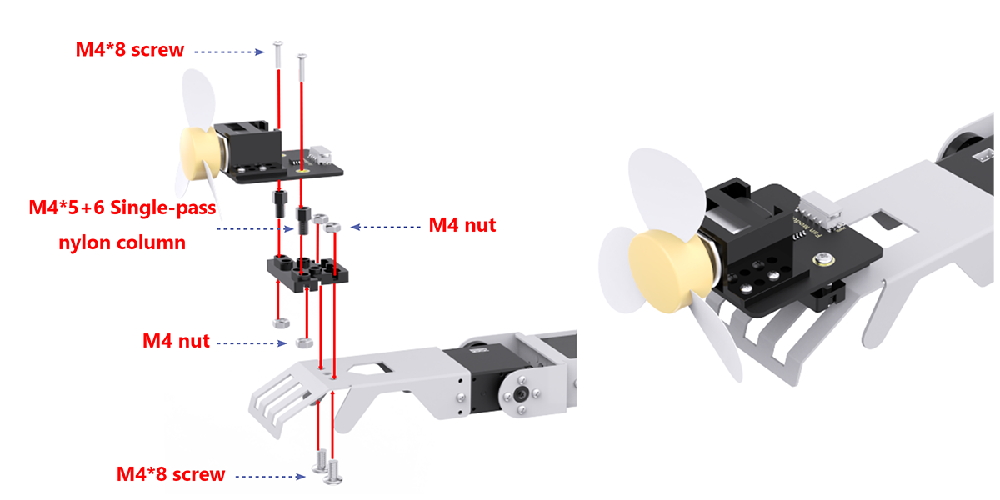

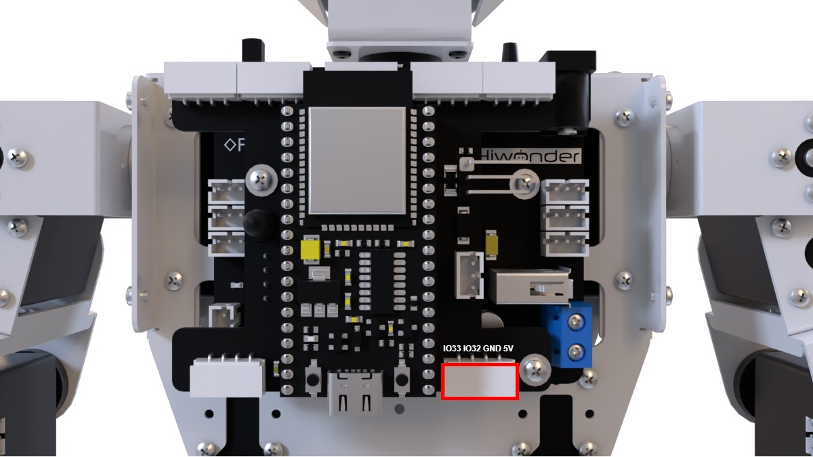

* **Project Introduction**

This section utilizes a glowy ultrasonic sensor to measure the distance to obstacles. Based on the detected distance, the arm is raised, the fan is activated, and the color of the ultrasonic RGB LED changes accordingly.

* **Program Implementation Process**


* **Sensor Introduction**

(1) Glowy Ultrasonic Sensor


This is a light-emitting ultrasonic distance sensor module that communicates via I2C. It reads the distance measured by the ultrasonic sensor using the I2C protocol.

When measuring distance, the module sends out 8 pulses of 40kHz square waves and checks for any returning signals. If a signal is detected, the module outputs a high-level signal, and the duration of this high signal corresponds to the time taken for the ultrasonic waves to travel to the target and back.

(2) Fan Module

The fan module is a sensor that operates without the need for an external motor driver board, utilizing PWM (pulse-width modulation) to control its movement. The direction of the fan's rotation is managed by PWM pulse waveforms in both directions, while the fan speed is adjustable by modifying the duty cycle of the PWM signal.

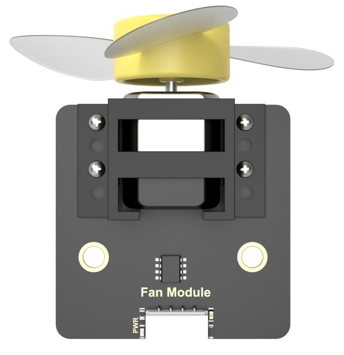

For module installation and wiring, please refer to the section 1 in the same folder.

* **Program Download**

[Smart Fan Program]()

(1) Locate and open the program file **“ Smart Fan Program\ultrasonic_fan\ultrasonic_fan.ino”** in the directory corresponding to this section.


(2) Connect the ESP32 to the computer using a data cable.

(3) Select the **"Select Board"** option. The software will automatically detect the serial port of the connected ESP32. Click to establish the connection.


(4) Click  to upload the program to the ESP32. Wait for the upload to complete.


* **Expected Results**

Slowly move the object towards the glowy ultrasonic sensor. If the distance is less than 300mm, the robot will extend its right hand and turn on the fan. If the distance exceeds 300mm, the robot will lower its right hand and turn off the fan.

* **Program Analysis**

[Smart Fan Program]()

(1) Library Import

Import the necessary libraries for servo control, sensor operations, software serial communication, and other required communication libraries for the project.

{lineno-start=6}

```
#include "base_config.h"
#include "HardwareSerial.h" //串口库(Serial library)
#include "LobotServoController.h" //舵机控制器库(Servo controller library)
#include "Arduino.h"
#include "Servo.h"
#include "HWSensor.h" //传感器库(Sensor library)
#include "Hiwonder.hpp"
```

(2) Pin Definition and Object Creation

Instantiate sensor classes, software serial classes, and custom communication classes.

{lineno-start=14}

```
LobotServoController Controller(Serial2); //实例化二次开发通信库(Instantiate communication library for secondary development)
HWSensor hwsensor;  //实例化传感器类(Instantiate sensor class)
Servo sonarServo; //超声波云台舵机控制类实例(Instantiate ultrasonic gimbal servo control class)
```

(3) Initialization Setting

{lineno-start=48}

```
void setup() {
  // 初始化串口通信(Initialize serial communication)
  Serial.begin(115200);
  // 初始化与底板通信的串口(Initialize serial communication with the baseboard)
  Serial2.begin(9600 , SERIAL_8N1 , IO_BaseRX , IO_BaseTX);
  sonarServo.attach(IO_Servo);         //设定舵机控制io口(Set the servo control IO pin)
  sonarServo.write(90); 
  delay(200); //等待底板初始化完毕(Wait for the baseboard initialization to complete)
  sonarServo.detach();
  // 初始化风扇接口(Initialize fan port)
  pinMode(IO_32, OUTPUT);
  pinMode(IO_33, OUTPUT);
  // 初始化机器人姿态(Initialize the robot's pose)
  Controller.runActionGroup(0 , 1);
  delay(1500);
  Serial.println("start.");
}
```

① Serial.begin(115200); initializes the main serial port (typically used for communication with a computer) with a baud rate of 115200, enabling data transmission.

② Next, sonarServo.write is used to communicate with a baseboard, setting the baud rate to 9600 with 8 data bits, no parity, and 1 stop bit. The pins for receiving and transmitting data (IO_BaseRX and IO_BaseTX) are also specified.

③ sonarServo.attach(IO_Servo); binds the sonarServo object to the specified pin (IO_Servo), allowing the servo to be controlled through this object.

④ sonarServo.write(90); delay(200); rotates the servo to a 90-degree position and waits for 200 milliseconds to ensure the servo has enough time to complete the movement. This is done to set a reasonable initial position before the ultrasonic sensor operates.

⑤ sonarServo.detach(); detaches the servo from the Arduino control after setting its initial position. This is typically done to save power or because further movement of the servo is not needed.

⑥ Controller.runActionGroup(0, 1); delay(1500); calls the Controller object's method to execute action group 0 for 1 second, followed by a 1500-millisecond delay to allow the process to complete.

⑦ Serial.println("start."); outputs "start." to the serial monitor after the setup process is complete, allowing for debugging and status monitoring of the program.

(4) Main Function

{lineno-start=66}

```
void loop() {
  if(getDistance() < 300) //若距离<300mm(If the distance is greater than 300m)
  {
    hwsensor.ultrasoundColor(0,250,0,0,250,0);
    Controller.moveServo(16, 670, 500);
    delay(500);
    //风扇开启(Fan is turned on)
    set_fan(1);
    while(true)
    {
      delay(50);
      if(getDistance() > 300)
      {
        hwsensor.ultrasoundColor(0,0,250,0,0,250);
        // 风扇关闭(Fan is turned off)
        set_fan(0);
        delay(500);
        Controller.moveServo(16, 275, 500);
        delay(500);
        break;
      }
    }
  }
  delay(100);  //注意需要给相应的延时(Make sure to provide the appropriate delay)
}
```

After initialization, the program enters the loop function. In the main function, the Controller.receiveHandle() function is used to receive data from the controller, and the getDistance() function is called to obtain ultrasonic distance data and make a distance judgment. If the distance is less than 300mm, the program sets the color of the ultrasonic light to green by calling hwsensor.ultrasoundColor(0,250,0,0,250,0). Then, it uses Controller.moveServo(16,670,500) to control the arm to extend. After waiting for 500ms, the set_fan(1) function is called to turn on the fan.

(5) Ultrasonic Detection Function

In this function, three variables are defined to store the ultrasonic distance data. The hwsensor.ultrasoundGetDistance() function is used to obtain the measured distance data from the ultrasonic sensor. Finally, the average value of the three measured distances is returned.

{lineno-start=18}

```
uint16_t getDistance() {       //获得距离(Get distance)
  uint16_t Distance = 0;
  uint16_t distance1, distance2, distance3;
  distance1 = hwsensor.ultrasoundGetDistance();
  distance2 = hwsensor.ultrasoundGetDistance();
  distance3 = hwsensor.ultrasoundGetDistance();
  Distance = (distance1 + distance2 + distance3)/3;
  return Distance;
}
```

(6) Fan Control Function

This function controls the fan's operation (stop, forward, or reverse) using the flag parameter to manage the high and low levels of the pins.

① When flag is 0, both IO_32 and IO_33 are set to LOW, indicating the fan is stopped.

{lineno-start=28}

```
//风扇停:0 风扇正转:1  风扇反转:2(Fan off: 0, Fan forward: 1, Fan reverse: 2)
void set_fan(int flag)
{
  switch(flag)
  {
    case 0:
      digitalWrite(IO_32, LOW);
      digitalWrite(IO_33, LOW);
      break;
    case 1:
      digitalWrite(IO_32, LOW);
      digitalWrite(IO_33, HIGH);
      break;
    case 2:
      digitalWrite(IO_32, HIGH);
      digitalWrite(IO_33, LOW);
      break;
  }
}
```

② When flag is 1, IO_32 is set to LOW and IO_33 to HIGH, indicating the fan is rotating forward.

③ When flag is 2, IO_32 is set to HIGH and IO_33 to LOW, indicating the fan is rotating in reverse.

* **Function Extension**

Here is an example of modifying the distance threshold for turning on the fan from 300mm to 400mm:  

In the main function, locate the ultrasonic distance threshold and change it to 400. After this modification, when the distance is less than 400mm, the arm will lift and the fan will turn on. When the distance exceeds 400mm, the arm will lower and the fan will turn off.


* **FAQ**

Q1: Why doesn’t the fan turn on after the ultrasonic sensor detects an obstacle?  

A1: Please verify that the 4-pin wire is connected to the correct IO port. Refer to Section 2.3 for proper wiring.

Q2: Why is the ultrasonic distance measurement sometimes inaccurate?  

A2: Ensure that the surface being measured is smooth and flat. Additionally, avoid prolonged close-range measurements of obstacles.

### 6.2.10 Touch Control Project

* **Sensor Installation & Wiring**


* **Project Introduction**

Touch the capacitive pad on the touch sensor, and Tonybot will perform a bowing motion.

* **Program Implementation Process**


* **Sensor Introduction**

The touch sensor operates based on capacitive sensing technology, detecting the presence of human skin or metal through its gold-plated contact surface.

When no human or metal is in contact with the surface, the signal output is high. Upon contact with a human or metal, the signal output becomes low. Additionally, the sensor can detect contact through materials such as plastic or paper. The sensitivity of detection is influenced by the size of the contact surface and the thickness of the covering material.


For module installation and wiring, please refer to the section 1 in the same directory.

* **Program Download**

(1) Locate and open the program file **“03 Touch Control Program\touch_action\touch_action.ino”** in the directory corresponding to this section.


(2) Connect the ESP32 to the computer using a data cable.

(3) Select the **"Select Board"** option. The software will automatically detect the serial port of the connected ESP32. Click to establish the connection.


(4) Click  to upload the program to the ESP32. Wait for the upload to complete.


* **Expected Results**

After powering on Tonybot, touch the capacitive pad on the touch sensor, and Tonybot will perform a bowing gesture.

* **Program Analysis**

(1) Library Imports

Import the necessary libraries for servos, sensors, software serial communication, and servo controllers required for this application.

{lineno-start=6}

```
#include "base_config.h"
#include "HardwareSerial.h" //串口库(Serial library)
#include "LobotServoController.h" //舵机控制器库(Servo controller library)
#include "Arduino.h"
#include "Servo.h"
#include "HWSensor.h" //传感器库(Sensor library)
#include "Hiwonder.hpp"
```

(2) Create Objects 

Instantiate the sensor class, software serial class, and custom communication class.

{lineno-start=16}

```
LobotServoController Controller(Serial2); //实例化二次开发通信库(Instantiate the communication library for secondary development)
HWSensor hwsensor;  //实例化传感器类(Instantiate the sensor class)
Servo sonarServo; //超声波云台舵机控制类实例(Instantiate the ultrasonic gimbal servo controller class)
```


(3) Initialize Settings

{lineno-start=20}

```
void setup() {
  // 初始化串口通信(Initialize serial communication)
  Serial.begin(115200);
  // 初始化与底板通信的串口(Initialize the serial communication with the baseboard)
  Serial2.begin(9600 , SERIAL_8N1 , IO_BaseRX , IO_BaseTX);
  sonarServo.attach(IO_Servo);         //设定舵机控制io口(Set the servo control IO port)
  sonarServo.write(90); 
  delay(200); //等待底板初始化完毕(Wait for the baseboard to finish initialization)
  sonarServo.detach();
  // 初始化触摸接口(Initialize touch interface)
  pinMode(Touch_pin , INPUT);
  // 初始化机器人姿态(Initialize robot posture)
  Controller.runActionGroup(0 , 1);
  delay(1500);
  Serial.println("start.");
}
```

① Serial.begin(115200); initializes the main serial port (typically used for serial communication with a computer), setting the baud rate to 115200 and enabling data transmission.

② Next, sonarServo.write is used to communicate with a certain board, setting the baud rate to 9600, data format to 8 data bits, no parity bit, and 1 stop bit. Additionally, the pins for receiving and transmitting data (IO_BaseRX and IO_BaseTX) are specified.

③ sonarServo.attach(IO_Servo); binds the servo object sonarServo to the specified pin (IO_Servo), allowing subsequent control of the servo through the sonarServo object.

④ sonarServo.write(90); delay(200); rotates the servo to 90 degrees and waits for 200 milliseconds to ensure the servo has enough time to complete the movement. This is generally done to set a reasonable initial position for the servo before the ultrasonic sensor begins working.

⑤ sonarServo.detach(); after setting the servo's initial position, the detach() function is called, so the servo is no longer controlled by the Arduino. This may be done to save power or because further movement of the servo is not required.

⑥ Controller.runActionGroup(0, 1); delay(1500); calls the runActionGroup method on the Controller object, instructing the robot to execute action group 0 for 1 second. Afterward, the program pauses for 1500 milliseconds with delay(1500) to allow the entire process to complete.

⑦ Serial.println("start."); prints "start." to the serial monitor once the setup is complete, enabling you to monitor the program's execution status during debugging.

(4) Main Function

① After initialization, the program enters the loop main function. In this function, Controller.receiveHandle() is used to receive data from the controller. The touch sensor pin value is read, and if the pin value is LOW, it indicates that the capacitive touch sensor has been activated. The enter_flag is then set to true, which is a flag used to control whether the bowing action will be executed.

{lineno-start=39}

```
void loop() {
  // 若触摸了(If touched)
  if(digitalRead(Touch_pin) == LOW)
  {
    // 消抖(Debounce)
    delay(20);
    if(digitalRead(Touch_pin) == LOW)
    {
      enter_flag = true;
    }
  }
```

② When enter_flag is true, the Controller.runActionGroup(10, 1) function is called to execute action group 10, which performs the bowing action.

{lineno-start=51}

```
  if(enter_flag == true)
  {
    enter_flag = false;
    Controller.runActionGroup(10, 1);
    delay(4000);
```

* **Function Extension**

Here’s an example of changing the bowing action to a twisting action:

Locate the code that executes the action group, and change the action group from number 10 (bowing) to number 50 (twisting). This way, the twisting action will be executed through the touch sensor.


* **FAQ**

**Q:** The touch sensor doesn't respond after uploading the code.  

**A:** Please check if the touch sensor is connected to the correct interface. Refer to section 2.3 for proper wiring.

### 6.2.11 Temperature and Humidity Detection Project

* **Sensor Installation & Wiring**


* **Project Introduction**

Once the mode is activated, Tonybot will monitor the temperature and humidity, and display the data on the matrix module.

* **Program Implementation Process**


* **Sensor Introduction**

**(1) Temperature and Humidity Sensor**

This sensor detects the temperature and humidity of the environment and provides accurate readings.


The AHT10 module converts the air’s temperature and humidity into digital signals, which are then sent to the control board via I2C communication.

(2) LED Dot Matrix Module

The LED dot matrix module uses an 8x8 LED display, known for its high brightness, flicker-free display, and easy wiring. It can display numbers, text, patterns, and more. The module consists of two red 8x8 LED arrays and is controlled by the driver chip TM640B, enabling full control of the dot matrix screen.


For installation and wiring details, refer to the section "01 Sensor Assembly and Wiring" in this directory.

* **Program Download**

(1) Locate and open the program file **“03 Temperature and Humidity Detection Program\temperature_humidity\temperature_humidity”** in the directory corresponding to this section.


(2) Connect the ESP32 to the computer using a data cable.

(3) Select the **"Select Board"** option. The software will automatically detect the serial port of the connected ESP32. Click to establish the connection.


(4) Click  to upload the program to the ESP32. Wait for the upload to complete.


* **Expected Results**

After powering on Tonybot, the dot matrix screen will display the detected temperature and humidity.

* **Program Analysis**

(1) Library Imports

Import the necessary libraries for servos, sensors, software serial communication, and servo controllers required for this application.

{lineno-start=6}

```
#include "base_config.h"
#include "HardwareSerial.h" //串口库(Serial library)
#include "LobotServoController.h" //舵机控制器库(Servo controller library)
#include "Arduino.h"
#include "Servo.h"
#include "HWSensor.h" //传感器库(Sensor library)
#include "Hiwonder.hpp"
#include "src/WMMatrixLed/WMMatrixLed.h"
#include "MVstring.h"
```

(2) Define Pins and Create Objects

WMMatrixLed mx(CLK, DIN); creates an object mx of the WMMatrixLed class, which uses the CLK and DIN pins to control the dot matrix LED display.

temperature and humidity are variables used to store the measured temperature and humidity values.

last_time is a uint32_t variable used to store time information, likely for time-based control.

step is a uint8_t variable acting as a status flag, which controls different execution steps in the program.

t_str and b_str store the display data for the Celsius symbol and the percent sign, respectively, to be shown on the dot matrix LED.

send_data is a uint8_t array with a length of 16, used to store data to be sent to the dot matrix LED for display.

{lineno-start=20}

```
#define DIN IO_2  //定义DIN(Define DIN)
#define CLK IO_5 //定义CLK(Define CLR)
// 实例化点阵对象(Instantiate the LED matrix object)
WMMatrixLed mx(CLK , DIN);

int temperature , humidity;
uint32_t last_time = 0;
uint8_t step = 0;
uint8_t t_str[] = {0x40,0x1C,0x22,0x22}; //摄氏度符号(Celsius symbol)
uint8_t b_str[] = {0x64,0x68,0x16,0x26}; //百分号(Percent symbol)
```

(3) Initialize Settings

Serial.begin(115200);: Initializes the main serial port with a baud rate of 115200, typically used for debugging or communication with other devices.

Serial2.begin(9600, SERIAL_8N1, IO_BaseRX, IO_BaseTX);: Initializes Serial2 with a baud rate of 9600, 8 data bits, no parity, 1 stop bit, and specifies the IO_BaseRX and IO_BaseTX pins. This is likely used for communication with the robot base or other devices.

sonarServo.attach(IO_Servo);: Attaches the sonarServo servo to the IO_Servo pin.

sonarServo.write(90);: Sets the servo to a 90-degree position.

delay(200);: Pauses the program for 200 milliseconds, allowing time for the base to initialize.

Controller.runActionGroup(0, 1);: Executes action group 0 once using the Controller object, likely to initialize the robot's posture.

delay(1500);: Pauses the program for 1500 milliseconds, allowing time for the action to complete or the system to stabilize.

mx.setColorIndex(1);: Sets the color index of the mx dot matrix LED to 1.

mx.setBrightness(4);: Sets the brightness of the mx dot matrix LED to level 4 out of 8.

Serial.println("start.");: Prints "start." to the serial monitor, indicating that the program has begun running.

{lineno-start=33}

```
void setup() {
  // 初始化串口通信(Initialize serial communication)
  Serial.begin(115200);
  // 初始化与底板通信的串口(Initialize the serial communication with the baseboard)
  Serial2.begin(9600 , SERIAL_8N1 , IO_BaseRX , IO_BaseTX);
  sonarServo.attach(IO_Servo); //设定舵机控制io口(Set the servo control I/O pin)
  sonarServo.write(90);
  delay(200); //等待底板初始化完毕(Wait for the baseboard to initialize)
  // 初始化机器人姿态(Initialize robot posture)
  Controller.runActionGroup(0 , 1);
  delay(1500);
  mx.setColorIndex(1);//设置颜色(Set the color)
  mx.setBrightness(4);//设置亮度8级可调(Set the brightness (8 levels adjustable))
  Serial.println("start.");
}
```

(4) Main Function

Controller.receiveHandle();: Calls the receiveHandle method of the Controller object to fetch data from the serial input buffer. This is likely used to receive commands or data from external devices.

if(millis() \> last_time): Uses the millis() function to get the current time in milliseconds and compares it with last_time. If the current time exceeds last_time, the following operations will be executed:

last_time = millis() + 2000;: Updates last_time to the current time plus 2000 milliseconds (2 seconds), ensuring the next operation is executed after a 2-second delay.

switch(step): Executes different actions based on the value of step.

**Case 0: Display Temperature**

temperature = hwsensor.getTemperature();: Uses the hwsensor object to read the temperature.

Calculates the tens and ones digits of the temperature, and copies the corresponding display data from nums (likely defined elsewhere) into the send_data array.

mx.drawBitmap(0, 0, 16, send_data);: Uses the mx object to display the temperature on the dot matrix LED.

Serial.println((int)temperature);: Prints the temperature to the serial monitor.

step = 1;: Sets step to 1 so the next execution will display the humidity.

**Case 1: Display Humidity**

humidity = hwsensor.getHumidity();: Uses the hwsensor object to read the humidity.

Calculates the tens and ones digits of the humidity and copies the corresponding display data into the send_data array.

mx.drawBitmap(0, 0, 16, send_data);: Displays the humidity information on the LED matrix.

Serial.println((int)humidity);: Prints the humidity to the serial monitor.

step = 0;: Sets step back to 0 so the next execution will display the temperature.

**Default Case:**

step = 0;: Resets step to 0 as the default action.

delay(50);: Pauses the program for 50 milliseconds to prevent excessive operation frequency and to give enough time for hardware to complete its tasks.

{lineno-start=50}

```
void loop() {
  Controller.receiveHandle();  //接收处理函数，从串口接收缓存中取出数据(Receive handling function, retrieves data from the serial receive buffer)
  if(millis() > last_time)
  {
    last_time = millis() + 2000;
    switch(step)
    {
      case 0:{ //温度显示(Temperature display)
        // 获取温度(Get temperature)
        temperature = hwsensor.getTemperature();
        // 显示十位(Display tens digit)
        uint8_t index = temperature/10;
        if(index == 0){
          memcpy(&send_data[1] , nums[10] , 4);
        }else{
          memcpy(&send_data[1] , nums[index] , 4);
        }
        // 显示个位(Display ones digit)
        index = temperature%10;
        memcpy(&send_data[6] , nums[index] , 4);
        memcpy(&send_data[11] , t_str , 4);
        mx.drawBitmap(0,0,16,send_data);
        Serial.println((int)temperature);
        step = 1;
      }break;
```

## 6.3 Voice Interaction Course

### 6.3.1 WonderEcho Introduction & Assembly

* **Assembly**


* **Introduction and Working Principle**

(1) Introduction


The voice interaction module is built on embedded voice recognition technology. It consists of a voice recognition chip and supporting circuits, designed for seamless communication with the main control chip. This module enables both voice recognition and voice playback functionalities. Developers can easily integrate it into their products to enable voice interaction capabilities.

(2) Working Principle

The module communicates via I2C and functions as a slave device, allowing communication with a master device. When the microphone on the module detects sound, it processes the audio and sends the result back to the master device.

The module operates in a keyword wake-up mode, requiring a specific trigger word to initiate recognition. By default, the wake-up keyword is "Hello Hiwonder." Once recognition is complete, if further recognition is required, the module must be re-activated by the wake-up keyword after a 15-second delay.

* **Interface Description**

For detailed specifications and chip diagrams, please refer to the "3. Chip Manual."

**Type-C Interface**: Used for powering the module and for firmware programming.

**I2C Interface**: Used for communication with host devices.


| **PIN** | **Function Description** |
| :-----: | :----------------------: |
|   5V    |       Power input        |
|   GND   |       Power ground       |
|   SDA   |      I2C data cable      |
|   SCL   |     I2C clock cable      |

* **Important Notes**

(1) Ensure the voltage does not exceed the rated range during use.

(2) The environment should be quiet, as noise may impact recognition performance.

(3) When speaking the trigger phrase, make sure your voice is clear and loud, and avoid speaking too quickly. It is recommended to maintain a distance of no more than 5 meters from the module.

### 6.3.2 Introduction to Speech-Related Library Files

During the development of our voice interaction module, we will use the "HWSensor" library for easier program access. This section will explain the main functions used in the speech interaction course.

* **Sensor Library Files (HWSensor)**

The HWSensor library includes functions for reading and writing data to the voice interaction module. Below is an explanation of these two functions.

(1) Member Function（HWSensor::asrGetResult）

{lineno-start=118}

```
unsigned char HWSensor::asrGetResult(void)
{
  unsigned char result;
  
  wireReadDataArray(ASR_IIC_ADDR, ASR_RESULT_ADDR,&result,1);
  return result;
}
```

This is a member function of the HWSensor class, designed to read speech recognition data. The details of this function are provided in the table below:

<table>
<colgroup>
<col  />
<col  />
<col  />
<col  />
</colgroup>
<tbody>
<tr>
<td colspan="4" ><strong>HWSensor::asrGetResult()</strong></td>
</tr>
<tr>
<td >Function description</td>
<td colspan="3" >Retrieves the ID of the recognized speech entry</td>
</tr>
<tr>
<td >Parameter list</td>
<td >None</td>
<td >Return value</td>
<td >Returns a uint8_t value representing the entry ID</td>
</tr>
<tr>
<td >Usage Instructions</td>
<td colspan="3" >HWSensor hws; // Create a sensor object<br />
hws.asrGetResult(); // Retrieve the recognized entry ID</td>
</tr>
</tbody>
</table>
The function uses wireReadDataArray to read data from the I2C address of the speech recognition module. It sends a read request for one byte to the ASR_RESULT_ADDR register at the device address ASR_IIC_ADDR, and the returned value is a uint8_t data type.


### 6.3.3 Distance Ranging & Announcement Project

* **Project Introduction**

This section utilizes the glowy ultrasonic module to measure the distance to an obstacle. Based on the detected distance, it controls the voice interaction module to announce messages and triggers the robot to perform specific action groups.

* **Program Implementation Process**

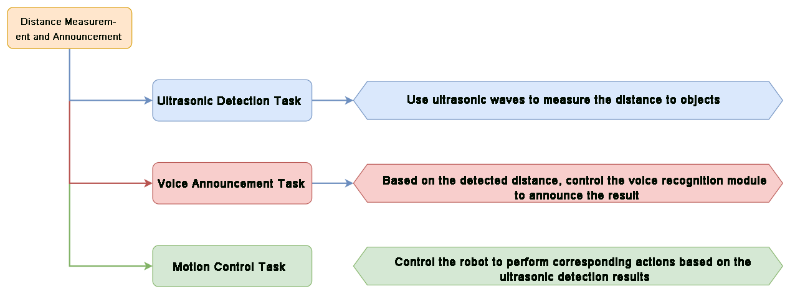

* **Sensor Introduction**

(1) Glowy Ultrasonic Sensor


This is a light-emitting ultrasonic distance sensor module that communicates via I2C. It reads the distance measured by the ultrasonic sensor using the I2C protocol.

When measuring distance, the module sends out 8 pulses of 40kHz square waves and checks for any returning signals. If a signal is detected, the module outputs a high-level signal, and the duration of this high signal corresponds to the time taken for the ultrasonic waves to travel to the target and back.

(2) Voice Interaction Module


The voice interaction module is built on embedded voice recognition technology. It consists of a voice recognition chip and supporting circuits, designed for seamless communication with the main control chip. This module enables both voice recognition and voice playback functionalities. Developers can easily integrate it into their products to enable voice interaction capabilities.

For instructions on module installation and wiring, please refer to assembly guide saved in the same directory.

* **Program Download**

[Distance Ranging & Announcement Program]()

(1) Locate and open the program file **“02 Distance Ranging & Announcement Program\say_hello\say_hello.ino”** in the directory corresponding to this section.


(2) Connect the ESP32 to the computer using a data cable.

(3) Select the "Select Board" option. The software will automatically detect the serial port of the connected ESP32. Click to establish the connection.


(4) Click  to upload the program to the ESP32. Wait for the upload to complete.


* **Expected Results**

After powering on the Tonybot, slowly bring an object close to the glowy ultrasonic sensor. When the distance is less than 200mm, action group 9 will be executed, and the message 'Hello, welcome' will be announced.

* **Program Analysis**

[Distance Ranging & Announcement Program]()

(1) Libraries Importing

Import the necessary libraries for servo control, sensor management, software serial communication, and other communication protocols required for the application.

{lineno-start=6}

```
#include "base_config.h"
#include "HardwareSerial.h" //串口库(Serial library)
#include "LobotServoController.h" //舵机控制器库(Servo controller library)
#include "Arduino.h"
#include "Servo.h"
#include "HWSensor.h" //传感器库(Sensor library)
#include "Hiwonder.hpp"
```

(2) Define Pins and Instantiate Objects

Instantiate objects for the servo control class, sensor class, software serial class, and any additional communication classes needed for secondary development.

{lineno-start=16}

```
LobotServoController Controller(Serial2); //实例化二次开发通信库(Instantiate the secondary development communication library)
HWSensor hwsensor;  //实例化传感器类(Instantiate the sensor class)
Servo sonarServo; //超声波云台舵机控制类实例(Instantiate the ultrasonic pan-tilt servo controller class)
```

(3) Initialize Settings

{lineno-start=52}

```
void setup() {
  // 初始化串口通信(Initialize serial communication)
  Serial.begin(115200);
  // 初始化与底板通信的串口(Initialize serial communication with the baseboard)
  Serial2.begin(9600 , SERIAL_8N1 , IO_BaseRX , IO_BaseTX);
  sonarServo.attach(IO_Servo);         //设定舵机控制io口(Set the servo control IO pin)
  sonarServo.write(90); 
  delay(200); //等待底板初始化完毕(Wait for the baseboard initialization to complete)
  sonarServo.detach();
  // 初始化机器人姿态(Initialize robot posture)
  Controller.runActionGroup(0 , 1);
  delay(1500);
  Serial.println("start.");
}
```

① Serial.begin(115200); initializes the main serial port (typically used for serial communication with a computer), setting the baud rate to 115200 and enabling data transmission.

② Next, sonarServo.write is used to communicate with a certain board, setting the baud rate to 9600, data format to 8 data bits, no parity bit, and 1 stop bit. Additionally, the pins for receiving and transmitting data (IO_BaseRX and IO_BaseTX) are specified.

③ sonarServo.attach(IO_Servo); binds the servo object sonarServo to the specified pin (IO_Servo), allowing subsequent control of the servo through the sonarServo object.

④ sonarServo.write(90); delay(200); rotates the servo to 90 degrees and waits for 200 milliseconds to ensure the servo has enough time to complete the movement. This is generally done to set a reasonable initial position for the servo before the ultrasonic sensor begins working.

⑤ sonarServo.detach(); after setting the servo's initial position, the detach() function is called, so the servo is no longer controlled by the Arduino. This may be done to save power or because further movement of the servo is not required.

⑥ Controller.runActionGroup(0, 1); delay(1500); calls the runActionGroup method on the Controller object, instructing the robot to execute action group 0 for 1 second. Afterward, the program pauses for 1500 milliseconds with delay(1500) to allow the entire process to complete.

⑦ Serial.println("start."); prints "start." to the serial monitor once the setup is complete, enabling you to monitor the program's execution status during debugging.

(4) Main Function

Once initialization is complete, the program enters the main loop() function. In this function, the Controller.receiveHandle() method is called to receive data from the controller. The sonar() function is then invoked to measure the ultrasonic distance and trigger the speech output.

{lineno-start=67}

```
void loop() {
  sonar(); //用户函数(User-defined function)
  delay(50);  //注意需要给相应的延时(Please provide an appropriate delay)
}
```

The periodic reading of ultrasonic sensor data is achieved by calling the custom sonar() function, along with a delay(50) to manage timing.

(5) Ultrasonic Detection Function

In the function, three variables are defined to store the distance data measured by the ultrasonic sensor. The hwsensor.ultrasoundGetDistance() function is called to obtain the distance measurements from the ultrasonic sensor, and the average of these three distance values is then returned.

{lineno-start=20}

```
int getDistance() {  //获得超声波距离(Get ultrasonic distance)
  uint16_t distance1, distance2, distance3;
  distance1 = hwsensor.ultrasoundGetDistance();
  distance2 = hwsensor.ultrasoundGetDistance();
  distance3 = hwsensor.ultrasoundGetDistance();

  float distance = (distance1 + distance2 + distance3) / 3;
  return distance;
}
```

(6) User Function

① This function is designed to execute a specific action and trigger speech output when the ultrasonic sensor detects an obstacle at a distance less than a specified threshold. The program uses the Controller.isRunning() function to check if any action group is currently running. If no action group is in progress, the code proceeds to the following logic. The getDistance() function retrieves the distance measured by the ultrasonic sensor. If the measured distance is less than 200mm, the glowing ultrasonic sensor's color is set to green, and action group 9 is executed once while broadcasting the message "Hello, welcome."

{lineno-start=31}

```
bool have_move = true;
void sonar() //用户函数(User-defined function)
{
  float distance = getDistance();
  if (distance < MIN_DISTANCE && distance > 0)  //如果测得距离小于指定距离(If the measured distance is less than the specified distance)
  {
    have_move = true;
    hwsensor.ultrasoundColor(0, 0, 50, 0, 0, 50);  //设置发光超声波颜色为蓝色(Set the ultrasonic light color to blue)
    Controller.runActionGroup(9, 1);  //运行9号动作组(Run action group 9)
    delay(500);
    hwsensor.asr_speak(ASR_ANNOUNCER , 0x0F); // 你好，欢迎光临(Hello, welcome)
    delay(2000);
  } else {
    if (have_move) {
      have_move = false;
      hwsensor.ultrasoundBreathing(0, 20, 0, 0, 20, 0); //设置发光超声波颜色为绿色渐变(Set the ultrasonic light color to a green gradient)
      Controller.runActionGroup(0, 1); //运行0号动作组(Run action group 0)
    }
  }
}

```

② If the measured distance is greater than or equal to 200mm, the glowing ultrasonic sensor's color is set to a blue gradient, and action group 0 is executed once, which corresponds to the "Attention" pose.

{lineno-start=43}

```
  } else {
    if (have_move) {
      have_move = false;
      hwsensor.ultrasoundBreathing(0, 20, 0, 0, 20, 0); //设置发光超声波颜色为绿色渐变(Set the ultrasonic light color to a green gradient)
      Controller.runActionGroup(0, 1); //运行0号动作组(Run action group 0)
    }
  }
}
```

* **Function Extension**

For example, change the speech output from "Hello, welcome" to "Obstacle detected ahead" when the ultrasonic distance is less than 200mm. First, locate the section of the code responsible for speech output.

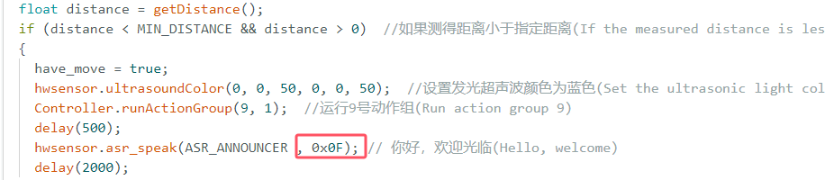

Next, update the ID number of the corresponding speech entry in the voice recognition module’s speech table to "0x05".


Finally, follow the steps outlined in "[Program Download]()" to upload the modified code to the Tonybot.

* **FAQ**

**Q: The voice interaction module is not producing speech output.**  

**A:** Please verify that the 4-pin wire is properly connected to the correct I2C interface.

**Q: The distance measured by the ultrasonic sensor is occasionally inaccurate.**  

**A:** Use smooth, flat objects for measurements, and avoid prolonged close-range detection of obstacles.

### 6.3.4 Human-Robot Interaction Project

* **Project Introduction**

The voice interaction module recognizes trigger phrases, which then control the Tonybot to execute the corresponding actions.

* **Program Implementation Process**


* **Sensor Introduction**


The voice interaction module is built on embedded voice recognition technology. It consists of a voice recognition chip and supporting circuits, designed for seamless communication with the main control chip. This module enables both voice recognition and voice playback functionalities. Developers can easily integrate it into their products to enable voice interaction capabilities.

For instructions on module installation and wiring, please refer to assembly guide saved in the same directory.

* **Program Download**

[Human-Robot Interaction Program]()

(1) Locate and open the program file **“02 Human-Robot Interaction Program\Communicate\Communicate.ino”** in the directory corresponding to this section.


(2) Connect the ESP32 to the computer using a data cable.

(3) Select the **"Select Board"** option. The software will automatically detect the serial port of the connected ESP32. Click to establish the connection.


(4) Click  to upload the program to the ESP32. Wait for the upload to complete.


* **Expected Results**

Say "Hello Hiwonder" to activate the voice interaction module. Then, use commands like "Hello," "Introduce yourself," "Show off," "Take two steps," or "Shake your head" to control Tonybot and trigger various actions.

* **Program Analysis**

[Human-Robot Interaction Program]()

(1) Importing Libraries

Import the necessary libraries for servo control, sensor management, software serial communication, and other required communication protocols.

{lineno-start=}

```
#include "base_config.h"
#include "HardwareSerial.h" //串口库(Serial library)
#include "LobotServoController.h" //舵机控制器库(Servo controller library)
#include "Arduino.h"
#include "Servo.h"
#include "HWSensor.h" //传感器库(Sensor library)
#include "Hiwonder.hpp"
```

(2) Defining Pins and Instantiating Objects

Instantiate objects for the servo control class, sensor class, software serial class, and any additional communication classes needed for secondary development.

{lineno-start=14}

```
LobotServoController Controller(Serial2); //实例化二次开发通信库(Instantiate the secondary development communication library)
HWSensor hwsensor;  //实例化传感器类(Instantiate the sensor class)
Servo sonarServo; //超声波云台舵机控制类实例(Instantiate the ultrasonic pan-tilt servo controller class)

```

(3) Initialization Settings

{lineno-start=76}

```
void setup() {
  // 初始化串口通信(Initialize serial communication)
  Serial.begin(115200);
  // 初始化与底板通信的串口(Initialize serial communication with the baseboard)
  Serial2.begin(9600 , SERIAL_8N1 , IO_BaseRX , IO_BaseTX);
  sonarServo.attach(IO_Servo);         //设定舵机控制io口(Set the servo control I/O pin)
  sonarServo.write(90); 
  delay(200); //等待底板初始化完毕(Wait for the baseboard initialization to complete)
  sonarServo.detach();
  // 初始化机器人姿态(Initialize robot posture)
  Controller.runActionGroup(0 , 1);
  delay(1500);
  Serial.println("start.");
}
```

① Serial.begin(115200); – Initializes the main serial port, typically used for communication with a computer, setting the baud rate to 115200 and enabling data transmission.

② The following command uses sonarServo.write to communicate with a specific board, setting the baud rate to 9600, with 8 data bits, no parity bit, and 1 stop bit. It also specifies the pins for receiving and transmitting data (IO_BaseRX and IO_BaseTX).

③ sonarServo.attach(IO_Servo); – Binds the sonarServo object to a specified pin (IO_Servo), enabling control of the servo using the sonarServo object.

④ sonarServo.write(90); delay(200); – Rotates the servo to 90 degrees and waits for 200 milliseconds to ensure the servo completes its movement. This step positions the servo properly before the ultrasonic sensor is activated.

⑤ sonarServo.detach(); – After setting the servo’s initial position, the detach() method is called to release the servo from Arduino control, possibly to save power or because further movement is unnecessary.

⑥ Controller.runActionGroup(0, 1); delay(1500); – Commands the Controller object to execute action group 0 for 1 second, followed by a 1500 millisecond delay to allow the action to complete.

⑦ Serial.println("start."); – Once the setup is complete, this command prints "start." to the serial monitor, aiding in debugging by indicating the execution status of the program.

(4) Main Function

{lineno-start=91}

```
void loop() {
  communicate();  //语音识别函数(Voice recognition function)
  delay(50);  //注意需要给相应的延时(Be sure to provide the appropriate delay)
}
```

By calling the custom sonar() function and using the delay(50) function, the program achieves periodic reading of the ultrasonic sensor data.

(5) Voice Recognition Function

① This function retrieves data from the voice recognition module and controls the robot to perform the corresponding action. The hwsensor.asrGetResult() function is called to obtain the recognition result, and the Controller.isRunning() function checks if the robot is currently executing an action group.

{lineno-start=18}

```
void communicate()
{
  unsigned char result;
  static bool have_move = true;

  delay(1);
  result = hwsensor.asrGetResult();  //获取语音识别模块数据(Get data from the voice recognition module)
  if(result)
  {
    Serial.print("ASR result is:");
    Serial.println(result);
```

② If no action group is running, the recognized entry ID is printed and evaluated. If the ID returned is 0x1A (indicating the "Hello" entry), Tonybot will execute action group 10.

{lineno-start=25}

```
  if(result)
  {
    Serial.print("ASR result is:");
    Serial.println(result);

    if(result==0x1A) //你好(Hello)
    {
      Controller.runActionGroup(10, 1);
      delay(1000);
    }
    else if(result==0x1B) //介绍自己(Introduce yourself)
    {
      Controller.runActionGroup(48, 1);
      delay(4000);
    }
```

③ If the ID is 0x1B (indicating the "Introduce yourself" entry), the voice recognition module will automatically perform speech output, and Tonybot will execute action group 48.

{lineno-start=35}

```
    else if(result==0x1B) //介绍自己(Introduce yourself)
    {
      Controller.runActionGroup(48, 1);
      delay(4000);
    }
```

④ If the ID is 0x1C (indicating the "Show your skills" entry), Tonybot will execute action group 17 once.

{lineno-start=41}

```
    else if(result==0x1C) //露一手(Show a trick)
    {
      delay(500);
      Controller.runActionGroup(17, 1);
      delay(10000);
    }
```

⑤ If the command "Take two steps" is recognized, Tonybot will move forward.

{lineno-start=47}

```
    else if(result==0x1D) //走两步(Walk two steps)
    {
      delay(500);
      Controller.runActionGroup(18, 1);
      Controller.waitForStop(2000);
      Controller.runActionGroup(21, 3); 
      Controller.waitForStop(5000);
      Controller.runActionGroup(18, 1);
      Controller.waitForStop(2000);
      Controller.runActionGroup(19, 1);
    }
```

⑥ If "Shake your head" is recognized, the head servo will rotate left and right to simulate a head-shaking gesture.

{lineno-start=58}

```
    else if(result==0x1E) //摇头(Shake head)
    {
      sonarServo.attach(IO_Servo);
      delay(1000);
      sonarServo.write(135);
      delay(400);
      sonarServo.write(45);
      delay(400);
      sonarServo.write(135);
      delay(400);
      sonarServo.write(90);
      delay(400);
      sonarServo.detach();
    }
  }
}
```

* **FAQ**

Q: The voice recognition module is not recognizing commands.

A: Please ensure that you have awakened the module by saying **"Hello Hiwonder"** If the module is awake, verify that it is properly connected.

### 6.3.5 Voice Control Project

* **Project Introduction**

This section demonstrates how to control Tonybot’s movements, including moving forward, backward, turning left, and turning right, using the voice recognition module.

* **Program Implementation Process**


* **Sensor Introduction**


The voice interaction module is built on embedded voice recognition technology. It consists of a voice recognition chip and supporting circuits, designed for seamless communication with the main control chip. This module enables both voice recognition and voice playback functionalities. Developers can easily integrate it into their products to enable voice interaction capabilities.

For instructions on module installation and wiring, please refer to assembly guide saved in the same directory.

* **Program Download**

[Voice Control Program]()

(1) Locate and open the program file **“02 Voice Control Program\ASRcontrol\ASRcontrol.ino”** in the directory corresponding to this section.


(2) Connect the ESP32 to the computer using a data cable.

(3) Select the **"Select Board"** option. The software will automatically detect the serial port of the connected ESP32. Click to establish the connection.


(4) Click  to upload the program to the ESP32. Wait for the upload to complete.


* **Expected Results**

To activate the voice recognition module, say "Hello Hiwonder." After activation, you can use commands such as "Forward," "Backward," "Left Turn," "Right Turn," and more to control Tonybot’s movements. The specific command entries are outlined in the table below:

| Command Phrase  | Returned Value | Command Phrase | Returned Value |
| --------------- | -------------- | -------------- | -------------- |
| GO-STRAIGHT     | 0x01           | GO-BACKWARD    | 0x02           |
| TURN LEFT       | 0x03           | TURN RIGHT     | 0x04           |
| LEFT-FOOT-SHOOT | 0x6E           | TWIST          | 0x71           |
| SIT-UP          | 0x72           | BOW            | 0x73           |
| SPREAD ARMS     | 0x74           | WAVE HAND      | 0x75           |
| MARCH-IN-PLACE  | 0x76           | RIGHT-HOOK     | 0x7A           |

* **Program Analysis**

[Voice Control Program]()

(1) Importing Libraries

Import the necessary libraries for servo control, sensor handling, and communication, including the soft serial library, required for the functionality of the project.

{lineno-start=6}

```
#include "base_config.h"
#include "HardwareSerial.h" //串口库(Serial library)
#include "LobotServoController.h" //舵机控制器库(Servo controller library)
#include "Arduino.h"
#include "Servo.h"
#include "HWSensor.h" //传感器库(Sensor library)
#include "Hiwonder.hpp"
```

(2) Object Creation

Instantiate the servo control class, sensor class, soft serial class, and secondary development communication class.

{lineno-start=14}

```
LobotServoController Controller(Serial2); //实例化二次开发通信库(Instantiate the secondary development communication library)
HWSensor hwsensor;  //实例化传感器类(Instantiate the sensor class)
Servo sonarServo; //超声波云台舵机控制类实例(Instantiate the ultrasonic gimbal servo controller class)
```

(3) Initialize Settings

{lineno-start=96}

```
void setup() {
  // 初始化串口通信(Initialize serial communication)
  Serial.begin(115200);
  // 初始化与底板通信的串口(Initialize serial communication with the baseboard)
  Serial2.begin(9600 , SERIAL_8N1 , IO_BaseRX , IO_BaseTX);
  sonarServo.attach(IO_Servo);         //设定舵机控制io口(Set the servo control IO pin)
  sonarServo.write(90); 
  delay(200); //等待底板初始化完毕(Wait for the baseboard to finish initialization)
  sonarServo.detach();
  // 初始化机器人姿态(Initialize the robot's posture)
  Controller.runActionGroup(0 , 1);
  delay(1500);
  Serial.println("start.");
}
```

① Serial.begin(115200); – Initializes the main serial port, typically used for communication with a computer, setting the baud rate to 115200 and enabling data transmission.

② The following command uses sonarServo.write to communicate with a specific board, setting the baud rate to 9600, with 8 data bits, no parity bit, and 1 stop bit. It also specifies the pins for receiving and transmitting data (IO_BaseRX and IO_BaseTX).

③ sonarServo.attach(IO_Servo); – Binds the sonarServo object to a specified pin (IO_Servo), enabling control of the servo using the sonarServo object.

④ sonarServo.write(90); delay(200); – Rotates the servo to 90 degrees and waits for 200 milliseconds to ensure the servo completes its movement. This step positions the servo properly before the ultrasonic sensor is activated.

⑤ sonarServo.detach(); – After setting the servo’s initial position, the detach() method is called to release the servo from Arduino control, possibly to save power or because further movement is unnecessary.

⑥ Controller.runActionGroup(0, 1); delay(1500); – Commands the Controller object to execute action group 0 for 1 second, followed by a 1500 millisecond delay to allow the action to complete.

⑦ Serial.println("start."); – Once the setup is complete, this command prints "start." to the serial monitor, aiding in debugging by indicating the execution status of the program.

(4) Main Function

Once initialization is complete, the program enters the loop function. Within the main loop, the Controller.receiveHandle() function is used to receive data from the controller. Then, the ASRrunAction() function is called to activate the voice control feature.

{lineno-start=111}

```
void loop() {
  Controller.receiveHandle();     //接收处理函数，从串口接收缓存中取出数据(Receive handling function, retrieve data from the serial buffer)
  ASRrunAction(); //识别执行任务(Recognize and execute tasks)
  delay(50);  //注意需要给相应的延时(Make sure to add the appropriate delay)
}
```

(5) Voice Control Function

This function retrieves data from the voice recognition module and controls the robot to perform specific actions based on the recognized commands. In the program, the hwsensor.asrGetResult() function is used to obtain the recognition result from the voice module. Then, the Controller.isRunning() function checks if the robot is currently executing an action group.

{lineno-start=18}

```
void ASRrunAction()
{
  unsigned char result;
  static bool have_move = true;
  // 获取识别结果(Get recognition result)
  result = hwsensor.asrGetResult();
  // 若无动作进行(If no action is currently being performed)
  if(!Controller.isRunning()){
```

If the robot is not in an active state, the function will print the recognized word ID and process it.

If the recognized ID is 0x71, the command "waist twist" is detected, and Tonybot will execute action group 50.

{lineno-start=27}

```
    if(result)
    {
      Serial.print("ASR result is:");
      Serial.println(result);//返回识别结果，即识别到的词条编号(Return the recognition result, which is the recognized word ID)
      if(result==0x71) //扭腰(Twist waist)
      {
        Controller.runActionGroup(50, 1);
      }
```

If the recognized ID is 0x72, the command "sit-up" is detected, and Tonybot will execute action group 8.

{lineno-start=35}

```
      else if(result==0x72) //仰卧起坐(Sit-up)
      {
      Controller.runActionGroup(8, 1); 
      }
```

Other commands are processed similarly. A complete list of supported command words can be found in the "Commands" table under [Expected Results]().

* **FAQ**

Q: The voice recognition module is not recognizing commands.

A: Please ensure that you have awakened the module by saying **"Hello Hiwonder"** If the module has been awakened, check if the connections are correct.

### 6.3.6 Fall Recovery Project

* **Project Introduction**

After the robot falls, say the command 'fall recovery' to make the robot stand up.

* **Program Implementation Process**


* **Sensor Introduction**


The voice interaction module is built on embedded voice recognition technology. It consists of a voice recognition chip and supporting circuits, designed for seamless communication with the main control chip. This module enables both voice recognition and voice playback functionalities. Developers can easily integrate it into their products to enable voice interaction capabilities.

For instructions on module installation and wiring, please refer to assembly guide saved in the same directory.

* **Program Download**

[Fall Recovery Program]()

(1) Locate and open the program file **“02 Fall Recovery Program\up\up.ino”** in the directory corresponding to this section.


(2) Connect the ESP32 to the computer using a data cable.

(3) Select the "Select Board" option. The software will automatically detect the serial port of the connected ESP32. Click to establish the connection.


(4) Click to upload the program to the ESP32. Wait for the upload to complete.


* **Expected Results**

If the robot is in a fallen state, activate the voice recognition module by saying 'Hello Hiwonder,' and then use the command 'fall and stand up' to instruct the robot to stand up.

* **Program Analysis**

[Fall Recovery Program]()

(1) Libraries Importing

Import the required libraries for servo control, sensors, software serial, and other communication libraries.

{lineno-start=6}

```
#include "base_config.h"
#include "HardwareSerial.h" //串口库(Serial communication library)
#include "LobotServoController.h" //舵机控制器库(Servo controller library)
#include "Arduino.h"
#include "Servo.h"
#include "HWSensor.h" //传感器库(Sensor library)
#include "Hiwonder.hpp"
```

(2) Object Creating

Instantiate the servo control class, sensor class, software serial class, and secondary development communication class.

{lineno-start=17}

```
LobotServoController Controller(Serial2); //实例化二次开发通信库(Instantiate the secondary development communication library)
IMU imu; //实例化IMU对象(Instantiate the IMU object)
Buzzer_t buzzer_obj; //实例化蜂鸣器对象(Instantiate the buzzer object)
HWSensor hwsensor;  //实例化传感器类(Instantiate the sensor class)
Servo sonarServo; //超声波云台舵机控制类实例(Instantiate the ultrasonic gimbal servo control class)

```

(3) Initialize the Settings

{lineno-start=63}

```
void setup() {
  // 初始化串口通信(Initialize serial communication)
  Serial.begin(115200);
  // 初始化IMU(Initialize IMU)
  imu.begin();
  // 初始化蜂鸣器(Initialize the buzzer)
  buzzer_obj.init(IO_BUZZER);
  // 初始化与底板通信的串口(Initialize communication with the baseboard)
  Serial2.begin(9600 , SERIAL_8N1 , IO_BaseRX , IO_BaseTX);
  sonarServo.attach(IO_Servo);         //设定舵机控制io口(Set the servo control IO pin)
  sonarServo.write(90); 
  delay(200); //等待底板初始化完毕(Wait for the baseboard to initialize)
  sonarServo.detach();
  // 初始化机器人姿态(Initialize robot posture)
  Controller.runActionGroup(0 , 1);
  delay(1500);
  delay(6000); //等待IMU初始化完成(Wait for IMU initialization to complete)
  buzzer_obj.blink(1500 , 100 , 100 , 1);
  Serial.println("start.");
}
```

① Serial.begin(115200); – This line of code initializes the main serial port (usually used for communication with a computer), sets the baud rate to 115200, and enables data transmission.

② Next, sonarServo.write is used to communicate with a specific baseboard, setting the baud rate to 9600, data format to 8 data bits, no parity bit, and 1 stop bit. It also specifies the pins for receiving and transmitting data (IO_BaseRX and IO_BaseTX).

③ sonarServo.attach(IO_Servo); – This line binds the sonarServo object to the specified pin (IO_Servo), allowing subsequent control of the servo through the sonarServo object.

④ sonarServo.write(90); delay(200); – This moves the servo to a 90-degree position, then waits for 200 milliseconds to ensure the servo has enough time to complete the movement. This is typically done to ensure the servo has a reasonable initial position before the ultrasonic sensor operates.

⑤ sonarServo.detach(); – After setting the servo to its initial position, the detach() function is called, which stops the Arduino from controlling the servo. This might be done to conserve power or because the servo movement is no longer needed.

⑥ Controller.runActionGroup(0, 1); delay(1500); – This line calls the Controller object’s method, instructing the robot to perform a specific action group (in this case, action group 0) for a duration of 1 second. Afterward, delay(1500) pauses for 1500 milliseconds to allow time for the entire process.

⑦ Serial.println("start."); – Once the setup is complete, this line prints "start." to the serial monitor, allowing for easier debugging and monitoring of the program’s execution status.

(4) Main Function

After initialization is complete, enter the main loop function. Within the main function, use the Controller.receiveHandle() function to receive data sent from the controller. Call the update_mpu6050() function to update the IMU data so that the tumble() function can process the data based on the current posture.

{lineno-start=84}

```
void loop() {
  Controller.receiveHandle();  //接收处理函数，从串口接收缓存中取出数据(Receive and process function, retrieving data from the serial buffer)
  tumble(); //识别结果执行任务(Execute task based on recognition result)
  delay(50);  //注意需要给相应的延时(Note: Appropriate delay needed)
}
```

The custom sonar() function, along with the delay(50) function, is used to periodically read data from the ultrasonic sensor.

(5) Fall and Stand-Up Function

① This function retrieves data from the voice interaction module and, using both speech and IMU data, controls the robot to perform corresponding actions. The hwsensor.asrGetResult() function is called to obtain speech recognition data, and Controller.isRunning() is used to check if the robot is currently executing an action group.

{lineno-start=23}

```
void tumble(void)
{
  static uint8_t step = 0;
  unsigned char result;
  // 获取识别结果(Get the recognition result)
  result = hwsensor.asrGetResult();
  // 若无动作进行(If no action is in progress)
  if (!Controller.isRunning()) {
```

② If the robot is not currently running an action group, the system enters the fall detection task. It first executes the code block for "case 0," which determines whether the robot has fallen forward or backward. If radianX is less than 60, it indicates a forward fall, and the system enters branch 1. If radianX is greater than 120, it enters branch 2.

{lineno-start=31}

```
    switch (step)
    {
      case 0:
        if (result == 0x77) { // “跌倒起立(Fall and Stand Up)”
          imu.get_angle(&radianX , &radianY);
          // 判断是倒正面还是背面(Determine whether it's face up or face down)
          if (radianX < 60 && radianX > -30)
          {
            step = 1;
          }
          else if (radianX > 120 || radianX < -140)
          {
            step = 2;
          }
        }
        break;
```

③ In both branches 1 and 2, the logic is the same: First, the speech recognition result is evaluated. If result equals 0x77, it means the "fall and stand up" command was recognized, prompting the robot to execute the fall-and-stand-up action group. Since the robot may fall forward or backward, there are two separate branches for each case. If a different falling posture is detected, the robot will execute a different action group to stand up accordingly.

{lineno-start=47}

```
      case 1:
          Controller.runActionGroup(102, 1); //恢复立正状态(Recover to standing position) 
          step = 0;
        break;
      case 2:
          Controller.runActionGroup(101, 1); //恢复立正状态(Recover to standing position)   
          step = 0;
        break;
      default:
        step = 0;
        break;
    }
  }
}
```

* **FAQ**

Q: The voice recognition module is not recognizing commands.

A: Please ensure that you have awakened the module by saying "Hello Hiwonder" If the module has been awakened, check if the connections are correct.

## 6.4 AI Vision Course

### 6.4.1 Overview and Installation of ESP32S3 Vision Module

* **Assembly**


* **Overview of the ESP32-S3**

The ESP32-S3 Vision Module is a compact camera module that can function as a standalone system. It captures images with its built-in camera, processes the data using the ESP32 microcontroller, and wirelessly transmits it via Wi-Fi. With support for various communication protocols and low-power features, this module is widely used in a range of IoT applications.

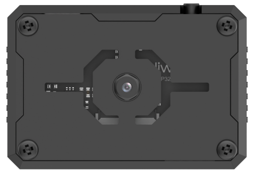

(1) Specification

<table  class="docutils-nobg"  border="1">
<colgroup>
<col  />
<col  />
</colgroup>
<tbody>
<tr>
<td ><strong>Parameter</strong></td>
<td ><strong>Specification</strong></td>
</tr>
<tr>
<td >Size</td>
<td >59*43*17.5</td>
</tr>
<tr>
<td >Power Supply Range</td>
<td >4.75~5.25V</td>
</tr>
<tr>
<td >Operating Temperature</td>
<td >Ambient Temperature</td>
</tr>
<tr>
<td >Storage Environment</td>
<td >Ambient Temperature and Pressure</td>
</tr>
<tr>
<td >SPI Flash</td>
<td >Supports up to 16MB</td>
</tr>
<tr>
<td >RAM</td>
<td >512KB Internal + 16MB External PSRAM</td>
</tr>
<tr>
<td >Bluetooth</td>
<td >Suppport Bluetooth 5 and Bluetooth Mesh</td>
</tr>
<tr>
<td >WiFi</td>
<td >802.11 b/g/n</td>
</tr>
<tr>
<td >Supported Interfaces</td>
<td >UART、I2C</td>
</tr>
<tr>
<td >Serial Baud Rate</td>
<td >Default 115200</td>
</tr>
<tr>
<td >Image Output Format</td>
<td >JPEG (only supported by OV2640), BMP, Grayscale</td>
</tr>
<tr>
<td >Frequency Range</td>
<td >2412~2484MHz</td>
</tr>
<tr>
<td >Antenna Type</td>
<td >Onboard PCB Antenna</td>
</tr>
<tr>
<td >Transmit Power</td>
<td ><p>802.11b:20.5 dBm(@11Mbps)</p>
<p>802.11g:18 dBm(@54Mbps)</p>
<p>802.11n:17 dBm(@MCS7)</p></td>
</tr>
<tr>
<td >Receive Sensitivity</td>
<td ><p>802.11b:-88.5 dBm(@11Mbps)</p>
<p>802.11g:-76.2 dBm(@54Mbps)</p>
<p>802.11n:-74.2dBm(@MCS7 HT20)</p>
<p>-71.2dBm(@MCS7 HT40)</p></td>
</tr>
<tr>
<td >Power Consumption (assuming peripherals are on)</td>
<td ><p>Active (RF On): TX: 285-355mA @ 3.3V RX:95-97mA@3.3V</p>
<p>Deep-sleep:8uA@5V</p>
<p>Modem-sleep:47.6-107.6mA@5V 240MHZ</p>
<p>Light-sleep:240uA@5V</p></td>
</tr>
<tr>
<td >Security</td>
<td >RSA/AES/SHA/HMAC/XTS-AES</td>
</tr>
</tbody>
</table>


**Kind Reminder:** The product specifications are theoretical values and are for reference only. Please rely on actual performance for precise details.

(2) Interface Description


| **Interface Name** |                  **Interface Description**                   |
| :----------------: | :----------------------------------------------------------: |
|  USB Serial Port   |          Serial communication, firmware programming          |
|   Custom Button    |       Allows customization of the button event in code       |
|   IIC Interface    | Secondary development interface, connects with the main controller |

* **ESP32-S3 Image Coordinate Framework**

Here are a few important points to note about the module's image coordinate system:

(1) The origin is positioned at the center of the screen, not at the top-left corner.

(2) The Y-axis direction is opposite to that of a typical Cartesian coordinate system.


(3) Important Notes:

① Ensure that the module is supplied with at least 5V 2A to avoid potential image distortion.

②  The module comes with the default firmware pre-installed, which supports image transmission. No additional downloads are provided. If you need to reflash with different firmware, please proceed carefully.

### 6.4.2 Introduction to the Vision Module Library Files

This section provides an analysis of the driver library for the ESP32-S3 vision module. This library is used to retrieve face or color data detected by the module. It consists of two files: hw_esp32S3cam_ctl.h and hw_esp32S3cam_ctl.cpp.

* **Accessing the Library Files**

(1) Navigate to the "1. Tutorials\6. Arduino Programming Projects\6.4 AI Vision Course" folder and open any program. In this case, we will use "6.4.6 Face Recognition" as an example.


(2) In the opened program, locate and select the file "**hw_esp32cam_ctl.cpp**.”


* **Library File Documentation**

(1) Member Function (HW_ESP32S3CAM::begin())

{lineno-start=8}

```
void HW_ESP32Cam::begin(void)
{
  Wire.begin(IO_SDA,IO_SCL);
}
```

This function initializes the I2C bus configuration, allowing subsequent communication with the vision module for command transmission and data reception over the bus.

(2) Underlying Function（wireWriteDataArray）

{lineno-start=14}

```
static bool wireWriteDataArray(uint8_t addr, uint8_t reg,uint8_t *val,unsigned int len)
{
    unsigned int i;

    Wire.beginTransmission(addr);
    Wire.write(reg);
    for(i = 0; i < len; i++) 
    {
        Wire.write(val[i]);
    }
    if( Wire.endTransmission() != 0 ) 
    {
        return false;
    }
    return true;
}
```

<table>
<colgroup>
<col  />
<col  />
<col  />
<col  />
</colgroup>
<tbody>
<tr>
<td colspan="4" ><strong>wireWriteDataArray()</strong></td>
</tr>
<tr>
<td >Function description</td>
<td colspan="3" >Send data to the registers of the ESP32-S3-Cam vision module via the I2C bus</td>
</tr>
<tr>
<td >Parameter list</td>
<td >Addr，reg，val，len</td>
<td >Return value</td>
<td ><p>false: Write operation failed</p>
<p>true: Write operation succeeded</p></td>
</tr>
<tr>
<td >Usage instruction</td>
<td colspan="3" ><ol type="1">
<li><p>Before using this function, make sure to call <strong>HW_ESP32S3CAM::begin</strong>.<br />
This function is not used in the subsequent development, so readers can simply review it for reference.</p></li>
</ol></td>
</tr>
</tbody>
</table>
Parameters and Their Meanings:

**addr**: The device address of the ESP32-S3-Cam vision module (0x53).

**reg**: The target memory address on the ESP32-S3-Cam vision module to write to.

**val**: The pointer to the data to be sent.

**len**: The length of the data to be transmitted.

The Arduino master device first sends the device address via I2C, followed by the target memory address of the ESP32-S3-Cam vision module. The data is then transmitted byte by byte based on the specified length. Afterward, the **endTransmission()** function is called to check if the data transmission was successful. A return value of 0 indicates success, while any other value indicates failure.

(3) Underlying Function（WireWriteByte）

{lineno-start=31}

```
static bool WireWriteByte(uint8_t val)
{
    Wire.beginTransmission(ESP32CAM_ADDR);
    Wire.write(val);
    if( Wire.endTransmission() != 0 ) {
        return false;
    }
    return true;
}
```

<table>
<colgroup>
<col  />
<col  />
<col  />
<col  />
</colgroup>
<tbody>
<tr>
<td colspan="4" ><strong>WireWriteByte()</strong></td>
</tr>
<tr>
<td >Function description</td>
<td colspan="3" >Before reading data from the ESP32-S3-Cam vision module, verify that the correct register address is specified</td>
</tr>
<tr>
<td >Parameter list</td>
<td >val</td>
<td >Return value</td>
<td ><p>false: Transmission error</p>
<p>true: Transmission successful</p></td>
</tr>
<tr>
<td >Usage instruction</td>
<td colspan="3" >Before using this function, ensure that <strong>HW_ESP32S3CAM::begin</strong> is called.<br />
During data transmission/writing, it is necessary to confirm the register address of the data being written to the slave device. The same implementation for this is also found within the <strong>wireWriteDataArray</strong> function.</td>
</tr>
</tbody>
</table>
Parameters and Their Meanings:

**val**: The data to be transmitted.

The Arduino master device sends the device address to the ESP32-S3-Cam vision module, followed by sending 1 byte of data. Afterward, the **endTransmission()** function is used to check if the data was transmitted successfully. A return value of 0 indicates success, while any other value indicates failure.

(4) Underlying Function（WireReadDataArray）

{lineno-start=41}

```
static int WireReadDataArray(uint8_t reg, uint8_t *val, unsigned int len)
{
    unsigned char i = 0;
    
    /* Indicate which register we want to read from */
    if (!WireWriteByte(reg)) {
        return -1;
    }
    
    /* Read block data */
    Wire.requestFrom(ESP32CAM_ADDR, len);
    while (Wire.available()) {
        if (i >= len) {
            return -1;
        }
        val[i] = Wire.read();
        i++;
    }   
    return i;
}
```

<table>
<colgroup>
<col  />
<col  />
<col  />
<col  />
</colgroup>
<tbody>
<tr>
<td colspan="4" ><strong>WireReadDataArray()</strong></td>
</tr>
<tr>
<td >Function description</td>
<td colspan="3" >Read multiple bytes of data from the ESP32-S3-Cam vision module via the I2C bus.</td>
</tr>
<tr>
<td >Parameter list</td>
<td >reg，val，len</td>
<td >Return value</td>
<td >-1: Read failed<br />
Other: The length of successfully read data</td>
</tr>
<tr>
<td >Usage instruction</td>
<td colspan="3" ><ol type="1">
<li><p>Before using this function, ensure that <strong>HW_ESP32S3CAM::begin</strong> is called.<br />
Additionally, before using this function, make sure to call <strong>WireWriteByte</strong> to set the register address for reading.</p></li>
</ol></td>
</tr>
</tbody>
</table>


Parameters and Their Meaning:

**reg**: The data address in the ESP32-S3-Cam vision module to be read.

**val**: The address in the Arduino main device where the data will be stored.

**Len**: The word length (number of bytes) to be read.

**Process Description:**

① The Arduino main device first sends the data address (reg) to the ESP32-S3-Cam vision module. If no response is received, the function returns -1, indicating a failure to establish a connection with the module.

② Next, the Arduino sends the word length (len) to the ESP32-S3-Cam vision module.

③ A while loop is used to read the data byte by byte. The variable i tracks the number of bytes read, and the data is stored in the val\[\] array.

④ If the number of bytes read exceeds the specified word length (len), the function returns -1, indicating a reading failure.

⑤ Upon successful reading, the function returns i, the actual number of bytes read. Note that i may be less than len if fewer bytes are available.

(5) Member Function（HW_ESP32Cam::faceDetect

{lineno-start=63}

```
bool HW_ESP32Cam::faceDetect(void)
{
  uint8_t face_info[4];
  int num = WireReadDataArray(0x01,face_info,4);
  if((num == 4) && (face_info[2] > 0)) //接收识别到的人脸的x,y,w,h值(Receive the x, y, w, h values of the detected face.)
  {
      return true;
  }
  return false;
}
```

<table>
<colgroup>
<col  />
<col  />
</colgroup>
<tbody>
<tr>
<td colspan="2" ><strong>HW_ESP32Cam::faceDetect</strong></td>
</tr>
<tr>
<td >Function description</td>
<td >Read the face detection results from the ESP32-S3-Cam vision module</td>
</tr>
<tr>
<td >Return value</td>
<td >false: No face detected<br />
true: Face detected</td>
</tr>
<tr>
<td >Usage instruction</td>
<td ><ol start="2" type="1">
<li><p>Before using this function, please call HW_ESP32S3CAM::begin first.</p></li>
<li><p>Additionally, make sure to call the WireReadDataArray function to read multiple bytes of data from the ESP32-S3-Cam vision module.</p></li>
</ol></td>
</tr>
</tbody>
</table>


Retrieve face data from the ESP32-S3-Cam. If successful and a face is detected (w value \> 0), output 'face 1' via serial and return true. Otherwise, output 'face 0' and return false.

(6) Member Function（HW_ESP32Cam::colorDetect）

{lineno-start=75}

```
int HW_ESP32Cam::colorDetect(void)
{
  uint8_t color_info[3][4];
  int num = WireReadDataArray(0x00,color_info[0],4);
  if((num == 4) && (color_info[0][2] > 0)) //接收识别到的颜色的x,y,w,h值(Receive the x, y, w, h values of the detected face)
  {
      return 1;
  }
  num = WireReadDataArray(0x01,color_info[1],4);
  if(num == 4)
  {
    if(color_info[1][2] > 0) //若w值大于0，则识别到颜色1(If the width value (w) is greater than 0, then color 1 is detected)
    {
      return 2;
    }
  }
  num = WireReadDataArray(0x02,color_info[2],4);
  if(num == 4)
  {
    if(color_info[2][2] > 0) //若w值大于0，则识别到颜色1(If the width value (w) is greater than 0, then color 1 is detected)
    {
      return 3;
    }
  }
  return 0;
}
```

<table>
<colgroup>
<col  />
<col  />
</colgroup>
<tbody>
<tr>
<td colspan="2" ><strong>HW_ESP32Cam::</strong>colorDetect</td>
</tr>
<tr>
<td >Function description</td>
<td >Read color detection results from the ESP32-S3-Cam vision module</td>
</tr>
<tr>
<td >Return value</td>
<td ><p>· <strong>1:</strong> Red color detected</p>
<p>· <strong>2:</strong> Green color detected</p>
<p>· <strong>3:</strong> Blue color detected</p>
<p>· <strong>0:</strong> No color detected</p></td>
</tr>
<tr>
<td >Usage instruction</td>
<td ><ol start="4" type="1">
<li><p><strong>Important Notes:</strong></p></li>
</ol>
<ol type="1">
<li><p>Before using this function, please call HW_ESP32S3CAM::begin.</p></li>
<li><p>Before using this function, make sure to call the WireReadDataArray function to read multiple bytes of data from the ESP32-S3-Cam vision module.</p></li>
</ol></td>
</tr>
</tbody>
</table>


Retrieve color data from the two register addresses (0x00 and 0x01). If either address returns valid color information (w value greater than 0), return the corresponding color code (1 or 2). If neither address detects a color, return 0.

(7) Member Function（HW_ESP32Cam::color_position）

{lineno-start=103}

```
bool HW_ESP32Cam::color_position(uint8_t *color_info)
{
  int num = WireReadDataArray(0x01,color_info,4);
  if((num == 4) && (color_info[2] > 0)) //接收识别到的颜色的x,y,w,h值(Receive the x, y, w, h values of the detected color)
  {
    return true;
  }
  return false;
}
```

<table>
<colgroup>
<col  />
<col  />
<col  />
<col  />
</colgroup>
<tbody>
<tr>
<td colspan="4" >HW_ESP32Cam::color_position</td>
</tr>
<tr>
<td >Function description</td>
<td colspan="3" >Obtain the position data for the colors detected by the ESP32-S3-Cam vision module</td>
</tr>
<tr>
<td >Return value</td>
<td >color_info</td>
<td >Return value</td>
<td ><p>true：reading succeeded</p>
<p>false：reading failed</p></td>
</tr>
<tr>
<td >Usage instruction</td>
<td colspan="3" ><ol start="5" type="1">
<li><p>Before using this function, please call HW_ESP32S3CAM::begin.<br />
Also, ensure that the WireReadDataArray function is called to read multiple bytes of data from the ESP32-S3-Cam vision module.</p></li>
</ol></td>
</tr>
</tbody>
</table>


Parameters and Meaning:

**color_info**: Stores the data read from the ESP32-S3-Cam vision module.

The color information is read from register 0x01. If the color data is successfully retrieved and the width (w) is greater than 0, the corresponding color code (2) is returned. Otherwise, 0 is returned.

* **Master-Slave Communication Overview (Module I2C Registers)**

**ESP32-S3 Vision Module I2C Slave Data Address**: 0x52

**Note**: The register information is quite extensive; please refer to the "**2.2 Register Description**" document for more details.

### 6.4.3 Image Transmission

:::{Note}

The image transmission firmware is pre-installed at the factory. If you flash other firmware for different functionalities, you will need to reflash the image transmission firmware to enable this feature.

:::

In this section, connect to the hotspot created by the ESP32-S3 vision module and visit the provided URL to view the real-time video feed from the camera.

* **Program Download**

(1) ESP32-S3 Vision Module Firmware Download

[ESP32S3 Color Recognition Example]()

① Connect the ESP32-S3 vision module to your computer using a Type-C data cable.

② Extract the ZIP file “[Image Transmission Firmware & Flash Tool\flash_download_tool_3.9.7]()” located in the same folder, then double-click **“flash_download_tool_3.9.7.exe”** to open the program.


③ In the opened window, configure it as shown below.


④ In the flashing interface, click  to select the firmware file (“02 Image Transmission Firmware & Flash Tool\image_transmit.bin”), then configure the settings according to the image below.


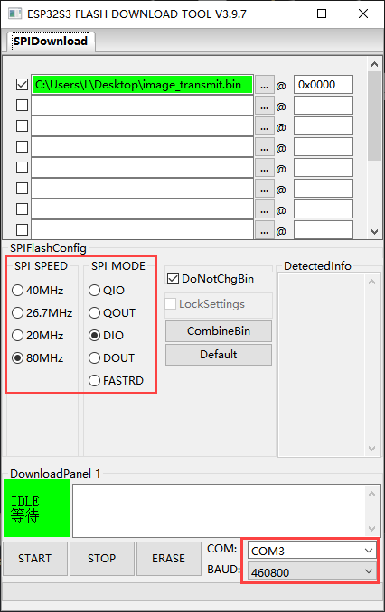

⑤ Choose the correct port number (do not select COM1, as this will cause the flashing to fail).

⑥ Click **“ERASE”** to erase the existing firmware (this step is essential), then click “START” to begin the flashing process.


⑦ Wait for a completion message to appear.


⑧ Once flashing is complete, disconnect the Type-C data cable and restart the device.

(2) Arduino Program Download

[Image Transmission Arduino Example]()

① Locate and open the "TonyBot_Action.ino" file, which can be found under the path "**03 Image Transmission Arduino Example\TonyBot_Action\TonyBot_Action.ino.**"


② Power on the robot and connect it to your computer using a Type-C data cable.

③ Click on the **"Select Board"** option, choose **"ESP32 Dev Module,"** and click to connect.


④ Go to the **"Tools"** menu and select the appropriate ESP32 board configuration as shown in the image below (initial setup is required, but you won't need to configure it again for future use).


⑤ Click  to download the program to Arduino, and wait for the download to complete.


* **Device Connection**

(1) Power on the device (ensure the vision module is installed on the robot as described in "6.4.1 Overview and Installation of ESP32S3 Vision Module" before powering it on).

(2) Locate the hotspot generated by the module: HW_ESP32S3CAM, and connect to it.

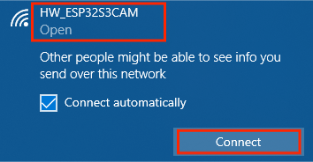


(3) Image Transmission Implementation

Open a browser (this works on both mobile and PC browsers; we'll use a PC as an example) and enter “192.168.5.1” in the address bar, then press Enter. On the resulting page, click  to access the camera's live transmission interface.


### 6.4.4 Color Recognition Project


* **Project Introduction**

Tonybot, equipped with the ESP32-S3 vision module, can recognize red, green, and blue objects, while also controlling the RGB lights and displaying information on the dot matrix display.

* **Program Implementation Process**


* **Module Introduction**

(1) ESP32-S3 Vision Module


The ESP32-S3 Vision Module is a compact camera module that can function as a standalone system. It captures images with its built-in camera, processes the data using the ESP32 microcontroller, and wirelessly transmits it via Wi-Fi. With support for various communication protocols and low-power features, this module is widely used in a range of IoT applications.

To get the detailed installation guide, please refer to ‘5.4.1 Overview and Installation of ESP32S3 Vision Module’.

* **LED Dot Matrix Module**

The LED dot matrix module features a high-brightness display, flicker-free operation, and easy wiring. It is capable of displaying numbers, text, graphics, and other content. The module consists of two 8x8 red LED matrices, controlled by the TM640B driver chip, enabling full control of the display.


For installation and wiring details, please refer to "01 Dot Matrix Display Installation" in this directory.

* **Program Download**

(1) ESP32-S3 Vision Module Program Download

① Connect the ESP32-S3 to your computer using a Type-C data cable.

② Open the program file “03 ESP32S3 Color Recognition Example\ESP32S3_ColorDetection\ESP32S3_ColorDetection.ino” located in the same directory as this document.


③ Select the “ESP32S3 Dev Module” as the target board.


④ In the "Tools" menu, configure the ESP32-S3 development board settings as shown in the image below. (This configuration is only required for the first use. It does not need to be repeated for subsequent uses.)


⑤ Click  to transfer the code to the ESP32-S3 and wait for the flashing process to complete.


(2) Arduino Program Download

① Locate and open the program file **“6.4.4 Color Recognition Program\Color Recognition Arduino Example\color_recognition\color_recognition.ino”** in the directory corresponding to this section.


② Connect the ESP32 to the computer using a data cable.

③ Select the "Select Board" option. The software will automatically detect the serial port of the connected ESP32. Click to establish the connection.


④ In the "Tools" menu, configure the ESP32-S3 development board settings as shown in the image below. (**This configuration is only required for the first use. It does not need to be repeated for subsequent uses.**)


⑤ Click  to upload the program to the ESP32. Wait for the upload to complete.


* **Achieved Effect**

(1) When the vision module detects red, the RGB on the ultrasonic module will light up red, and the dot matrix module will display the word “Red” scrolling.

(2) When the vision module detects blue, the RGB on the ultrasonic module will light up blue, and the dot matrix module will display the word “Blue” scrolling.

(3) When the vision module detects green, the RGB on the ultrasonic module will light up green, and the dot matrix module will display the word “Green” scrolling.

(4) If the vision module does not detect any color, both the RGB on the ultrasonic module and the dot matrix module will turn off.

* **Program Analysis**

(1) Importing Library Files

Import the necessary libraries for the servos, sensors, software serial, servo controllers, and ESP32S3 communication.

{lineno-start=6}

```
#include "base_config.h"
#include "HardwareSerial.h" //串口库(Serial library)
#include "LobotServoController.h" //舵机控制器库(Servo controller library)
#include "Arduino.h"
#include "Servo.h"
#include "HWSensor.h" //传感器库(Sensor library)
#include "Hiwonder.hpp"
#include "hw_esp32cam_ctl.h" //导入ESP32Cam通讯库(Import ESP32Cam communication library)
#include "src/WMMatrixLed/WMMatrixLed.h"
```

(2) Hardware Instantiation

① Instantiate the communication library for secondary development, the sensor class, and the control class for the pan-tilt servo.

{lineno-start=16}

```
LobotServoController Controller(Serial2); //实例化二次开发通信库(Instantiate the secondary development communication library)
HWSensor hwsensor;  //实例化传感器类(Instantiate the sensor class)
Servo sonarServo; //超声波云台舵机控制类实例(Ultrasonic pan-tilt servo control class instance)

```

② Define the CLK and DIN pins for the dot matrix LED and instantiate the LED display.

{lineno-start=20}

```
#define DIN IO_2  //定义DIN(Define DIN)
#define CLK IO_5 //定义CLK(Define CLK)
WMMatrixLed mx(CLK , DIN);

//ESP32Cam通讯对象(ESP32Cam communication object)
HW_ESP32Cam hw_cam;
```

③ Instantiate the communication object for ESP32.

{lineno-start=24}

```
//ESP32Cam通讯对象(ESP32Cam communication object)
HW_ESP32Cam hw_cam;
```

(3) Initialization Settings

① First, initialize the Arduino hardware serial port (Serial1) for debugging, and a software serial port (Serial2) for communication with the servo controller. Then, set the servo control IO pin as “IO_Servo,” which is a macro defined in the “base_config.h” header file (specifically the ESP32 IO4 pin). After defining the interface, the pan-tilt servo will be controlled to move to 90°.

{lineno-start=27}

```
void setup() {
  // 初始化串口通信(Initialize serial communication)
  Serial.begin(115200);
  // 初始化与底板通信的串口(Initialize the communication serial port with the baseboard)
  Serial2.begin(9600 , SERIAL_8N1 , IO_BaseRX , IO_BaseTX);
  sonarServo.attach(IO_Servo);         //设定舵机控制io口(Set the servo control IO port)
  sonarServo.write(90); 
  delay(200); //等待底板初始化完毕(Wait for the baseboard to initialize)
  //sonarServo.detach(); //失能舵机接口(Disable the servo interface)
  // 初始化机器人姿态(Initialize the robot's posture)
  Controller.runActionGroup(0 , 1);
  delay(1500);
  mx.setColorIndex(1);//设置颜色(Set the color)
  mx.setBrightness(4);//设置亮度8级可调(Set the brightness (8 levels adjustable))
  delay(2000);
  Serial.println("start.");
}
```

② Once the robot hardware control is initialized, call the runActionGroup() function to set the robot's initial posture to "standing."

{lineno-start=36}

```
  // 初始化机器人姿态(Initialize the robot's posture)
  Controller.runActionGroup(0 , 1);
  delay(1500);
```

③ Initialize the dot matrix LED display and set its color and brightness level.

{lineno-start=39}

```
  mx.setColorIndex(1);//设置颜色(Set the color)
  mx.setBrightness(4);//设置亮度8级可调(Set the brightness (8 levels adjustable))
```

**5.4 Main Function**

① After initialization, the program enters the loop function, where it continuously calls Controller.receiveHandle() to process any data received from the servo controller.

{lineno-start=45}

```
void loop() {
  Controller.receiveHandle();  //接收处理函数，从串口接收缓存中取出数据(Receive processing function, retrieves data from the serial buffer)
```

② The hw_cam.colorDetect() function is called to detect color. Based on the returned value (0 for no color, 1 for red, 2 for green, 3 for blue), different actions are performed.

{lineno-start=47}

```
  int res = 0;
  // 获取颜色检测数据(Get color detection data)
  res = hw_cam.colorDetect();
```

③ Based on the detected color, the hwsensor.ultrasoundColor() function is used to control the color of the ultrasonic sensor (for example, when red is detected, similar actions are applied for other colors).

{lineno-start=51}

```
  switch(res)
  {
    // 无检测到(No detection)
    case 0:
    {
      hwsensor.ultrasoundColor(0,0,0,0,0,0);
      mx.clearScreen();
    }break;
    // 检测到红色(Detected red color)
    case 1:
    {
      //RED
      hwsensor.ultrasoundColor(250,0,0,250,0,0);
```

④ The corresponding color word, such as "Red" (for red detection, similar for other colors), is displayed scrolling on the dot matrix LED display.

{lineno-start=64}

```
      char *str_data = "Red";
      int str_len = strlen(str_data); //获取字符长度(Get string length)
      for (int i = 16; i > -str_len*6; i-- ){ //滚动显示(Scrolling display)
        mx.drawStr(i,7,str_data);
        delay(40);//滚动速度(Scrolling speed)
      }
      delay(200);
      // res = 2;
    }break;
```

* **FAQ**

**Q: The color detected by the camera is inaccurate or misidentified.**  

**A:** To improve detection accuracy, reduce background clutter. It is recommended to use a solid-colored background or an environment with minimal distractions.

### 6.4.5 Color Tracking Project

* **Project Introduction**

Tonybot, equipped with the ESP32-S3 vision module, tracks a red ball while the robot's head follows the ball's movement direction.

* **Program Implementation Process**


* **Module Introduction**


The ESP32-S3 Vision Module is a compact camera module that can function as a standalone system. It captures images with its built-in camera, processes the data using the ESP32 microcontroller, and wirelessly transmits it via Wi-Fi. With support for various communication protocols and low-power features, this module is widely used in a range of IoT applications.

To get the detailed installation guide, please refer to ‘6.4.1 Overview and Installation of ESP32S3 Vision Module’.

* **Program Download**

(1) ESP32-S3 Vision Module Program Download

① Connect the ESP32-S3 to your computer using a Type-C data cable.

② Open the program file “03 ESP32S3 Color Recognition Example\ESP32S3_ColorDetection\ESP32S3_ColorDetection.ino” located in the same directory as this document.


③ Select the “ESP32S3 Dev Module” as the target board.


④ In the "Tools" menu, configure the ESP32-S3 development board settings as shown in the image below. (This configuration is only required for the first use. It does not need to be repeated for subsequent uses.)


⑤ Click  to transfer the code to the ESP32-S3 and wait for the flashing process to complete.


⑥ After programming is complete, simply disconnect the Type-C data cable.

(2) Arduino Program Download

① Open the program file “03 ESP32S3 Color Tracking Arduino Example\\**color_follow\color_follow.ino**” located in the same directory as this document.


② Power on the robot, and connect the ESP332 to the computer using the Type-C cable.

③ Select the “ESP32S3 Dev Module” as the target board.


④ In the "Tools" menu, configure the ESP32-S3 development board settings as shown in the image below. (This configuration is only required for the first use. It does not need to be repeated for subsequent uses.)


⑤ Click  to transfer the code to the ESP32-S3 and wait for the flashing process to complete.


* **Achieved Effect**

When a red ball is moved in front of the ESP32-S3 vision module camera, the robot’s head will move in response to the ball’s movement.

* **Program Analysis**

(1) Importing Library Files

Import the necessary library files for the servo motors, sensors, software serial, servo controller, and ESP32-S3 communication.

{lineno-start=6}

```
#include "base_config.h"
#include "HardwareSerial.h" //串口库(Serial library)
#include "LobotServoController.h" //舵机控制器库(Servo controller library)
#include "Arduino.h"
#include "Servo.h"
#include "HWSensor.h" //传感器库(Sensor library)
#include "Hiwonder.hpp"
#include "hw_esp32cam_ctl.h" //导入ESP32Cam通讯库(Import ESP32Cam communication library)
```

(2) Hardware Instantiation

① Instantiate the communication library for secondary development, the sensor class, and the pan-tilt servo control class.

{lineno-start=15}

```
LobotServoController Controller(Serial2); //实例化二次开发通信库(Instantiate the secondary development communication library)
HWSensor hwsensor;  //实例化传感器类(Instantiate the sensor class)
Servo sonarServo; //超声波云台舵机控制类实例(Ultrasonic pan-tilt servo control class instance)
```

② Define the left and right boundaries, as well as the step size for angle adjustments. Store the color position information in the result\[\] array.

{lineno-start=35}

```
// 左边界阈值(Left boundary threshold)
const uint8_t left = 90;
// 右边界阈值(Right boundary threshold)
const uint8_t right = 150;
// 转动角度步长(Rotation angle step)
uint8_t dev = 1;
// 数据缓冲区(Data buffer)
uint8_t result[4];
// 舵机角度(Servo angle)
uint8_t angle = 90;
```

(3) Initialize Settings

① First, initialize the Arduino hardware serial port (Serial1) for debugging, and the software serial port (Serial2) for communication with the servo controller. Set the servo control I/O pin to **"IO_Servo"**, which is a macro defined in the **"base_config.h"** header file, corresponding to pin IO4 on the ESP32. After setting up the interface, the pan-tilt servo is moved to a 90° position.

{lineno-start=22}

```
void setup() {
  Serial.begin(115200);
  Serial2.begin(9600 , SERIAL_8N1 , IO_BaseRX , IO_BaseTX);
  sonarServo.attach(IO_Servo);         //设定舵机控制io口(Set the servo control IO port)
  sonarServo.write(90); 
  delay(200); //等待底板初始化完毕(Wait for the baseboard to initialize)
  Controller.runActionGroup(0 , 1);
  delay(1500);
  hwsensor.ultrasoundColor(0,0,0,0,0,0);
  delay(2000);
  Serial.println("start.");
}
```

② Once the robot’s hardware is initialized, call the runActionGroup() function to set the robot's initial posture to "standing."

{lineno-start=28}

```
  Controller.runActionGroup(0 , 1);
  delay(1500);
```

③ Finally, turn off the illuminated ultrasonic lights to avoid misidentification.

{lineno-start=30}

```
  hwsensor.ultrasoundColor(0,0,0,0,0,0);
  delay(2000);
  Serial.println("start.");
```

(4) Main Function

① After initialization, the program enters the **loop** function. Inside the loop, the **Controller.receiveHandle()** function is called repeatedly to process any data received from the servo controller.

{lineno-start=46}

```
void loop() {
  Controller.receiveHandle();  //接收处理函数，从串口接收缓存中取出数据(Receive and process data, fetching from the serial buffer)
  // 获取识别结果(Get the recognition result)
  bool res = hw_cam.color_position(result);
```

② The **hw_cam.colorDetect()** function is called to detect colors. If a color is detected, the function returns **true**, and the color position information is stored in the **result** array.

{lineno-start=49}

```
  bool res = hw_cam.color_position(result);
```

③ Based on the detected color position (calculated from the values in the **result** array), the pan-tilt servo angle is adjusted to point toward the color. Simple boundary conditions (left and right boundaries) are used to control the rotation of the servo.

{lineno-start=50}

```
  if(res)
  {
    // 计算x中心(Calculate the x center)
    uint8_t x = result[0] + result[2]/2;
    Serial.println(x);
    // 若偏右(If it's shifted to the right)
    if(x > right)
    {
      dev = (x - right)*0.04;
      angle = (angle - dev) < 0 ? 0 : (angle - dev);
    }else if(x < left) //若偏左(If it's shifted to the left)
    {
      dev = (left - x)*0.04;
      angle = (angle + dev) > 180 ? 180 : (angle + dev);
    }
    // 设置舵机角度(Set the servo angle)
    sonarServo.write(angle);
  }
  delay(100);  //注意需要给相应的延时(Ensure appropriate delay)
}
```

:::{Note}

The color to be tracked is defined in the "hw_esp32cam_ctl.cpp" file. Currently, "0x00" is set for red. To change it to another color, refer to "6. Arduino Programming Projects\6.4 AI Vision Course\6.4.2 Introduction to the Vision Module Library Files and Registers\02 Register Description" for instructions on modifying the register address.

:::


Calculate the color's position and display the result.

{lineno-start=50}

```
  if(res)
  {
    // 计算x中心(Calculate the x center)
    uint8_t x = result[0] + result[2]/2;
    Serial.println(x);
```

Adjust the pan-tilt servo's angle based on the color's position. If the position is within the left boundary, move the servo to the left; if within the right boundary, move the servo to the right.

{lineno-start=55}

```
    // 若偏右(If it's shifted to the right)
    if(x > right)
    {
      dev = (x - right)*0.04;
      angle = (angle - dev) < 0 ? 0 : (angle - dev);
    }else if(x < left) //若偏左(If it's shifted to the left)
    {
      dev = (left - x)*0.04;
      angle = (angle + dev) > 180 ? 180 : (angle + dev);
    }
    // 设置舵机角度(Set the servo angle)
    sonarServo.write(angle);
  }
  delay(100);  //注意需要给相应的延时(Ensure appropriate delay)
}
```

Apply the new angle to the pan-tilt servo.

{lineno-start=55}

```
    // 若偏右(If it's shifted to the right)
    if(x > right)
    {
      dev = (x - right)*0.04;
      angle = (angle - dev) < 0 ? 0 : (angle - dev);
    }else if(x < left) //若偏左(If it's shifted to the left)
    {
      dev = (left - x)*0.04;
      angle = (angle + dev) > 180 ? 180 : (angle + dev);
    }
    // 设置舵机角度(Set the servo angle)
    sonarServo.write(angle);
  }
  delay(100);  //注意需要给相应的延时(Ensure appropriate delay)
}

```

* **FAQ**

**Q:** The color detected by the camera is inaccurate or misidentified.  

**A:** To improve detection accuracy, minimize background noise. A solid-color background or a simple environment is recommended.

### 6.4.6 Face Recognition Project

* **Project Introduction**

This section demonstrates how the ESP32-S3 vision module detects faces. When a face is recognized, the robot performs a waving gesture to greet the person.

* **Program Implementation Process**


* **Module Introduction**


The ESP32-S3 Vision Module is a compact camera module that can function as a standalone system. It captures images with its built-in camera, processes the data using the ESP32 microcontroller, and wirelessly transmits it via Wi-Fi. With support for various communication protocols and low-power features, this module is widely used in a range of IoT applications.

To get the detailed installation guide, please refer to ‘6.4.1 Overview and Installation of ESP32S3 Vision Module’.

* **Program Download**

[ ESP32S3 Face Detection Example]()

(1) ESP32-S3 Vision Module Program Download

① Connect the ESP32-S3 to your computer using a Type-C data cable.

② Open the program file “02 ESP32S3 Face Detection Example\ESP32S3_FaceDetection\ESP32S3_FaceDetection.ino” located in the same directory as this document.


③ Select the **“ESP32S3 Dev Module”** as the target board.


④ In the "Tools" menu, configure the ESP32-S3 development board settings as shown in the image below. (**This configuration is only required for the first use. It does not need to be repeated for subsequent uses.**)


⑤ Click  to transfer the code to the ESP32-S3 and wait for the flashing process to complete.


⑥ After the flashing is complete, disconnect the Type-C data cable.

(2) Arduino Program Download

[Face Recognition Arduino Example]()

① Open the program file “Face Recognition Arduino Example\\**face_hello\face_hello.ino**” located in the same directory as this document.


② Power on the robot, and connect the ESP332 to the computer using the Type-C cable.

③ Select the **“ESP32S3 Dev Module”** as the target board.


④ In the **"Tools"** menu, configure the ESP32-S3 development board settings as shown in the image below. (This configuration is only required for the first use. It does not need to be repeated for subsequent uses.)


⑤ Click  to transfer the code to the ESP32-S3 and wait for the flashing process to complete.


* **Achieved Effect**

Upon detecting a face, the robot will perform a waving gesture sequence to greet.

* **Program Analysis**

(1) Importing Library Files

Import the necessary library files for the servo motors, sensors, software serial, servo controller, and ESP32-S3 communication.

{lineno-start=6}

```
#include "base_config.h"
#include "HardwareSerial.h" //串口库(Serial library)
#include "LobotServoController.h" //舵机控制器库(Servo controller library)
#include "Arduino.h"
#include "Servo.h"
#include "HWSensor.h" //传感器库(Sensor library)
#include "Hiwonder.hpp"
#include "hw_esp32cam_ctl.h" //导入ESP32Cam通讯库(Import ESP32Cam communication library)
```

(2) Hardware Instantiation

① Instantiate the secondary development communication library, the sensor class, and the control class for the pan-tilt servo.

{lineno-start=15}

```
LobotServoController Controller(Serial2); //实例化二次开发通信库(Instantiate the secondary development communication library)
HWSensor hwsensor;  //实例化传感器类(Instantiate the sensor class)
Servo sonarServo; //超声波云台舵机控制类实例(Ultrasonic pan-tilt servo control class instance)
```

② Instantiate the ESP32 communication object.

{lineno-start=19}

```
//ESP32Cam通讯对象(ESP32Cam communication object)
HW_ESP32Cam hw_cam;
```

(3) Initialization Settings

① Begin by initializing the Arduino hardware serial port (Serial1) for debugging, and the software serial port (Serial2) for communication with the servo controller. Then, set the servo control I/O pin to **"IO_Servo"**, a macro defined in the **"base_config.h"** header file, corresponding to pin IO4 on the ESP32. After defining the interface, rotate the pan-tilt servo to 90°.

{lineno-start=22}

```
void setup() {
  // 初始化串口通信(Initialize serial communication)
  Serial.begin(115200);
  // 初始化与底板通信的串口(Initialize the communication serial port with the baseboard)
  Serial2.begin(9600 , SERIAL_8N1 , IO_BaseRX , IO_BaseTX);
  sonarServo.attach(IO_Servo);         //设定舵机控制io口(Set the servo control IO port)
  sonarServo.write(90); 
  delay(200); //等待底板初始化完毕(Wait for the baseboard to initialize)
  sonarServo.detach();
  // 初始化机器人姿态(Initialize the robot's posture)
  Controller.runActionGroup(0 , 1);
  delay(1500);
  hwsensor.ultrasoundColor(0,0,0,0,0,0);
  delay(2000);
  Serial.println("start.");
}
```

② Once the robot hardware control is initialized, call the **runActionGroup()** function to set the robot's initial posture to "standing."

{lineno-start=31}

```
  // 初始化机器人姿态(Initialize the robot's posture)
  Controller.runActionGroup(0 , 1);
  delay(1500);
```

③ Finally, turn off the illuminated ultrasonic lights to prevent misidentification.

{lineno-start=34}

```
  hwsensor.ultrasoundColor(0,0,0,0,0,0);
  delay(2000);
  Serial.println("start.");
}
```

(4) Main Function

① After initialization, enter the **loop** function. Within the loop, repeatedly call the **Controller.receiveHandle()** function to process any data received from the servo controller.

{lineno-start=39}

```
void loop() {
  Controller.receiveHandle();  //接收处理函数，从串口接收缓存中取出数据(Receive processing function, retrieves data from the serial buffer)
```

② Call the **hw_cam.faceDetect()** function to detect faces. If a face is detected, the function returns **true**.

{lineno-start=41}

```
  bool res = false;
  // 获取人脸检测结果(Get face detection data)
  res = hw_cam.faceDetect();
```

③ If a face is detected, execute the waving action group.

{lineno-start=45}

```
  if(res == true)
  {
    Controller.runActionGroup(9, 1);
    delay(3000);
    hw_cam.faceDetect(); //用于清除缓存数据(Used to clear the cache data)
  }
  delay(100);  //注意需要给相应的延时(Ensure appropriate delay)
}
```

### 6.4.7 Vision Line Following Project

* **Project Introduction**

In this section, the robot, equipped with the ESP32-S3 vision module, will detect red lines and follow them.

* **Program Implementation Process**


* **Module Introduction**


The ESP32-S3 Vision Module is a compact camera module that can function as a standalone system. It captures images with its built-in camera, processes the data using the ESP32 microcontroller, and wirelessly transmits it via Wi-Fi. With support for various communication protocols and low-power features, this module is widely used in a range of IoT applications.

To get the detailed installation guide, please refer to ‘[6.4.1 Overview and Installation of ESP32S3 Vision Module]()’.

* **Program Download**

[ESP32S3 Color Recognition Example]()

(1) ESP32-S3 Vision Module Program Download

① Connect the ESP32-S3 to your computer using a Type-C data cable.

② Open the program file “02 ESP32S3 Color Recognition Example\ESP32S3_ColorDetection\ESP32S3_ColorDetection.ino” located in the same directory as this document.


③ Select the **“ESP32S3 Dev Module”** as the target board.


④ In the "Tools" menu, configure the ESP32-S3 development board settings as shown in the image below. (**This configuration is only required for the first use. It does not need to be repeated for subsequent uses.**)


⑤ Click  to transfer the code to the ESP32-S3 and wait for the flashing process to complete.


⑥ After the flashing is complete, disconnect the Type-C data cable.

(2) Arduino Program Download

[Vision Line Following Arduino Example]()

① Open the program file “03 Vision Line Following Arduino Example\\**line_follow\line_follow.ino**” located in the same directory as this document.


② Power on the robot, and connect the ESP332 to the computer using the Type-C cable.

③ Select the **“ESP32S3 Dev Module”** as the target board.


④ In the **"Tools"** menu, configure the ESP32-S3 development board settings as shown in the image below. (This configuration is only required for the first use. It does not need to be repeated for subsequent uses.)


⑤ Click  to transfer the code to the ESP32-S3 and wait for the flashing process to complete.


* **Achieved Effect**

The robot's vision module will conduct line-following movements along red lines.

* **Program Analysis**

The program for this feature is named '**Cam_line_follow.ino**.' Refer to the diagram below for an overview of its implementation logic.

(1) Importing Library Files

Import the necessary libraries for servo motors, sensors, software serial communication, the servo controller, and ESP32-S3 communication.

{lineno-start=6}

```
#include "base_config.h"
#include "HardwareSerial.h" //串口库(Serial library)
#include "LobotServoController.h" //舵机控制器库(Servo controller library)
#include "Arduino.h"
#include "Servo.h"
#include "HWSensor.h" //传感器库(Sensor library)
#include "Hiwonder.hpp"
#include "hw_esp32cam_ctl.h" //导入ESP32Cam通讯库(Import ESP32Cam communication library)

```

(2) Hardware Initialization

① Define the action group numbers required for the robot’s line-following behavior. Instantiate the sensor class, software serial communication, the secondary development communication library, and the ESP32-S3 communication object.

{lineno-start=15}

```
#define TURN_RIGHT  66     /*右转动作组 24 35 4(Right turn action group 24 35 4)*/
#define TURN_LEFT   65     /*左转动作组 23 34 3(Left turn action group 23 34 3) */
#define GO_STRAIGHT 63     /*直走动作 21(Move straight action 21)*/
#define RETREAT     22     /*后退动作(Retreat action)*/
#define TRANSITION  18     /*过渡动作（右倾）(Transition action (right tilt))*/

LobotServoController Controller(Serial2); //实例化二次开发通信库(Instantiate the secondary development communication library)
HWSensor hwsensor;  //实例化传感器类(Instantiate the sensor class)
Servo sonarServo; //超声波云台舵机控制类实例(Ultrasonic pan-tilt servo control class instance)
```

② Set threshold values for the left and right boundaries. If the sensor readings remain within these thresholds, the robot moves straight; if they exceed the limits, the robot adjusts its direction accordingly.

{lineno-start=28}

```
const uint16_t LEFT_MIN = 300 / 2 - 40;    //左临界值(Left boundary value)
const uint16_t RIGHT_MAX = 300 / 2 + 40;   //右临界值(Right boundary value)
```

(3) Initialization Settings

① Initialize Arduino’s hardware serial port (Serial1) for debugging and a software serial port (Serial2) for communication with the servo controller. Set the servo control IO pin to "IO_Servo", a macro-defined value specified in the base_config.h file, corresponding to ESP32 IO4. Once the interface is configured, the servo controlling the head pan-tilt mechanism moves to 90°.

{lineno-start=31}

```
void setup() {
  // 初始化串口通信(Initialize serial communication)
  Serial.begin(115200);
  // 初始化与底板通信的串口(Initialize serial communication with the base plate)
  Serial2.begin(9600 , SERIAL_8N1 , IO_BaseRX , IO_BaseTX);
  sonarServo.attach(IO_Servo);         //设定舵机控制io口(Set servo control I/O pin)
  sonarServo.write(90); 
  delay(200); //等待底板初始化完毕(Wait for base plate initialization to complete)
  // 初始化机器人姿态(Initialize robot posture)
  Controller.runActionGroup(0 , 1);
  delay(1500);
  hwsensor.ultrasoundColor(0,0,0,0,0,0);
  delay(2000);
  Serial.println("start.");
}
```

② After completing the hardware initialization, call the runActionGroup() function to set the robot’s initial posture to "standing."

{lineno-start=39}

```
  // 初始化机器人姿态(Initialize robot posture)
  Controller.runActionGroup(0 , 1);
  delay(1500);
```

③ Finally, turn off the ultrasonic module’s LED lights to prevent false detections.

{lineno-start=42}

```
  hwsensor.ultrasoundColor(0,0,0,0,0,0);
  delay(2000);
  Serial.println("start.");
}
```

(4) Main Function

① Call the **hw_cam.colorDetect()** function to detect colors. If a color is detected, the function returns **true** and stores the color’s position data in the **result** array.

{lineno-start=52}

```
  res = hw_cam.color_position(result);
```

:::{Note}

The color to be tracked is defined as "0x00" (red) in the `hw_esp32cam_ctl.cpp` file. To track a different color, refer to "6.4 AI Vision Course \\ 6.4.2 Introduction to the Vision Module Library Files and Registers \Register Description" to modify the corresponding register address.

:::


② If the detected color matches the target, the **body_follow()** function is called to control the robot's movement based on the color’s position.

{lineno-start=53}

```
  //若获取到新的消息(If new data is received)
  if( res == true)
  {
    Serial.println("res");
    res = false;
    // 计算x中心(Calculate x center)
    uint8_t x = result[0]+result[2]/2;
    body_follow(x);
  }
  delay(100);  //注意需要给相应的延时(Ensure appropriate delay)
}
```

(5) Robot Movement Function - body_follow()

The robot's movement is determined by the **X-coordinate** of the detected color:

① Print the X-axis coordinate of the detected tracking color.

{lineno-start=69}

```
void body_follow(uint8_t x)
{
  static uint16_t flag = 0;
  static uint8_t step = 0;
  Serial.print(x);
  Serial.println(" ");
```

② If the color’s center X-coordinate falls within the threshold range, the robot moves straight.

{lineno-start=75}

```
  switch(step)
  {
    case 0:
      // 在中间，直走(In the middle, move straight)
      if(x > LEFT_MIN && x < RIGHT_MAX)
      {
        Controller.runActionGroup(GO_STRAIGHT, 1);
        delay(850);
```

③ If the X-coordinate is greater than 0 but less than the left threshold (indicating a left deviation), the robot turns left, and the step variable is set to 1.

{lineno-start=83}

```
      }else if(0 < x && x < LEFT_MIN){ // 左偏，左转(Deviating to left, turn left)
        Controller.runActionGroup(TURN_LEFT, 2);
        delay(2700);
        step = 1;
```

④ If the X-coordinate exceeds the right threshold, the robot turns right, and the step variable is set to 2.

{lineno-start=87}

```
      }else{ //右偏(Deviating to right)
        Controller.runActionGroup(TURN_RIGHT, 2);  //转到右边(Turn to the right)
        delay(2850);
        step = 2;
```

⑤ When step = 1 (left turn), the robot continues to check the X-coordinate. If the robot is still deviating left, the left turn duration is extended. Once the robot realigns, it resumes moving straight.

{lineno-start=93}

```
    case 1: //左偏(Deviating to left)
      if(0 < x && x < LEFT_MIN) //未调整(Not adjusted)
      {
        Controller.runActionGroup(TURN_LEFT, 1);
        delay(1350);
      }else{
        Controller.runActionGroup(GO_STRAIGHT, 1);
        delay(900);
        step = 0;
      }
      break;
```

⑥ The same logic applies when step = 2 (right turn).

{lineno-start=104}

```
    case 2: //右偏(Deviating to right)
      if(x > RIGHT_MAX)
      {
        Controller.runActionGroup(TURN_RIGHT, 1);  //转到右边(Deviating to right)
        delay(1450);
      }else{
        Controller.runActionGroup(GO_STRAIGHT, 1);
        delay(900);
        step = 0;
      }
      break;
```

* **FAQ**

Q: The color detected by the camera is inaccurate or misidentified.

A: To improve accuracy, reduce background clutter by using a solid-colored background or an environment with minimal distractions.

## 6.5 IoT (Internet of Things)  Course

[Tonybot IOT Example]()

### 6.5.1 Module Installation & Wiring

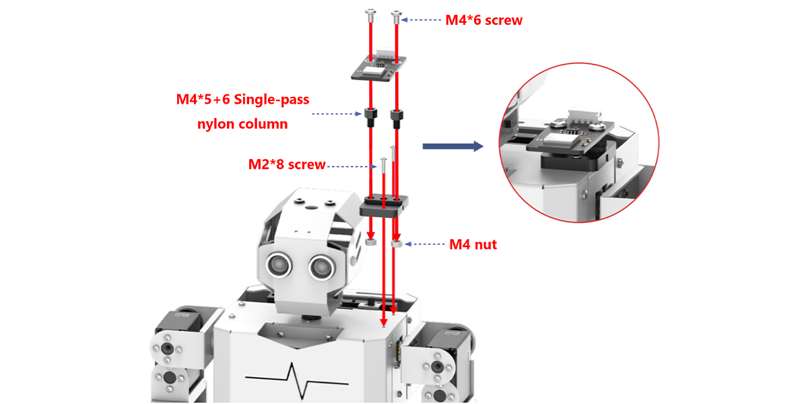


### 6.5.2 Program Download

* **Vision Module Program Download**

This section provides a step-by-step guide for downloading the ESP32-S3 vision module program, using the face detection program as an example. The process for downloading the color recognition program is identical to that of the face detection program.

(1) Program Download

① Connect the ESP32-S3 to your computer using a Type-C data cable.

② Open the program file “**02 Face Detection Porgram\FaceDetection\FaceDetection.ino**” located in the same directory as this document.

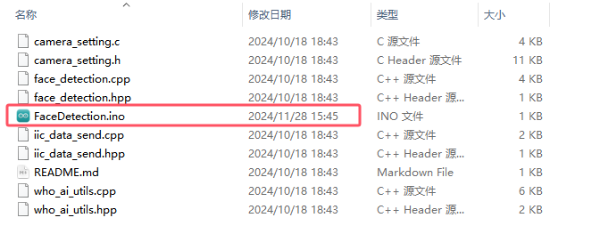

③ Select the **“ESP32S3 Dev Module”** as the target board.


④ In the "Tools" menu, configure the ESP32-S3 development board settings as shown in the image below. (**This configuration is only required for the first use. It does not need to be repeated for subsequent uses.**)


⑤ Click  to transfer the code to the ESP32-S3 and wait for the flashing process to complete.


⑥ After the flashing is complete, disconnect the Type-C data cable.

* **Tonybot IoT Program Download Instructions**

(1) Preparation and Precautions

Before downloading the program, ensure that Tonybot is powered on and connected via a Type-C data cable. Failure to do so may result in the port not being detected.

(2) Program Download

① Connect the ESP32-S3 to the computer using a Type-C data cable.

② Open the **"IOT_Tonybot.ino"** file located in the **"02 Tonybot IOT Examples\IOT_Tonybot"** folder.


③ Select the **"ESP32 Dev Module"** board.


④ In the "Tools" menu, select the appropriate ESP32-S3 board configuration as shown in the image below (this configuration is required only the first time; subsequent uses do not require reconfiguration).


⑤ Click  to upload the program to Arduino and wait for the upload to complete.


* **Achieved Effect**

Once you open the app, you can control Tonybot to perform functions such as face detection alerts, unknown object detection alerts, and collision warnings for unidentified objects. For detailed information on the app’s functionality, please refer to section 6.5.3 App Installation.

### 6.5.3 App Usage Instruction

* **App Installation**

For iOS users: Simply search for "[IoT Control]()" in the App Store and download it.

For Android users: You can find the "[IoT Control]()", or refer to the appendix to download and install it on your phone.

* **App Connection**

:::{Note}

Before using the app, make sure that Wi-Fi and location services are enabled in your phone’s settings. This section demonstrates using the Android version of the app, but the steps are the same for the iOS version.

:::

(1) Power on the Tonybot, then open the **"IoT Control"** app on your phone.


(2) Tap  in the top-right corner, select **“IOT_Tonybot”** from the Wi-Fi list, and enter the password **“12345678”** to connect.


(3) Once connected, the Wi-Fi icon in the top-right corner will become solid.


* **Control Overview**

The app provides 8 different modes: Face Detection Alert, Unknown Object Alert, Unknown Impact Alert, Remote Warning, Color Detection, Distance Detection, RGB Light Control, and Robot Control.  

A detailed description of each function is provided in the table below:

<table  class="docutils-nobg"  border="1">
<colgroup>
<col  />
<col  />
</colgroup>
<tbody>
<tr>
<td ><strong>Icon</strong></td>
<td ><strong>Function</strong></td>
</tr>
<tr>
<td ></td>
<td >When the Tonybot vision module detects a face, the phone will vibrate.<br />
(<strong>Note: This feature requires the face detection program to be pre-installed on the vision module.</strong>)</td>
</tr>
<tr>
<td ></td>
<td >When the Tonybot ultrasonic module detects an object, the buzzer will sound.</td>
</tr>
<tr>
<td ></td>
<td >When an unknown object causes Tonybot to fall, the buzzer will sound.</td>
</tr>
<tr>
<td ></td>
<td >Once activated, the buzzer will continue to sound until Tonybot is upright again.</td>
</tr>
<tr>
<td ></td>
<td >When the Tonybot vision module detects a specific color, the corresponding color will be displayed in the circle below.<br />
(Note: This feature requires the color detection program to be pre-installed on the vision module.)</td>
</tr>
<tr>
<td ></td>
<td >With the Remote Distance Measurement feature enabled, the detected distance will be shown below.</td>
</tr>
<tr>
<td ></td>
<td >Controls the color of the RGB light on the Tonybot ultrasonic module.</td>
</tr>
<tr>
<td ></td>
<td >Controls Tonybot to execute various action groups.</td>
</tr>
</tbody>
</table>

### 6.5.4 Face Detection Alert Project

* **Project Introduction**

In this section, Tonybot utilizes the ESP32-S3 vision module to detect faces and triggers a vibration alert on the phone upon face detection.

* **Program Implementation Process**


* **Module Introduction**

**(1) ESP32-S3 Vision Module**


The ESP32-S3 Vision Module is a compact camera module that can function as a standalone system. It captures images with its built-in camera, processes the data using the ESP32 microcontroller, and wirelessly transmits it via Wi-Fi. With support for various communication protocols and low-power features, this module is widely used in a range of IoT applications.

To get the detailed installation guide, please refer to ‘6.5 IoT (Internet of Things) Course\\ 6.5.1 WiFi Module Installation & Wiring’.

* **Program Download**

For instructions on downloading the vision module and Tonybot program, please refer to the "6.5.2 Program Download" section.

* **Achieved Effect**

When Tonybot detects a face, the phone will vibrate as an alert.

* **Program Analysis**

(1) Importing Library Files

Import the required libraries for the servo motors, sensors, software serial communication, servo controller, and ESP32-S3 communication.

{lineno-start=6}

```
#include "base_config.h"
#include "HardwareSerial.h" //串口库
#include "LobotServoController.h" //舵机控制器库
#include "Arduino.h"
#include "Servo.h"
#include "HWSensor.h" //传感器库
#include "Hiwonder.hpp"
#include "hw_esp32cam_ctl.h" //导入ESP32Cam通讯库
```

(2) Hardware Initialization

① Instantiate the secondary development communication library, the sensor class, the pan-tilt servo control class, and the vision module object.

{lineno-start=15}

```
LobotServoController Controller(Serial2); //实例化二次开发通信库
IMU imu;  //实例化IMU控制对象
Buzzer_t buzzer_obj; //实例化蜂鸣器控制对象
HWSensor hwsensor;  //实例化传感器类
Servo sonarServo; //实例化超声波云台舵机控制类
HW_ESP32Cam cam; //实例化ESP32S3视觉模块对象
```

② Set the vision module's function type to empty during initialization.

{lineno-start=23}

```
uint8_t esp32s3_type = 0; // 1：face  2：color
```

③ Create the necessary variables to receive and process data.

{lineno-start=28}

```
// 用于接收WIFI的数据
uint8_t read_data[2][20];
// 解析后的数据集
int16_t rec_data[5];

// 各个功能开启标志位
uint8_t onoff_face = 0;
uint8_t onoff_undef_obj = 0;
uint8_t onoff_hit = 0;
uint8_t onoff_color_detec = 0;
uint8_t onoff_distance = 0;

// 用于保存各个功能触发标志位和数据
uint8_t warn_face = 0;
uint8_t warn_undef_obj = 0;
uint8_t warn_hit = 0;
uint8_t color_detec_num = 0;
uint16_t sensor_distance = 0;
float roll = 0, pitch = 0;

// WiFi发送缓冲区
uint8_t wifi_send_data[20];
```

④ Use the ESP32S3Cam_type() function to retrieve the current function type of the vision module and store it in the "esp32s3_type" variable.

{lineno-start=51}

```
/*确定ESP32S3Cam的功能类型*/
int ESP32S3Cam_type(void)
{
  uint8_t color_data[4];
  cam.color_position(color_data); //修改为访问的颜色3
  //若获取到的数据都为0xFF（即255），即为人脸识别程序
  if(color_data[0] == 255 && color_data[1] == 255) 
  {
    Serial.println("type:face");
    return 1;
  }else{
    Serial.println("type:color");
    return 2;
  }
}
```

(3) Initialization Function

① First, set the serial port baud rate to 115200 and configure the Wi-Fi name and password.

{lineno-start=77}

```
void setup() {
  // 初始化串口通信
  Serial.begin(115200);
  delay(200);
  // 设置Wifi名称和密码
  uint8_t wifi_name[30] = "NIOT_Tonybot|||12345678$$$";
  hwsensor.wifi_send(wifi_name , 30);
```

② Then, initialize the vision module, the buzzer, and a software serial port (Serial2) for communication with the servo controller. Set the servo control IO pin to "IO_Servo", which is defined in the base_config.h file as ESP32 IO4. After the interface is set, control the pan-tilt servo to move the head to 90°. Finally, initialize the robot's posture to action group 1 (standing).

{lineno-start=84}

```
  // 初始化视觉模块
  cam.begin();
  // 初始化蜂鸣器
  buzzer_obj.init(IO_BUZZER);
  // 初始化与底板通信的串口
  Serial2.begin(9600 , SERIAL_8N1 , IO_BaseRX , IO_BaseTX);
  // 初始化舵机
  sonarServo.attach(IO_Servo); //设定舵机控制io口
  sonarServo.write(90); //旋转到90度
  delay(200); //等待底板初始化完毕
  // 初始化机器人姿态
  Controller.runActionGroup(0 , 1); 
  delay(2000);
```

③ Initialize the IMU module (Note: The IMU initialization takes some time, so include a 5-second delay after calling the initialization function to ensure it properly initializes. Without this delay, the IMU might not initialize correctly). Once the IMU is ready, the buzzer will sound to confirm that all functions are initialized.

{lineno-start=97}

```
  // 初始化IMU
  imu.begin();
  delay(5000); //等待IMU初始化完成
  // 蜂鸣器鸣响1声
  buzzer_obj.blink(1500 , 100 , 100 , 1);
  Serial.println("start.");
  // 获取ESP32视觉模块的功能类型
  esp32s3_type = ESP32S3Cam_type();
}
```

(4) Face Detection Function Analysis

① In the sensor task, when the vision module is set to face detection mode, the **cam.faceDetect()** function is called to determine if a face is detected. If a face is recognized, the **warn_face** function is set to **1**; if no face is detected, **warn_face** is set to **0**.

{lineno-start=227}

```
/*传感器任务*/
void sensor_Task(void)
{
  /* ESP32S3视觉模块检测 */
  // 若为人脸检测
  if(esp32s3_type == 1)
  {
    // 判断是否开启
    if(onoff_face != 0)
    {
      // 检测人脸
      if(cam.faceDetect())
      {
        warn_face = 1;
      }else{
        warn_face = 0;
      }
    }else{
      warn_face = 0;
    }
```

② Combine the statuses of face detection, unknown object detection, and unknown object collision detection into a single command, and send it to the mobile app. Upon receiving the command, the app will automatically trigger the phone’s vibration function.

{lineno-start=288}

```
  // 预警状态发送
  static uint32_t last_time = 0;
  static uint8_t step = 0;
  if(millis() > last_time)
  {
    last_time = millis() + 50;
    switch(step)
    {
      // 发送人脸检测、不明物体检测、不明物体撞击检测的状态
      case 0:{
        sprintf((char*)wifi_send_data, "CMD|1|%d|%d|%d|$" , warn_face , warn_undef_obj , warn_hit);
        hwsensor.wifi_send(wifi_send_data , 20);
        step = 1;
      }break;
```

### 6.5.5 Unknown Object Alert

* **Project Introduction**

This section shows how Tonybot uses the ultrasonic sensor to detect objects and sends a vibration alert to the mobile phone.

* **Program Implementation Process**


* **Module Introduction**


This is a light-emitting ultrasonic distance sensor module that communicates via I2C. It reads the distance measured by the ultrasonic sensor using the I2C protocol.

When measuring distance, the module sends out 8 pulses of 40kHz square waves and checks for any returning signals. If a signal is detected, the module outputs a high-level signal, and the duration of this high signal corresponds to the time taken for the ultrasonic waves to travel to the target and back.

* **Program Download**

For instructions on downloading the vision module and Tonybot program, please refer to the "6.5.2 Program Download" section.

* **Achieved Effect**

When Tonybot detects an object at a distance of less than 15 cm, the phone will vibrate.

* **Program Analysis**

(1) Importing Library Files

Import the necessary libraries for the servo motors, sensors, software serial communication, servo controller, and ESP32-S3 communication.

{lineno-start=6}

```
#include "base_config.h"
#include "HardwareSerial.h" //串口库
#include "LobotServoController.h" //舵机控制器库
#include "Arduino.h"
#include "Servo.h"
#include "HWSensor.h" //传感器库
#include "Hiwonder.hpp"
#include "hw_esp32cam_ctl.h" //导入ESP32Cam通讯库
```

(2) Hardware Instantiation

① Instantiate the communication library for secondary development, the sensor class, the pan-tilt servo control class, and the vision module object.

{lineno-start=15}

```
LobotServoController Controller(Serial2); //实例化二次开发通信库
IMU imu;  //实例化IMU控制对象
Buzzer_t buzzer_obj; //实例化蜂鸣器控制对象
HWSensor hwsensor;  //实例化传感器类
Servo sonarServo; //实例化超声波云台舵机控制类
HW_ESP32Cam cam; //实例化ESP32S3视觉模块对象
```

② Set the vision module’s function type to empty during initialization.

{lineno-start=22}

```
// 视觉模块功能类型
uint8_t esp32s3_type = 0; // 1：face  2：color
```

③ Create the necessary variables to receive and process data.

{lineno-start=28}

```
// 用于接收WIFI的数据
uint8_t read_data[2][20];
// 解析后的数据集
int16_t rec_data[5];

// 各个功能开启标志位
uint8_t onoff_face = 0;
uint8_t onoff_undef_obj = 0;
uint8_t onoff_hit = 0;
uint8_t onoff_color_detec = 0;
uint8_t onoff_distance = 0;

// 用于保存各个功能触发标志位和数据
uint8_t warn_face = 0;
uint8_t warn_undef_obj = 0;
uint8_t warn_hit = 0;
uint8_t color_detec_num = 0;
uint16_t sensor_distance = 0;
float roll = 0, pitch = 0;

// WiFi发送缓冲区
uint8_t wifi_send_data[20];
```

④ Use the ESP32S3Cam_type() function to retrieve the current function type of the vision module and store it in the "esp32s3_type" variable.

{lineno-start=52}

```
int ESP32S3Cam_type(void)
{
  uint8_t color_data[4];
  cam.color_position(color_data); //修改为访问的颜色3
  //若获取到的数据都为0xFF（即255），即为人脸识别程序
  if(color_data[0] == 255 && color_data[1] == 255) 
  {
    Serial.println("type:face");
    return 1;
  }else{
    Serial.println("type:color");
    return 2;
  }
}
```

(3) Function Initialization

① Start by initializing the serial port with a baud rate of 115200 and setting up the Wi-Fi name and password.

{lineno-start=77}

```
void setup() {
  // 初始化串口通信
  Serial.begin(115200);
  delay(200);
  // 设置Wifi名称和密码
  uint8_t wifi_name[30] = "NIOT_Tonybot|||12345678$$$";
  hwsensor.wifi_send(wifi_name , 30);
```

② Next, initialize the vision module, buzzer, and a software serial port (Serial2) for communication with the servo controller. Set the servo control IO pin to "IO_Servo", a macro defined in the base_config.h file (which corresponds to ESP32 IO4). After configuring the interface, control the pan-tilt servo to move the head to 90°. Finally, set the robot’s posture to action group 1 (standing).

{lineno-start=84}

```
  // 初始化视觉模块
  cam.begin();
  // 初始化蜂鸣器
  buzzer_obj.init(IO_BUZZER);
  // 初始化与底板通信的串口
  Serial2.begin(9600 , SERIAL_8N1 , IO_BaseRX , IO_BaseTX);
  // 初始化舵机
  sonarServo.attach(IO_Servo); //设定舵机控制io口
  sonarServo.write(90); //旋转到90度
  delay(200); //等待底板初始化完毕
  // 初始化机器人姿态
  Controller.runActionGroup(0 , 1); 
  delay(2000);
```

③ Then, initialize the IMU module (Note: IMU initialization takes some time. After calling the initialization function, add a 5-second delay to ensure proper initialization. Without this delay, the IMU might fail to initialize). Once the IMU is ready, the buzzer will sound to confirm that all functions are successfully initialized.

{lineno-start=97}

```
  // 初始化IMU
  imu.begin();
  delay(5000); //等待IMU初始化完成
  // 蜂鸣器鸣响1声
  buzzer_obj.blink(1500 , 100 , 100 , 1);
  Serial.println("start.");
  // 获取ESP32视觉模块的功能类型
  esp32s3_type = ESP32S3Cam_type();
}
```

(4) Unknown Object Alert Function Analysis

① Call the **uLtrasoundGetDistance()** function to get the distance to any detected obstacles. If the distance is less than 200mm, set the **warn_undef_obj** function to **1**, indicating the presence of an unknown object, and trigger a phone vibration alert. If the distance exceeds 200mm, set it to **0**, meaning no unknown object was detected.

{lineno-start=274}

```
  // 不明物体撞击检测
  if(onoff_hit != 0)
  {
    imu.get_angle(&roll , &pitch);
    if(roll < 70 || roll > 110)
    {
      warn_hit = 1;
    }else{
      warn_hit = 0;
    }
  }else{
    warn_hit = 0;
  }
```

② Combine the statuses of face detection, unknown object detection, and unknown object collision detection into a single command and send it to the mobile app. Once the app receives the command, it will automatically activate the phone's vibration feature.

{lineno-start=288}

```
  // 预警状态发送
  static uint32_t last_time = 0;
  static uint8_t step = 0;
  if(millis() > last_time)
  {
    last_time = millis() + 50;
    switch(step)
    {
      // 发送人脸检测、不明物体检测、不明物体撞击检测的状态
      case 0:{
        sprintf((char*)wifi_send_data, "CMD|1|%d|%d|%d|$" , warn_face , warn_undef_obj , warn_hit);
        hwsensor.wifi_send(wifi_send_data , 20);
        step = 1;
      }break;
```

### 6.5.6 Unknown Impact Alert

* **Project Introduction**

In this section, Tonybot will trigger a vibration alert on the phone when an object is detected by the IMU sensor.

* **Program Implementation Process**


* **IMU Sensor**


Tonybot is equipped with an on-board IMU sensor, widely used in applications such as handheld gaming devices, 3D controllers, and portable navigation systems. This sensor integrates a 3-axis MEMS gyroscope, a 3-axis MEMS accelerometer, and a Digital Motion Processor (DMP) for advanced motion detection and processing.

* **Program Download**

For instructions on downloading the vision module and Tonybot program, please refer to the "6.5.2 Program Download" section.

* **Achieved Effect**

When Tonybot is knocked over by an unknown object, the phone will vibrate.

* **Program Analysis**

Import the necessary libraries for the servo motors, sensors, software serial communication, servo controller, and ESP32-S3 communication.

{lineno-start=6}

```
#include "base_config.h"
#include "HardwareSerial.h" //串口库
#include "LobotServoController.h" //舵机控制器库
#include "Arduino.h"
#include "Servo.h"
#include "HWSensor.h" //传感器库
#include "Hiwonder.hpp"
#include "hw_esp32cam_ctl.h" //导入ESP32Cam通讯库
```

(1) Hardware Initialization

① Instantiate the hardware components, including enabling I2C communication, creating the Tonybot object, and activating the buzzer.

{lineno-start=15}

```
LobotServoController Controller(Serial2); //实例化二次开发通信库
IMU imu;  //实例化IMU控制对象
Buzzer_t buzzer_obj; //实例化蜂鸣器控制对象
HWSensor hwsensor;  //实例化传感器类
Servo sonarServo; //实例化超声波云台舵机控制类
HW_ESP32Cam cam; //实例化ESP32S3视觉模块对象
```

② Set the vision module's function type to empty during initialization.

{lineno-start=23}

```
uint8_t esp32s3_type = 0; // 1：face  2：color
```

③ Define the variables needed for receiving and processing data.

{lineno-start=28}

```
// 用于接收WIFI的数据
uint8_t read_data[2][20];
// 解析后的数据集
int16_t rec_data[5];

// 各个功能开启标志位
uint8_t onoff_face = 0;
uint8_t onoff_undef_obj = 0;
uint8_t onoff_hit = 0;
uint8_t onoff_color_detec = 0;
uint8_t onoff_distance = 0;

// 用于保存各个功能触发标志位和数据
uint8_t warn_face = 0;
uint8_t warn_undef_obj = 0;
uint8_t warn_hit = 0;
uint8_t color_detec_num = 0;
uint16_t sensor_distance = 0;
float roll = 0, pitch = 0;

// WiFi发送缓冲区
uint8_t wifi_send_data[20];
```

④ Use the ESP32S3Cam_type() function to obtain the current function type of the vision module and store it in the "esp32s3_type" variable.

{lineno-start=51}

```
/*确定ESP32S3Cam的功能类型*/
int ESP32S3Cam_type(void)
{
  uint8_t color_data[4];
  cam.color_position(color_data); //修改为访问的颜色3
  //若获取到的数据都为0xFF（即255），即为人脸识别程序
  if(color_data[0] == 255 && color_data[1] == 255) 
  {
    Serial.println("type:face");
    return 1;
  }else{
    Serial.println("type:color");
    return 2;
  }
}
```

(2) Function Initialization

① Begin by initializing the serial port with a baud rate of 115200 and configuring the Wi-Fi name and password.

{lineno-start=77}

```
void setup() {
  // 初始化串口通信
  Serial.begin(115200);
  delay(200);
  // 设置Wifi名称和密码
  uint8_t wifi_name[30] = "NIOT_Tonybot|||12345678$$$";
  hwsensor.wifi_send(wifi_name , 30);
```

② Next, initialize the vision module, buzzer, and a software serial port (Serial2) for communication with the servo controller. Set the servo control IO pin to "IO_Servo", a macro defined in the base_config.h file, which corresponds to ESP32 IO4. After setting the interface, control the pan-tilt servo to move the head to 90°. Finally, initialize the robot's posture to action group 1 (standing).

{lineno-start=84}

```
  // 初始化视觉模块
  cam.begin();
  // 初始化蜂鸣器
  buzzer_obj.init(IO_BUZZER);
  // 初始化与底板通信的串口
  Serial2.begin(9600 , SERIAL_8N1 , IO_BaseRX , IO_BaseTX);
  // 初始化舵机
  sonarServo.attach(IO_Servo); //设定舵机控制io口
  sonarServo.write(90); //旋转到90度
  delay(200); //等待底板初始化完毕
  // 初始化机器人姿态
  Controller.runActionGroup(0 , 1); 
  delay(2000);
```

③ Initialize the IMU module (Note: The IMU initialization process is slow. After calling the initialization function, include a 5-second delay to allow proper initialization. Without this delay, the IMU module may fail to initialize). Once initialization is complete, the buzzer will sound to indicate that all functions have been successfully initialized.

{lineno-start=97}

```
  // 初始化IMU
  imu.begin();
  delay(5000); //等待IMU初始化完成
  // 蜂鸣器鸣响1声
  buzzer_obj.blink(1500 , 100 , 100 , 1);
  Serial.println("start.");
  // 获取ESP32视觉模块的功能类型
  esp32s3_type = ESP32S3Cam_type();
}
```

(4) Unknown Object Collision Alert Function Analysis

① Call the get_angle function to retrieve data from the IMU sensor. Check the tilt angle of the IMU: if the angle is greater than 110° or less than 70°, set warn_hit to 1, indicating that the robot has fallen and a vibration alert should be triggered on the phone. Otherwise, set warn_hit to 0, indicating that the robot is still upright.

{lineno-start=259}

```
  /* 超声波测距 */
  sensor_distance = hwsensor.ultrasoundGetDistance();
  //不明物体检测
  if(onoff_undef_obj != 0) 
  {
    if(sensor_distance < 200)
    {
      warn_undef_obj = 1;
    }else{
      warn_undef_obj = 0;
    }
  }else{
    warn_undef_obj = 0;
  }
```

② Combine the statuses of face detection, unknown object detection, and unknown object collision detection into a single command and send it to the app. When the app receives the command, it will automatically activate the phone's vibration feature.

{lineno-start=288}

```
  // 预警状态发送
  static uint32_t last_time = 0;
  static uint8_t step = 0;
  if(millis() > last_time)
  {
    last_time = millis() + 50;
    switch(step)
    {
      // 发送人脸检测、不明物体检测、不明物体撞击检测的状态
      case 0:{
        sprintf((char*)wifi_send_data, "CMD|1|%d|%d|%d|$" , warn_face , warn_undef_obj , warn_hit);
        hwsensor.wifi_send(wifi_send_data , 20);
        step = 1;
      }break;
```

### 6.5.7 Color Detection Project

* **Project Introduction**

This section allows Tonybot, equipped with the ESP32-S3 vision module, to detect red, green, and blue colors and display the corresponding colors on the mobile phone.

* **Program Implementation Process**


* **Module Introduction**


The ESP32-S3 Vision Module is a compact camera module that can function as a standalone system. It captures images with its built-in camera, processes the data using the ESP32 microcontroller, and wirelessly transmits it via Wi-Fi. With support for various communication protocols and low-power features, this module is widely used in a range of IoT applications.

To get the detailed installation guide, please refer to ‘6.5 IoT (Internet of Things) Course\\ 6.5.1 WiFi Module Installation & Wiring’.

* **Program Download**

For instructions on downloading the vision module and Tonybot program, please refer to the "6.5.2 Program Download" section.

* **Achieved Effect**

When Tonybot detects red, green, or blue, it sends the data to the app, which then displays the recognized color.

* **Program Analysis**

(1) Importing Library Files

Import the required libraries for the servo motors, sensors, software serial communication, servo controller, and ESP32S3 communication.

{lineno-start=6}

```
#include "base_config.h"
#include "HardwareSerial.h" //串口库
#include "LobotServoController.h" //舵机控制器库
#include "Arduino.h"
#include "Servo.h"
#include "HWSensor.h" //传感器库
#include "Hiwonder.hpp"
#include "hw_esp32cam_ctl.h" //导入ESP32Cam通讯库
```

(2) Hardware Initialization

① Instantiate the communication library for secondary development, the sensor class, the pan-tilt servo control class, and the vision module object.

{lineno-start=15}

```
LobotServoController Controller(Serial2); //实例化二次开发通信库
IMU imu;  //实例化IMU控制对象
Buzzer_t buzzer_obj; //实例化蜂鸣器控制对象
HWSensor hwsensor;  //实例化传感器类
Servo sonarServo; //实例化超声波云台舵机控制类
HW_ESP32Cam cam; //实例化ESP32S3视觉模块对象
```

② Set the function type of the vision module to empty during initialization.

{lineno-start=23}

```
uint8_t esp32s3_type = 0; // 1：face  2：color
```

③ Create the necessary variables to handle and process data.

{lineno-start=28}

```
// 用于接收WIFI的数据
uint8_t read_data[2][20];
// 解析后的数据集
int16_t rec_data[5];

// 各个功能开启标志位
uint8_t onoff_face = 0;
uint8_t onoff_undef_obj = 0;
uint8_t onoff_hit = 0;
uint8_t onoff_color_detec = 0;
uint8_t onoff_distance = 0;

// 用于保存各个功能触发标志位和数据
uint8_t warn_face = 0;
uint8_t warn_undef_obj = 0;
uint8_t warn_hit = 0;
uint8_t color_detec_num = 0;
uint16_t sensor_distance = 0;
float roll = 0, pitch = 0;

// WiFi发送缓冲区
uint8_t wifi_send_data[20];
```

④ Use the ESP32S3Cam_type() function to get the current function type of the vision module and store it in the "esp32s3_type" variable.

{lineno-start=52}

```
int ESP32S3Cam_type(void)
{
  uint8_t color_data[4];
  cam.color_position(color_data); //修改为访问的颜色3
  //若获取到的数据都为0xFF（即255），即为人脸识别程序
  if(color_data[0] == 255 && color_data[1] == 255) 
  {
    Serial.println("type:face");
    return 1;
  }else{
    Serial.println("type:color");
    return 2;
  }
}
```

**(3) Function Initialization**

① Begin by initializing the serial port with a baud rate of 115200 and configure the Wi-Fi name and password.

{lineno-start=77}

```
void setup() {
  // 初始化串口通信
  Serial.begin(115200);
  delay(200);
  // 设置Wifi名称和密码
  uint8_t wifi_name[30] = "NIOT_Tonybot|||12345678$$$";
  hwsensor.wifi_send(wifi_name , 30);
```

② Next, initialize the vision module, buzzer, and a software serial port (Serial2) for communication with the servo controller. Set the servo control IO pin to "IO_Servo", a macro defined in the base_config.h file (corresponding to ESP32 IO4). After setting up the interface, move the pan-tilt servo to 90° to position the head. Finally, set the robot's posture to action group 1 (standing).

{lineno-start=}

```
  // 初始化视觉模块
  cam.begin();
  // 初始化蜂鸣器
  buzzer_obj.init(IO_BUZZER);
  // 初始化与底板通信的串口
  Serial2.begin(9600 , SERIAL_8N1 , IO_BaseRX , IO_BaseTX);
  // 初始化舵机
  sonarServo.attach(IO_Servo); //设定舵机控制io口
  sonarServo.write(90); //旋转到90度
  delay(200); //等待底板初始化完毕
  // 初始化机器人姿态
  Controller.runActionGroup(0 , 1); 
  delay(2000);
```

③ Initialize the IMU module (Note: IMU initialization takes some time. After calling the initialization function, add a 5-second delay to ensure it initializes properly. Without this delay, the IMU may fail to initialize). Once the IMU is ready, the buzzer will sound to confirm that all functions have been initialized successfully.

{lineno-start=97}

```
  // 初始化IMU
  imu.begin();
  delay(5000); //等待IMU初始化完成
  // 蜂鸣器鸣响1声
  buzzer_obj.blink(1500 , 100 , 100 , 1);
  Serial.println("start.");
  // 获取ESP32视觉模块的功能类型
  esp32s3_type = ESP32S3Cam_type();
}
```

(4) Color Detection Function Analysis

① When the vision module is in color detection mode, the colorDetect() function is used to identify the detected color ID.

{lineno-start=227}

```
/*传感器任务*/
void sensor_Task(void)
{
  /* ESP32S3视觉模块检测 */
  // 若为人脸检测
  if(esp32s3_type == 1)
  {
    // 判断是否开启
    if(onoff_face != 0)
    {
      // 检测人脸
      if(cam.faceDetect())
      {
        warn_face = 1;
      }else{
        warn_face = 0;
      }
    }else{
      warn_face = 0;
    }
  }else if(esp32s3_type == 2) //若为颜色检测
  {
    // 判断是否开启
    if(onoff_color_detec != 0)
    {
      // 检测颜色
      color_detec_num = cam.colorDetect();
    }else{
      color_detec_num = 0;
    }
  }
```

② Once the color is recognized, the detected color ID is packaged into a command and transmitted to the app for further processing.

{lineno-start=309}

```
      case 2:{
        sprintf((char*)wifi_send_data, "CMD|2|%d|$" , color_detec_num);
        hwsensor.wifi_send(wifi_send_data , 20);
        step = 0;
      }
```

### 6.5.8 Distance Detection

* **Project Introduction**

This section enables Tonybot to measure the obstacle distance using an ultrasonic sensor and display the distance on the app.

* **Program Implementation Process**


* **Module Introduction**


This is a light-emitting ultrasonic distance sensor module that communicates via I2C. It reads the distance measured by the ultrasonic sensor using the I2C protocol.

When measuring distance, the module sends out 8 pulses of 40kHz square waves and checks for any returning signals. If a signal is detected, the module outputs a high-level signal, and the duration of this high signal corresponds to the time taken for the ultrasonic waves to travel to the target and back.

* **Program Download**

For instructions on downloading the vision module and Tonybot program, please refer to the "6.5.2 Program Download" section.

* **Achieved Effect**

Tonybot will continuously monitor the distance to objects and display the measurement on the app.

* **Program Analysis**

(1) Import Library Files

Import the required libraries for game, including servo control, sensors, software serial communication, the servo controller, and ESP32-S3 communication.

{lineno-start=6}

```
#include "base_config.h"
#include "HardwareSerial.h" //串口库
#include "LobotServoController.h" //舵机控制器库
#include "Arduino.h"
#include "Servo.h"
#include "HWSensor.h" //传感器库
#include "Hiwonder.hpp"
#include "hw_esp32cam_ctl.h" //导入ESP32Cam通讯库
```

(2) Hardware Initialization

① Set up the extended development communication library, sensor class, pan-tilt servo controller, and vision module.

{lineno-start=15}

```
LobotServoController Controller(Serial2); //实例化二次开发通信库
IMU imu;  //实例化IMU控制对象
Buzzer_t buzzer_obj; //实例化蜂鸣器控制对象
HWSensor hwsensor;  //实例化传感器类
Servo sonarServo; //实例化超声波云台舵机控制类
HW_ESP32Cam cam; //实例化ESP32S3视觉模块对象
```

② Initialize the vision module with no predefined function type.

{lineno-start=22}

```
// 视觉模块功能类型
uint8_t esp32s3_type = 0; // 1：face  2：color
```

③ Define key variables for handling incoming data and processing tasks.

{lineno-start=28}

```
// 用于接收WIFI的数据
uint8_t read_data[2][20];
// 解析后的数据集
int16_t rec_data[5];

// 各个功能开启标志位
uint8_t onoff_face = 0;
uint8_t onoff_undef_obj = 0;
uint8_t onoff_hit = 0;
uint8_t onoff_color_detec = 0;
uint8_t onoff_distance = 0;

// 用于保存各个功能触发标志位和数据
uint8_t warn_face = 0;
uint8_t warn_undef_obj = 0;
uint8_t warn_hit = 0;
uint8_t color_detec_num = 0;
uint16_t sensor_distance = 0;
float roll = 0, pitch = 0;

// WiFi发送缓冲区
uint8_t wifi_send_data[20];
```

④ Use the ESP32S3Cam_type() function to determine the current function mode of the vision module and store the result in the esp32s3_type variable.

{lineno-start=51}

```
/*确定ESP32S3Cam的功能类型*/
int ESP32S3Cam_type(void)
{
  uint8_t color_data[4];
  cam.color_position(color_data); //修改为访问的颜色3
  //若获取到的数据都为0xFF（即255），即为人脸识别程序
  if(color_data[0] == 255 && color_data[1] == 255) 
  {
    Serial.println("type:face");
    return 1;
  }else{
    Serial.println("type:color");
    return 2;
  }
}
```

(4) Function Initialization

① Set the serial baud rate to 115200 and configure the Wi-Fi credentials.

{lineno-start=77}

```
void setup() {
  // 初始化串口通信
  Serial.begin(115200);
  delay(200);
  // 设置Wifi名称和密码
  uint8_t wifi_name[30] = "NIOT_Tonybot|||12345678$$$";
  hwsensor.wifi_send(wifi_name , 30);
```

② Initialize the vision module, buzzer, and a software serial port (Serial2) for communication with the servo controller. Define the servo control IO pin as IO_Servo, a macro specified in the base_config.h file, corresponding to ESP32’s IO4 pin. Once the interface is set up, rotate the pan-tilt servo to 90°. Finally, set the robot’s initial posture to Action Group 1 (standing).

{lineno-start=84}

```
  // 初始化视觉模块
  cam.begin();
  // 初始化蜂鸣器
  buzzer_obj.init(IO_BUZZER);
  // 初始化与底板通信的串口
  Serial2.begin(9600 , SERIAL_8N1 , IO_BaseRX , IO_BaseTX);
  // 初始化舵机
  sonarServo.attach(IO_Servo); //设定舵机控制io口
  sonarServo.write(90); //旋转到90度
  delay(200); //等待底板初始化完毕
  // 初始化机器人姿态
  Controller.runActionGroup(0 , 1); 
  delay(2000);
```

③ Initialize the IMU module.

:::{Note}

The IMU initialization process takes time. To ensure proper setup, introduce a 5-second delay after calling the initialization function. If no delay is added, the IMU module may fail to initialize. Once initialization is complete, trigger the buzzer to sound, indicating that all system functions have been successfully set up.

:::

{lineno-start=97}

```
  // 初始化IMU
  imu.begin();
  delay(5000); //等待IMU初始化完成
  // 蜂鸣器鸣响1声
  buzzer_obj.blink(1500 , 100 , 100 , 1);
  Serial.println("start.");
  // 获取ESP32视觉模块的功能类型
  esp32s3_type = ESP32S3Cam_type();
}
```

(4) Distance Detection Function Analysis

① In the sensor task, call the ultrasoundGetDistance() function to measure the obstacle distance using the ultrasonic sensor (in millimeters).

{lineno-start=259}

```
  /* 超声波测距 */
  sensor_distance = hwsensor.ultrasoundGetDistance();
```

② Convert the measured distance to centimeters, package the data into a command, and transmit it to the mobile app.

{lineno-start=302}

```
      // 发送超声波检测的距离
      case 1:{
        sprintf((char*)wifi_send_data, "CMD|3|%d|$" , sensor_distance/10);
        hwsensor.wifi_send(wifi_send_data , 20);
        step = 2;
      }break;
```

### 6.5.9 RGB Light Control

* **Project Introduction**

This section allows you to control the RGB light color of Tonybot's ultrasonic sensor through the app.

* **Program Implementation Process**


* **Module Introduction**


This is a light-emitting ultrasonic distance sensor module that communicates via I2C. It reads the distance measured by the ultrasonic sensor using the I2C protocol.

When measuring distance, the module sends out 8 pulses of 40kHz square waves and checks for any returning signals. If a signal is detected, the module outputs a high-level signal, and the duration of this high signal corresponds to the time taken for the ultrasonic waves to travel to the target and back.

* **Program Download**

For instructions on downloading the vision module and Tonybot program, please refer to the "6.5.2 Program Download" section.

* **Achieved Effect**

Tonybot will adjust the RGB light color of the ultrasonic sensor according to the commands sent from the app.

* **Program Analysis**

(1) Import Library Files

Import the required libraries for the servos, sensors, software serial ports, servo controllers, and ESP32S3 communication, as needed for the functionality.

{lineno-start=6}

```
#include "base_config.h"
#include "HardwareSerial.h" //串口库
#include "LobotServoController.h" //舵机控制器库
#include "Arduino.h"
#include "Servo.h"
#include "HWSensor.h" //传感器库
#include "Hiwonder.hpp"
#include "hw_esp32cam_ctl.h" //导入ESP32Cam通讯库
```

(2) Hardware Initialization

① Initialize the custom communication library, sensor classes, pan-tilt servo control class, and vision module object.

{lineno-start=15}

```
LobotServoController Controller(Serial2); //实例化二次开发通信库
IMU imu;  //实例化IMU控制对象
Buzzer_t buzzer_obj; //实例化蜂鸣器控制对象
HWSensor hwsensor;  //实例化传感器类
Servo sonarServo; //实例化超声波云台舵机控制类
HW_ESP32Cam cam; //实例化ESP32S3视觉模块对象
```

② Set the vision module's function type to empty.

{lineno-start=22}

```
// 视觉模块功能类型
uint8_t esp32s3_type = 0; // 1：face  2：color
```

③ Define variables to receive and process data for each function.

{lineno-start=28}

```
// 用于接收WIFI的数据
uint8_t read_data[2][20];
// 解析后的数据集
int16_t rec_data[5];

// 各个功能开启标志位
uint8_t onoff_face = 0;
uint8_t onoff_undef_obj = 0;
uint8_t onoff_hit = 0;
uint8_t onoff_color_detec = 0;
uint8_t onoff_distance = 0;

// 用于保存各个功能触发标志位和数据
uint8_t warn_face = 0;
uint8_t warn_undef_obj = 0;
uint8_t warn_hit = 0;
uint8_t color_detec_num = 0;
uint16_t sensor_distance = 0;
float roll = 0, pitch = 0;

// WiFi发送缓冲区
uint8_t wifi_send_data[20];
```

④ Use the ESP32S3Cam_type() function to obtain the current functionality type of the vision module and store it in the esp32s3_type variable.

{lineno-start=51}

```
/*确定ESP32S3Cam的功能类型*/
int ESP32S3Cam_type(void)
{
  uint8_t color_data[4];
  cam.color_position(color_data); //修改为访问的颜色3
  //若获取到的数据都为0xFF（即255），即为人脸识别程序
  if(color_data[0] == 255 && color_data[1] == 255) 
  {
    Serial.println("type:face");
    return 1;
  }else{
    Serial.println("type:color");
    return 2;
  }
}
```

(3) Function Initialization

① First, initialize the serial port with a baud rate of 115200 and configure the Wi-Fi name and password.

{lineno-start=77}

```
void setup() {
  // 初始化串口通信
  Serial.begin(115200);
  delay(200);
  // 设置Wifi名称和密码
  uint8_t wifi_name[30] = "NIOT_Tonybot|||12345678$$$";
  hwsensor.wifi_send(wifi_name , 30);
```

② Then, initialize the vision module, buzzer, and a software serial port (Serial2) for communication with the servo controller. Set the servo control IO pin to “IO_Servo,” which is a macro defined in the "base_config.h" file, corresponding to the ESP32’s IO4 pin. Once the interface is defined, control the pan-tilt servo to rotate to 90°. Finally, initialize the robot’s posture to action group 1 (standing).

{lineno-start=84}

```
  // 初始化视觉模块
  cam.begin();
  // 初始化蜂鸣器
  buzzer_obj.init(IO_BUZZER);
  // 初始化与底板通信的串口
  Serial2.begin(9600 , SERIAL_8N1 , IO_BaseRX , IO_BaseTX);
  // 初始化舵机
  sonarServo.attach(IO_Servo); //设定舵机控制io口
  sonarServo.write(90); //旋转到90度
  delay(200); //等待底板初始化完毕
  // 初始化机器人姿态
  Controller.runActionGroup(0 , 1); 
  delay(2000);
```

③ Initialize the IMU module (Note: The IMU module initialization process is slower, so we add a 5-second delay after calling the initialization function to ensure it is completed. Without this delay, the IMU module initialization may fail). After initialization, activate the buzzer to indicate that all functions have been successfully initialized.

{lineno-start=97}

```
  // 初始化IMU
  imu.begin();
  delay(5000); //等待IMU初始化完成
  // 蜂鸣器鸣响1声
  buzzer_obj.blink(1500 , 100 , 100 , 1);
  Serial.println("start.");
  // 获取ESP32视觉模块的功能类型
  esp32s3_type = ESP32S3Cam_type();
}
```

(4) Remote RGB Light Control Function Analysis

① In the Wi-Fi reception task, first read the data received from the app and store it in the data string.

{lineno-start=127}

```
  // 读取WiFi数据
  num = hwsensor.wifi_read(read_data[array_index] , 20);
  // 判断WiFi是否有新的数据
  if(compare_data(&read_data[0][4] , &read_data[1][4] , 15) != 0) //有数据
  {
    // 将WiFi数据转换为string类型
    String data;
    for(int i = 0 ; i < 20 ; i++){
      data += (char)read_data[array_index][i];
    }
```

② Parse the received data, and separate the command type and the associated data into the rec_data array. The command type will be stored in rec_data\[0\].

{lineno-start=137}

```
    // 解析数据
    if(data.startsWith("CMD") && data.endsWith("$")) //进行数据校验
    {
      data = data.substring(data.indexOf('|') + 1,data.indexOf('$'));
      while(data.indexOf("|") != -1){
        rec_data[index] = data.substring(0, data.indexOf('|')).toInt(); //提取数据字符串并转换为int类型
        data = data.substring(data.indexOf('|') + 1);
        index++;
      }
      // 使用第一个数据来判断控制功能类型
      switch(rec_data[0]){
```

③ When the command type is "4" (which corresponds to the remote control command for the RGB lights), use the ultrasoundColor function to change the color of the ultrasonic RGB light. The elements in rec_data are defined as follows:

rec_data\[0\]: Command type, which is "4" in this case.

rec_data\[1\]: Red brightness control (value range: 0-255).

rec_data\[2\]: Green brightness control (value range: 0-255).

rec_data\[3\]: Blue brightness control (value range: 0-255).

{lineno-start=172}

```
        case 4:{
          if(index == 4)
          {
            hwsensor.ultrasoundColor(rec_data[1] , rec_data[2] , rec_data[3] , rec_data[1] , rec_data[2] , rec_data[3]);
          }
        }break;
```

### 6.5.10 Remote Warning

* **Project Introduction**

In this section, you will learn how to use the app to control Tonybot's buzzer and trigger sound.

* **Program Implementation Process**


* **Module Introduction**


Tonybot is equipped with a 5V buzzer. By adjusting the frequency of the PWM signal output, the buzzer can produce sounds of different pitches.

* **Program Download**

For instructions on downloading the vision module and Tonybot program, please refer to the "6.5.2 Program Download" section.

* **Achieved Effect**

After enabling the remote warning feature, Tonybot's buzzer will sound.

* **Program Analysis**

(1) Import Library Files

Import the required libraries for the servos, sensors, software serial, servo controller, and ESP32S3 communication.

{lineno-start=6}

```
#include "base_config.h"
#include "HardwareSerial.h" //串口库
#include "LobotServoController.h" //舵机控制器库
#include "Arduino.h"
#include "Servo.h"
#include "HWSensor.h" //传感器库
#include "Hiwonder.hpp"
#include "hw_esp32cam_ctl.h" //导入ESP32Cam通讯库
```

(2) Hardware Instantiation

① Instantiate the communication library for secondary development, sensor classes, the pan-tilt servo control class, and the visual module object.

{lineno-start=15}

```
LobotServoController Controller(Serial2); //实例化二次开发通信库
IMU imu;  //实例化IMU控制对象
Buzzer_t buzzer_obj; //实例化蜂鸣器控制对象
HWSensor hwsensor;  //实例化传感器类
Servo sonarServo; //实例化超声波云台舵机控制类
HW_ESP32Cam cam; //实例化ESP32S3视觉模块对象
```

② Initialize the visual module's function type as empty.

{lineno-start=22}

```
// 视觉模块功能类型
uint8_t esp32s3_type = 0; // 1：face  2：color
```

③ Create the necessary variables to receive and process data for each function.

{lineno-start=28}

```
// 用于接收WIFI的数据
uint8_t read_data[2][20];
// 解析后的数据集
int16_t rec_data[5];

// 各个功能开启标志位
uint8_t onoff_face = 0;
uint8_t onoff_undef_obj = 0;
uint8_t onoff_hit = 0;
uint8_t onoff_color_detec = 0;
uint8_t onoff_distance = 0;

// 用于保存各个功能触发标志位和数据
uint8_t warn_face = 0;
uint8_t warn_undef_obj = 0;
uint8_t warn_hit = 0;
uint8_t color_detec_num = 0;
uint16_t sensor_distance = 0;
float roll = 0, pitch = 0;

// WiFi发送缓冲区
uint8_t wifi_send_data[20];
```

④ Use the ESP32S3Cam_type() function to retrieve the current function type of the visual module and store it in the esp32s3_type variable.

{lineno-start=51}

```
/*确定ESP32S3Cam的功能类型*/
int ESP32S3Cam_type(void)
{
  uint8_t color_data[4];
  cam.color_position(color_data); //修改为访问的颜色3
  //若获取到的数据都为0xFF（即255），即为人脸识别程序
  if(color_data[0] == 255 && color_data[1] == 255) 
  {
    Serial.println("type:face");
    return 1;
  }else{
    Serial.println("type:color");
    return 2;
  }
}
```

(3) Initialization Function

① First, initialize the serial port with a baud rate of 115200, and set the WiFi name and password.

{lineno-start=77}

```
void setup() {
  // 初始化串口通信
  Serial.begin(115200);
  delay(200);
  // 设置Wifi名称和密码
  uint8_t wifi_name[30] = "NIOT_Tonybot|||12345678$$$";
  hwsensor.wifi_send(wifi_name , 30);
```

② Next, initialize the vision module, the buzzer, and a software serial port (Serial2) for communication with the servo controller. Then, define the servo control IO pin as "IO_Servo" (this is a macro defined in the "base_config.h" header file, corresponding to ESP32's IO4 pin). After defining the interface, control the head gimbal servo to rotate to 90°. Finally, initialize the robot’s posture to Action Group 1 (standing).

{lineno-start=84}

```
  // 初始化视觉模块
  cam.begin();
  // 初始化蜂鸣器
  buzzer_obj.init(IO_BUZZER);
  // 初始化与底板通信的串口
  Serial2.begin(9600 , SERIAL_8N1 , IO_BaseRX , IO_BaseTX);
  // 初始化舵机
  sonarServo.attach(IO_Servo); //设定舵机控制io口
  sonarServo.write(90); //旋转到90度
  delay(200); //等待底板初始化完毕
  // 初始化机器人姿态
  Controller.runActionGroup(0 , 1); 
  delay(2000);
```

③ Initialize the IMU module (Note: The IMU module initialization process is slow. We delay for 5 seconds after calling the initialization function to allow for proper initialization. Failing to add the delay function may result in an IMU initialization failure). Once the IMU module is initialized, the buzzer will emit a sound to notify us that all functions are initialized.

{lineno-start=97}

```
  // 初始化IMU
  imu.begin();
  delay(5000); //等待IMU初始化完成
  // 蜂鸣器鸣响1声
  buzzer_obj.blink(1500 , 100 , 100 , 1);
  Serial.println("start.");
  // 获取ESP32视觉模块的功能类型
  esp32s3_type = ESP32S3Cam_type();
}
```

(4) Remote RGB Light Control Function Analysis

① In the Wi-Fi reception task, first retrieve the data sent by the mobile app and store it in the data string.

{lineno-start=127}

```
  // 读取WiFi数据
  num = hwsensor.wifi_read(read_data[array_index] , 20);
  // 判断WiFi是否有新的数据
  if(compare_data(&read_data[0][4] , &read_data[1][4] , 15) != 0) //有数据
  {
    // 将WiFi数据转换为string类型
    String data;
    for(int i = 0 ; i < 20 ; i++){
      data += (char)read_data[array_index][i];
    }
```

② Parse the received data, separating the command type and data into the rec_data array, where rec_data\[0\] represents the command type.

{lineno-start=137}

```
    // 解析数据
    if(data.startsWith("CMD") && data.endsWith("$")) //进行数据校验
    {
      data = data.substring(data.indexOf('|') + 1,data.indexOf('$'));
      while(data.indexOf("|") != -1){
        rec_data[index] = data.substring(0, data.indexOf('|')).toInt(); //提取数据字符串并转换为int类型
        data = data.substring(data.indexOf('|') + 1);
        index++;
      }
      // 使用第一个数据来判断控制功能类型
      switch(rec_data[0]){
```

③ If the command type is “5” (remote alarm command), use the buzzer_obj.blink function to activate the buzzer.

{lineno-start=179}

```
        case 5:{
          if(index == 2)
          {
            if(rec_data[1] != 0)
            {
              buzzer_obj.blink(1500 , 400 , 500 , 0);
            }else{
              buzzer_obj.blink(1500 , 0 , 500 , 0);
            }
          }
        }break;
```

### 6.5.11 Robot Control

* **Project Introduction**

In this section, you'll use the mobile app to control Tonybot and make it perform a series of actions.

* **Program Implementation Process**


* **Achieved Effect**

Tonybot includes 16 built-in action groups, and we can call these action groups to make Tonybot perform the corresponding actions. The specific action groups are shown in the table below:

| **Action Group Name** |          **Content**           |
| :-------------------: | :----------------------------: |
|    left_foot_kick     |         Left Foot Kick         |
|    right_foot_kick    |        Right Foot Kick         |
|    stand_four_legs    |       Four-Legged Stand        |
|       sit_dowm        |            Sit Down            |
|       go_prone        |            Lie Down            |
|    stand_two_legs     |        Two-Legged Stand        |
|       handshake       |           Handshake            |
|     scrape_a_bow      |              Bow               |
|    nodding_motion     |              Nod               |
|        boxing         |             Boxing             |
|    stretch_oneself    |            Stretch             |
|          pee          |            Urinate             |
|       press_up        |            Push-up             |
|    rotation_pitch     |          Rotate Pitch          |
|     rotation_roll     |          Rotate Roll           |
|    normal_attitude    | Attention (Stand at Attention) |

* **Program Download**

For instructions on downloading the vision module and Tonybot program, please refer to the "5.5.2 Program Download" section.

* **Program Download**

For instructions on downloading the vision module and Tonybot program, please refer to the "6.5.2 Program Download" section.

* **Program Analysis**

(1) Import Library Files

Import the necessary libraries for the servos, sensors, software serial, servo controllers, and the ESP32S3 communication module.

{lineno-start=6}

```
#include "base_config.h"
#include "HardwareSerial.h" //串口库
#include "LobotServoController.h" //舵机控制器库
#include "Arduino.h"
#include "Servo.h"
#include "HWSensor.h" //传感器库
#include "Hiwonder.hpp"
#include "hw_esp32cam_ctl.h" //导入ESP32Cam通讯库
```

(2) Hardware Instantiation

① Instantiate the communication library for secondary development, the sensor class, the gimbal servo control class, and the visual module object.

{lineno-start=15}

```
LobotServoController Controller(Serial2); //实例化二次开发通信库
IMU imu;  //实例化IMU控制对象
Buzzer_t buzzer_obj; //实例化蜂鸣器控制对象
HWSensor hwsensor;  //实例化传感器类
Servo sonarServo; //实例化超声波云台舵机控制类
HW_ESP32Cam cam; //实例化ESP32S3视觉模块对象
```

② Initialize the visual module's function type as "null" (or empty).

{lineno-start=22}

```
// 视觉模块功能类型
uint8_t esp32s3_type = 0; // 1：face  2：color
```

③ Create the necessary variables to receive and process data for each functionality.

{lineno-start=28}

```
// 用于接收WIFI的数据
uint8_t read_data[2][20];
// 解析后的数据集
int16_t rec_data[5];

// 各个功能开启标志位
uint8_t onoff_face = 0;
uint8_t onoff_undef_obj = 0;
uint8_t onoff_hit = 0;
uint8_t onoff_color_detec = 0;
uint8_t onoff_distance = 0;

// 用于保存各个功能触发标志位和数据
uint8_t warn_face = 0;
uint8_t warn_undef_obj = 0;
uint8_t warn_hit = 0;
uint8_t color_detec_num = 0;
uint16_t sensor_distance = 0;
float roll = 0, pitch = 0;

// WiFi发送缓冲区
uint8_t wifi_send_data[20];
```

④ Call the ESP32S3Cam_type() function to retrieve the current function type of the visual module and store it in the esp32s3_type variable.

{lineno-start=51}

```
/*确定ESP32S3Cam的功能类型*/
int ESP32S3Cam_type(void)
{
  uint8_t color_data[4];
  cam.color_position(color_data); //修改为访问的颜色3
  //若获取到的数据都为0xFF（即255），即为人脸识别程序
  if(color_data[0] == 255 && color_data[1] == 255) 
  {
    Serial.println("type:face");
    return 1;
  }else{
    Serial.println("type:color");
    return 2;
  }
}
```

(3) Initialization Function

① First, initialize the serial port with a baud rate of 115200, and configure the Wi-Fi settings, including the SSID and password.

{lineno-start=77}

```
void setup() {
  // 初始化串口通信
  Serial.begin(115200);
  delay(200);
  // 设置Wifi名称和密码
  uint8_t wifi_name[30] = "NIOT_Tonybot|||12345678$$$";
  hwsensor.wifi_send(wifi_name , 30);
```

② Next, initialize the vision module, buzzer, and a software serial port (Serial2) for communication with the servo controller. Set the servo control I/O pin to “IO_Servo,” which is defined in the "base_config.h" header file (this corresponds to ESP32’s IO4 pin). Once the interface is set up, rotate the pan-tilt servo to 90°. Finally, set the robot’s posture to Action Group 1 (Standing).

{lineno-start=84}

```
  // 初始化视觉模块
  cam.begin();
  // 初始化蜂鸣器
  buzzer_obj.init(IO_BUZZER);
  // 初始化与底板通信的串口
  Serial2.begin(9600 , SERIAL_8N1 , IO_BaseRX , IO_BaseTX);
  // 初始化舵机
  sonarServo.attach(IO_Servo); //设定舵机控制io口
  sonarServo.write(90); //旋转到90度
  delay(200); //等待底板初始化完毕
  // 初始化机器人姿态
  Controller.runActionGroup(0 , 1); 
  delay(2000);
```

③ Initialize the IMU module. Note that the initialization process for the IMU may take some time, so introduce a 5-second delay after calling the initialization function to allow for proper setup. Without this delay, the IMU module might fail to initialize. After the IMU is successfully initialized, the buzzer will sound to confirm that all functions have been set up correctly.

{lineno-start=97}

```
  // 初始化IMU
  imu.begin();
  delay(5000); //等待IMU初始化完成
  // 蜂鸣器鸣响1声
  buzzer_obj.blink(1500 , 100 , 100 , 1);
  Serial.println("start.");
  // 获取ESP32视觉模块的功能类型
  esp32s3_type = ESP32S3Cam_type();
}
```

(4) Remote Robot Control Function Analysis

① In the Wi-Fi reception task, first read the data sent from the mobile app and store it in the data string.

{lineno-start=127}

```
  // 读取WiFi数据
  num = hwsensor.wifi_read(read_data[array_index] , 20);
  // 判断WiFi是否有新的数据
  if(compare_data(&read_data[0][4] , &read_data[1][4] , 15) != 0) //有数据
  {
    // 将WiFi数据转换为string类型
    String data;
    for(int i = 0 ; i < 20 ; i++){
      data += (char)read_data[array_index][i];
    }
```

② Parse the received data and store the command type and data separately in the rec_data array, where rec_data\[0\] represents the command type.

{lineno-start=137}

```
    // 解析数据
    if(data.startsWith("CMD") && data.endsWith("$")) //进行数据校验
    {
      data = data.substring(data.indexOf('|') + 1,data.indexOf('$'));
      while(data.indexOf("|") != -1){
        rec_data[index] = data.substring(0, data.indexOf('|')).toInt(); //提取数据字符串并转换为int类型
        data = data.substring(data.indexOf('|') + 1);
        index++;
      }
      // 使用第一个数据来判断控制功能类型
      switch(rec_data[0]){
```

③ If the command type is "6" (remote control command), call the runActionGroup() function to execute the corresponding action group. Before executing the new action, check if the previous action group included a crouching action. If it did, first have the robot perform the "stand up" action before executing the new action received from the app.

{lineno-start=190}

```
        // 动作组控制
        case 6:{
          static uint8_t last_action = 0;
          if(index == 3)
          {
            if(!Controller.isRunning())
            {
              // 若上次为下蹲姿态
              if(last_action == 16 || last_action == 30 || last_action == 77)
              {
                // 这次还是下蹲姿态动作
                if(rec_data[2] == 16 || rec_data[2] == 30 || rec_data[2] == 77)
                {
                  Controller.runActionGroup(rec_data[2] , 1);
                }else{
                  Controller.runActionGroup(19 , 1); //执行快速立正
                  delay(600);
                  Controller.runActionGroup(rec_data[2] , 1);
                }
              }else{
                Controller.runActionGroup(rec_data[2] , 1);
              }
              last_action = rec_data[2];
            }
          }
        }break;
        // 视觉模块类型询问
        case 7:{
          Serial.println("type");
          sprintf((char*)wifi_send_data , "CMD|7|%d|$", esp32s3_type);
          hwsensor.wifi_send(wifi_send_data , 20);
        }
      }
    }
  }
}
```

## 6.6 Serial Communication Course

### 6.6.1 Master-Slave Communication Principles

In this section, we’ll explore how Tonybot communicates with various devices (like STM32, 51 microcontrollers, Arduino, Raspberry Pi, etc.) in a master-slave relationship. You’ll learn how Tonybot functions as a slave device for data exchange, and how other devices act as masters to control Tonybot.  

Throughout this chapter, Tonybot operates as a slave device, using the UART serial port to exchange information with other devices.

* **Master-Slave Relationship**

In the master-slave control system, Tonybot functions as a slave, working alongside other devices (like microcontrollers) that act as the master to control the system.

(1) Tonybot’s Functions as a Slave Device

① Receive and Parse Signals from the Master

Tonybot waits for incoming serial signals. Once data is received, it parses the information according to the communication protocol and calls the corresponding function based on the data.

② Execute Actions Triggered by the Received Data

After parsing the signal, Tonybot executes the required action, such as triggering a pre-set action group or reading data from the ultrasonic sensor.

③ Data Packaging and Feedback

When a read command is received, Tonybot calls the appropriate read function, retrieves the data, packages it according to the communication protocol, and sends it back to the master device.

(2) Other Devices as the Master

① Command Packaging and Sending

The master device packages control commands and relevant data into data packets according to the communication protocol and sends them to the device.

② Control Coordination

The master device is responsible for managing the system’s operations, ensuring smooth communication between Tonybot and other devices, avoiding conflicts, and keeping the entire system stable.

③ Data Reception

When the master needs to read Tonybot’s status, it sends the read command and then receives the status data from Tonybot. The master must ensure the data's integrity and accuracy, parse the data packets, and extract the useful information.

* **Hardware Connection**

For example, connecting Tonybot to a PC:

(1) Connect the TXD, RXD, and GND pins of the USB-to-serial adapter to the D27, D19, and GND pins on Tonybot using DuPont wires,

(2) Plug the USB-to-serial adapter into your computer.

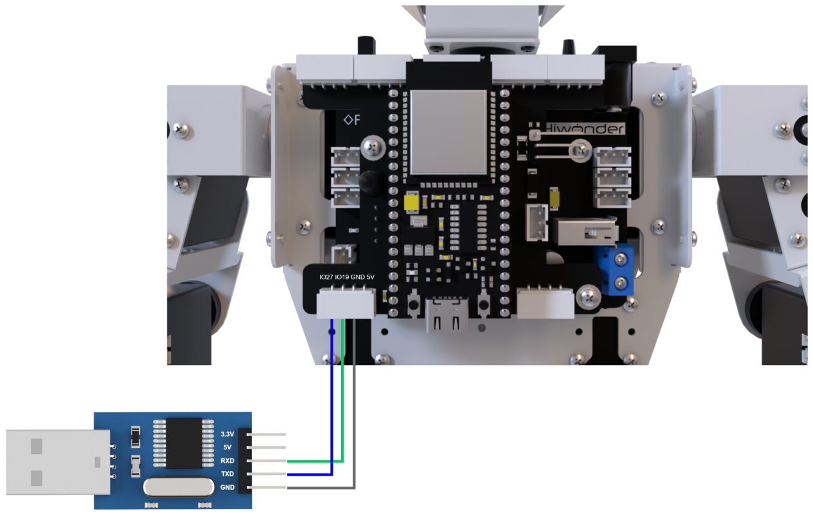

:::{Note}

* The power supplies for the master device and Tonybot can be different, but they must share a common ground to ensure stable communication levels.

* This version is concise and maintains clarity. Let me know if you'd like further adjustments!

:::

* **Data Transmission Format**

The default data transmission format for the UART serial port on Tonybot is as follows:

| Baud Rate  | 9600 |
| :--------: | :--: |
| Data Bits  |  8   |
| Parity Bit | None |
|  Stop Bit  |  1   |

* **Communication Protocol**

The command format sent from the master to Tonybot is as follows: it begins with "CMD," followed by command parameters separated by "\|," and ends with "\$."

### 6.6.2 PC Serial Port Control

This document demonstrates how to sequentially control Tonybot’s action groups, head servo, read battery levels, capture ultrasonic data, and retrieve IMU data through the PC serial port.

* **Program Logic**

:::{Note}

To proceed with this section, make sure the Tonybot slave-side program is downloaded first. You can find the "Tonybot Slave-side Program" in the same directory as this document.

:::

(1) After connecting Tonybot to TTL for serial communication, it can be connected to a PC for UART communication. This enables serial control of Tonybot. The default UART data transmission format is as follows:

| Baud rate  | 9600 |
| :--------: | :--: |
|  Data bit  |  8   |
| Parity bit | None |
|  Stop bit  |  1   |

* **Communication protocol**

Next, we will explain the format of the protocol command packet. The format is as follows: it begins with "CMD," parameters are separated by "\|," and it ends with "\$."

* **Preparation**

**(1) Hardware Preparation**

Connect the TXD, RXD, and GND pins of the USB-to-serial adapter to the IO27, IO19, and GND pins on Tonybot using DuPont wires. Then, plug the USB adapter into the computer. (Note: The 5V connection is optional, but the GND connection is mandatory.)


**(2) Software Preparation**

① First, navigate to the [Serial Port Debugging Tool]() in the same folder as this section's content.


② Once you open the tool, make sure to set the baud rate to 9600, choose NONE for the parity bit, set data bits to 8, and stop bits to 1. Don’t forget to check the “Send as ASCII” option. The configuration should look like the one shown below:

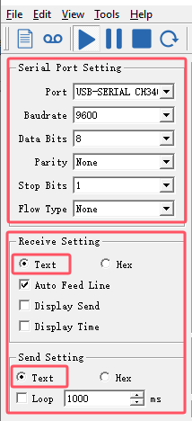

* **Function Implementation**

Control Tonybot by sending protocol commands:

(1) **Command Name:** Action Group Call

**Function Code:** 1

**Command Data:** Action group number, ranging from 0 to 255, corresponding to action groups 0-255.

**Description:** This command is used to instruct Tonybot to execute a specific action group.

**Example:** Sending the command "CMD\|1\|0\|\$" will make Tonybot perform the "Stand at Attention" action group.

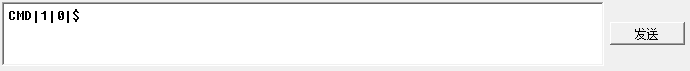

(2) **Command Name:** Head Servo Control

**Function Code:** 2

**Command Data:** Servo angle, ranging from 0 to 180, corresponding to angles from 0° to 180°.

**Description:** This command controls the movement of Tonybot's head servo.  

**Example:** Sending the command "CMD\|2\|90\|\$" will rotate the head servo to a 90° position.


(3) **Command Name:** Battery Voltage

**Function Code:** 3

**Command Data:** This is a read operation, so no command data is needed.

**Description:** This command retrieves Tonybot's battery voltage, in millivolts (mV).  

**Example:** Sending the command "CMD\|3\|\$" will request the battery voltage.


After sending the data, Tonybot will return the requested information in the format:  

"CMD\|Function Code\|data\|\$", where "data" represents the retrieved value.


(4) **Command Name:** Ultrasonic Data

**Function Code:** 4

**Command Data:** This is a read operation, so no command data is required.

**Description:** This command retrieves the distance measured by Tonybot's ultrasonic sensor.  

**Example:** Sending the command "CMD\|4\|\$" will return the distance detected by the ultrasonic sensor, in millimeters (mm).


After sending the data, Tonybot will return the requested information in the format:  

"CMD\|Function Code\|data\|\$", where "data" represents the retrieved distance.


(5) **Command Name:** IMU Data

**Function Code:** 5

**Command Data:** This is a read operation, so no command data is needed.

**Description:** This command retrieves Tonybot's tilt angles along the X and Y axes, measured in degrees.  

**Example:** Sending the command "CMD\|5\|\$" will return the IMU data.


After sending the data, Tonybot will return the requested information in the format:  

"CMD\|Function Code\|x\|y\|\$", where "x" and "y" represent the tilt angles on the X and Y axes.


