# 6. Python Programming Projects

## 6.1 Introduction to Hiwonder Python Editor

In this section, we will learn about the connection methods and specific functions of the Hiwonder Python Editor.

:::{Note}

If the editor fails to open, please change the editor's name to English only, such as 'Hiwonder'.

:::

### 6.1.1 Function Introduction

The editor interface is divided into 5 sections as below:

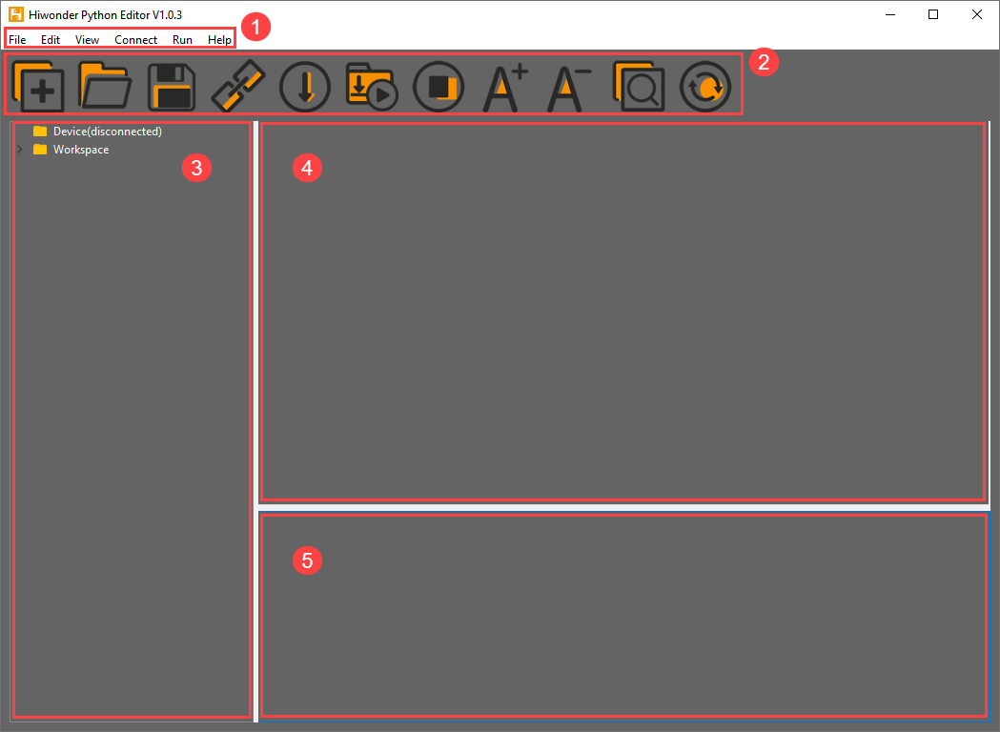

Each area has its corresponding functions, as shown in the table below:

| **No.** |   **Area Name**   |                   **Function Description**                   |
| :-----: | :---------------: | :----------------------------------------------------------: |
|    1    |     Menu Bar      |      Contains File, Edit, View, Connect, Run, and Help       |
|    2    |      Toolbar      | Includes some commonly used shortcut keys that have the same effect as certain keys in the menu bar |
|    3    |     File List     | Divided into multiple project files in the device and locally, allowing you to view the contents of project files (folders, source code, etc.) |
|    4    | Code Editing Area |              Allows you to view and write code               |
|    5    |     Terminal      | Displays message logs and debugging information. When no device is connected, only the message logs can be viewed |

### 6.1.2 Operation Instructions

* **Importing Local Projects**

(1) When importing a local project for the first time, left-click on '**Local Projects**' to open the file selection list. (For subsequent imports, right-click on '**Local Projects**' and select '**Switch Project Path**').


(2) Select [Appendix/Program Collection/Python Project Programs](https://docs.hiwonder.com/projects/Tonybot/en/latest/docs/resources_download.html) and click the '**Select Folder**' button.

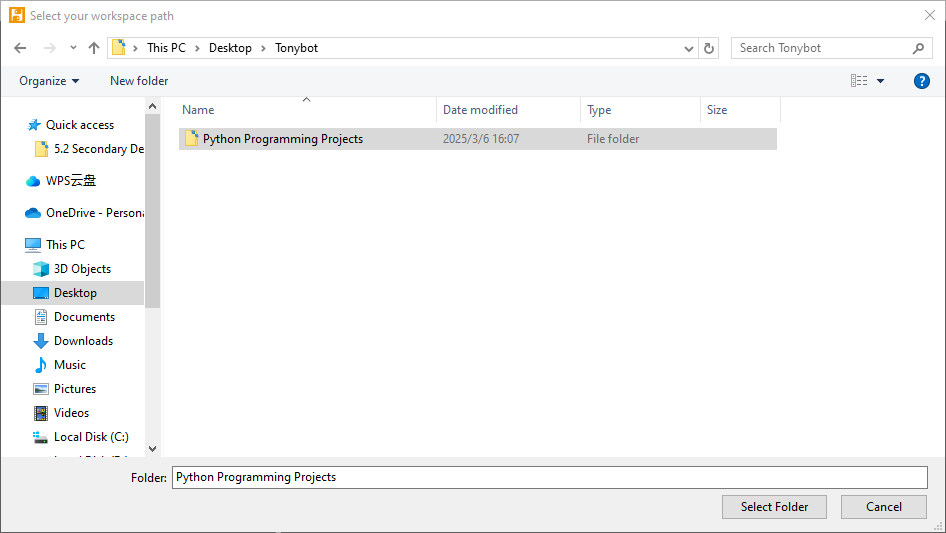

(3) The files in the folder will be automatically added to the local projects, and you will be able to see them under '**Local Projects**'.

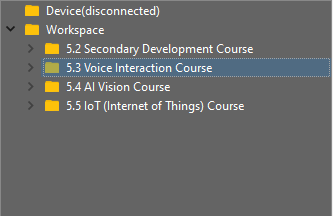

:::{Note}

Importing a local project brings files from your computer into the editor, not downloading them to the ESP32 core board.

:::

* **Viewing Imported Files/Programs**

Here, we can double-click on the program file in the file list to view the detailed code. For example, let's take [Smart_fan.py](../_static/source_code/05/smart_fan.zip):

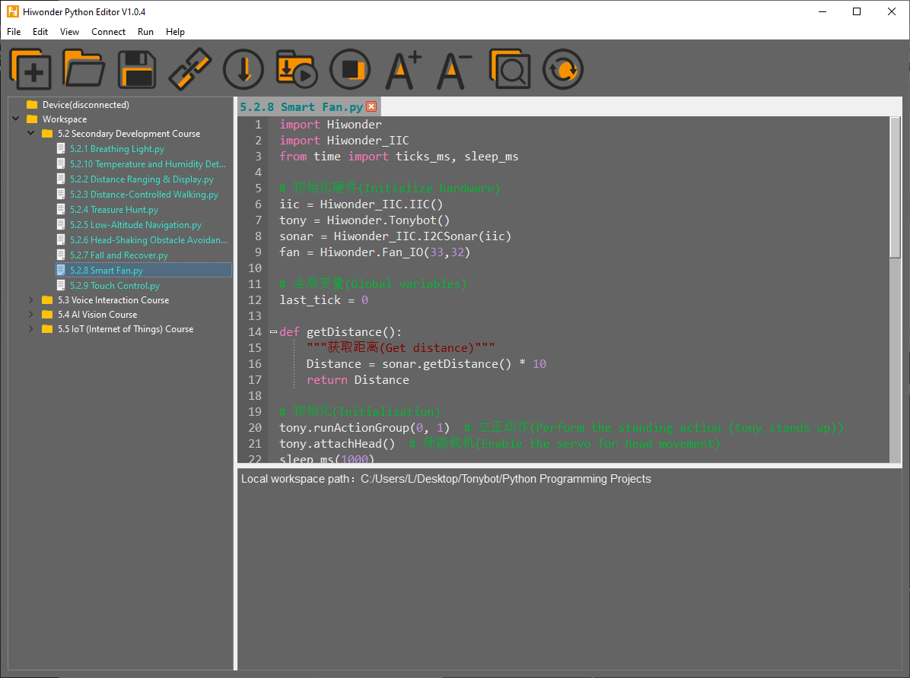

Similarly, after downloading the program file to the ESP32 core board, you can double-click it under the 'Devices' list to view the program file.

* **Code Writing and Storage**

The code editing area on the right side of the interface supports functions such as creating, viewing, editing, modifying, and saving code. Before you start writing code, please read the following notes:

(1) Users cannot directly create files within the **'Devices'** tab, and files in the 'Devices' can only be saved and modified by downloading. If you need to back up, please copy them to the local projects first.

(2) Do not modify action group files with the **'.rob'** extension within the editor to avoid unknown formatting errors. If you need to modify action group files, please do so on the host machine.

(3) Among the provided low-level program files, **'main.py'** is the main program for the device. All functionalities of the robot need to be initiated through this file, meaning that both reset and power-on operations require this program to be executed. If it becomes unresponsive, subsequent operations cannot proceed. Therefore, if the user needs to add functions to this file, it is recommended to rename the program as a precaution. If 'main.py' is renamed, even if a special freeze occurs during debugging (when the shortcuts **'Ctrl+C'** and **'Ctrl+D'** become unresponsive), you only need to reset the control board and delete and re-download the required program.

* **Program Download and Execution**

Downloading a program is an interactive action between the editor and the device. Using '**smart_fan.py**' as an example:

(1) After selecting the '**smart_fan.py**' file in the '**Local Projects**' tab, click  in the toolbar or right-click the file and choose '**Download and Run**'

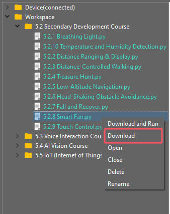

(2) You can view the download progress and completion status in the terminal interface. Since '**Download and Run**' was selected in the previous step, you can also observe the program's running effect.


(3) Once the download is complete, the program will appear in the file list under the '**Devices**' tab.


(4) Finally, delete the original '**main.py**' file of Tonybot and rename the downloaded 'smart_fan.py' to '**main.py**.'


Additionally, here are a few points for users to be aware of:

① Besides this download method, you can also rename the file you want to download to '**main.py**' before proceeding with the download.

② The '**Download and Run**' function first resets the device (restarts) and then downloads and runs the program, which helps enhance the stability of the program execution.

③ If you do not need to execute the program immediately, you can click  or right-click the target file and select '**Download**.' Before executing the program later, we can first click  to reset the device and then run the program.

* **Terminal Usage (Debugging)**

The terminal is a functional area that combines an information window and a debugging interface. However, it is important to note that if no device is connected, the terminal area is only for viewing information and cannot be used for editing or debugging.

Regarding information viewing, you have already experienced this in the previous steps, so I won't elaborate further. Here, I will mainly explain the debugging functions.

(1) The terminal supports code input. When you input the code **\`print(123)\`** in the terminal and press Enter, the output will be as follows:


(2) Additionally, the terminal supports automatic indentation. When you type a Python statement that ends with a colon (such as \`if\`, \`for\`, or \`while\`) and press Enter, the next line will continue at the same indentation level as a regular statement or, when appropriate, at a different indentation level. If you press the Backspace key, it will undo one level of indentation.


(3) To copy and paste code, select the target code and right-click in the terminal interface to perform the operation.

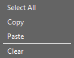

It is important to note that because the terminal has automatic indentation, you must press \`Ctrl+E\` to enter edit mode before pasting code; otherwise, you may encounter indentation errors during debugging. The following image shows the correct method for copying and pasting, with the indentation format appearing correctly.


The following image shows an incorrect indentation format:

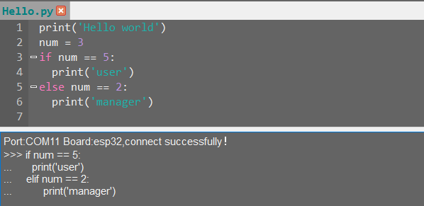

To exit edit mode, you can press **Ctrl+C**. Additionally, if you write an infinite loop, you can also press \`Ctrl+C\` to exit.

**Friendly Reminder**: In the terminal, the **Ctrl+C** shortcut key can only be used to interrupt a running program; it does not have a copy function, and **Ctrl+V** has no paste function.

(4) When entering commands in the terminal, you can use the **Tab** key for code completion. For example, after typing  **os**  in the terminal, pressing the  **Tab**  key will yield the following result:


If there are two or more options available for the current code completion, the terminal will list all options; if there is only one option, the terminal will automatically complete it; if there are none, it will have no effect.

(5) In the terminal, you can use the **"and"** keys on your keyboard to view the command history, saving you input time.

For more commands and command descriptions, you can visit <http://docs.micropython.org/en/latest/library/uos.html>.

## 6.2 Secondary Development Course

### 6.2.1 Breathing Light Project

* **Project Introduction**

In this lesson, we will make the RGB LED on the ultrasonic sensor blink.

* **Program Implementation Process**


* **Introduction to Glowy Ultrasonic Sensor**


This is a glowy ultrasonic distance sensor module that communicates via I2C. It reads the distance measured by the ultrasonic sensor using the I2C protocol.

When measuring distance, the module sends out 8 pulses of 40kHz square waves and checks for any returning signals. If a signal is detected, the module outputs a high-level signal, and the duration of this high signal corresponds to the time taken for the ultrasonic waves to travel to the target and back.

The ultrasonic sensor is pre-installed on the robot when it leaves the factory.

<p id="program_download_2_1"></p>

* **Program Download**

[Breathing Light Program](../_static/source_code/05/Breathing%20Light%20Program.zip)

(1) Launch the **"Hiwonder Python Editor"** software .

(2) Drag the **"breathing_light.py"** file (located in the same folder as this document) into the editor window.

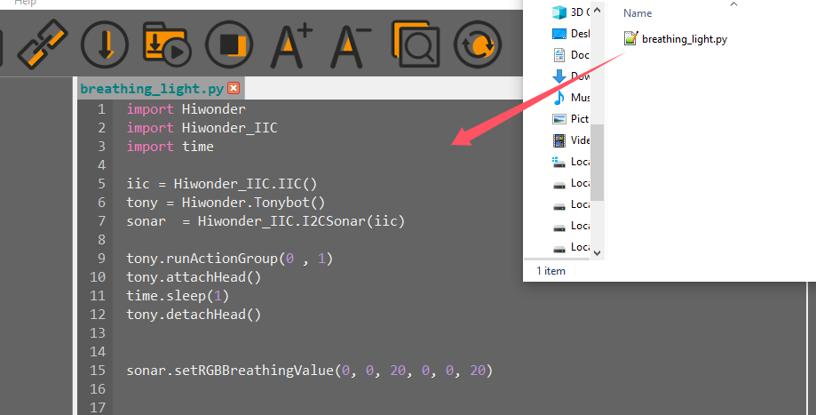

(3) Click the connection button  in the menu bar. Once connected, the icon  will turn green, indicating a successful connection.

(4) After the connection is established, click the download button  in the menu bar to upload the program to Tonybot. Wait for the completion message to appear in the info box below.


* **Achieved Effect**

:::{Note}

For the best experience, try this activity in a dimly lit room. 

:::

You'll see the RGB light on the ultrasonic module glowing blue, with a blink every 2 seconds.


* **Program Analysis**

[Breathing Light Program](../_static/source_code/05/Breathing%20Light%20Program.zip)

(1) Load the necessary libraries: The Hiwonder library handles robot control and low voltage alarms, the time library manages time-related functions, and the Hiwonder_IIC library controls sensors via I2C communication.

{lineno-start=1}

```
import Hiwonder
import Hiwonder_IIC
import time
```

(2) First, initialize the I2C communication object, then set up the Tonybot robot object, and finally, initialize the ultrasonic sensor to communicate over I2C.

{lineno-start=5}

```
iic = Hiwonder_IIC.IIC()
tony = Hiwonder.Tonybot()
sonar  = Hiwonder_IIC.I2CSonar(iic)
```

(3) Run the first action from the action group, then connect the head. After a 1-second pause, disconnect the head.

{lineno-start=9}

```
tony.runActionGroup(0 , 1)
tony.attachHead()
time.sleep(1)
tony.detachHead()
```

(4) Adjust the RGB light color and brightness on the ultrasonic sensor. The parameters control the starting and target values for red, green, and blue, as well as the speed of the breathing effect.

{lineno-start=15}

```
sonar.setRGBBreathingValue(0, 0, 20, 0, 0, 20)
```

* **Function Extension**

You can modify the color of the breathing light by following these steps:

(1) In the main function, locate the section of code responsible for the color. When the distance is less than 250, the color will transition from red to blue. Specifically, the red component is set to 250 - color_diff, the green component is set to color_diff, and the blue component is set to 0.

{lineno-start=15}

```
while True:
  distance = sonar.getDistance() * 10
  distance = distance if distance < 1000 else 1000
  color_diff = distance if distance < 250 else 250
  sonar.setRGB(0 , 250-color_diff , color_diff , 0)
  ledmatrix.showNum(distance)
  time.sleep_ms(200)
```

(2) Adjust the ratio between the red and green components to achieve different colors. For example, if color_diff is 0, the color will be red (250, 0, 0). If color_diff is 250, the color will be green (0, 250, 0). You can change the value of color_diff to create a variety of colors.

(3) After making the changes, refer to the [Program Download](#program_download_2_1) section to run the updated program.

### 6.2.2 Distance Ranging & Display Project

* **Assembly**


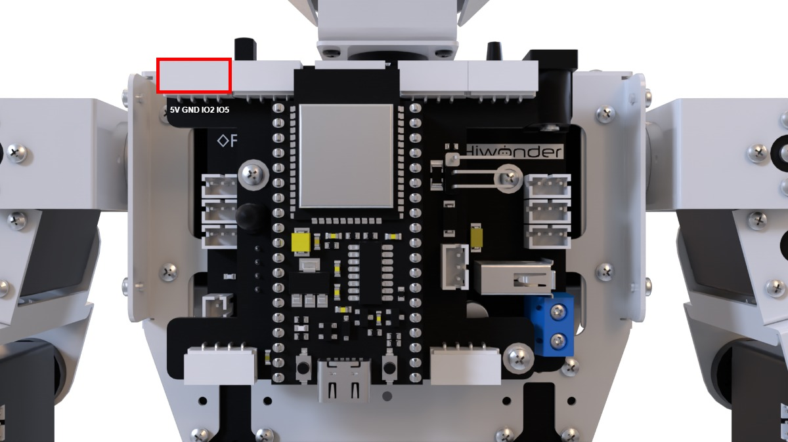

* **Project Introduction**

This section utilizes the ultrasonic module to measure the distance to an obstacle. The measured distance is displayed on the LED dot matrix, and the RGB light color of the ultrasonic module is adjusted accordingly.

* **Program Implementation Process**

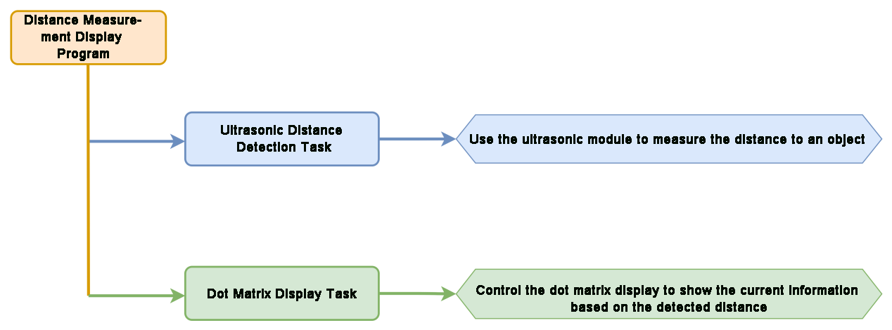

* **Sensor Introduction**

(1) Glowy Ultrasonic Sensor


This is a light-emitting ultrasonic distance sensor module that communicates via I2C. It reads the distance measured by the ultrasonic sensor using the I2C protocol.

When measuring distance, the module sends out 8 pulses of 40kHz square waves and checks for any returning signals. If a signal is detected, the module outputs a high-level signal, and the duration of this high signal corresponds to the time taken for the ultrasonic waves to travel to the target and back.

(2) LED Dot Matrix Display

The LED dot matrix module utilizes an LED display screen that offers high brightness, flicker-free performance, and easy wiring. It is capable of displaying numbers, text, patterns, and other content. The module consists of two red 8x8 LED matrices and is controlled by the TM640B driver chip, which enables efficient control of the dot matrix screen.


For a detailed introduction to the installation and assembly process, please refer to the tutorial video.

<p id="program_download_2_2"></p>

* **Program Download**

[Distance Ranging & Display Program](../_static/source_code/05/Distance%20Ranging%20&%20Display%20Program.zip)

(1) Launch the **"Hiwonder Python Editor"** software .

(2) Drag the **"distance_display.py"** file (located in the same folder as this document) into the editor window.

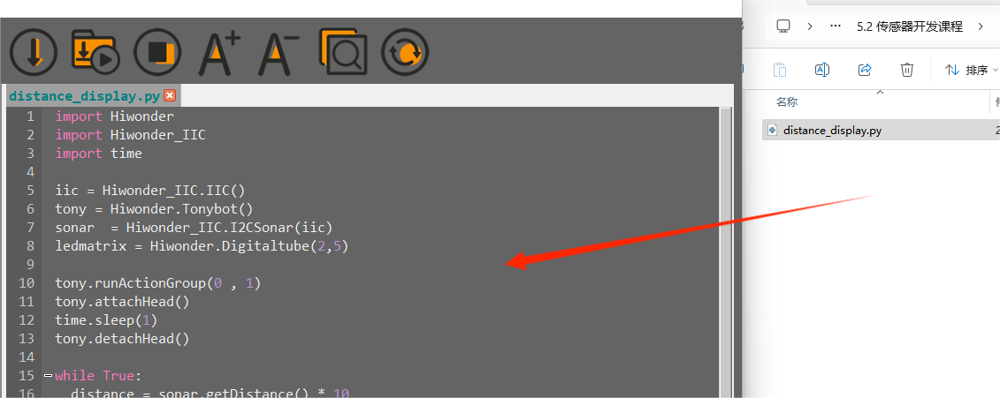

(3) Click the connection button  in the menu bar. Once connected, the icon  will turn green, indicating a successful connection.

(4) After the connection is established, click the download button  in the menu bar to upload the program to Tonybot. Wait for the completion message to appear in the info box below.


* **Achieved Effect**

Slowly bring the object closer to the glowy ultrasonic sensor. As the distance decreases, the ultrasonic light will shift towards red, and as the distance increases, it will become greener. The LED dot matrix display will update in real-time to show the measured distance.
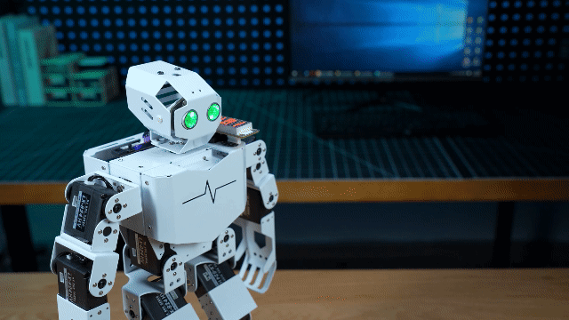

* **Function Extension**

You can customize the color of the breathing light by following these steps:

(1) Find the section of the main function that controls the color. When the distance is less than 250, the color will gradually shift from red to blue. Specifically, the red component is calculated as 250 - color_diff, the green component is color_diff, and the blue component remains 0.

{lineno-start=15}

```
    while True:
        distance = sonar.getDistance() * 10
        distance = distance if distance < 1000 else 1000
        color_diff = distance if distance < 250 else 250
        sonar.setRGB(0 ,250-color_diff , color_diff ,0)
        ledmatrix.showNum(distance)
        time.sleep_ms(200)
```

(2) You can adjust the balance between the red and green components to create different colors. For example, if color_diff is 0, the color will be red (250, 0, 0), and if color_diff is 250, the color will be green (0, 250, 0). Modify color_diff to get the color you prefer.

(3) Once you've made the changes, refer to section "**[Program Download](#program_download_2_2)**" to run the updated program.

* **Program Analysis**

[Distance Ranging & Display Program](../_static/source_code/05/Distance%20Ranging%20&%20Display%20Program.zip)

(1) Load the required libraries:

The **Hiwonder** library contains functions for robot control and low-voltage alarms.

The **time** library is used for time-related functions.

The **Hiwonder_IIC** library is used to control sensors via I2C communication.

{lineno-start=1}

```python
import Hiwonder
import Hiwonder_IIC
import time
```

(2) Initialize the I2C communication object, followed by the initialization of the **Tonybot** robot object. Next, initialize the ultrasonic sensor object for I2C communication. The **ledmatrix** is the dot matrix module object, connected to GPIO pins 2 and 5.

{lineno-start=5}

```
iic = Hiwonder_IIC.IIC()
tony = Hiwonder.Tonybot()
sonar  = Hiwonder_IIC.I2CSonar(iic)
ledmatrix = Hiwonder.Digitaltube(2,5)
```

(3) Execute the first action in the action group. Then, connect the head, and after a one-second pause, disconnect the head.

{lineno-start=10}

```
tony.runActionGroup(0 , 1)
tony.attachHead()
time.sleep(1)
tony.detachHead()
```

(4) Use the **sonar.getDistance()** function to retrieve the distance measured by the ultrasonic sensor, and multiply it by 10 to convert the value to millimeters. If the distance exceeds 1000 mm, set it to 1000 mm. Calculate the **color_diff** value based on the distance. If the distance is greater than 250 mm, limit **color_diff** to 250 mm. Use the **sonar.setRGB(0, 250 - color_diff, color_diff, 0)** function to set the head LED color, transitioning from green (for closer distances) to red (for farther distances). Use **ledmatrix.showNum(distance)** to display the measured distance on the dot matrix module. Finally, call **time.sleep_ms(200)** to pause the program for 200 milliseconds.

{lineno-start=15}

```
while True:
  distance = sonar.getDistance() * 10
  distance = distance if distance < 1000 else 1000
  color_diff = distance if distance < 250 else 250
  sonar.setRGB(0 , 250-color_diff , color_diff , 0)
  ledmatrix.showNum(distance)
  time.sleep_ms(200)
```

### 6.2.3 Distance-Controlled Walking Project

* **Project Introduction**

In this lesson, the ultrasonic sensor is used to measure obstacles in front of the robot. When the detected distance falls within the predefined range set by the program, the robot will move forward or backward accordingly.

* **Program Implementation Process**


* **Sensor Introduction**


This is a light-emitting ultrasonic distance sensor module that communicates via I2C. It reads the distance measured by the ultrasonic sensor using the I2C protocol.

When measuring distance, the module sends out 8 pulses of 40kHz square waves and checks for any returning signals. If a signal is detected, the module outputs a high-level signal, and the duration of this high signal corresponds to the time taken for the ultrasonic waves to travel to the target and back.

<p id="program_download_2_3"></p>

* **Program Download**

[Distance-Controlled Walking Program](../_static/source_code/05/Distance-Controlled%20Walking%20Program.zip)

(1) Launch the **"Hiwonder Python Editor"** software 

(2) Drag the **"ultrasonic_follow.py"** file (located in the same folder as this document) into the editor window.

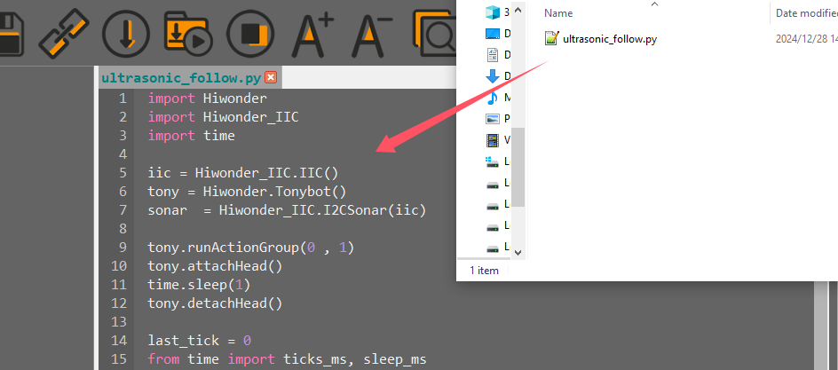

(3) Click the connection button  in the menu bar. Once connected, the icon  will turn green, indicating a successful connection.

(4) After the connection is established, click the download button  in the menu bar to upload the program to Tonybot. Wait for the completion message to appear in the info box below.


* **Achieved Effect**

:::{Note}

Please avoid using the ultrasonic sensor to continuously detect objects that are too close.  

:::

Place a cardboard box in front of the sensor. If the distance is between 28-40 cm, the robot will move forward. If the distance is between 3-18 cm, the robot will move backward.


* **Program Analysis**

[Distance-Controlled Walking Program](../_static/source_code/05/Distance-Controlled%20Walking%20Program.zip)

(1) Load the necessary libraries:

The **Hiwonder** library includes functions for controlling the robot and managing low-voltage alarms.

The **time** library is used for time-related functions.

The **Hiwonder_IIC** library controls sensors via I2C communication.

{lineno-start=1}

```
import Hiwonder
import Hiwonder_IIC
import time
```

(2) Create the following objects:

**iic**: The I2C communication object.

**tony**: The **Tonybot** object.

**sonar**: The ultrasonic sensor object.

{lineno-start=5}

```
iic = Hiwonder_IIC.IIC()
tony = Hiwonder.Tonybot()
sonar  = Hiwonder_IIC.I2CSonar(iic)
```

(3) Define the following variables:

**Distance**: Stores the distance measured by the ultrasonic sensor.

**have_move**: A flag indicating whether the robot has moved.

**step**: The current step of the state machine.

**last_tick**: Holds the timestamp of the last executed action.

{lineno-start=17}

```
# Global variables
Distance = 0
have_move = False
step = 0
last_tick = 
```

(4) The **ticks_ms()** function retrieves the current time. If the current time is less than or equal to **last_tick**, the function returns immediately. If the time has passed, the program proceeds to call **sonar.getDistance()** to obtain the distance value. When the **step** variable is set to 0, the program should decide the next action based on the **Distance** value. For instance, the program might turn on the red light and trigger action 18, depending on the distance.

{lineno-start=23}

```
def Distancewalking():
    """Distance-Controlled Walking Task"""
    global step, last_tick, have_move
    
    if ticks_ms() <= last_tick:
        return
    Distance = sonar.getDistance() * 10
    if step == 0:
        # 若距离过近 (If the distance is too close)
        if 30 < Distance < 180:
            # 亮红灯，执行过渡动作 (Turn on the red light, execute transition action)
            sonar.setRGB(0, 250, 0, 0)
            tony.runActionGroup(18, 1)
            last_tick = ticks_ms() + 350
            have_move = True
            step = 1
```

* **Function Extension**

(1) You can modify the ultrasonic distance range in the program by editing the code in the designated section, as shown in the image below.

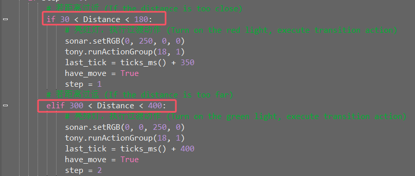

(2) The program checks if the distance is between 30 mm and 180 mm, in which case the robot will move backward. If the distance is between 300 mm and 400 mm, the robot will move forward. To adjust the ultrasonic distance range, simply update the comparison values in the code, for example:

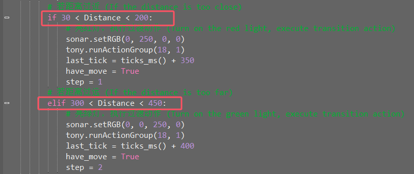

(3) After making the modifications, refer to section "[**Program Download**](#program_download_2_3)" to run the updated program.

### 6.2.4 Treasure Hunt Project

* **Project Introduction**

In this lesson, the robot's servo controlling the ultrasonic sensor will rotate back and forth. When the set conditions are met, the robot will turn in the corresponding direction.

* **Program Implementation Process**


* **Sensor Introduction**

(1) Ultrasonic Sensor


This is a light-emitting ultrasonic distance sensor module that communicates via I2C. It reads the distance measured by the ultrasonic sensor using the I2C protocol.

When measuring distance, the module sends out 8 pulses of 40kHz square waves and checks for any returning signals. If a signal is detected, the module outputs a high-level signal, and the duration of this high signal corresponds to the time taken for the ultrasonic waves to travel to the target and back.

(2) LED Dot Matrix Display

The LED dot matrix display is a high-brightness display unit that offers flicker-free visuals and easy wiring. It is capable of displaying numbers, text, images, and more. The module is made up of two 8x8 red LED panels and is controlled by the TM640B driver chip, which manages the dot matrix screen's operation.


For installation and wiring details, please refer to the section 1.

<p id="program_download_2_4"></p>

* **Program Download**

[Treasure Hunt Program](../_static/source_code/05/Treasure%20Hunt%20Program.zip)

(1) Launch the **"Hiwonder Python Editor"** software .

(2) Drag the **"find_target.py"** file (located in the same folder as this document) into the editor window.

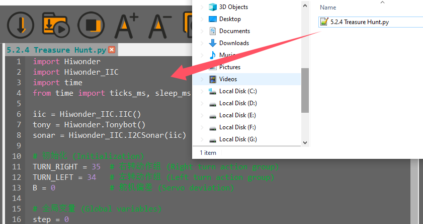

(3) Click the connection button  in the menu bar. Once connected, the icon  will turn green, indicating a successful connection.

(4) After the connection is established, click the download button  in the menu bar to upload the program to Tonybot. Wait for the completion message to appear in the info box below.


* **Achieved Effect**

The servo below the ultrasonic sensor will rotate back and forth while measuring the distance between the robot and nearby obstacles. The robot compares the distances on both sides.  

If the distance on one side is shorter, the robot will turn in that direction. For example, if the left side is closer, the robot will turn left; if the right side is closer, it will turn right.


* **Program Analysis**

[Treasure Hunt Program](../_static/source_code/05/Treasure%20Hunt%20Program.zip)

(1) Library Imports and Variable Initialization:

① First, load the necessary libraries:

* The Hiwonder library, which provides functions for robot control, low-voltage alarms, and other system operations.

* The time library, which is used for time-related functions.

* The Hiwonder_IIC library, which enables control of sensors via I2C communication.

{lineno-start=1}

```
import Hiwonder
import Hiwonder_IIC
import time
from time import ticks_ms, sleep_ms
```

② Next, initialize the I2C communication object, followed by the Tonybot robot object. Finally, initialize the ultrasonic sensor object to communicate using the I2C protocol.

{lineno-start=6}

```
iic = Hiwonder_IIC.IIC()
tony = Hiwonder.Tonybot()
sonar = Hiwonder_IIC.I2CSonar(iic)
```

③ The action group IDs for left and right turns are defined here. Using macro definitions for these actions enhances code readability and clarity.

④ The servo offset for the pan-tilt is also specified. Users can measure the deviation between the expected and actual servo angles, and declare the offset here. This ensures that subsequent control algorithms can compensate for the discrepancy, improving accuracy during operation.

{lineno-start=10}

```
# 初始化 (Initialization)
TURN_RIGHT = 35  # 右转动作组 (Right turn action group)
TURN_LEFT = 34   # 左转动作组 (Left turn action group)
B = 0            # 舵机偏差 (Servo deviation)
```

(2) Loop

Within the loop function, the ESP32 continuously calls the find_ function to measure distances, calculate the optimal direction, and adjust the robot's orientation accordingly.

{lineno-start=102}

```
while True:
    find_()
    sleep_ms(100)
```

(3) Optimal Navigation Decision Function — find_

① Upon entering the find_ function, the robot first calls the getDistance function to measure the distance from the front (with the servo rotated to 90°) to the target box.

**First execution (step = 0):**

* The program executes the logic under case 0, using the measured distance to control the color of the ultrasonic RGB module.

* If the front-facing distance to the box is within a moderate range (30–350), the program proceeds to evaluate case 1 logic but retains step = 0. If the distance is too large, step is set to 1, and the next iteration will enter case 1 to search for the nearest direction to the box.

{lineno-start=34}

```
    if step == 0:
        if 30 < distance <= 350:
            tony.detachHead()
            sleep_ms(100)
            sonar.setRGB(0, 50, 50, 50)  # 白色(White)
            step = 0
        else:
            tony.attachHead()
            sonar.setRGB(0, 0, 50, 0)    # 绿色(Green)
            step = 1

```

**Second execution (case 1):**

* The servo rotates to scan four angles: 45° (front-left), 0° (left), 145° (front-right), and 180° (right), measuring the distance to the box at each angle.

* Step is then updated to 2, and the next iteration will enter case 2 for direction analysis and decision-making.

{lineno-start=45}

```
    elif step == 1:
        tony.moveHeadAngle(45 + B)    # 转到右边 (Turn to the right)
        sleep_ms(600)
        distanceR = sonar.getDistance() * 10     # 测量右边距离 (Measure the right distance)
        
        tony.moveHeadAngle(0 + B)     # 转到右上 (Turn to the right upper)
        sleep_ms(600)
        distanceRC = sonar.getDistance() * 10    # 测量右上距离 (Measure the right upper distance)
        
        tony.moveHeadAngle(145 + B)   # 转到左边 (Turn to the left)
        sleep_ms(800)
        distanceL = sonar.getDistance() * 10     # 测量左边距离 (Measure the left distance)
        
        tony.moveHeadAngle(180 + B)   # 转到左上 (Turn to the left upper)
        sleep_ms(600)
        distanceLC = sonar.getDistance() * 10    # 测量左上距离 (Measure the left upper distance)
        
        tony.moveHeadAngle(90 + B)    # 转回中间 (Turn back to the center)
        sleep_ms(600)
        step = 2

```

**Third execution (case 2):**

* The program first standardizes the distance values. If the box is not detected within the valid range (sensor returns 0), the corresponding direction is treated as out of range, and the distance is set to a default high value of 9999.

* It then performs logic evaluation across all directions to identify the one with the shortest valid distance. If the closest direction is on the left, the ultrasonic RGB module lights up blue; if on the right, it lights up red. The robot then turns left or right accordingly to align with the selected direction.

:::{Note}

If the front-facing distance is still shorter than other directions, even if it exceeds the "**moderate**" range, the robot will not perform a turn. In this case, the ultrasonic RGB module remains green as in case 0. 

:::

② After three cycles of executing the find_ function, the robot completes a full decision-making process for optimal navigation.

* **Function Extension**

(1) Adjusting the Detection Range

① To modify the detection range, update the code within the designated section of the program, as shown in the example below.

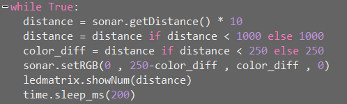

② The system identifies a "**treasure box**" when the detected distance between the object and the robot is greater than 30 mm but less than 350 mm. To change the detection range, simply adjust the conditions in the distance judgment. For example:

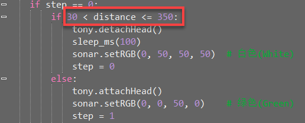

(2) Modifying the Turning Conditions

① To modify the turning conditions, edit the appropriate code section within the program, as illustrated in the example below.

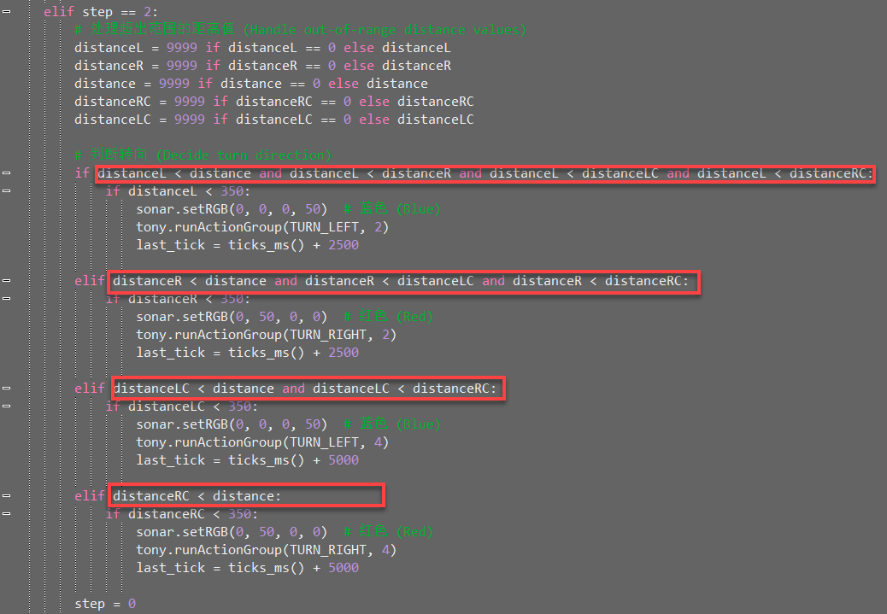

② The program evaluates five directional measurements, identifies the closest direction, and checks if the distance falls within the specified detection range. If it does, the robot executes a turn in that direction.

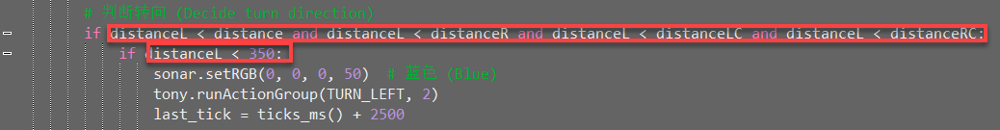

③ To adjust the distance thresholds for turning, modify the distance condition for each direction. For instance, if the left direction is the closest and its distance is less than 400 mm, the robot will turn left, as shown in the example below:

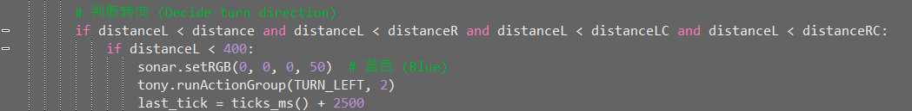

### 6.2.5 Low-Altitude Navigation Project

* **Project Introduction**

When the ultrasonic sensor detects an obstacle ahead, the robot will move forward a short distance in a crouching posture. Afterward, it will return to an upright position and continue moving forward in its normal stance.

* **Program Implementation Process**


* **Sensor Introduction**

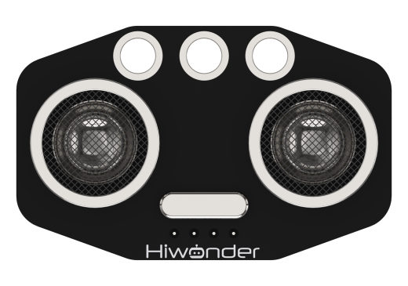

This is a light-emitting ultrasonic distance sensor module that communicates via I2C. It reads the distance measured by the ultrasonic sensor using the I2C protocol.

When measuring distance, the module sends out 8 pulses of 40kHz square waves and checks for any returning signals. If a signal is detected, the module outputs a high-level signal, and the duration of this high signal corresponds to the time taken for the ultrasonic waves to travel to the target and back.

<p id="program_download_2_5"></p>

* **Program Download**

[Low Posture Crossing Program](../_static/source_code/05/Low%20Posture%20Crossing%20Program.zip)

(1) Launch the **"Hiwonder Python Editor"** software .

(2) Drag the **"low_posture_crossing.py"** file (located in the same folder as this document) into the editor window.

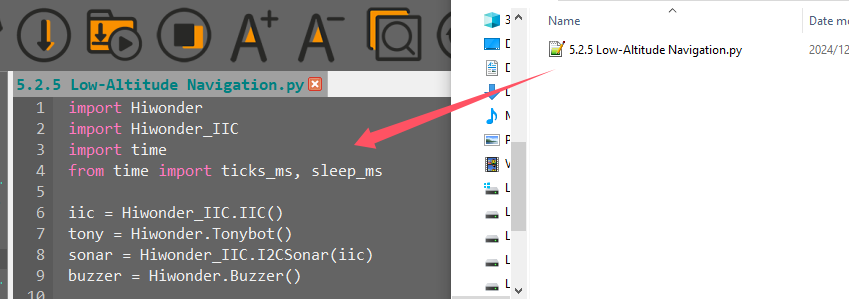

(3) Click the connection button  in the menu bar. Once connected, the icon  will turn green, indicating a successful connection.

(4) After the connection is established, click the download button  in the menu bar to upload the program to Tonybot. Wait for the completion message to appear in the info box below.


* **Achieved Effect**

:::{Note}

Avoid using the ultrasonic sensor to continuously detect very close objects.

:::

You can create a **"small tunnel"** using several cardboard boxes. As the robot moves forward, if the ultrasonic sensor detects an obstacle ahead, it will trigger a beeping sound as a warning. At the same time, the RGB light on the ultrasonic sensor will change from green to red.

The robot will then adopt a crouching position and move forward for a short distance. After passing through the obstacle, it will return to a standing position and continue moving forward as usual.


* **Program Analysis**

(1) Load Libraries:

The Hiwonder library includes functions for robot control, low-voltage alarms, and more.

The time library is used for time-related functions. Import the ticks_ms and sleep_ms functions from it.

The Hiwonder_IIC library is used to control sensors via the I2C interface.

{lineno-start=1}

```
import Hiwonder
import Hiwonder_IIC
import time
from time import ticks_ms, sleep_ms
```

(2) Initialize Objects:

**IIC**: Initialize the I2C interface object.

**tony**: Initialize the Tonybot robot object.

**sonar**: Initialize the ultrasonic sensor object, which uses the I2C interface.

**buzzer**: Initialize the buzzer object.

{lineno-start=6}

```
iic = Hiwonder_IIC.IIC()
tony = Hiwonder.Tonybot()
sonar = Hiwonder_IIC.I2CSonar(iic)
buzzer = Hiwonder.Buzzer()
```

(3) Action Group IDs:

H_STAND: Normal standing position, action group ID = 0.

L_STAND: Crouching position, action group ID = 30.

H_GO_FORWARD: Normal forward movement, action group ID = 21.

L_GO_FORWARD: Forward movement in a crouching position, action group ID = 31.

MIN_DISTANCE: Minimum safe distance = 150 mm.

{lineno-start=11}

```
# 动作组定义(Action group definitions)
H_STAND = 0
L_STAND = 30
H_GO_FORWARD = 21
L_GO_FORWARD = 31

# 常量定义 (Constant definitions)
MIN_DISTANCE = 150  # 150mm
```

(4) Execute Initial Action:

Run the first action in the action group, then connect the robot's head.

After a 1-second pause, disconnect the head.

{lineno-start=20}

```
# 初始化机器人 (Initialize robot)
tony.runActionGroup(0, 1)
tony.attachHead()
time.sleep(1)
tony.detachHead()
```

(5) Global Variables:

step: Tracks the current step in the process, initially set to 0.

last_tick: Stores the last timestamp, initially set to 0.

{lineno-start=26}

```
# 全局变量 (Global variables)
step = 0
last_tick = 0
```

(6) Upon entering the function, the robot follows different motion logic based on the current

**First Execution (step = 0):**

①　Execute the code under case 0. If the measured distance is greater than the threshold (i.e., no obstacle ahead and distance = 0), the robot will perform a predefined action group and light up a green LED. On the next call to this function, the logic for the second step will be executed.

②　If the measured distance is less than the threshold, the next function call will still follow the logic for the first execution.

{lineno-start=39}

```

    if step == 0:
        if Distance > MIN_DISTANCE or Distance == 0:
            sonar.setRGB(0, 0, 50, 0)  # 绿色 (Green light)
            tony.runActionGroup(18, 1)
            sleep_ms(400)
            step = 1

```

**Second Execution (step = 1):**

①　Execute the code under case 1. If a new measurement taken since the last function call indicates the distance is now below the threshold, the robot will execute two action groups, light up a red LED, and activate the buzzer as an alert. It will then switch to a low-stance standing posture. On the next function call, it will proceed to the third step of the logic.

②　If the new distance remains above the threshold, the robot continues with a high-stance walking motion. The next function call will still follow the logic of the second execution.

{lineno-start=46}

```

    elif step == 1:
        if 0 < Distance < MIN_DISTANCE:
            tony.runActionGroup(18, 1)
            sleep_ms(2000)
            tony.runActionGroup(19, 1)
            sleep_ms(2000)
            sonar.setRGB(0, 50, 0, 0)  # 红色 (Red light)
            buzzer.playTone(1500, 100 , False)  # 蜂鸣器响 (Play tone on the buzzer)
            tony.runActionGroup(L_STAND, 1)  # 运行下蹲 (Run squat action)
            sleep_ms(1300)
            step = 2
        else:
            tony.runActionGroup(H_GO_FORWARD, 1)  # 正常前进 (Move forward normally)
            sleep_ms(1150)

```
**Third Execution (step = 2):**

①　Execute the code under case 2. If the latest measurement still shows the distance below the threshold, the robot will perform two action groups, light up a blue LED, and transition from a low-stance standing position into low-stance forward movement.

②　If the new distance is greater than the threshold, the robot maintains its low-stance standing posture. The next function call will still follow the logic of the third execution.

{lineno-start=61}

```

    elif step == 2:
        if Distance > MIN_DISTANCE or Distance == 0:
            sleep_ms(500)
            sonar.setRGB(0, 0, 0, 50)  # 蓝色 (Blue light)
            tony.runActionGroup(L_GO_FORWARD, 14)  # 以下蹲姿态前进 (Move forward in squat position)
            sleep_ms(28500)
            step = 3

```
**Fourth Execution (step = 3):**

①　The robot first switches back to a low-stance standing posture, ending its previous low-stance movement, then transitions into a stationary high-stance posture.

②　On the next function call, the logic loop returns to the first step (step = 0).

{lineno-start=69}

```

    elif step == 3:
        tony.runActionGroup(L_STAND, 1)  # 运行下蹲 (Run squat action)
        sleep_ms(2000)
        sleep_ms(200)
        tony.runActionGroup(H_STAND, 1)  # 正常立正 (Run standing action)
        sleep_ms(2000)
        sleep_ms(200)
        step = 0

```

* **Function Extension**

You can modify the color of the breathing light. Follow these steps:

(1)  **Find the section** in the main function code that controls the color. When the distance is less than 250, the color will gradually transition from red to blue. Specifically:

The red component is calculated as 250 - color_diff.

The green component is set to color_diff.

The blue component remains at 0.


(2) **Adjust the ratio between the red and green components** to achieve different colors. For instance:

If color_diff is 0, the color will be red (250, 0, 0).

If color_diff is 250, the color will be green (0, 250, 0). 

You can modify color_diff to create a range of colors.

(3) **Once you've made the changes,** refer to "**[Program Download](#program_download_2_5)**" to run the updated program.

###  6.2.6 Head-Shaking Obstacle Avoidance Project

* **Project Introduction**

When the ultrasonic sensor detects an obstacle ahead, the robot will move to avoid the obstacle, implementing intelligent obstacle avoidance.

* **Program Implementation Process**


* **Sensor Introduction**


This is a light-emitting ultrasonic distance sensor module that communicates via I2C. It reads the distance measured by the ultrasonic sensor using the I2C protocol.

When measuring distance, the module sends out 8 pulses of 40kHz square waves and checks for any returning signals. If a signal is detected, the module outputs a high-level signal, and the duration of this high signal corresponds to the time taken for the ultrasonic waves to travel to the target and back.

<p id="program_download_2_6"></p>

* **Program Download**

[Head-Shaking Obstacle Avoidance Program](../_static/source_code/05/Head-Shaking%20Obstacle%20Avoidance%20Program.zip)

(1) Launch the "**Hiwonder Python Editor**" software .

(2) Drag the "**ultrasonic_obstacle_avoidance.py**" file (located in the same folder as this document) into the editor window.

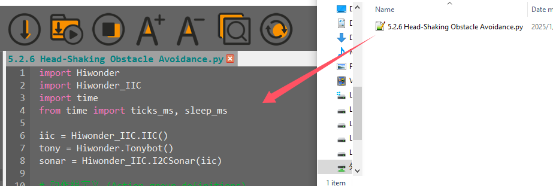

(3) Click the connection button  in the menu bar. Once connected, the icon  will turn green, indicating a successful connection.

(4) After the connection is established, click the download button  in the menu bar to upload the program to Tonybot. Wait for the completion message to appear in the info box below.


* **Achieved Effect**

:::{Note}
Avoid using the ultrasonic sensor to continuously detect objects that are very close.  
:::

When an obstacle is detected in front of the robot, it will stop and perform a head-shaking motion to check for obstacles on the left and right sides. Based on the results of this check, the robot will turn towards the direction with no obstacles and continue moving forward.


* **Program Analysis**

[Head-Shaking Obstacle Avoidance Program](../_static/source_code/05/Head-Shaking%20Obstacle%20Avoidance%20Program.zip)

(1) Load Required Libraries:

**Hiwonder library:** Contains functions for robot control, low voltage alerts, etc.

**time library:** Provides time-related functions.

**Hiwonder_IIC library:** Used to control the sensor via IIC communication.

{lineno-start=1}

```
import Hiwonder
import Hiwonder_IIC
import time
from time import ticks_ms, sleep_ms
```

(1) Initialize Objects

Initialize the IIC interface object (iic).

Initialize the Tonybot robot object (tony).

Initialize the ultrasonic sensor object (sonar), which depends on the IIC interface.

{lineno-start=6}

```
iic = Hiwonder_IIC.IIC()
tony = Hiwonder.Tonybot()
sonar = Hiwonder_IIC.I2CSonar(iic)
```

(2) Define Action Groups:

Action group for moving forward, backward, left turn, and right turn with predefined action group numbers.

{lineno-start=10}

```
# 动作组定义 (Action group definitions)
GO_FORWARD = 21  # 前进动作组 (Forward action group)
GO_BACK = 22    # 后退动作组 (Backward action group)
TURN_LEFT = 23  # 左转动作组 (Left turn action group)
TURN_RIGHT = 24 # 右转动作组 (Right turn action group)
```

(3) Set Parameters:

MIN_DISTANCE_TURN: Set to 200 mm. When the detected distance is less than 200 mm, the robot will perform an obstacle avoidance operation.

BIAS: Set to 0, meaning there is no servo bias or deviation.

Initialize the robot, run action group 0, attach the head, wait for 1 second, then detach the head. (This can be adjusted to change the robot's startup position by modifying the action group numbers.)

{lineno-start=16}

```
# 常量定义 (Constant definitions)
MIN_DISTANCE_TURN = 200  # 避障距离 (Obstacle avoidance distance)
BIAS = 0                 # 舵机偏差 (Servo bias)

# 初始化机器人 (Initialize robot)
tony.runActionGroup(0, 1)
tony.attachHead()
time.sleep(1)
tony.detachHead()
```

(4) Define Global Variables:

Track the current step, the last timestamp, distances in the front, left, and right directions, movement status, and whether the last action was a backward movement.

{lineno-start=26}

```
# 全局变量 (Global variables)
step = 0
last_tick = 0
Distance = 0     # 中间位置距离 (Distance at the center position)
LDistance = 0    # 左侧距离 (Distance on the left side)
RDistance = 0    # 右侧距离 (Distance on the right side)
have_move = False
lastActionIsGoBack = False  # 添加新变量 (New variable to track if last action was to go back)
```

(5) getAllDistance() Function:

This function measures the distances in the front, left, and right directions. Here's the process:

Set the ultrasonic sensor to blue-green light.

Front Distance: Adjust the head to the middle (90° + BIAS), wait for 200 ms, then read the distance and convert it to mm by multiplying by 10.

Left Distance: Adjust the head to 40° (145° + BIAS) and 80° (180° + BIAS), wait 400 ms between each adjustment, then read the distance and multiply by 10. Take the smaller value as the final left distance.

Right Distance: Adjust the head to 40° (45° + BIAS) and 80° (0° + BIAS), wait 600 ms and 400 ms for each, read the distance, and multiply by 10. Take the smaller value as the final right distance.

Reset the Head: Return the head to the middle (90° + BIAS), and wait 400 ms.

{lineno-start=35}

```
def getAllDistance():
    """获取三个方向的距离(Get distances from three directions)"""
    global Distance, LDistance, RDistance
    
    sonar.setRGB(0, 0, 50, 50)  # 蓝绿混合 (Blue-green mixed color)
    tony.moveHeadAngle(90 + BIAS)  # 中间位置 (Move to center position)
    sleep_ms(200)
    Distance = sonar.getDistance() * 10
    
    tony.moveHeadAngle(145 + BIAS)  # 左侧40度 (Left side 40 degrees)
    sleep_ms(400)
    temp_distance = sonar.getDistance() * 10
    
    tony.moveHeadAngle(180 + BIAS)  # 左侧80度 (Left side 80 degrees)
    sleep_ms(400)
    LDistance = sonar.getDistance() * 10
    
    if temp_distance < LDistance:  # 取较小值 (Take the smaller value)
        LDistance = temp_distance
    
    tony.moveHeadAngle(45 + BIAS)  # 右侧40度 (Right side 40 degrees)
    sleep_ms(600)
    temp_distance = sonar.getDistance() * 10
    
    tony.moveHeadAngle(0 + BIAS)   # 右侧80度 (Right side 80 degrees)
    sleep_ms(400)
    RDistance = sonar.getDistance() * 10
    
    if temp_distance < RDistance:   # 取较小值 (Take the smaller value)
        RDistance = temp_distance
    
    tony.moveHeadAngle(90 + BIAS)  # 回到中间 (Move back to center)
    sleep_ms(400)
```

(6) This function handles obstacle avoidance movements. The steps are as follows:

Check if the current time is less than the last recorded timestamp. If so, exit the function.

If the current step is 0, check the front distance.

If the distance is greater than or equal to MIN_DISTANCE_TURN or is 0, change the RGB light to green, run action group 18, wait 400 ms, and then continue moving forward. Update the last_tick timestamp after the operation.

{lineno-start=69}

```
def obstacleAvoidance():
    """避障行走任务(Obstacle avoidance walking task)"""
    global step, last_tick, Distance, have_move, lastActionIsGoBack
    
    if ticks_ms() <= last_tick:
        return
        
    if step == 0:
        Distance = sonar.getDistance() * 10
        if Distance >= MIN_DISTANCE_TURN or Distance == 0:
            sonar.setRGB(0, 0, 50, 0)  # 绿色 (Green light)
            tony.runActionGroup(18, 1)
            sleep_ms(400)
            tony.runActionGroup(GO_FORWARD, 0)  # 持续前进 (Keep moving forward)
            last_tick = ticks_ms() + 1300
            have_move = True
            lastActionIsGoBack = False  # 记录不是后退动作 (Record that the last action was not to go back)
```

* **Function Extension**

(1) To modify the obstacle avoidance actions, update the corresponding section of the code as shown in the image below.

{lineno-start=11}

```
GO_FORWARD = 21  # 前进动作组 (Forward action group)
GO_BACK = 22    # 后退动作组 (Backward action group)
TURN_LEFT = 23  # 左转动作组 (Left turn action group)
TURN_RIGHT = 24 # 右转动作组 (Right turn action group)
```

(2) We have defined action group numbers using macros. These action group numbers represent the actions downloaded to the robot through the control software. To modify the obstacle avoidance behavior, simply adjust the relevant macro definitions, as shown in the image below.

{lineno-start=11}

```
GO_FORWARD = 25  # 前进动作组 (Forward action group)
GO_BACK = 22    # 后退动作组 (Backward action group)
TURN_LEFT = 23  # 左转动作组 (Left turn action group)
TURN_RIGHT = 24 # 右转动作组 (Right turn action group)
```

(3) After making the changes, refer to section "**[Program Download](#program_download_2_6)**" to run the updated program.

### 6.2.7 Fall and Recover Project

* **Project Introduction**

This section utilizes an accelerometer to monitor the current state. Upon detecting a fall, the robot will initiate the action to stand up.

* **Program Implementation Process**


* **Sensor Introduction**

This section makes use of the onboard QMI8658 motion sensor, which has a wide range of applications, including handheld gaming devices, 3D controllers, and portable navigation systems.


It integrates a 3-axis MEMS gyroscope, a 3-axis MEMS accelerometer, and an expandable Digital Motion Processor (DMP).

<p id="program_download_2_7"></p>

* **Program Download**

[Fall and Recover Program](../_static/source_code/05/Fall%20and%20Recover%20Program.zip)

(1) Launch the **"Hiwonder Python Editor"** software .

(2) Drag the **"rise_after_fall.py"** file (located in the same folder as this document) into the editor window.

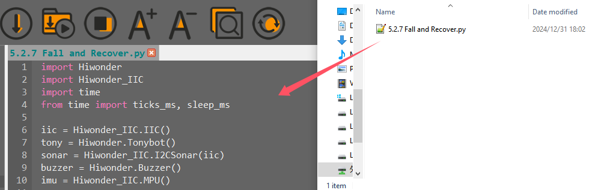

(3) Click the connection button  in the menu bar. Once connected, the icon  will turn green, indicating a successful connection.

(4) After the connection is established, click the download button  in the menu bar to upload the program to Tonybot. Wait for the completion message to appear in the info box below.


* **Achieved Effect**

:::{Note}

In the "**Fall and Stand Up**" mode, when the robot is powered on or restarted, the IMU will initialize. Wait for a "**beep**" sound, which indicates that the initialization is complete.

:::

After turning on the robot, place it flat on either its front or back. After a brief moment, the robot will automatically perform the standing-up action. (Please note that the standing-up action differs depending on whether the robot is placed face-up or face-down.)


* **Program Analysis**

[Fall and Recover Program](../_static/source_code/05/Fall%20and%20Recover%20Program.zip)

(1) Import Libraries:

The program begins by importing the Hiwonder library and its relevant modules, including IIC communication, time control, buzzer, ultrasonic sensor, and IMU (Inertial Measurement Unit).

(2) Initialize Objects:

Objects for IIC communication, Tonybot, ultrasonic sensor, buzzer, and IMU are created.

(3) Robot Initialization:

The robot is initialized using the `runActionGroup(0, 1)` method. After waiting for 6 seconds to ensure the IMU is fully initialized, the buzzer emits a "**beep**" sound to confirm the initialization is complete.

{lineno-start=1}

```
import Hiwonder
import Hiwonder_IIC
import time
from time import ticks_ms, sleep_ms

iic = Hiwonder_IIC.IIC()
tony = Hiwonder.Tonybot()
sonar = Hiwonder_IIC.I2CSonar(iic)
buzzer = Hiwonder.Buzzer()
imu = Hiwonder_IIC.MPU()

# 初始化机器人(Initialize the robot)
tony.runActionGroup(0, 1)
time.sleep(6)  # 等待IMU初始化完成(Wait for IMU initialization to complete)
buzzer.playTone(1500, 100, False)
```

(4) Variables:

**step:** Keeps track of the current execution step.

**last_tick:** Records the timestamp of the last execution, used to control the execution frequency.

**count1** and **count2:** Track the number of forward and backward tumbles, respectively.

{lineno-start=17}

```
# 全局变量(Global variables)
step = 0
last_tick = 0
count1 = 0
count2 = 0
```

(5) Infinite Loop:

The program enters an infinite loop, continuously calling the `tumble()` function and then pausing for 50 milliseconds after each execution.

{lineno-start=70}

```
# 主循环(Main loop)
while True:
    tumble()
    sleep_ms(50)
```

### 6.2.8 Smart Fan Project

* **Assembly**

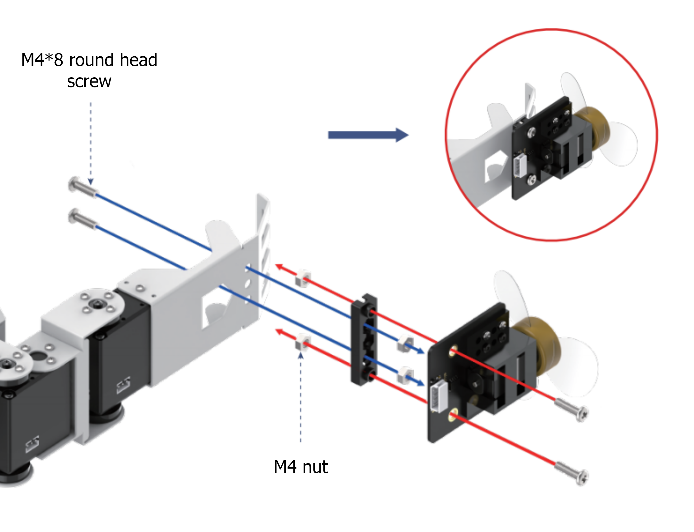

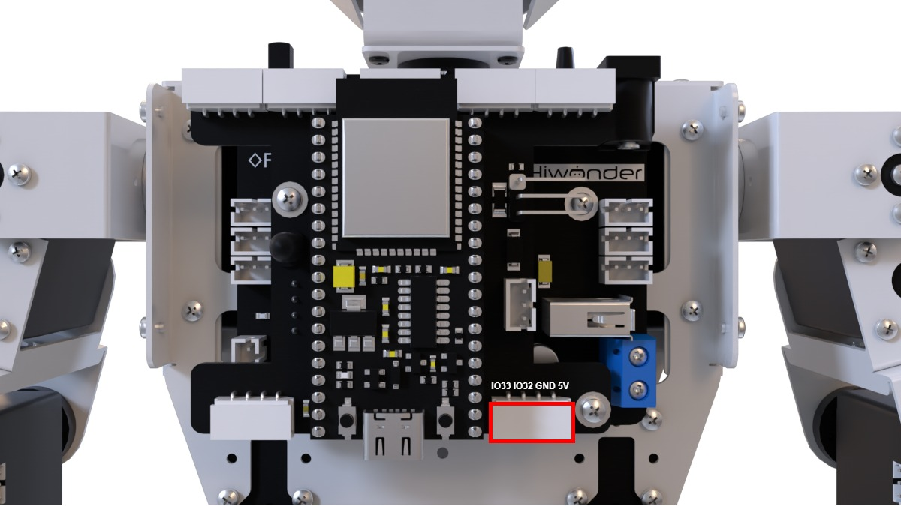

* **Project Introduction**

This section utilizes a glowy ultrasonic sensor to measure the distance to obstacles. Based on the detected distance, the arm is raised, the fan is activated, and the color of the ultrasonic RGB LED changes accordingly.

* **Program Implementation Process**

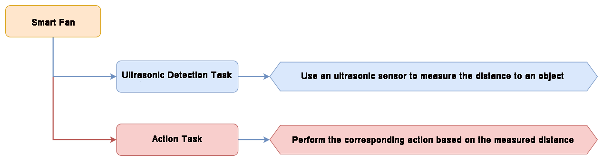

* **Sensor Introduction**

(1) Glowy Ultrasonic Sensor


This is a light-emitting ultrasonic distance sensor module that communicates via I2C. It reads the distance measured by the ultrasonic sensor using the I2C protocol.

When measuring distance, the module sends out 8 pulses of 40kHz square waves and checks for any returning signals. If a signal is detected, the module outputs a high-level signal, and the duration of this high signal corresponds to the time taken for the ultrasonic waves to travel to the target and back.

(2) Fan Module 

The fan module is a sensor that operates without the need for an external motor driver board, utilizing PWM (pulse-width modulation) to control its movement. The direction of the fan's rotation is managed by PWM pulse waveforms in both directions, while the fan speed is adjustable by modifying the duty cycle of the PWM signal.

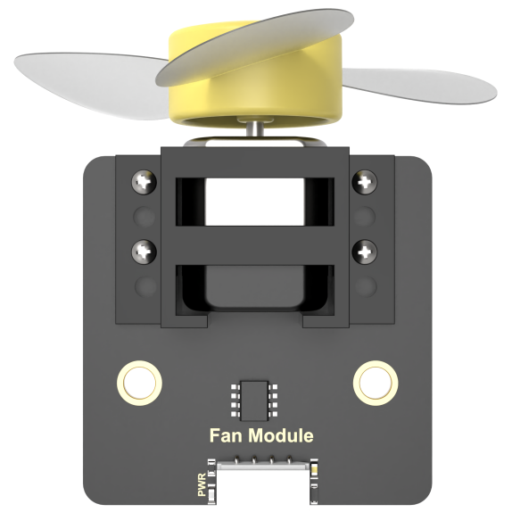

For module installation and wiring, please refer to the section 1 in the same folder.

<p id="program_download_2_8"></p>

* **Program Download**

[Smart Fan Program](../_static/source_code/05/Smart%20Fan%20Program.zip)

(1) Launch the "**Hiwonder Python Editor**" software .

(2) Drag the "**smart_fan.py**" file (located in the same folder as this document) into the editor window.

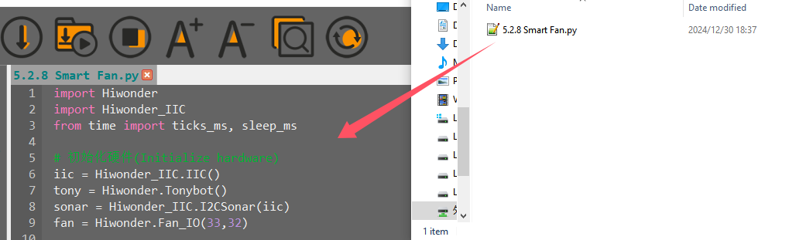

(3) Click the connection button  in the menu bar. Once connected, the icon  will turn green, indicating a successful connection.

(4) After the connection is established, click the download button  in the menu bar to upload the program to Tonybot. Wait for the completion message to appear in the info box below.


* **Achieved Effect**

Slowly move the object towards the glowy ultrasonic sensor. If the distance is less than 300mm, the robot will extend its right hand and turn on the fan. If the distance exceeds 300mm, the robot will lower its right hand and turn off the fan.


* **Function Extension**

You can customize the color of the breathing light. Follow the steps below for detailed instructions:

(1) Locate the section of the main function code that controls the color. When the distance is less than 250, the color transitions from red to blue. Specifically, the red component is calculated as 250 - color_diff, the green component is color_diff, and the blue component is always 0.

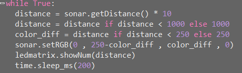

(2) You can adjust the ratio of the red and green channels to create different colors. For example, when color_diff is 0, the color will be red (250, 0, 0). When color_diff is 250, the color will be green (0, 250, 0). Adjust the color_diff value to achieve various color combinations.

(3) After making the necessary changes, follow the steps in the "**[Program Download](#program_download_2_8)**" section to run the program.

* **Program Overview**

[Smart Fan Program](../_static/source_code/05/Smart%20Fan%20Program.zip)

(1) The Hiwonder, Hiwonder_IIC, and time modules are imported.

(2) The ticks_ms and sleep_ms functions are imported from the time module. ticks_ms retrieves the current time in milliseconds, while sleep_ms pauses the program for a specified duration (in milliseconds).

{lineno-start=1}

```
import Hiwonder
import Hiwonder_IIC
from time import ticks_ms, sleep_ms
```

(3) The iic object is used to establish an IIC communication channel, enabling communication with other IIC devices later.

(4) The tony object represents the robot, providing control over its various movements and functions.

(5) The sonar object is a sonar device based on IIC communication, used for distance detection.

(6) The fan object is created with parameters 33 and 32, which correspond to the control pins for the fan.

(7) A global variable, last_tick, is defined to store the timestamp.

{lineno-start=5}

```
# 初始化硬件(Initialize hardware)
iic = Hiwonder_IIC.IIC()
tony = Hiwonder.Tonybot()
sonar = Hiwonder_IIC.I2CSonar(iic)
fan = Hiwonder.Fan_IO(33,32)

# 全局变量(Global variables)
last_tick = 0
```

(8) The runActionGroup method of the tony object is called to execute a movement from action group 0.

(9) The attachHead method is called on the tony object to enable the robot's head servo, allowing for control over the head. After initialization, the head servo is released.

(10) The program prints "**start.**" to indicate that initialization is complete and the program is ready to run.

{lineno-start=19}

```
# 初始化(Initialization)
tony.runActionGroup(0, 1)  # 立正动作(Perform the standing action (tony stands up))
tony.attachHead()  # 使能舵机(Enable the servo for head movement)
sleep_ms(1000)
tony.detachHead()  # 释放舵机(Release the servo (disables the head movement))
print("start.")
```

(11) The getDistance function is called to measure the distance. If the distance is less than 300mm, the RGB light is set to green using sonar.setRGB(0, 0, 250, 0).

(12) If the distance exceeds 300mm, the RGB light is set to blue using sonar.setRGB(0, 0, 0, 250), indicating a change in state.

(13) The moveServo method of the tony object is used to move the servo (servo number 16) to position 670 within 500 milliseconds if the distance is less than 300mm. If the distance is greater than 300mm, the servo is moved to position 275 within the same 500-millisecond duration.

(14) The break statement is used to exit the inner while True loop.

{lineno-start=26}

```
# 主循环(Main loop)
while True:
    if getDistance() < 300:  # 若距离<300mm(If the distance is less than 300mm)
        sonar.setRGB(0, 0, 250, 0)  # 绿色(Set sonar LED to green)
        tony.moveServo(16, 670, 500)  # 控制舵机(Control the servo to move to position 670)
        sleep_ms(500)
        
        # 风扇开启(Turn on the fan)
        fan.open()
        
        while True:
            sleep_ms(50)
            if getDistance() > 300:
                sonar.setRGB(0, 0, 0, 250)  # 蓝色(Set sonar LED to blue)
                # 风扇关闭(Turn off the fan)
                fan.close()
                sleep_ms(500)
                tony.moveServo(16, 275, 500)
                sleep_ms(500)
                break
                
    sleep_ms(100)  # 适当延时(Add a small delay before the next loop iteration)
```

### 6.2.9 Touch Control Project

* **Sensor Installation & Wiring**


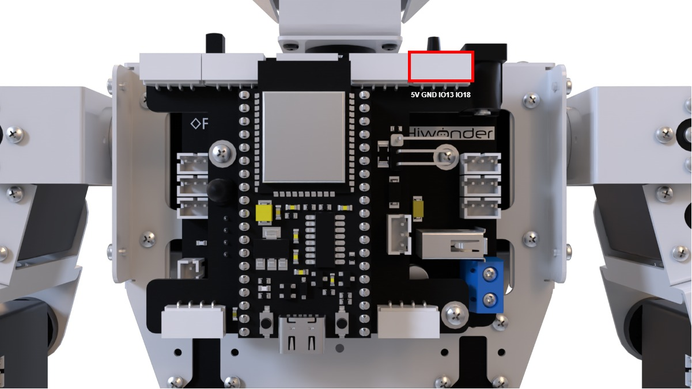

* **Project Introduction**

Touch the capacitive pad on the touch sensor, and Tonybot will perform a bowing motion.

* **Program Implementation Process**

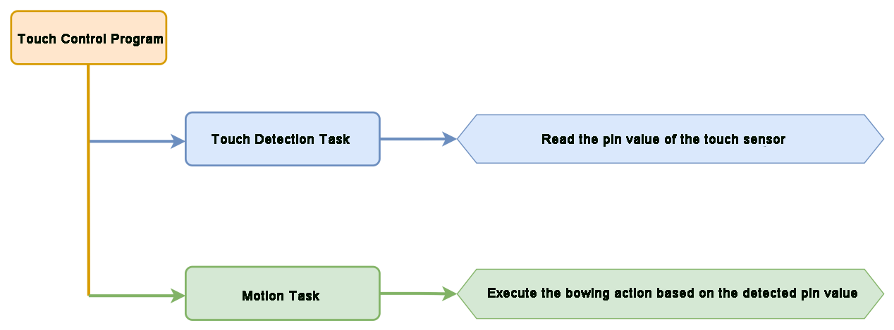

* **Sensor Introduction**

The touch sensor operates based on capacitive sensing technology, detecting the presence of human skin or metal through its gold-plated contact surface.

When no human or metal is in contact with the surface, the signal output is high. Upon contact with a human or metal, the signal output becomes low. Additionally, the sensor can detect contact through materials such as plastic or paper. The sensitivity of detection is influenced by the size of the contact surface and the thickness of the covering material.

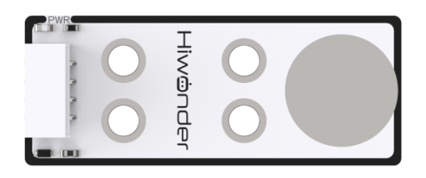

For module installation and wiring, please refer to the section 1 in the same directory.

<p id="program_download_2_9"></p>

* **Program Download**

[Touch Control Program](../_static/source_code/05/Touch%20Control%20Program.zip)

(1) Launch the "**Hiwonder Python Editor**" software .

(2) Drag the "**touch_control.py**" file (located in the same folder as this document) into the editor window.

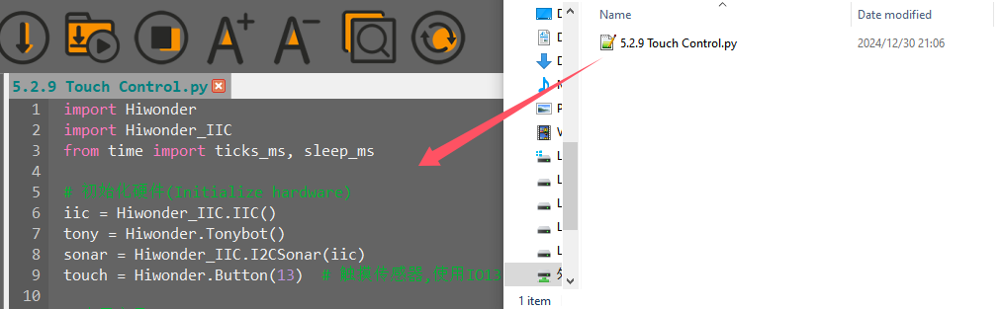

(3) Click the connection button  in the menu bar. Once connected, the icon  will turn green, indicating a successful connection.

(4) After the connection is established, click the download button  in the menu bar to upload the program to Tonybot. Wait for the completion message to appear in the info box below.


* **Achieved Effect**

Upon powering on Tonybot, touching the capacitive plate on the touch sensor will trigger the robot to perform a bowing motion.


* **Program Analysis**

[Touch Control Program](../_static/source_code/05/Touch%20Control%20Program.zip)

(1) The **Hiwonder**, **Hiwonder_IIC**, and **time** modules are imported.

(2) The **ticks_ms** and **sleep_ms** functions are imported from the **time** module. The **ticks_ms** function retrieves the current time in milliseconds, while **sleep_ms** pauses the program for a specified duration (in milliseconds).

{lineno-start=1}

```
import Hiwonder
import Hiwonder_IIC
from time import ticks_ms, sleep_ms
```

(3) The **iic** object is used to establish an IIC communication channel, preparing for communication with other IIC devices.

(4) The **tony** object represents the robot and allows control over its various actions and functions.

(5) The **sonar** is an IIC-based sonar device used for distance detection.

(6) The **touch** instance, initialized with **13** as a parameter, controls the touch sensor.

{lineno-start=5}

```
# 初始化硬件(Initialize hardware)
iic = Hiwonder_IIC.IIC()
tony = Hiwonder.Tonybot()
sonar = Hiwonder_IIC.I2CSonar(iic)
touch = Hiwonder.Button(13)  # 触摸传感器,使用IO13引脚(Touch sensor, using IO13 pin)
```

(7) **tony.runActionGroup(0, 1)**: Calls the **runActionGroup** method of the **tony** object to execute action group 0 once.

(8) **tony.attachHead()**: Enables the robot's head servo, preparing it for head-related actions.

(9) **sleep_ms(1000)**: Pauses the program for 1000 milliseconds (1 second), ensuring the robot has enough time to complete its standing action.

(10) **tony.detachHead()**: Releases the robot's head servo after the initialization process is complete.

(11) **print("start.")**: Outputs the string "**start.**" to indicate that the robot has been initialized and the program is about to enter the main loop.

{lineno-start=14}

```
# 初始化机器人(Initialize robot)
tony.runActionGroup(0, 1)  # 立正动作(Perform the standing action (tony stands up))
tony.attachHead()  # 使能舵机(Enable the servo for head movement)
sleep_ms(1000)
tony.detachHead()  # 释放舵机(Release the servo (disables the head movement))
print("start.")
```

(12) **while True**: The program enters an infinite loop and continuously executes the following actions.

(13) **if touch.read():**: Calls the **read** method of the **touch** object to check the status of the touch sensor. **if not enter_flag:**: Checks whether **enter_flag** is **False**, which indicates no action is being executed, allowing a new action to be triggered.

(14) **enter_flag = True**: Sets **enter_flag** to **True**, marking that an action is currently in progress to prevent multiple triggers of the same action.

(15) **tony.runActionGroup(10, 1)**: Calls the **runActionGroup** method of the **tony** object to execute action group 10 once, causing the robot to perform the corresponding action.

(16) **else:**: If no touch event is detected, sets **enter_flag** to **False**, allowing the next touch event to trigger a new action.

(17) **sleep_ms(50)**: Pauses the program for 50 milliseconds after each loop iteration to prevent frequent checks of the touch sensor, allowing the robot sufficient time to complete its actions and reducing CPU usage.

{lineno-start=21}

```
# 主循环(Main loop)
while True:
    if touch.read():  # 检测到触摸(Detect touch)
        if not enter_flag:  # 避免重复触发(Prevent repeated triggers)
            enter_flag = True
            tony.runActionGroup(10, 1)  # 执行动作组10(Execute action group 10)
    else:
        enter_flag = False
        
    sleep_ms(50)
```

* **Function Extension**

Here's an example of how to modify the original action group from 'bow' to 'twist': Locate the code for the action sequence and replace action group 10 (bow) with action group 50 (twist). This will enable the twist action to be triggered by the touch sensor.

{lineno-start=26}

```
            tony.runActionGroup(50, 1)  # 执行动作组10(Execute action group 10)
```

### 6.2.10 Temperature and Humidity Detection Project

* **Sensor Installation & Wiring**


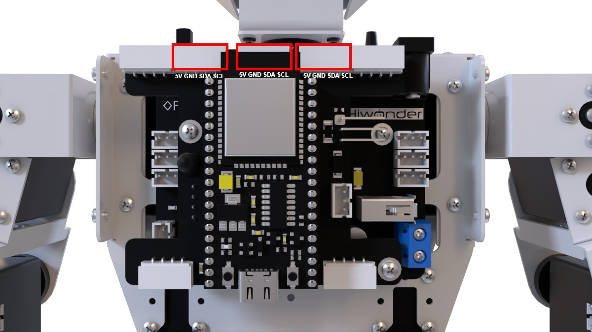

* **Project Introduction**

Once the mode is activated, Tonybot will monitor the temperature and humidity, and display the data on the matrix module.

* **Program Implementation Process**

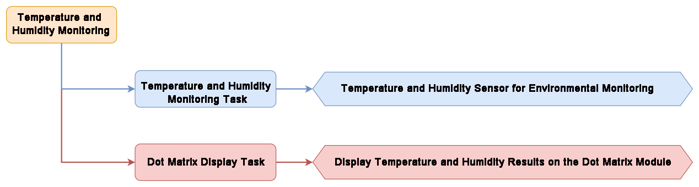

* **Sensor Introduction**

(1) Temperature and Humidity Sensor

This sensor detects the temperature and humidity of the environment and provides accurate readings.

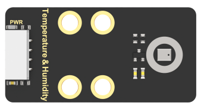

The AHT10 module converts the air's temperature and humidity into digital signals, which are then sent to the control board via I2C communication.

(2) LED Dot Matrix Module

The LED dot matrix module uses an 8x8 LED display, known for its high brightness, flicker-free display, and easy wiring. It can display numbers, text, patterns, and more. The module consists of two red 8x8 LED arrays and is controlled by the driver chip TM640B, enabling full control of the dot matrix screen.


For installation and wiring details, refer to the section "**01 Sensor Assembly and Wiring**" in this directory.

<p id="program_download_2_10"></p>

* **Program Download**

[Temperature and Humidity Detection Program](../_static/source_code/05/Temperature%20and%20Humidity%20Detection%20Program.zip)

(1) Launch the **"Hiwonder Python Editor"** software .

(2) Drag the **"main.py"** file (located in the same folder as this document) into the editor window.

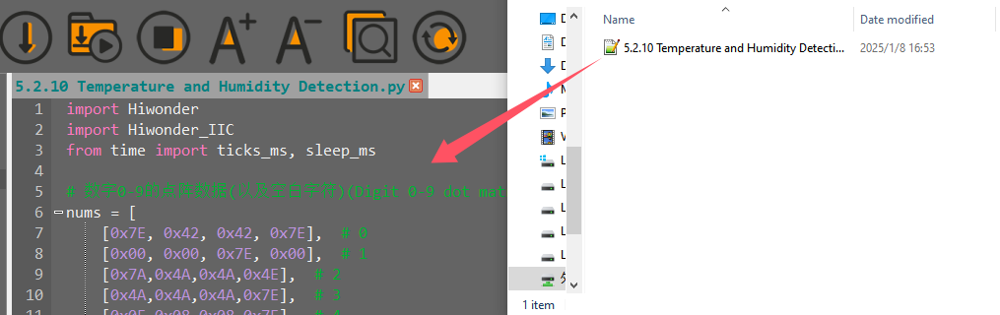

(3) Click the connection button  in the menu bar. Once connected, the icon  will turn green, indicating a successful connection.

(4) After the connection is established, click the download button  in the menu bar to upload the program to Tonybot. Wait for the completion message to appear in the info box below.


* **Achieved Effect**

Once the temperature and humidity are detected, the dot matrix module will display the numerical values.


* **Program Analysis**

[Temperature and Humidity Detection Program](../_static/source_code/05/Temperature%20and%20Humidity%20Detection%20Program.zip)

(1) Import the custom hardware control library to provide the necessary interfaces and functions for hardware operations.

① Import the ticks_ms and sleep_ms functions from the time module. ticks_ms retrieves the current millisecond counter, and sleep_ms is used for millisecond-level delays.

② The nums list stores dot matrix data for numbers 0-9, as well as for a blank character, enabling the display of numbers on the dot matrix module.

③ t_str and b_str store dot matrix data for the Celsius symbol and percentage sign, which are used to display the temperature and humidity units.

{lineno-start=1}

```
import Hiwonder
import Hiwonder_IIC
from time import ticks_ms, sleep_ms

# 数字0-9的点阵数据(以及空白字符)(Digit 0-9 dot matrix data (and blank character))
nums = [
    [0x7E, 0x42, 0x42, 0x7E],  # 0
    [0x00, 0x00, 0x7E, 0x00],  # 1
    [0x7A,0x4A,0x4A,0x4E],  # 2
    [0x4A,0x4A,0x4A,0x7E],  # 3
    [0x0E,0x08,0x08,0x7E],  # 4
    [0x4E,0x4A,0x4A,0x7A],  # 5
    [0x7E,0x4A,0x4A,0x7A],  # 6
    [0x02,0x02,0x02,0x7E],  # 7
    [0x7E,0x4A,0x4A,0x7E],  # 8
    [0x4E,0x4A,0x4A,0x7E],  # 9
    [0x00, 0x00, 0x00, 0x00]   # null
]

t_str = [0x02, 0x38, 0x44, 0x44] # 摄氏度符号(Celsius symbol)
b_str = [0x26, 0x16, 0x68, 0x64] # 百分号(Percentage symbol)
```

(2) Create the I2C communication object to establish communication with hardware via the I2C protocol.

① Create the robot object tony to control the robot's movements.

② Create the temperature and humidity sensor object tmp, using I2C communication to read the environmental temperature and humidity data.

③ Create the dot matrix display module object mx, where parameters 2 and 5 are likely configuration settings specific to the module for displaying information.

{lineno-start=23}

```
# 初始化硬件(Initialize hardware)
iic = Hiwonder_IIC.IIC()
tony = Hiwonder.Tonybot()
tmp = Hiwonder_IIC.AHTxx(iic)  # 温湿度传感器(Temperature and humidity sensor)
mx = Hiwonder.Digitaltube(2 , 5)  # 点阵显示模块(Dot matrix display module)
```

(3) last_time stores a timestamp, which may be used for time-based control and operation scheduling.

① step serves as a state flag, used in the main loop to switch between displaying the temperature and humidity values.

② temperature and humidity store the respective temperature and humidity values retrieved from the sensor.

{lineno-start=29}

```
# 全局变量(Global variables)
last_time = 0
step = 0
temperature = 0
humidity = 0
```

(4) tony.runActionGroup(0, 1): Executes action group 0 once, likely corresponding to a standing action.

① tony.attachHead(): Activates the robot's head servo.

② sleep_ms(200): Pauses for 200 milliseconds to allow the head servo to initialize.

③ tony.detachHead(): Deactivates the head servo to prevent unnecessary power consumption or misoperations.

{lineno-start=35}

```
# 初始化机器人(Initialize robot)
tony.runActionGroup(0, 1)  # 立正动作(Standing action)
tony.attachHead()  # 使能舵机(Enable servo)
sleep_ms(200)  # 等待初始化(Wait for initialization)
tony.detachHead()  # 释放舵机(Release servo)
```

(5) An infinite loop is created to ensure the program runs continuously. Every 2000 milliseconds, the following actions are performed based on the comparison between the current time and last_time:

① mx_data: Create and initialize a 14-byte list to store the dot matrix display data.

② When step == 0: Display the temperature:

③ Call tmp.read_temperature() to read the temperature and store it in temperature.

④ Calculate the tens and ones digits of the temperature, then retrieve the corresponding dot matrix data from the nums list to store in mx_data.

⑤ Store the dot matrix data for the temperature symbol.

⑥ Display the temperature value and set step to 1.

{lineno-start=43}

```
# 主循环(Main loop)
while True:
    if ticks_ms() > last_time:
        last_time = ticks_ms() + 2000
        mx_data = [0x00,0x00,0x00,0x00,0x00,0x00,0x00,0x00,0x00,0x00,0x00,0x00,0x00,0x00,0x00,0x00]
        if step == 0:  # 温度显示(Temperature display)
            temperature = tmp.read_temperature()
            # 显示十位(Display tens place)
            index = temperature // 10
            if index == 0:
                mx_data[1:5] = nums[10]  # 空白显示(Blank display)
            else:
                mx_data[1:5] = nums[index]
            
            # 显示个位(Display ones place)
            index = temperature % 10
            mx_data[6:10] = nums[index]
            
            # 显示温度符号(Display temperature symbol)
            mx_data[11:15] = t_str
            print("Temperature: {}".format(temperature))
            step = 1
            
        else:  # 湿度显示(Humidity display)
            humidity = tmp.read_humidity()
            # 显示十位(Display tens place)
            index = humidity // 10
            if index == 0:
                mx_data[1:5] = nums[10]  # 空白显示(Blank display)
            else:
                mx_data[1:5] = nums[index]
            
            # 显示个位(Display ones place)
            index = humidity % 10
            mx_data[6:10] = nums[index]
            
            # 显示百分比符号(Display percentage symbol)
            mx_data[11:15] = b_str
            print("Humidity: {}".format(humidity))
            step = 0
```

## 6.3 Voice Interaction Course

### 6.3.1 WonderEcho Introduction & Assembly

* **Assembly**

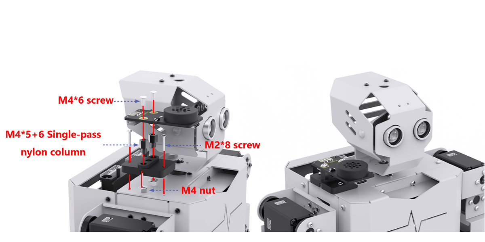

* **Introduction and Working Principle**

(1) Introduction

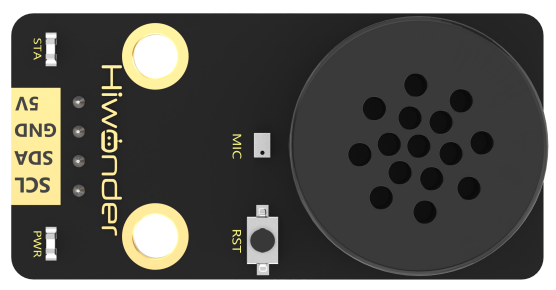

The voice interaction module is built on embedded voice recognition technology. It consists of a voice recognition chip and supporting circuits, designed for seamless communication with the main control chip. This module enables both voice recognition and voice playback functionalities. Developers can easily integrate it into their products to enable voice interaction capabilities.

(2) Working Principle

The module communicates via I2C and functions as a slave device, allowing communication with a master device. When the microphone on the module detects sound, it processes the audio and sends the result back to the master device.

The module operates in a keyword wake-up mode, requiring a specific trigger word to initiate recognition. By default, the wake-up keyword is "**Hello Hiwonder.**" Once recognition is complete, if further recognition is required, the module must be re-activated by the wake-up keyword after a 15-second delay.

* **Interface Description**

For detailed specifications and chip diagrams, please refer to the "**3. Chip Manual.**"

**Type-C Interface**: Used for powering the module and for firmware programming.

**I2C Interface**: Used for communication with host devices.

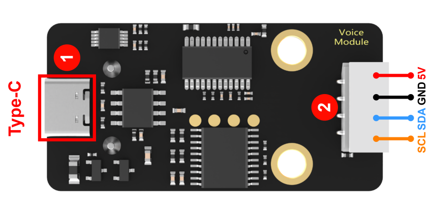

| **PIN** | **Function Description** |
| :-----: | :----------------------: |
|   5V    |       Power input        |
|   GND   |       Power ground       |
|   SDA   |      I2C data cable      |
|   SCL   |     I2C clock cable      |

* **Important Notes**

(1) Ensure the voltage does not exceed the rated range during use.

(2) The environment should be quiet, as noise may impact recognition performance.

(3) When speaking the trigger phrase, make sure your voice is clear and loud, and avoid speaking too quickly. It is recommended to maintain a distance of no more than 5 meters from the module.

### 6.3.2 Distance Ranging & Announcement Project

* **Project Introduction**

This section utilizes the glowy ultrasonic module to measure the distance to an obstacle. Based on the detected distance, it controls the voice interaction module to announce messages and triggers the robot to perform specific action groups.

* **Program Implementation Process**


* **Sensor Introduction**

(1) Glowy Ultrasonic Sensor


This is a light-emitting ultrasonic distance sensor module that communicates via I2C. It reads the distance measured by the ultrasonic sensor using the I2C protocol.

When measuring distance, the module sends out 8 pulses of 40kHz square waves and checks for any returning signals. If a signal is detected, the module outputs a high-level signal, and the duration of this high signal corresponds to the time taken for the ultrasonic waves to travel to the target and back.

(2) Voice Interaction Module

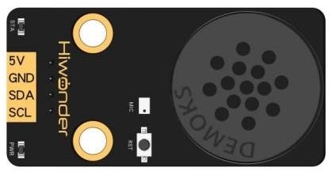

The voice interaction module is built on embedded voice recognition technology. It consists of a voice recognition chip and supporting circuits, designed for seamless communication with the main control chip. This module enables both voice recognition and voice playback functionalities. Developers can easily integrate it into their products to enable voice interaction capabilities.

For instructions on module installation and wiring, please refer to assembly guide saved in the same directory.

<p id="program_download_3_2"></p>

* **Program Download**

[Distance Ranging & Announcement Program](../_static/source_code/05/Distance%20Ranging%20&%20Announcement%20Program.zip)

(1) Launch the **"Hiwonder Python Editor"** software .

(2) Drag the **"Range_broadcasting.py"** file (located in the same folder as this document) into the editor window.

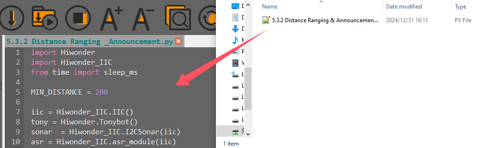

(3) Click the connection button  in the menu bar. Once connected, the icon  will turn green, indicating a successful connection.

(4) After the connection is established, click the download button  in the menu bar to upload the program to Tonybot. Wait for the completion message to appear in the info box below.


* **Achieved Effect**

After powering on the Tonybot, slowly bring an object close to the glowy ultrasonic sensor. When the distance is less than 200mm, action group 9 will be executed, and the message '**Hello, welcome**' will be announced.


* **Program Analysis**

[Distance Ranging & Announcement Program](../_static/source_code/05/Distance%20Ranging%20&%20Announcement%20Program.zip)

(1) The **Hiwonder** and **Hiwonder_IIC** modules are imported, providing the necessary interfaces and functionality for controlling specific hardware components.

The ticks_ms function retrieves the current millisecond timestamp, while sleep_ms pauses the program for a specified duration (in milliseconds). These functions are essential for precise time control and introducing time delays when needed.

{lineno-start=1}

```
import Hiwonder
import Hiwonder_IIC
from time import ticks_ms, sleep_ms
```

(2) An **IIC** object is created for I2C communication.

① The tony object is instantiated from the **Tonybot** class to control the robot's movements.

② The sonar object is an instance of the **I2CSonar** class, used for ultrasonic distance measurement and receiving the iic parameter.

③ The asr object is an instance of the **asr_module** class, used for voice functionality, also communicating via I2C.

④ The command tony.runActionGroup(0, 1) is used to execute action group 0 on the robot.

⑤ The tony.attachHead() function enables the robot's head, and after waiting 1000 milliseconds, tony.detachHead() is called to release the head.

{lineno-start=7}

```
iic = Hiwonder_IIC.IIC()
tony = Hiwonder.Tonybot()
sonar  = Hiwonder_IIC.I2CSonar(iic)
asr = Hiwonder_IIC.asr_module(iic)

tony.runActionGroup(0 , 1)
tony.attachHead()
sleep_ms(1000)
tony.detachHead()
```

(3) A global variable have_move is defined and initialized to True to track whether the robot is moving or engaged in some activity.

{lineno-start=17}

```
have_move = True
```

(4) The distance is measured using sonar.getDistance() \* 10 and stored in the distance variable.

① If the distance is less than MIN_DISTANCE but greater than 0, the have_move variable is set to True, the ultrasonic sensor's RGB light is set to blue, the robot executes action group 9, and the voice module announces "**Hello, welcome**".

② If the have_move variable is True in other cases, it is set to False, the ultrasonic sensor's RGB light transitions to a green gradient, and the robot performs action group 0.

{lineno-start=19}

```
def sonar_task():
    """用户函数(User functionv)"""
    global have_move
    distance = sonar.getDistance() * 10
    if distance < MIN_DISTANCE and distance > 0:  # 如果测得距离小于指定距离(If the measured distance is less than the specified distance)
        global have_move
        have_move = True
        sonar.setRGB(0 , 0, 0, 250)
        tony.runActionGroup(9, 1)  # 运行9号动作组(Run action group 9)
        sleep_ms(500)
        asr.speak(asr.ASR_ANNOUNCER, 0x0F)  # 你好，欢迎光临(Say "Hello, welcome")
        sleep_ms(2000)
    else:
        if have_move:
            have_move = False
            sonar.setRGB(0 , 20, 0, 0)  # 设置发光超声波颜d色为绿色渐变(Set ultrasonic RGB color to a gradient green)
            tony.runActionGroup(0, 1)  # 运行0号动作组(Run action group 0)
```

(5) The program runs in an infinite loop, continuously executing the following operations:

① The program repeatedly calls the sonar_task function to detect distances and perform corresponding actions.

② After each call to sonar_task, the program pauses for 50 milliseconds to reduce resource usage and allow time for hardware operations.

{lineno-start=38}

```
# 主循环(Main loop)
while True:
    sonar_task()  # 用户函数(User function)
    sleep_ms(50)  # 注意需要给相应的延时(Remember to add a delay)
```

* **Function Extension**

(1) To modify the voice announcement from "**Hello, welcome**" to "**There is an obstacle ahead**" when the ultrasonic distance is less than 200mm, locate the voice announcement code in the program.

{lineno-start=29}

```
        asr.speak(asr.ASR_ANNOUNCER, 0x0F)  # 你好，欢迎光临(Say "Hello, welcome")
```

(2) Update the ID of the voice recognition module's announcement data to "**0x05**".

{lineno-start=29}

```
 asr.speak(asr.ASR_ANNOUNCER, 0x05)  # 你好，欢迎光临(Say "Hello, welcome")
```

(3) Finally, follow the steps in "[**Program Download**](#program_download_3_2)" to upload the modified code to the Tonybot.

### 6.3.3 Human-Robot Interaction Project

* **Project Introduction**

The voice interaction module recognizes trigger phrases, which then control the Tonybot to execute the corresponding actions.

* **Program Implementation Process**

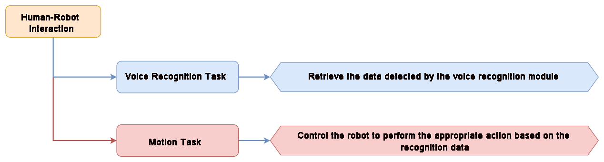

* **Sensor Introduction**


The voice interaction module is built on embedded voice recognition technology. It consists of a voice recognition chip and supporting circuits, designed for seamless communication with the main control chip. This module enables both voice recognition and voice playback functionalities. Developers can easily integrate it into their products to enable voice interaction capabilities.

For instructions on module installation and wiring, please refer to assembly guide saved in the same directory.

<p id="program_download_3_3"></p>

* **Program Download**

[Human-Robot Interaction Program](../_static/source_code/05/Human-Robot%20Interaction%20Program.zip)

(1) Launch the **"Hiwonder Python Editor"** software .

(2) Drag the **"Communicate.py"** file (located in the same folder as this document) into the editor window.

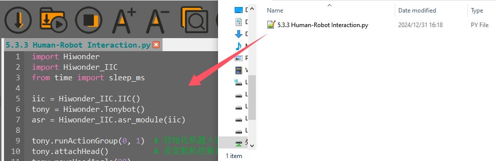

(3) Click the connection button  in the menu bar. Once connected, the icon  will turn green, indicating a successful connection.

(4) After the connection is established, click the download button  in the menu bar to upload the program to Tonybot. Wait for the completion message to appear in the info box below.


* **Achieved Effect**

Say **"Hello Hiwonder"** to activate the voice recognition module. Then, use commands like **"Hello,"** **"Introduce yourself,"** **"Show off,"** **"Take two steps,"** or **"Shake your head"** to control Tonybot and trigger various actions.


* **Program Analysis**

[Human-Robot Interaction Program](../_static/source_code/05/Human-Robot%20Interaction%20Program.zip)

(1) The **Hiwonder** and **Hiwonder_IIC** modules are imported, providing the necessary interfaces and functionality for controlling specific hardware components.

ticks_ms retrieves the current millisecond timestamp, while sleep_ms pauses the program for a specified duration (in milliseconds).

{lineno-start=1}

```
import Hiwonder
import Hiwonder_IIC
from time import sleep_ms
```

(2) tony.runActionGroup(0, 1): Executes action group 0 once to initialize the robot.

① tony.attachHead(): Enables the robot's head servo.

② tony.moveHeadAngle(90): Rotates the robot's head to a 90-degree position.

③ tony.detachHead(): Disables the head servo after initialization.

{lineno-start=9}

```
tony.runActionGroup(0, 1)  # 初始化机器人姿态(Initialize robot posture)
tony.attachHead()          # 设定舵机控制io口(Set servo control I/O port)
tony.moveHeadAngle(90)
sleep_ms(200)             # 等待底板初始化完毕(Wait for the base to initialize)
tony.detachHead()
```

(3) The function calls the asr.getResult() method to retrieve the recognition result from the voice recognition module and stores it in the result variable. If the result is valid (not None or an invalid value), it is printed for debugging or monitoring.

{lineno-start=15}

```
def communicate():
    """语音识别函数(Speech recognition function)"""
    result = asr.getResult()  # 获取语音识别模块数据(Get speech recognition module data)
    if result:
        print("ASR result is:", result)
```

(4) If the voice recognition result is 0x1A, indicating the "**Hello**" command, the robot executes action group 10 using tony.runActionGroup(10, 1) once.

① If the result is 0x1D (representing the "**Take two steps**" command), the robot pauses for 500 milliseconds and then performs the following actions:

② tony.runActionGroup(18, 1): Executes action group 18 once.

③ tony.runActionGroup(21, 3): Executes action group 21 three times for forward movement.

④ tony.waitForStop(5000): Pauses for 5000 milliseconds to allow the action to complete.

⑤ The robot then executes transitional actions by calling tony.runActionGroup(18, 1) and tony.waitForStop(2000).

⑥ Finally, tony.runActionGroup(19, 1) completes the movement.

{lineno-start=21}

```
        if result == 0x1A:  # 你好(Hello)
            tony.runActionGroup(10, 1)
            sleep_ms(1000)
            
        elif result == 0x1B:  # 介绍自己(Introduce yourself)
            tony.runActionGroup(48, 1)
            sleep_ms(4000)
            
        elif result == 0x1C:  # 露一手(Show a trick)
            sleep_ms(500)
            tony.runActionGroup(17, 1)
            sleep_ms(10000)
            
        elif result == 0x1D:  # 走两步(Walk two steps)
            sleep_ms(500)
            tony.runActionGroup(18, 1)
            tony.waitForStop(2000)
            tony.runActionGroup(21, 3)
            tony.waitForStop(5000)
            tony.runActionGroup(18, 1)
            tony.waitForStop(2000)
            tony.runActionGroup(19, 1)
```

(5) The program enters an infinite loop with while True, continuously calling the communicate() function.

sleep_ms(50): After each communicate() call, the program pauses for 50 milliseconds. This allows hardware to process previous operations, reduces CPU load, and ensures stable and smooth system performance.

{lineno-start=57}

```
# 主循环(Main loop)
while True:
    communicate()  # 语音识别函数(Speech recognition function)
    sleep_ms(50)  # 注意需要给相应的延时(Remember to add a delay)
```

### 6.3.4 Voice Control Project

* **Project Introduction**

This section demonstrates how to control Tonybot's movements, including moving forward, backward, turning left, and turning right, using the voice recognition module.

* **Program Implementation Process**

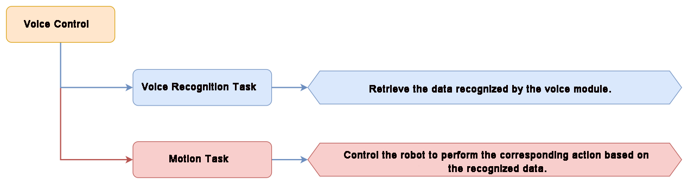

* **Sensor Introduction**


The voice interaction module is built on embedded voice recognition technology. It consists of a voice recognition chip and supporting circuits, designed for seamless communication with the main control chip. This module enables both voice recognition and voice playback functionalities. Developers can easily integrate it into their products to enable voice interaction capabilities.

For instructions on module installation and wiring, please refer to assembly guide saved in the same directory.

<p id="program_download_3_4"></p>

* **Program Download**

[Voice Control Program](../_static/source_code/05/Voice%20Control%20Program.zip)

(1) Launch the **"Hiwonder Python Editor"** software .

(2) Drag the **"main.py"** file (located in the same folder as this document) into the editor window.

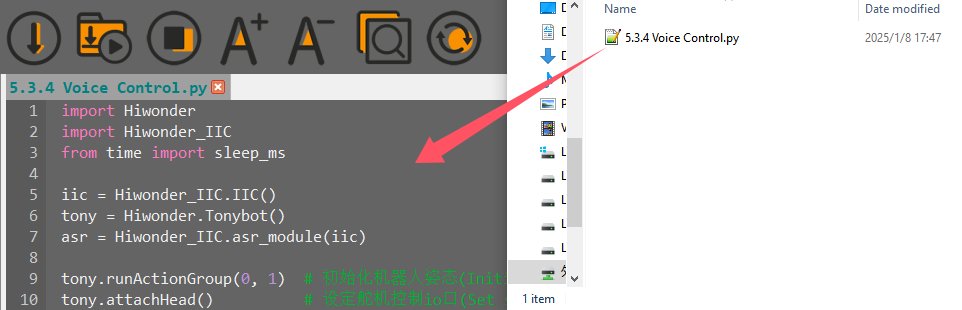

(3) Click the connection button  in the menu bar. Once connected, the icon  will turn green, indicating a successful connection.

(4) After the connection is established, click the download button  in the menu bar to upload the program to Tonybot. Wait for the completion message to appear in the info box below.


* **Achieved Effect**

Activate the voice recognition module by saying "**Hello Hiwonder**" Then, use commands like **"Forward," "Backward," "Turn left," "Turn right,"** and others to control Tonybot and execute different actions. The specific control commands are listed in the table below:

| Command Phrase  | Returned Value | Command Phrase | Returned Value |
| --------------- | -------------- | -------------- | -------------- |
| GO-STRAIGHT     | 0x01           | GO-BACKWARD    | 0x02           |
| TURN LEFT       | 0x03           | TURN RIGHT     | 0x04           |
| LEFT-FOOT-SHOOT | 0x6E           | TWIST          | 0x71           |
| SIT-UP          | 0x72           | BOW            | 0x73           |
| SPREAD ARMS     | 0x74           | WAVE HAND      | 0x75           |
| MARCH-IN-PLACE  | 0x76           | RIGHT-HOOK     | 0x7A           |


* **Program Analysis**

[Voice Control Program](../_static/source_code/05/Voice%20Control%20Program.zip)

(1) The **Hiwonder** and **Hiwonder_IIC** modules are imported, providing the necessary interfaces and functions for controlling specific hardware.  

The **time** module imports the ticks_ms and sleep_ms functions. ticks_ms retrieves the current millisecond timestamp, and sleep_ms pauses the program for a specified duration (in milliseconds).

{lineno-start=1}

```
import Hiwonder
import Hiwonder_IIC
from time import sleep_ms
```

(2) tony.runActionGroup(0, 1): Executes action group 0 once to initialize the robot.

① tony.attachHead(): Connects the robot's head servo.

② tony.moveHeadAngle(90): Rotates the robot's head to a 90-degree position.

③ sleep_ms(200): Pauses for 200 milliseconds to allow sufficient time for the robot's initialization.

④ tony.detachHead(): Disconnects or disables the head servo to prevent misoperation and save energy after the initialization.

{lineno-start=9}

```
tony.runActionGroup(0, 1)  # 初始化机器人姿态(Initialize robot posture)
tony.attachHead()          # 设定舵机控制io口(Set servo control I/O port)
tony.moveHeadAngle(90)
sleep_ms(200)             # 等待底板初始化完毕(Wait for base initialization to complete)
tony.detachHead()
```

(3) The function calls asr.getResult() to retrieve the recognition result from the voice recognition module, storing it in the result variable. If the result is valid (not None or other invalid values), it is printed for debugging or monitoring purposes.

{lineno-start=15}

```
def ASR_task():
    """语音识别函数(Speech recognition function)"""
    result = asr.getResult()  # 获取语音识别模块数据(Get speech recognition module data)
    if result:
        print("ASR result is:", result)
```

(4) If the recognition result is 0x1A (indicating the "**Hello**" voice command), the robot executes action group 10 once using tony.runActionGroup(10, 1). This action typically corresponds to a greeting gesture such as waving or nodding. The program then pauses for 1000 milliseconds to give the robot time to complete the action.

① If the recognition result is 0x1D (indicating the "**Take two steps**" command), the following sequence of actions is performed:

② tony.runActionGroup(18, 1): Executes action group 18 once.

③ tony.runActionGroup(21, 3): Executes action group 21 three times, corresponding to the "**move forward**" action.

④ tony.waitForStop(5000): Waits for the action to complete by pausing for 5000 milliseconds.

⑤ Additional transitional actions are executed by calling tony.runActionGroup(18, 1) and tony.waitForStop(2000).

⑥ Finally, tony.runActionGroup(19, 1) completes the movement.

{lineno-start=15}

```
def ASR_task():
    """语音识别函数(Speech recognition function)"""
    result = asr.getResult()  # 获取语音识别模块数据(Get speech recognition module data)
    if result:
        print("ASR result is:", result)
        
        if result == 0x71:  # 扭腰(Twist waist)
            tony.runActionGroup(50, 1)
            
        elif result == 0x72:  # 仰卧起坐(Sit-up)
            tony.runActionGroup(8, 1)
            
        elif result == 0x73:  # 鞠躬(Bow)
            tony.runActionGroup(10, 1)
            
        elif result == 0x74:  # 大鹏展翅(Spread wings)
            tony.runActionGroup(17, 1)
            
        elif result == 0x75:  # 招招手(Wave hand)
            tony.runActionGroup(9, 1)
            
        elif result == 0x76:  # 原地踏步(Marching in place)
            tony.runActionGroup(49, 1)
            
        elif result == 0x01:  # 前进(Move forward)
            tony.runActionGroup(18, 1)
            tony.waitForStop(2000)
            tony.runActionGroup(21, 3)
            tony.waitForStop(5000)
            tony.runActionGroup(18, 1)
            tony.waitForStop(2000)
            tony.runActionGroup(19, 1)
            
        elif result == 0x02:  # 后退(Move backward)
            tony.runActionGroup(18, 1)
            tony.waitForStop(2000)
            tony.runActionGroup(22, 3)
            tony.waitForStop(5000)
            tony.runActionGroup(18, 1)
            tony.waitForStop(2000)
            tony.runActionGroup(19, 1)
            
        elif result == 0x03:  # 左转(Turn left)
            tony.runActionGroup(34, 5)
            
        elif result == 0x04:  # 右转(Turn right)
            tony.runActionGroup(35, 5)
            
        elif result == 0x6E:  # 左脚射门(Left foot kick)
            tony.runActionGroup(55, 1)
            
        elif result == 0x7A:  # 右勾拳(Right hook punch)
            tony.runActionGroup(58, 1)
```

(5) The program enters an infinite loop with while True, continuously calling the communicate() function to listen for voice commands and respond accordingly.

sleep_ms(50): After each communicate() call, the program pauses for 50 milliseconds. This allows the hardware enough time to process prior operations, reduces CPU usage, and ensures system stability.

{lineno-start=69}

```
# 主循环(Main loop)
while True:
    ASR_task()  # 语音识别函数(Speech recognition function)
    sleep_ms(50)  # 注意需要给相应的延时(Remember to add a delay)
```

### 6.3.5 Fall Recovery Project

* **Project Introduction**

After the robot falls, say the command 'fall recovery' to make the robot stand up.

* **Program Implementation Process**

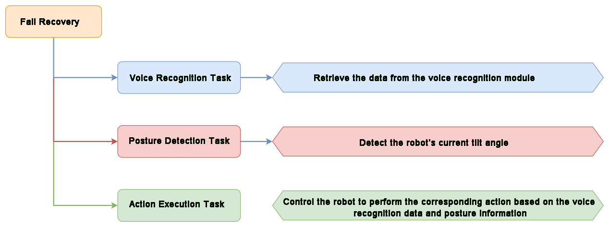

* **Sensor Introduction**


The voice interaction module is built on embedded voice recognition technology. It consists of a voice recognition chip and supporting circuits, designed for seamless communication with the main control chip. This module enables both voice recognition and voice playback functionalities. Developers can easily integrate it into their products to enable voice interaction capabilities.

For instructions on module installation and wiring, please refer to assembly guide saved in the same directory.

<p id="program_download_3_5"></p>

* **Program Download**

[Fall Recovery Program](../_static/source_code/05/Fall%20Recovery%20Program.zip)

(1) Launch the **"Hiwonder Python Editor"** software .

(2) Drag the **"wake_up.py"** file  into the editor window.

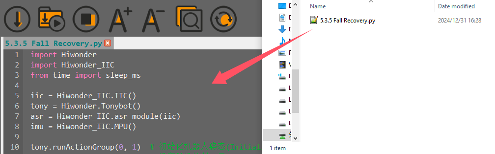

(3) Click the connection button  in the menu bar. Once connected, the icon  will turn green, indicating a successful connection.

(4) After the connection is established, click the download button  in the menu bar to upload the program to Tonybot. Wait for the completion message to appear in the info box below.


* **Achieved Effect**

If the robot is in a fallen state, activate the voice recognition module by saying 'Hello Hiwonder,' and then use the command 'fall and stand up' to instruct the robot to stand up.


* **Program Overview**

[Fall Recovery Program](../_static/source_code/05/Fall%20Recovery%20Program.zip)

(1) Module Imports

The Hiwonder and Hiwonder_IIC modules are imported to provide necessary interfaces and functions for hardware control. The time module imports the ticks_ms and sleep_ms functions. ticks_ms retrieves the current millisecond count, while sleep_ms pauses the program for a specified duration in milliseconds.

{lineno-start=1}

```
import Hiwonder
import Hiwonder_IIC
from time import sleep_ms
```

(2) Robot Initialization

The robot's posture is initialized by adjusting the head angle and waiting for the base and IMU to complete initialization. Initially, action group 0 is executed to configure the head servos and rotate the head to a 90-degree position. A pause is introduced to allow time for initialization. Afterward, the head servos are detached, and the program waits for the IMU to finish initializing. A "**beep**" sound signifies the successful completion of the initialization process.

{lineno-start=10}

```
tony.runActionGroup(0, 1)  # 初始化机器人姿态(Initialize robot posture)
tony.attachHead()          # 设定舵机控制io口(Set servo control I/O port)
tony.moveHeadAngle(90)
sleep_ms(200)             # 等待底板初始化完毕(Wait for base initialization to complete)
tony.detachHead()
sleep_ms(6000)           # 等待IMU初始化完成(Wait for IMU initialization to complete)
```

(3) State Management and Recovery Logic

① **Global Variable** step: A global variable step is used to track the robot's recovery stages when it falls.

② tumble() **Function**: The tumble() function is the core of the program, responsible for detecting if the robot has fallen and performing recovery actions based on the current state.

③ global step: This ensures that step can be modified within the function to reflect the robot's state changes.

④ result = asr.getResult(): Retrieves the current result from the voice recognition module.

⑤ if not tony.isRunning(): This check ensures that the fall detection logic is only executed when the robot is not engaged in other actions, avoiding interference with ongoing movements.

{lineno-start=19}

```
def tumble():
    """跌倒检测函数(Fall detection function)"""
    global step
    result = asr.getResult()  # 获取语音识别模块数据(Get speech recognition module data)
    
    if not tony.isRunning():  # 若无动作进行(If no action is running)
        if step == 0:
            if result == 0x77:  # "跌倒起立(Fall and stand up)"
                angle = imu.read_angle()
                radianX = angle[0]  # X轴角度(X-axis angle)
                # 判断是倒正面还是背面(Determine whether it is face down or back down)
                if radianX < 60 and radianX > -30:
                    step = 1
                elif radianX > 120 or radianX < -140:
                    step = 2
                    
        elif step == 1:
            tony.runActionGroup(102, 1)  # 恢复立正状态(Recover to standing posture)
            step = 0
            
        elif step == 2:
            tony.runActionGroup(101, 1)  # 恢复立正状态(Recover to standing posture)
            step = 0
            
        else:
            step = 0
```

(5) Continuous Monitoring and Controlwhile

① Infinite Loop (while True): An infinite loop is implemented to continually monitor and control the robot. The tumble() function is called in each iteration to check for falls and initiate recovery actions as needed.

② Delay (sleep_ms(50)): After each call to tumble(), a 50-millisecond delay is introduced. This prevents excessive function calls, reducing CPU usage and ensuring that hardware operations have sufficient time to complete, maintaining system stability and smoothness.

{lineno-start=46}

```
# 主循环(Main loop)
while True:
    tumble()  # 跌倒检测函数(Fall detection function)
    sleep_ms(50)  # 注意需要给相应的延时(Remember to add a delay)
```

## 6.4 AI Vision Course

<p id="anchor_5_4_1"></p>

### 6.4.1 Overview and Installation of ESP32S3 Vision Module

* **Assembly**

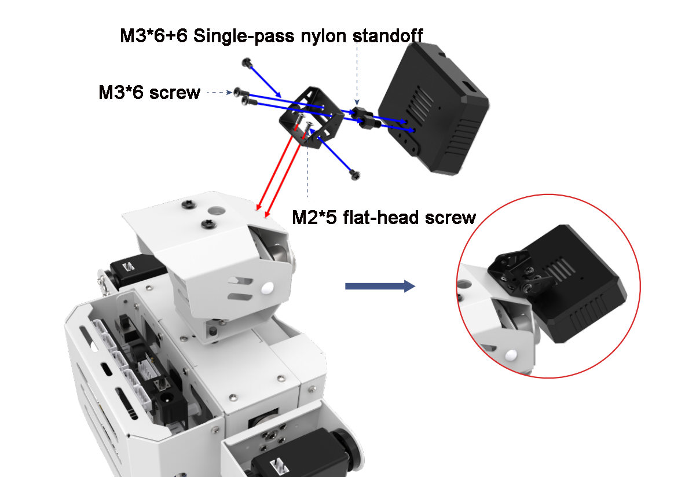

* **Overview of the ESP32-S3**

The ESP32-S3 Vision Module is a compact camera module that can function as a standalone system. It captures images with its built-in camera, processes the data using the ESP32 microcontroller, and wirelessly transmits it via Wi-Fi. With support for various communication protocols and low-power features, this module is widely used in a range of IoT applications.

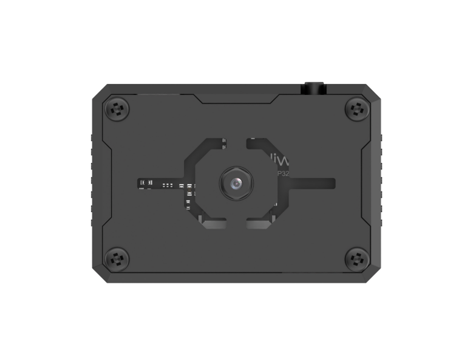

(1) Specification

<table  class="docutils-nobg" border="1">
<colgroup>
<col  />
<col  />
</colgroup>
<tbody>
<tr>
<td ><strong>Parameter</strong></td>
<td ><strong>Specification</strong></td>
</tr>
<tr>
<td >Size</td>
<td >59*43*17.5</td>
</tr>
<tr>
<td >Power Supply Range</td>
<td >4.75~5.25V</td>
</tr>
<tr>
<td >Operating Temperature</td>
<td >Ambient Temperature</td>
</tr>
<tr>
<td >Storage Environment</td>
<td >Ambient Temperature and Pressure</td>
</tr>
<tr>
<td >SPI Flash</td>
<td >Supports up to 16MB</td>
</tr>
<tr>
<td >RAM</td>
<td >512KB Internal + 16MB External PSRAM</td>
</tr>
<tr>
<td >Bluetooth</td>
<td >Suppport Bluetooth 5 and Bluetooth Mesh</td>
</tr>
<tr>
<td >WiFi</td>
<td >802.11 b/g/n</td>
</tr>
<tr>
<td >Supported Interfaces</td>
<td >UART、I2C</td>
</tr>
<tr>
<td >Serial Baud Rate</td>
<td >Default 115200</td>
</tr>
<tr>
<td >Image Output Format</td>
<td >JPEG (only supported by OV2640), BMP, Grayscale</td>
</tr>
<tr>
<td >Frequency Range</td>
<td >2412~2484MHz</td>
</tr>
<tr>
<td >Antenna Type</td>
<td >Onboard PCB Antenna</td>
</tr>
<tr>
<td >Transmit Power</td>
<td ><p>802.11b:20.5 dBm(@11Mbps)</p>
<p>802.11g:18 dBm(@54Mbps)</p>
<p>802.11n:17 dBm(@MCS7)</p></td>
</tr>
<tr>
<td >Receive Sensitivity</td>
<td ><p>802.11b:-88.5 dBm(@11Mbps)</p>
<p>802.11g:-76.2 dBm(@54Mbps)</p>
<p>802.11n:-74.2dBm(@MCS7 HT20)</p>
<p>-71.2dBm(@MCS7 HT40)</p></td>
</tr>
<tr>
<td >Power Consumption (assuming peripherals are on)</td>
<td ><p>Active (RF On): TX: 285-355mA @ 3.3V RX:95-97mA@3.3V</p>
<p>Deep-sleep:8uA@5V</p>
<p>Modem-sleep:47.6-107.6mA@5V 240MHZ</p>
<p>Light-sleep:240uA@5V</p></td>
</tr>
<tr>
<td >Security</td>
<td >RSA/AES/SHA/HMAC/XTS-AES</td>
</tr>
</tbody>
</table>


**Kind Reminder:** The product specifications are theoretical values and are for reference only. Please rely on actual performance for precise details.

(2) Interface Description

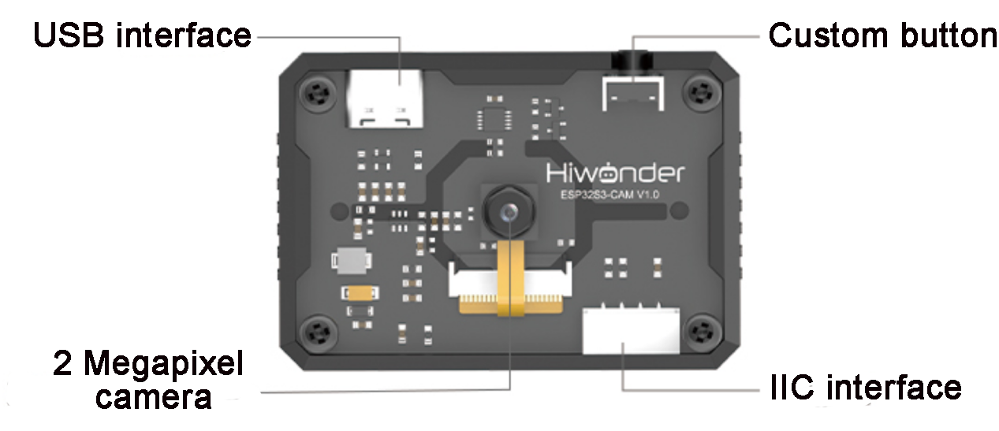

| **Interface Name** |                  **Interface Description**                   |
| :----------------: | :----------------------------------------------------------: |
|  USB Serial Port   |          Serial communication, firmware programming          |
|   Custom Button    |       Allows customization of the button event in code       |
|   IIC Interface    | Secondary development interface, connects with the main controller |

* **ESP32-S3 Image Coordinate Framework**

Here are a few important points to note about the module's image coordinate system:

(1) The origin is positioned at the center of the screen, not at the top-left corner.

(2) The Y-axis direction is opposite to that of a typical Cartesian coordinate system.

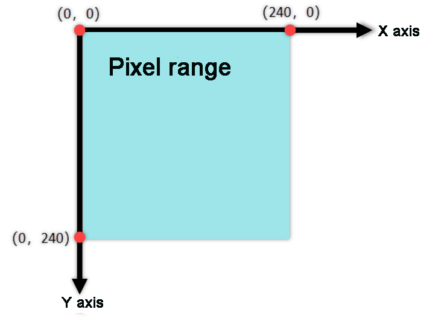

(3) Important Notes:

① Ensure that the module is supplied with at least 5V 2A to avoid potential image distortion.

②  The module comes with the default firmware pre-installed, which supports image transmission. No additional downloads are provided. If you need to reflash with different firmware, please proceed carefully.

### 6.4.2 Image Transmission

:::{Note}

The image transmission firmware is pre-installed at the factory. If you flash other firmware for different functionalities, you will need to reflash the image transmission firmware to enable this feature.

:::

In this section, connect to the hotspot created by the ESP32-S3 vision module and visit the provided URL to view the real-time video feed from the camera.

* **Program Download**

[Image Transmission Python Example](../_static/source_code/05/Image%20Transmission%20Python%20Example.zip)

(1) ESP32-S3 Vision Module Firmware Download 

① Connect the ESP32-S3 vision module to your computer using a Type-C data cable.

② Extract the ZIP file "**[flash_download_tool_3.9.7](https://docs.hiwonder.com/projects/Tonybot/en/latest/docs/resources_download.html)**" located in the same folder, then double-click "**flash_download_tool_3.9.7.exe**" to open the program.


③ In the opened window, configure it as shown below.

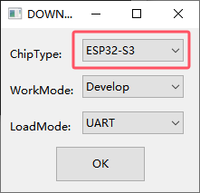

④ In the flashing interface, click  to select the firmware file ("**02 Image Transmission Firmware & Flash Tool\image_transmit.bin**"), then configure the settings according to the image below.


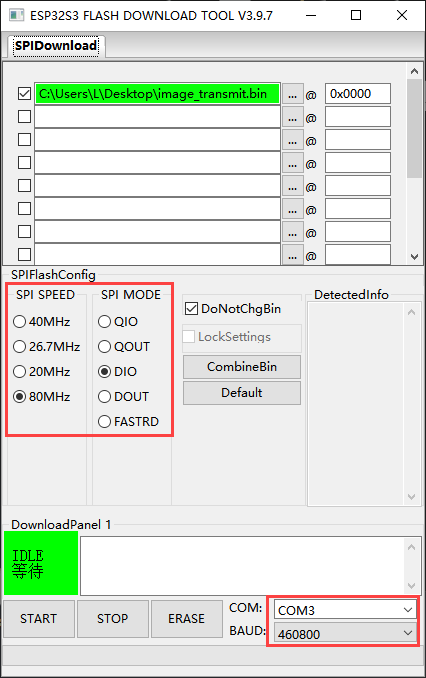

⑤ Choose the correct port number (do not select COM1, as this will cause the flashing to fail).

⑥ Click **"ERASE"** to erase the existing firmware (this step is essential), then click "**START**" to begin the flashing process.

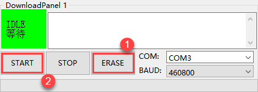

⑦ Wait for a completion message to appear.

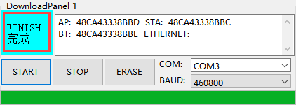

⑧ Once flashing is complete, disconnect the Type-C data cable and restart the device.

(2) Python Program Download

① Open the **"main.py"** file located in the **"03 Image Transmission Python Example"** folder in your Python editor.

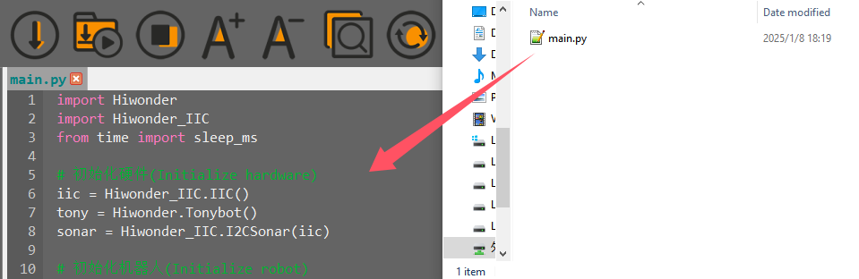

② Power on the device and connect it to your computer using a Type-C data cable.

③ In the Python editor, click  to establish the connection. Once successful, you will see a confirmation prompt.


④ Click  to transfer the program to the Tonybot robot.

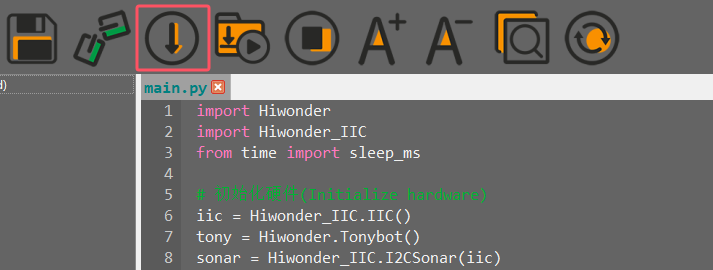

⑤ After the download is complete, restart the device to begin running the program.


* **Device Connection**

(1) Power on the device (before powering on, ensure that the vision module has been installed on the robot, as described in section [5.4.1 Overview and Installation of ESP32S3 Vision Module](#anchor_5_4_1).

(2) Locate the hotspot generated by the module: **HW_ESP32S3CAM** and connect to it.

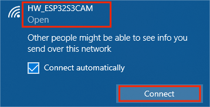

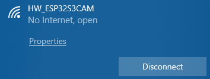

* **Image Transmission Implementation**

Open a browser (this works on both mobile and PC browsers; we'll use a PC as an example) and enter "**192.168.5.1**" in the address bar, then press Enter. On the resulting page, click  to access the camera's live transmission interface.

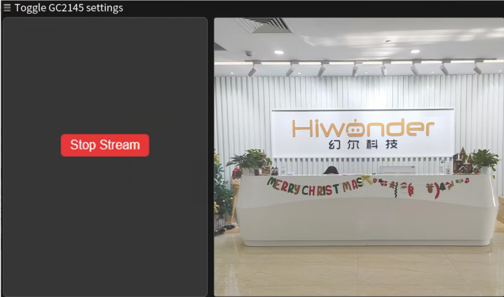

### 6.4.3 Color Recognition Project

* **Assembly**

  

* **Project Introduction**

Tonybot, equipped with the ESP32-S3 vision module, can recognize red, green, and blue objects, while also controlling the RGB lights and displaying information on the dot matrix display.

* **Program Implementation Process**


* **Module Introduction**

(1) ESP32-S3 Vision Module

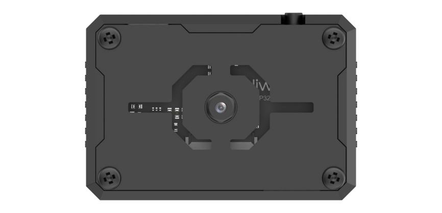

The ESP32-S3 Vision Module is a compact camera module that can function as a standalone system. It captures images with its built-in camera, processes the data using the ESP32 microcontroller, and wirelessly transmits it via Wi-Fi. With support for various communication protocols and low-power features, this module is widely used in a range of IoT applications.

To get the detailed installation guide, please refer to '5.4.1 Overview and Installation of ESP32S3 Vision Module'.

(2) LED Dot Matrix Module

The LED dot matrix module features a high-brightness display, flicker-free operation, and easy wiring. It is capable of displaying numbers, text, graphics, and other content. The module consists of two 8x8 red LED matrices, controlled by the TM640B driver chip, enabling full control of the display.

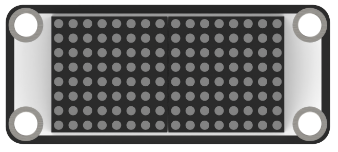

For installation and wiring details, please refer to "**01 Dot Matrix Display Installation**" in this directory.

* **Program Download**

(1) ESP32-S3 Vision Module Program Download

[ESP32S3 Color Recognition Example](../_static/source_code/05/ESP32S3%20Color%20Recognition%20Example.zip)

① Connect the ESP32-S3 to your computer using a Type-C data cable.

② Open the program file **"ESP32S3 Color Recognition Example/ ESP32S3_ColorDetection/ ESP32S3_ColorDetection.ino"** located in the same directory as this document.


③ Select the **"ESP32S3 Dev Module"** as the target board.

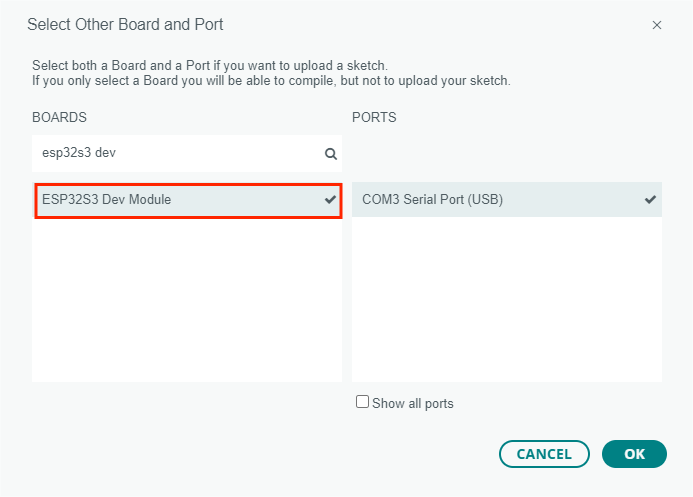

④ In the **"Tools"** menu, configure the ESP32-S3 development board settings as shown in the image below. (This configuration is only required for the first use. It does not need to be repeated for subsequent uses.)

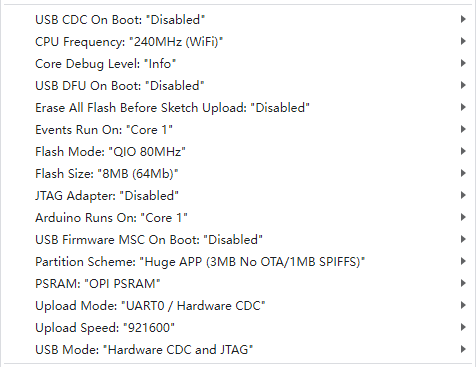

⑤ Click  to transfer the code to the ESP32-S3 and wait for the flashing process to complete.


(2) Python Program Download

[Color Recognition Python Program](../_static/source_code/05/Color%20Recognition%20Python%20Program.zip)

① Open the **"04 Color Recognition Python Program\main.py"** file from the same directory in your Python editor.

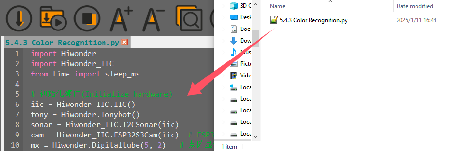

② Power on the device and connect it to your computer using a Type-C data cable.

③ Click  in the Python editor to establish the connection. Once the connection is successful, a confirmation prompt will appear.


④ Click  to upload the program to the Tonybot robot.

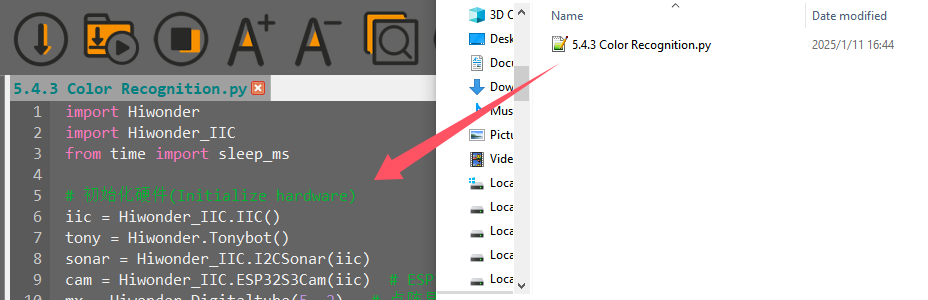

⑤ After the upload is complete, a success prompt will be displayed.


⑥ In the **"Devices"** list, rename the file **"color_recognition.py"** to **"main.py".** Then, restart the device to execute the program.


* **Achieved Effect**

(1) When the vision module detects red, the RGB on the ultrasonic module will light up red, and the dot matrix module will display the word "**Red**" scrolling.

(2) When the vision module detects blue, the RGB on the ultrasonic module will light up blue, and the dot matrix module will display the word "**Blue**" scrolling.

(3) When the vision module detects green, the RGB on the ultrasonic module will light up green, and the dot matrix module will display the word "**Green**" scrolling.

(4) If the vision module does not detect any color, both the RGB on the ultrasonic module and the dot matrix module will turn off.


* **Program Analysis**

**(1) Initialization Program**

① Initialize the I2C interface, sensors, and vision module hardware interfaces.

{lineno-start=5}

```
# 初始化硬件(Initialize hardware)
iic = Hiwonder_IIC.IIC()
tony = Hiwonder.Tonybot()
sonar = Hiwonder_IIC.I2CSonar(iic)
cam = Hiwonder_IIC.ESP32S3Cam(iic)  # ESP32S3Cam通讯对象(ESP32S3Cam communication object)
mx = Hiwonder.Digitaltube(5, 2)   # 点阵显示模块(Dot matrix display module)
sonar.setRGB(0, 0, 0, 0)
```

② Initialize the robot's initial posture and set the servo rotation angles.

{lineno-start=13}

```
# 初始化机器人(Initialize robot)
tony.runActionGroup(0, 1)  # 初始化机器人姿态(Initialize robot posture)
tony.attachHead()          # 设定舵机控制io口(Set up servo control IO port)
tony.moveHeadAngle(90)
sleep_ms(200)             # 等待底板初始化完毕(Wait for the base board initialization to complete)
tony.detachHead()         # 失能舵机接口(Disable the servo interface)

sleep_ms(2000)

print("start.")
```

**(2) Main Program**

① In the main loop, retrieve the color detection data and determine the recognized color based on the results. If no color is detected, clear the display on the dot matrix module. When red, green, or blue is detected, display the corresponding color name in English on the dot matrix module.

{lineno-start=48}

```
# 主循环(Main loop)
while True:
    # 获取颜色检测数据(Get color detection data)
    res = colorDetect()
    
    if res == 0:  # 无检测到(No color detected)
        mx.clear()
        
    elif res == 1:  # 检测到红色(Red detected)
        display_color("Red")
        
    elif res == 2:  # 检测到绿色(Green detected)
        display_color("Green")
        
    elif res == 3:  # 检测到蓝色(Blue detected)
        display_color("Blue")
        
    sleep_ms(100)  # 注意需要给相应的延时(Note: Proper delay is required)
```

② The `display_color()` function updates the content on the dot matrix module. It uses the drawStr() function to display the passed text on the module.

{lineno-start=24}

```
def display_color(text):
    """显示颜色文字(Display color text)"""
    str_len = len(text)
    for i in range(16, -str_len*6, -1):  # 滚动显示(Scrolling display)
        mx.drawStr(0 , i, text)
        sleep_ms(40)      # 滚动速度(Scrolling speed)
    sleep_ms(200)
```

③ The `colorDetect()` function handles color detection. It retrieves the detection results for red, green, and blue. The value in res\[2\] indicates the width of the detected color. If the width is greater than 0, the color is considered detected, and the corresponding color ID is returned.

{lineno-start=32}

```
def colorDetect():
    """颜色检测函数(Color detection function)"""
    res = cam.read_color(1)
    if res is not None:
        if res[2] > 0:
            return 1
    res = cam.read_color(2)
    if res is not None:
        if res[2] > 0:
            return 2
    res = cam.read_color(3)
    if res is not None:
        if res[2] > 0:
            return 3
    return 0
```

* **FAQ**

**Q: The color detected by the camera is inaccurate or incorrectly recognized.**  

**A:** To improve detection accuracy, minimize background noise and complexity. It is recommended to use a solid-colored or simple background.

### 6.4.4 Color Tracking Project

* **Project Introduction**

Tonybot, equipped with the ESP32-S3 vision module, tracks a red ball while the robot's head follows the ball's movement direction.

* **Program Implementation Process**


* **Module Introduction**

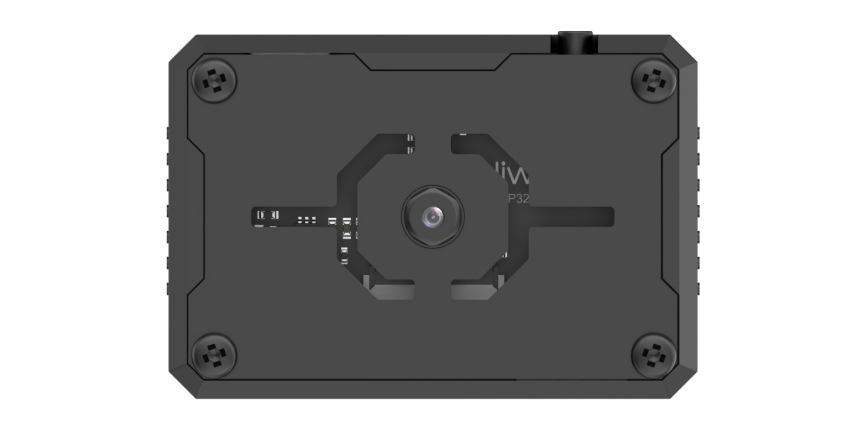

The ESP32-S3 Vision Module is a compact camera module that can function as a standalone system. It captures images with its built-in camera, processes the data using the ESP32 microcontroller, and wirelessly transmits it via Wi-Fi. With support for various communication protocols and low-power features, this module is widely used in a range of IoT applications.

To get the detailed installation guide, please refer to [**5.4.1 Overview and Installation of ESP32S3 Vision Module**](#anchor_5_4_1).

* **Program Download**

[ESP32S3 Color Recognition Example](../_static/source_code/05/ESP32S3%20Color%20Recognition%20Example.zip)

(1) ESP32-S3 Vision Module Program Download

① Connect the ESP32-S3 to your computer using a Type-C data cable.

② Open the program file **"03 ESP32S3 Color Recognition Example/ ESP32S3_ColorDetection/ ESP32S3_ColorDetection.ino"** located in the same directory as this document.


③ Select the **"ESP32S3 Dev Module"** as the target board.


④ In the **"Tools"** menu, configure the ESP32-S3 development board settings as shown in the image below. (This configuration is only required for the first use. It does not need to be repeated for subsequent uses.)


⑤ Click  to transfer the code to the ESP32-S3 and wait for the flashing process to complete.


(2) Python Program Download

[Color Follow Python Program](../_static/source_code/05/Color%20Follow%20Python%20Program.zip)

① Open the **"03 Color Tracking Python Example/main.py"** file from the same directory in your Python editor.

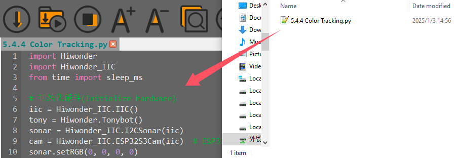

② Power on the device and connect it to your computer using a Type-C data cable.

③ Click  in the Python editor to establish the connection. Once the connection is successful, a confirmation prompt will appear.


④ Click  to upload the program to the Tonybot robot.


⑤ After the upload is complete, a success prompt will be displayed.


⑥ In the **"Devices"** list, rename the file "**color_follow.py**" to "**main.py**". Then, restart the device to execute the program.


* **Achieved Effect**

When a red ball is moved in front of the ESP32-S3 vision module camera, the robot's head will move in response to the ball's movement.


* **Program Analysis**

(1) Initialization Program

① Initialize the I2C interface, sensors, and vision module hardware interfaces.

{lineno-start=5}

```
# 初始化硬件(Initialize hardware)
iic = Hiwonder_IIC.IIC()
tony = Hiwonder.Tonybot()
sonar = Hiwonder_IIC.I2CSonar(iic)
cam = Hiwonder_IIC.ESP32S3Cam(iic)  # ESP32S3Cam通讯对象(ESP32S3Cam communication object)
sonar.setRGB(0, 0, 0, 0)
```

② Initialize the robot's initial posture and servo angles, then turn off the RGB lights on the ultrasonic module.

{lineno-start=12}

```
# 初始化机器人(Initialize robot)
tony.runActionGroup(0, 1)  # 初始化机器人姿态(Initialize robot posture)
tony.attachHead()          # 设定舵机控制io口(Set up servo control IO port)
tony.moveHeadAngle(90)
sleep_ms(200)             # 等待底板初始化完毕(Wait for base board initialization to complete)
sonar.setRGB(0, 0, 0, 0)  # 关闭LED(Turn off the LED)
sleep_ms(2000)
```

(2) Main Program

① First, define global variables to set the left and right boundaries for detection and the servo's rotation step size.

{lineno-start=22}

```
# 全局变量(Global variables)
left = 90        # 左边界阈值(Left boundary threshold)
right = 150      # 右边界阈值(Right boundary threshold)
dev = 4         # 转动角度步长(Rotation angle step)
angle = 90      # 舵机角度(Servo angle)
```

② In the main program, retrieve the recognition results from the vision module. Use the x-axis coordinate of the top-left corner of the detected face (result\[0\]) and the width of the face area (result\[2\]) to calculate the x-coordinate of the face's center. Based on the center point's x-coordinate, adjust the servo's rotation angle. If the center point's x-coordinate is greater than the "**right**" boundary, the face is shifted to the right, and the servo should rotate right. If the center point's x-coordinate is less than the "**left**" boundary, the face is shifted to the left, and the servo should rotate left.

{lineno-start=28}

```
# 主循环(Main loop)
while True:
    # 获取识别结果(Get recognition result)
    result = cam.read_color(1)
    if result:
        # 计算x中心(Calculate x-center)
        x = result[0] + result[2]//2
        print(x)
        
        # 若偏右(If biased to the right)
        if x > right:
            dev = int((x - right)*0.04)
            angle = max(0, angle - dev)
            
        # 若偏左(If biased to the left)
        elif x < left:
            dev = int((left - x)*0.04)
            angle = min(180, angle + dev)
            
        # 设置舵机角度(Set servo angle)
        tony.moveHeadAngle(angle)
        
    sleep_ms(100)  # 注意需要给相应的延时(Note: Proper delay is required)
```

* **FAQ**

Q: The color detected by the camera is inaccurate or incorrectly recognized.

A: To enhance accuracy, reduce background noise and complexity. It is recommended to use a solid-colored or simple background.

### 6.4.5 Face Recognition Project

* **Project Introduction**

This section demonstrates how the ESP32-S3 vision module detects faces. When a face is recognized, the robot performs a waving gesture to greet the person.

* **Program Implementation Process**

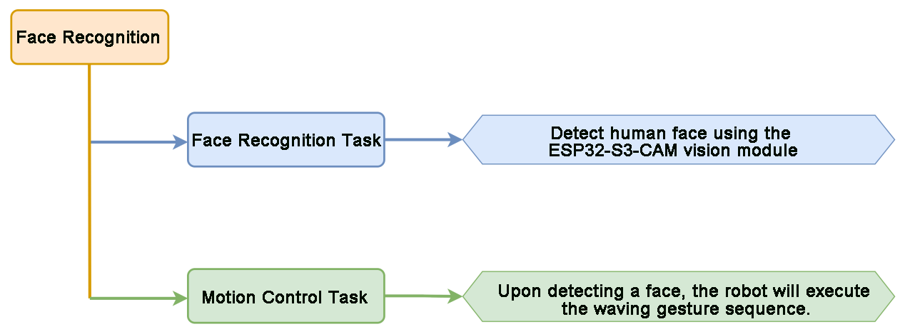

* **Module Introduction**

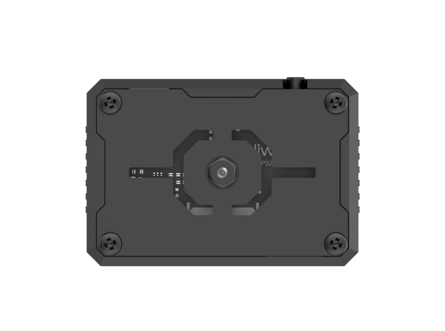

The ESP32-S3 Vision Module is a compact camera module that can function as a standalone system. It captures images with its built-in camera, processes the data using the ESP32 microcontroller, and wirelessly transmits it via Wi-Fi. With support for various communication protocols and low-power features, this module is widely used in a range of IoT applications.

To get the detailed installation guide, please refer to [**5.4.1 Overview and Installation of ESP32S3 Vision Module**](#anchor_5_4_1).

* **Program Download**

[ESP32S3 Face Detection Example](../_static/source_code/05/ESP32S3%20Face%20Detection%20Example.zip)

(1) ESP32-S3 Vision Module Program Download

① Connect the ESP32-S3 to your computer using a Type-C data cable.

② Open the program file **"ESP32S3 Face Detection Example/ ESP32S3_FaceDetection/ ESP32S3_FaceDetection.ino"** located in the same directory as this document.

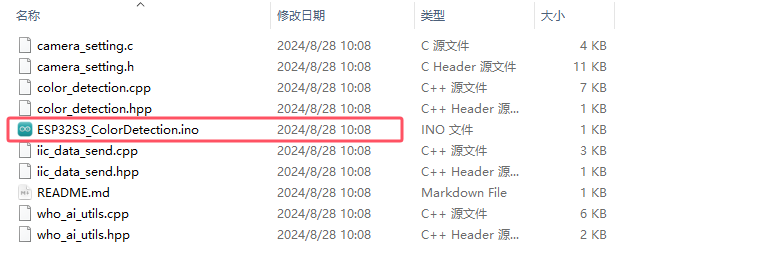

③ Select the **"ESP32S3 Dev Module"** as the target board.


④ In the "**Tools**" menu, configure the ESP32-S3 development board settings as shown in the image below. (**This configuration is only required for the first use. It does not need to be repeated for subsequent uses.**)


⑤ Click  to transfer the code to the ESP32-S3 and wait for the flashing process to complete.


⑥ After the flashing is complete, disconnect the Type-C data cable.

(2) Python Program Download

[Face Recognition Python Example](../_static/source_code/05/Face%20Recognition%20Python%20Example.zip)

① Open the **"03 Face Recognition Python Example/facial_recognition.py"** file from the same directory in your Python editor.

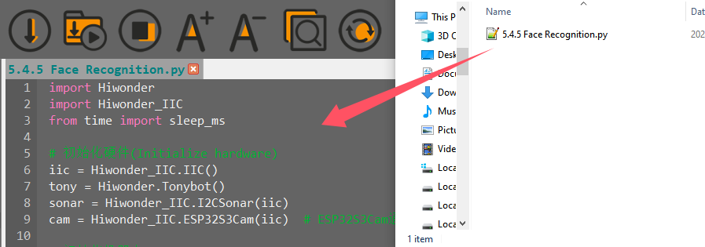

② Power on the device and connect it to your computer using a Type-C data cable.

③ Click  in the Python editor to establish the connection. Once the connection is successful, a confirmation prompt will appear.


④ Click  to upload the program to the Tonybot robot.

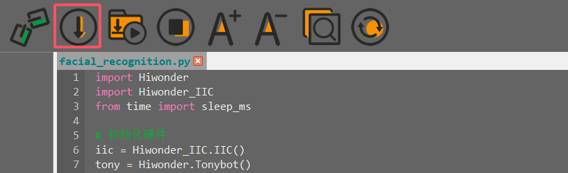

⑤ After the upload is complete, a success prompt will be displayed.


⑥ In the "**Devices**" list, rename the file "**facial_recognition.py**" to "**main.py**". Then, restart the device to execute the program.


* **Achieved Effect**

Upon detecting a face, the robot will perform a waving gesture sequence to greet.


* **Program Analysis**

[Face Recognition Python Example](../_static/source_code/05/Face%20Recognition%20Python%20Example.zip)

(1) Initialization Program

① Initialize the I2C interface, sensors, and vision module hardware interfaces.

{lineno-start=5}

```
# 初始化硬件(Initialize hardware)
iic = Hiwonder_IIC.IIC()
tony = Hiwonder.Tonybot()
sonar = Hiwonder_IIC.I2CSonar(iic)
cam = Hiwonder_IIC.ESP32S3Cam(iic)  # ESP32S3Cam通讯对象(ESP32S3Cam communication object)
```

② Initialize the robot's initial posture and servo angles, then turn off the RGB lights on the ultrasonic module.

{lineno-start=11}

```
# 初始化机器人(Initialize robot)
tony.runActionGroup(0, 1)  # 初始化机器人姿态(Initialize robot posture)
tony.attachHead()          # 设定舵机控制io口(Set up servo control IO port)
tony.moveHeadAngle(90)
sleep_ms(200)             # 等待底板初始化完毕(Wait for base board initialization to complete)
tony.detachHead()         # 失能舵机接口(Disable servo interface)
sonar.setRGB(0, 0, 0, 0)  # 关闭LED(Turn off the LED)
sleep_ms(2000)
```

(2) Main Program

In the main program, retrieve the recognition results from the vision module. If the recognition result is valid (not empty), execute the waving gesture.

{lineno-start=22}

```
# 主循环(Main loop)
while True:
    # 获取人脸检测结果(Get face detection result)
    result = cam.read_face()
    
    # 若识别到人脸(If a face is detected)
    if result is not None:
        tony.runActionGroup(9, 1)  # 执行招手动作(Perform a waving action)
        sleep_ms(3000)
        cam.read_face()  # 清除缓存数据(Clear the cached data)
        
    sleep_ms(100)  # 注意需要给相应的延时(Note: Proper delay is required)
```

### 6.4.6 Vision Line Following Project

* **Project Introduction**

Tonybot, equipped with the ESP32-S3 vision module, detects red lines and follows their path. The robot moves accordingly, adjusting its position to stay aligned with the detected lines in its field of view.

* **Program Implementation Process**

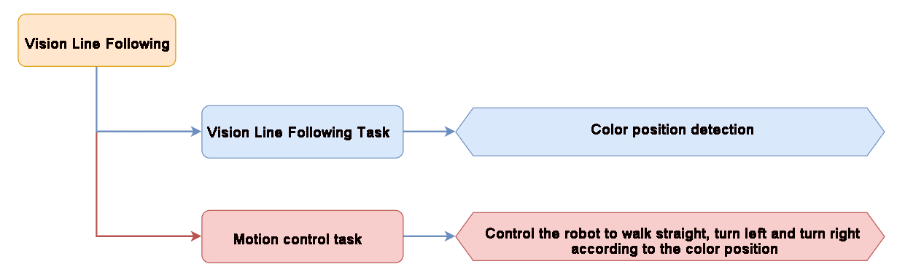

* **Module Introduction**


The ESP32-S3 Vision Module is a compact camera module that can function as a standalone system. It captures images with its built-in camera, processes the data using the ESP32 microcontroller, and wirelessly transmits it via Wi-Fi. With support for various communication protocols and low-power features, this module is widely used in a range of IoT applications.

To get the detailed installation guide, please refer to '5.4.1 Overview and Installation of ESP32S3 Vision Module'.

* **Program Download**

[ESP32S3 Color Recognition Example](../_static/source_code/05/ESP32S3%20Color%20Recognition%20Example.zip)

(1) ESP32-S3 Vision Module Program Download

① Connect the ESP32-S3 to your computer using a Type-C data cable.

② Open the program file **"ESP32S3 Color Recognition Example/ ESP32S3_ColorDetection/ ESP32S3_ColorDetection.ino"** located in the same directory as this document.


(2) Select the **"ESP32S3 Dev Module"** as the target board.


(3) In the **"Tools"** menu, configure the ESP32-S3 development board settings as shown in the image below. (**This configuration is only required for the first use. It does not need to be repeated for subsequent uses.**)


④ Click  to transfer the code to the ESP32-S3 and wait for the flashing process to complete.


⑤ After the flashing is complete, disconnect the Type-C data cable.

(2) Python Program Download

[Vision Line Following Python Example](../_static/source_code/05/Vision%20Line%20Following%20Python%20Example.zip)

① Open the "**Vision Line Following Python Example/facial_recognition.py**" file from the same directory in your Python editor.

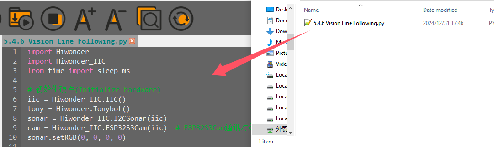

② Power on the device and connect it to your computer using a Type-C data cable.

③ Click  in the Python editor to establish the connection. Once the connection is successful, a confirmation prompt will appear.


④ Click  to upload the program to the Tonybot robot.

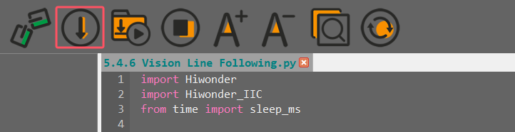

⑤ After the upload is complete, a success prompt will be displayed.


⑥ In the **"Devices"** list, rename the file **"visual_patrol.py"** to **"main.py".** Then, restart the device to execute the program.


* **Achieved Effect**

The robot's vision module will conduct line-following movements along red lines.


* **Program Analysis**

[Vision Line Following Python Example](../_static/source_code/05/Vision%20Line%20Following%20Python%20Example.zip)

(1) Initialization Program

① Initialize the I2C interface, sensors, and vision module hardware interfaces.

{lineno-start=5}

```
# 初始化硬件(Initialize hardware)
iic = Hiwonder_IIC.IIC()
tony = Hiwonder.Tonybot()
sonar = Hiwonder_IIC.I2CSonar(iic)
cam = Hiwonder_IIC.ESP32S3Cam(iic)  # ESP32S3Cam通讯对象(ESP32S3Cam communication object)
sonar.setRGB(0, 0, 0, 0)
```

② Initialize the robot's initial posture and servo angles, then turn off the RGB lights on the ultrasonic module.

{lineno-start=23}

```
# 初始化机器人(Initialize robot)
tony.runActionGroup(0, 1)  # 初始化机器人姿态(Initialize robot posture)
tony.attachHead()          # 设定舵机控制io口(Set up servo control IO port)
tony.moveHeadAngle(90)
sleep_ms(200)             # 等待底板初始化完毕(Wait for base board initialization to complete)
sonar.setRGB(0, 0, 0, 0)  # 关闭LED(Turn off the LED)
sleep_ms(2000)
```

**(2) Main Program**

① Define the action group ID and set the detection threshold.

{lineno-start=12}

```
# 动作组定义(Action group definitions)
TURN_RIGHT = 66    # 右转动作组(Right turn action group)
TURN_LEFT = 65     # 左转动作组(Left turn action group)
GO_STRAIGHT = 63   # 直走动作(Go straight action)
RETREAT = 22       # 后退动作(Retreat action)
TRANSITION = 18    # 过渡动作（右倾）(Transition action (right tilt))

# 阈值定义(Threshold definitions)
LEFT_MIN = 300//2 - 40   # 左临界值(Left threshold)
RIGHT_MAX = 300//2 + 40  # 右临界值(Right threshold)
```

② In the main loop, obtain the recognition result of color ID1. If the result is not empty, calculate the x-coordinate of the center point and pass it to the body_follow function for further processing.

{lineno-start=75}

```
# 主循环 (Main loop)
while True:
    # 获取线条位置 (Get line position)
    result = cam.read_color(3)
    if result is not None:
        # 计算x中心 (Calculate the x center)
        x = result[0] + result[2]/2
        body_follow(x)
    sleep_ms(50)  # 注意需要给相应的延时 (Note: Proper delay is required)
```

③ In the movement function, first check if there is any ongoing action. If no action is being executed, determine the position of the line based on the x-coordinate. If the x-coordinate is within the left and right boundary thresholds, execute the straight movement action group.

{lineno-start=35}

```
def body_follow(x):
    """机体运动函数(Body movement function)"""
    global step
    print(x)
    # 
    if not tony.isRunning():  # 若无动作进行(If no action is running)
        if step == 0:
            # 在中间，直走(In the middle, go straight)
            if LEFT_MIN < x < RIGHT_MAX:
                tony.runActionGroup(GO_STRAIGHT, 1)
                sleep_ms(850)
```

④ If the x-coordinate of the center point is smaller than the left boundary (or greater than the right boundary), execute the left turn (or right turn) action group. At the same time, set the step variable to 1 (or 2). The step variable will be used for subsequent position checking after the robot completes the turn.

{lineno-start=46}

```
            # 左偏，左转 (Deviating to the left, Turn left)
            elif 0 < x < LEFT_MIN:
                tony.runActionGroup(TURN_LEFT, 2)
                sleep_ms(2700)
                step = 1
            # 右偏(Deviating to the right)
            else:
                tony.runActionGroup(TURN_RIGHT, 2)
                sleep_ms(2850)
                step = 2
```

⑤ When step=1, recheck the robot's position. If the line is still to the left, continue executing the left turn action group. Otherwise, execute the straight movement action group to make the robot move forward. The same process applies when step=2.

{lineno-start=51}

```
            # 右偏(Deviating to the right)
            else:
                tony.runActionGroup(TURN_RIGHT, 2)
                sleep_ms(2850)
                step = 2
        elif step == 1:  # 左偏 (Deviating to the left)
            if 0 < x < LEFT_MIN:  # 未调整(Not adjusted)
                tony.runActionGroup(TURN_LEFT, 1)
                sleep_ms(1350)
            else:
                tony.runActionGroup(GO_STRAIGHT, 1)
                sleep_ms(900)
                step = 0
        elif step == 2:  # 右偏 （Deviating to the right）
            if x > RIGHT_MAX:  # 未调整 (Not adjusted)
                tony.runActionGroup(TURN_RIGHT, 1)
                sleep_ms(1450)
            else:
                tony.runActionGroup(GO_STRAIGHT, 1)
                sleep_ms(900)
                step = 0
        else:
            step = 0
```

* **FAQ**

Q: The color recognized by the camera is inaccurate or misidentified.  

A: To improve accuracy, minimize background clutter by using a monochromatic background or a simple environment.

## 6.5 IoT (Internet of Things)  Course

[Tonybot IOT Example](../_static/source_code/05/Tonybot%20IOT%20Example.zip)

### 6.5.1 Module Installation & Wiring

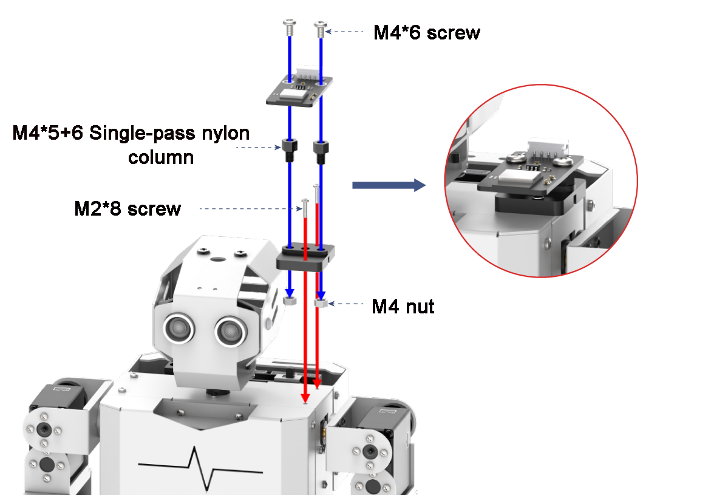


<p id="program_download_5_2"></p>

### 6.5.2 Program Download

* **Vision Module Program Download**

This section provides a step-by-step guide for downloading the ESP32-S3 vision module program, using the face detection program as an example. The process for downloading the color recognition program is identical to that of the face detection program.

(1) Program Download

① Connect the ESP32-S3 to your computer using a Type-C data cable.

② Open the program file "**02 Face Detection Porgram/FaceDetection/FaceDetection.ino**" located in the same directory as this document.

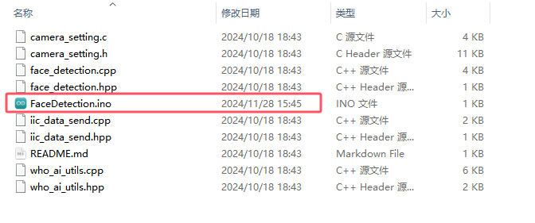

③ Select the **"ESP32S3 Dev Module"** as the target board.


④ In the "**Tools**" menu, configure the ESP32-S3 development board settings as shown in the image below. (**This configuration is only required for the first use. It does not need to be repeated for subsequent uses.**)


⑤ Click  to transfer the code to the ESP32-S3 and wait for the flashing process to complete.


⑥ After the flashing is complete, disconnect the Type-C data cable.

* **Tonybot IOT Program Download Instructions**

(1) Preparation and Precautions

Before downloading the program, ensure that Tonybot is powered on and connected via a Type-C data cable. Failure to do so may result in the port not being detected.

(2) Program Download

① Open the "03 **Tonybot IOT** Example/**Tonybot_IoT.py**" file from the same directory in your Python editor.

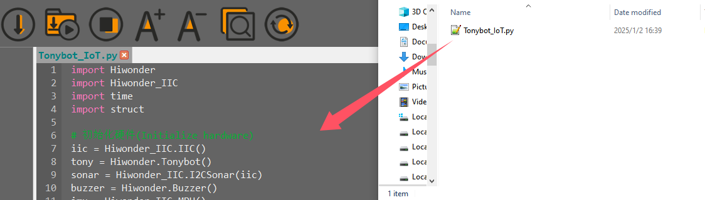

② Power on the device and connect it to your computer using a Type-C data cable.

③ Click  in the Python editor to establish the connection. Once the connection is successful, a confirmation prompt will appear.


④ Click  to upload the program to the Tonybot robot.

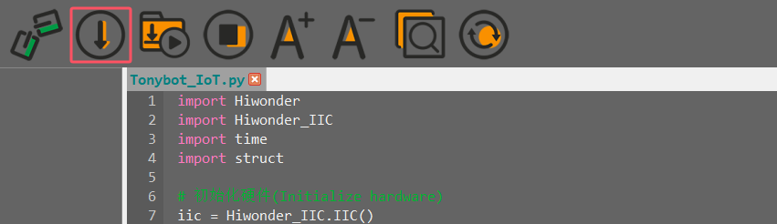

⑤ After the upload is complete, a success prompt will be displayed.


⑥ In the "**Devices**" list, rename the file "**Tonybot_IoT.py**" to "**main.py**". Then, restart the device to execute the program.


* **Achieved Effect**

After opening the app, you can control Tonybot to perform functions such as face detection alerts, unknown object alerts, and collision alerts for unidentified items. For detailed operational instructions, please refer to section "**5.5.3 App Usage Instruction**".

### 6.5.3 App Usage Instruction

* **App Installation**

For iOS users: Simply search for "[**IoT Control**](https://apps.apple.com/us/app/iot-control-hiwonder/id6738712087)" in the App Store and download it.

For Android users: You can find the "[**IoT Control**](https://play.google.com/store/apps/details?id=com.hiwonder.mechdogiot)", or refer to the appendix to download and install it on your phone.

* **App Connection**

:::{Note}

Before using the app, make sure that Wi-Fi and location services are enabled in your phone's settings. This section demonstrates using the Android version of the app, but the steps are the same for the iOS version.

:::

(1) Power on the Tonybot, then open the **"IoT Control"** app on your phone.

(2) Tap  in the top-right corner, select **"IOT_Tonybot"** from the Wi-Fi list, and enter the password **"12345678"** to connect.

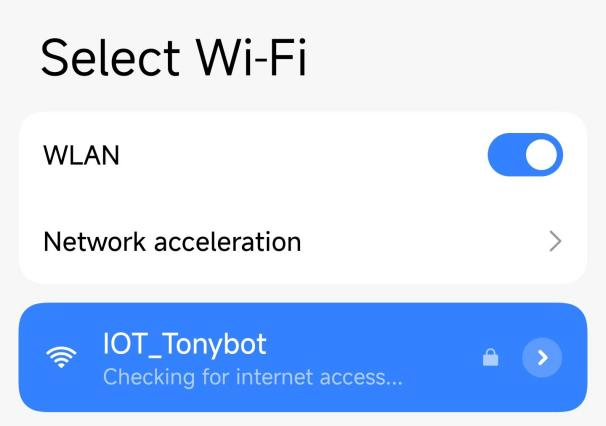

(3) Once connected, the Wi-Fi icon in the top-right corner will become solid.

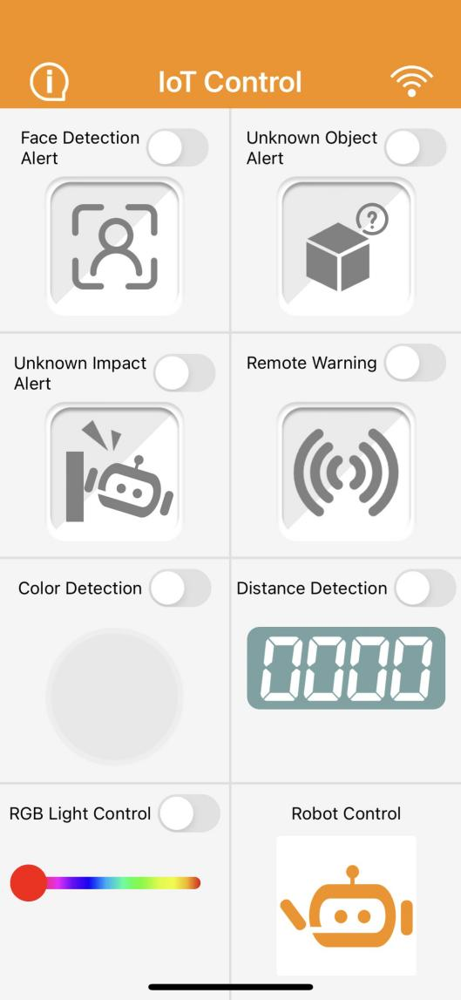

* **Control Overview**

The app provides 8 different modes: Face Detection Alert, Unknown Object Alert, Unknown Impact Alert, Remote Warning, Color Detection, Distance Detection, RGB Light Control, and Robot Control.  

A detailed description of each function is provided in the table below:

<table  class="docutils-nobg" border="1">
<colgroup>
<col  />
<col  />
</colgroup>
<tbody>
<tr>
<td ><strong>Icon</strong></td>
<td ><strong>Function</strong></td>
</tr>
<tr>
<td ></td>
<td >When the Tonybot vision module detects a face, the phone will vibrate.<br />
(<strong>Note: This feature requires the face detection program to be pre-installed on the vision module.</strong>)</td>
</tr>
<tr>
<td >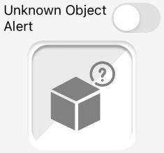</td>
<td >When the Tonybot ultrasonic module detects an object, the buzzer will sound.</td>
</tr>
<tr>
<td ></td>
<td >When an unknown object causes Tonybot to fall, the buzzer will sound.</td>
</tr>
<tr>
<td >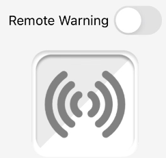</td>
<td >Once activated, the buzzer will continue to sound until Tonybot is upright again.</td>
</tr>
<tr>
<td >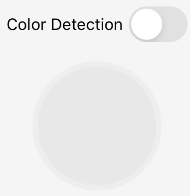</td>
<td >When the Tonybot vision module detects a specific color, the corresponding color will be displayed in the circle below.<br />
(Note: This feature requires the color detection program to be pre-installed on the vision module.)</td>
</tr>
<tr>
<td >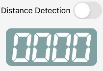</td>
<td >With the Remote Distance Measurement feature enabled, the detected distance will be shown below.</td>
</tr>
<tr>
<td >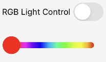</td>
<td >Controls the color of the RGB light on the Tonybot ultrasonic module.</td>
</tr>
<tr>
<td ></td>
<td >Controls Tonybot to execute various action groups.</td>
</tr>
</tbody>
</table>

### 6.5.4 Face Detection Alert Project

* **Project Introduction**

In this section, Tonybot utilizes the ESP32-S3 vision module to detect faces and triggers a vibration alert on the phone upon face detection.

* **Program Implementation Process**


* **Module Introduction**

**(1) ESP32-S3 Vision Module**


The ESP32-S3 Vision Module is a compact camera module that can function as a standalone system. It captures images with its built-in camera, processes the data using the ESP32 microcontroller, and wirelessly transmits it via Wi-Fi. With support for various communication protocols and low-power features, this module is widely used in a range of IoT applications.

To get the detailed installation guide, please refer to '5.5 IoT (Internet of Things) Course/ 5.5.1 WiFi Module Installation & Wiring'.

* **Program Download**

(1) Connect the ESP32-S3 to your computer using a Type-C data cable.

(2) Open the program file "**03 ESP32S3 Face Detection Example/FaceDetection/FaceDetection.ino**" located in the same directory as this document.

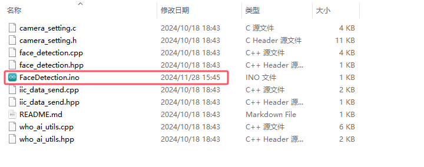

(3) Select the **"ESP32S3 Dev Module"** as the target board.


(4) In the **"Tools"** menu, configure the ESP32-S3 development board settings as shown in the image below.


(5) Click  to transfer the code to the ESP32-S3 and wait for the flashing process to complete.


* **Achieved Effect**

When Tonybot detects a face, the phone will vibrate as an alert.


* **Program Analysis**

(1) Importing Library Files

① Import the necessary libraries: The Hiwonder library includes sensor libraries, low voltage alarm functionality, and more. The time library is used for time-related functions, while the Hiwonder_IIC library facilitates I2C communication with the modules.

{lineno-start=1}

```
import Hiwonder
import Hiwonder_IIC
import time
import struct
```

(2) Hardware Initialization

① Instantiate the hardware components, including enabling I2C communication, creating the Tonybot object, and activating the buzzer.

{lineno-start=6}

```
 
iic = Hiwonder_IIC.IIC()
tony = Hiwonder.Tonybot()
sonar = Hiwonder_IIC.I2CSonar(iic)
buzzer = Hiwonder.Buzzer()
imu = Hiwonder_IIC.MPU()
cam = Hiwonder_IIC.ESP32S3Cam(iic)
```

② Configure the Wi-Fi settings with the name "**IOT_Tonybot**" and the password "**12345678**".

{lineno-start=14}

```
time.sleep_ms(100)
 
iic.writeto(0x69 , "NIOT_Tonybot|||12345678$$$")
time.sleep_ms(1000)
```

③ Initialize the robot's posture, enable the head servo to rotate to 90°, and then disable the servo. Finally, initialize the IMU module.

{lineno-start=19}

```
 
tony.runActionGroup(0, 1)   
tony.attachHead()          
tony.moveHeadAngle(90)
time.sleep_ms(200)             
tony.detachHead()         
time.sleep_ms(1000)           
buzzer.playTone(1500, 100, False)
```

④ Define functions for reading and writing data between the ESP32 and the vision module.

{lineno-start=28}

```
def wifi_send(buf):
  iic.writeto(0x69 , buf)

def wifi_read():
  return iic.readfrom(0x69 , 20)
```

⑤ Define flags and data structures to control function switches and trigger events.

{lineno-start=37}

```
 
onoff_face = False
onoff_undef_obj = False
onoff_hit = False
onoff_color_detec = False
onoff_distance = False

 
warn_face = False
warn_undef_obj = False
warn_hit = False
color_detec_num = 0
sensor_distance = 0
```

**(3) Face Detection Function Analysis**

① First, define and call the function to check the current mode of the vision module, determining whether it is in color recognition or face recognition mode.

{lineno-start=51}

```
def ESP32S3Cam_type():
    
    result = cam.read_color(3)
    time.sleep_ms(100)
    result = cam.read_color(3)
    print(result)
    if result is not None:
      if result[0] != 0x00 and result[0] == result[2]:
        print("type:face")
        cam.read_face()
        return 1
    print("type:color")
    return 2

esp32s3_type = ESP32S3Cam_type()
```

② In the sensor task, when the vision module is set to face recognition, use the onoff_face flag to determine if the face detection alert function is enabled. When enabled, if a face is detected (i.e., if the face width is greater than 0, result\[2\] \> 0), set the warn_face flag to true. Otherwise, set it to false.

{lineno-start=89}

```
    if esp32s3_type == 1:   
        if onoff_face:
            result = cam.read_face()
            print(result)
            if result[2] > 0:
              warn_face = True
            else:
              warn_face = False
        else:
            warn_face = False
```

③ Finally, send the warn_face flag to the mobile app.

{lineno-start=124}

```
    if send_step == 0:
      send_step = 1
       
      wifi_send("CMD|1|{}|{}|{}|$".format(
          1 if warn_face else 0,
          1 if warn_undef_obj else 0,
          1 if warn_hit else 0
      ))
```

### 6.5.5 Unknown Impact Alert

* **Project Introduction**

In this section, Tonybot will trigger a vibration alert on the phone when an object is detected by the IMU sensor.

* **Program Implementation Process**


* **IMU Sensor**


Tonybot is equipped with an on-board IMU sensor, widely used in applications such as handheld gaming devices, 3D controllers, and portable navigation systems. This sensor integrates a 3-axis MEMS gyroscope, a 3-axis MEMS accelerometer, and a Digital Motion Processor (DMP) for advanced motion detection and processing.

* **Program Download**

For instructions on downloading the vision module and Tonybot program, please refer to the "**[5.5.2 Program Download](#program_download_5_2)**" section.

* **Achieved Effect**

When Tonybot is knocked over by an unknown object, the phone will vibrate.


* **Program Analysis**

(1) Importing Library Files

Import the required libraries: The Hiwonder library includes sensor libraries, low voltage alarms, and other functions. The time library is used for time-related operations, while the Hiwonder_IIC library enables I2C communication with the modules.

{lineno-start=1}

```
import Hiwonder
import Hiwonder_IIC
import time
import struct
```

(2) Hardware Initialization

① Instantiate the hardware components, including enabling I2C communication, creating the Tonybot object, and activating the buzzer.

{lineno-start=6}

```
 
iic = Hiwonder_IIC.IIC()
tony = Hiwonder.Tonybot()
sonar = Hiwonder_IIC.I2CSonar(iic)
buzzer = Hiwonder.Buzzer()
imu = Hiwonder_IIC.MPU()
cam = Hiwonder_IIC.ESP32S3Cam(iic)
```

② Set up the Wi-Fi network with the name "**IOT_Tonybot**" and the password "**12345678**".

{lineno-start=14}

```
time.sleep_ms(100)
 
iic.writeto(0x69 , "NIOT_Tonybot|||12345678$$$")
time.sleep_ms(1000)
```

③ Initialize the robot's posture, enable the head servo to rotate to 90°, then disable the servo. Finally, initialize the IMU module.

{lineno-start=19}

```
 
tony.runActionGroup(0, 1)   
tony.attachHead()          
tony.moveHeadAngle(90)
time.sleep_ms(200)             
tony.detachHead()         
time.sleep_ms(1000)           
buzzer.playTone(1500, 100, False)
```

④ Define functions for reading and writing data between the ESP32 and the vision module.

{lineno-start=28}

```
def wifi_send(buf):
  iic.writeto(0x69 , buf)

def wifi_read():
  return iic.readfrom(0x69 , 20)
```

⑤ Create flags and data structures to control function switches and trigger specific actions.

{lineno-start=37}

```
 
onoff_face = False
onoff_undef_obj = False
onoff_hit = False
onoff_color_detec = False
onoff_distance = False

 
warn_face = False
warn_undef_obj = False
warn_hit = False
color_detec_num = 0
sensor_distance = 0
```

* **Unknown Object Collision Alert Function Analysis**

(1) In the sensor task, use the onoff_hit flag to check if the unknown object collision alert function is enabled. When enabled, retrieve the IMU data. If the roll angle is less than 70° or greater than 110°, it indicates that a collision has occurred. In this case, set the warn_hit flag to true; otherwise, set it to false.

{lineno-start=116}

```
     
    if onoff_hit:
        angle = imu.read_angle()
        roll = angle[0]
        warn_hit = True if roll < 70 or roll > 110 else False
    else:
        warn_hit = False
```

(2) Finally, transmit the warn_hit flag to the mobile app.

{lineno-start=124}

```
    if send_step == 0:
      send_step = 1
     
      wifi_send("CMD|1|{}|{}|{}|$".format(
          1 if warn_face else 0,
          1 if warn_undef_obj else 0,
          1 if warn_hit else 0
      ))
```

### 6.5.6 Unknown Object Alert

* **Project Introduction**

This section shows how Tonybot uses the ultrasonic sensor to detect objects and sends a vibration alert to the mobile phone.

* **Program Implementation Process**


* **Module Introduction**


This is a light-emitting ultrasonic distance sensor module that communicates via I2C. It reads the distance measured by the ultrasonic sensor using the I2C protocol.

When measuring distance, the module sends out 8 pulses of 40kHz square waves and checks for any returning signals. If a signal is detected, the module outputs a high-level signal, and the duration of this high signal corresponds to the time taken for the ultrasonic waves to travel to the target and back.

* **Program Download**

For instructions on downloading the vision module and Tonybot program, please refer to the "[**5.5.2 Program Download**](#program_download_5_2)" section.

* **Achieved Effect**

When Tonybot detects an object at a distance of less than 15 cm, the phone will vibrate.


* **Program Analysis**

(1) Importing Library Files

Import the required libraries: The Hiwonder library includes sensor libraries, low voltage alarms, and other functions. The time library is used for time-related operations, while the Hiwonder_IIC library enables I2C communication with the modules.

{lineno-start=1}

```
import Hiwonder
import Hiwonder_IIC
import time
import struct
```

(2) Hardware Initialization

① Instantiate the hardware components, including enabling I2C communication, creating the Tonybot object, and activating the buzzer.

{lineno-start=6}

```
 
iic = Hiwonder_IIC.IIC()
tony = Hiwonder.Tonybot()
sonar = Hiwonder_IIC.I2CSonar(iic)
buzzer = Hiwonder.Buzzer()
imu = Hiwonder_IIC.MPU()
cam = Hiwonder_IIC.ESP32S3Cam(iic)
```

② Set up the Wi-Fi network with the name "**IOT_Tonybot**" and the password "**12345678**".

{lineno-start=14}

```
time.sleep_ms(100)
 
iic.writeto(0x69 , "NIOT_Tonybot|||12345678$$$")
time.sleep_ms(1000)
```

③ Initialize the robot's posture, enable the head servo to rotate to 90°, then disable the servo. Finally, initialize the IMU module.

{lineno-start=19}

```
 
tony.runActionGroup(0, 1)   
tony.attachHead()          
tony.moveHeadAngle(90)
time.sleep_ms(200)             
tony.detachHead()         
time.sleep_ms(1000)           
buzzer.playTone(1500, 100, False)
```

④ Define functions for reading and writing data between the ESP32 and the vision module.

{lineno-start=28}

```
def wifi_send(buf):
  iic.writeto(0x69 , buf)

def wifi_read():
  return iic.readfrom(0x69 , 20)
```

⑤ Create flags and data structures to control function switches and trigger specific actions.

{lineno-start=37}

```
 
onoff_face = False
onoff_undef_obj = False
onoff_hit = False
onoff_color_detec = False
onoff_distance = False

 
warn_face = False
warn_undef_obj = False
warn_hit = False
color_detec_num = 0
sensor_distance = 0
```

* **Unknown Object Alert Function Analysis**

(1) In the sensor task, retrieve the ultrasonic distance measurement. Use the onoff_undef_obj flag to check if the unknown object detection function is enabled. When enabled, if the obstacle distance is less than 200mm, set the warn_undef_obj flag to true; otherwise, set it to false.

{lineno-start=107}

```
    
    sensor_distance = sonar.getDistance() * 10
    
    
    if onoff_undef_obj:
        warn_undef_obj = True if sensor_distance < 200 else False
    else:
        warn_undef_obj = False
```

(2) Finally, send the warn_undef_obj flag to the app.

{lineno-start=124}

```
    if send_step == 0:
      send_step = 1
      
      wifi_send("CMD|1|{}|{}|{}|$".format(
          1 if warn_face else 0,
          1 if warn_undef_obj else 0,
          1 if warn_hit else 0
      ))
```

### 6.5.7 Color Detection Project

* **Project Introduction**

This section allows Tonybot, equipped with the ESP32-S3 vision module, to detect red, green, and blue colors and display the corresponding colors on the mobile phone.

* **Program Implementation Process**

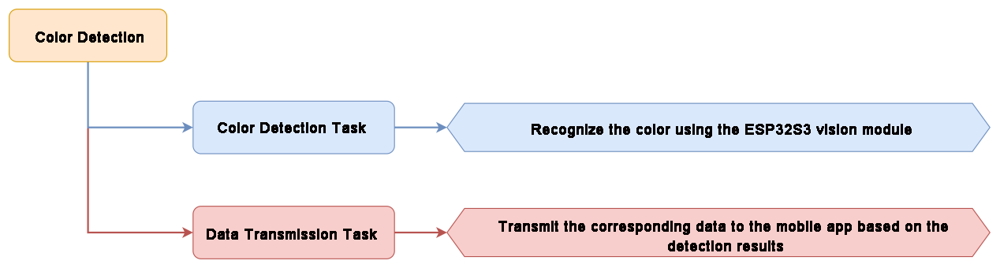

* **Module Introduction**

(1) ESP32-S3 Vision Module

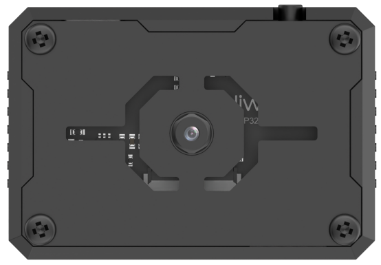

The ESP32-S3 Vision Module is a compact camera module that can function as a standalone system. It captures images with its built-in camera, processes the data using the ESP32 microcontroller, and wirelessly transmits it via Wi-Fi. With support for various communication protocols and low-power features, this module is widely used in a range of IoT applications.

To get the detailed installation guide, please refer to '5.5 IoT (Internet of Things) Course/ 5.5.1 WiFi Module Installation & Wiring'

* **Vision Module Program Download**

(1) Connect the ESP32-S3 to your computer using a Type-C data cable.

(2) Open the program file "02 ESP32S3 Color Recognition Example/ColorDetection/ColorDetection.ino" located in the same directory as this document.

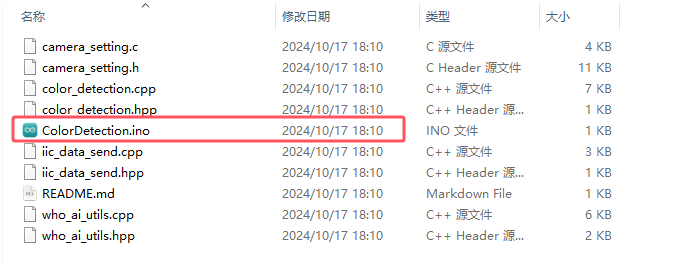

(3) Select the "**ESP32S3 Dev Module**" as the target board.


(4) In the "**Tools**" menu, configure the ESP32-S3 development board settings as shown in the image below.


(5) Click  to transfer the code to the ESP32-S3 and wait for the flashing process to complete.


* **Achieved Effect**

When Tonybot detects red, green, or blue, it sends the data to the app, which then displays the recognized color.


* **Program Analysis**

(1) Importing Library Files

Import the required libraries: The Hiwonder library includes sensor libraries, low voltage alarms, and other functions. The time library is used for time-related operations, while the Hiwonder_IIC library enables I2C communication with the modules.

{lineno-start=1}

```
import Hiwonder
import Hiwonder_IIC
import time
import struct
```

(2) Hardware Initialization

① Instantiate the hardware components, including enabling I2C communication, creating the Tonybot object, and activating the buzzer.

{lineno-start=6}

```
 
iic = Hiwonder_IIC.IIC()
tony = Hiwonder.Tonybot()
sonar = Hiwonder_IIC.I2CSonar(iic)
buzzer = Hiwonder.Buzzer()
imu = Hiwonder_IIC.MPU()
cam = Hiwonder_IIC.ESP32S3Cam(iic)
```

② Configure the Wi-Fi network with the name "**IOT_Tonybot**" and the password "**12345678**".

{lineno-start=14}

```
time.sleep_ms(100)
 
iic.writeto(0x69 , "NIOT_Tonybot|||12345678$$$")
time.sleep_ms(1000)
```

③ Initialize the robot's posture, enable the head servo to rotate to 90°, then disable the servo. Finally, initialize the IMU module.

{lineno-start=19}

```
 
tony.runActionGroup(0, 1)   
tony.attachHead()          
tony.moveHeadAngle(90)
time.sleep_ms(200)             
tony.detachHead()         
time.sleep_ms(1000)            
buzzer.playTone(1500, 100, False)
```

④ Define functions for reading and writing data between the ESP32 and the vision module.

{lineno-start=28}

```
def wifi_send(buf):
  iic.writeto(0x69 , buf)

def wifi_read():
  return iic.readfrom(0x69 , 20)
```

⑤ Create flags and data structures to control function switches and trigger specific actions.

{lineno-start=37}

```
 
onoff_face = False
onoff_undef_obj = False
onoff_hit = False
onoff_color_detec = False
onoff_distance = False

 
warn_face = False
warn_undef_obj = False
warn_hit = False
color_detec_num = 0
sensor_distance = 0
```

**(3) Remote Color Detection Function Analysis**

① First, define and call the function to determine the current mode of the vision module, checking whether it is in color recognition or face recognition mode.

{lineno-start=51}

```
def ESP32S3Cam_type():
   
    result = cam.read_color(3)
    time.sleep_ms(100)
    result = cam.read_color(3)
    print(result)
    if result is not None:
      if result[0] != 0x00 and result[0] == result[2]:
        print("type:face")
        cam.read_face()
        return 1
    print("type:color")
    return 2

esp32s3_type = ESP32S3Cam_type()
```

② In the sensor task, when the vision module is in color recognition mode, use the onoff_color_detec flag to check if the color detection function is enabled. If enabled, retrieve the detected color ID and store it in the color_detec_num variable.

{lineno-start=100}

```
    elif esp32s3_type == 2:  
        if onoff_color_detec:
            color_detec_num = colorDetect()
            print(color_detec_num)
        else:
            color_detec_num = 0
```

The color detection function calls the read_color function to obtain data for red, green, and blue colors, storing the results in the res variable. If valid color data is obtained, return the corresponding color ID.

{lineno-start=67}

```
def colorDetect():
    
    res = cam.read_color(1)
    if res is not None:
        if res[2] > 0:
            return 3
    res = cam.read_color(2)
    if res is not None:
        if res[2] > 0:
            return 1
    res = cam.read_color(3)
    if res is not None:
        if res[2] > 0:
            return 2
    return 0
```

③ In the Wi-Fi reception task, receive the data sent by the mobile app and parse the command and data.

{lineno-start=147}

```
def wifi_receive_Task():
    
    global onoff_face, onoff_undef_obj, onoff_hit, onoff_color_detec, onoff_distance,last_receive,receive_data,buzzer_flag
    
    receive_data = wifi_read()
    if last_receive != receive_data:
        last_receive = receive_data
        rec = receive_data.decode('utf-8')
        print(rec)
        if rec.find("CMD") != -1 and rec.find("$"):
          cmd = rec.split('|')[1:]
          print(cmd)
```

④ When the command is 2, send the detected color ID to the app.

{lineno-start=168}

```
          elif int(cmd[0]) == 2:  
              onoff_color_detec = bool(int(cmd[1]))
```

### 6.5.8 Distance Detection

* **Project Introduction**

This section enables Tonybot to measure the obstacle distance using an ultrasonic sensor and display the distance on the app.

* **Program Implementation Process**


*  **Module Introduction**


This is a light-emitting ultrasonic distance sensor module that communicates via I2C. It reads the distance measured by the ultrasonic sensor using the I2C protocol.

When measuring distance, the module sends out 8 pulses of 40kHz square waves and checks for any returning signals. If a signal is detected, the module outputs a high-level signal, and the duration of this high signal corresponds to the time taken for the ultrasonic waves to travel to the target and back.

* **Program Download**

For instructions on downloading the vision module and Tonybot program, please refer to the "**[5.5.2 Program Download](#program_download_5_2)**" section.

* **Achieved Effect**

Tonybot will continuously monitor the distance to objects and display the measurement on the app.


* **Program Analysis**

(1) Import Library Files

Import the required libraries: The Hiwonder library includes sensor functions, low voltage alarm, and more. The time library is used for time-related operations, and the Hiwonder_IIC library facilitates I2C communication with modules.

{lineno-start=1}

```
import Hiwonder
import Hiwonder_IIC
import time
import struct
```

(2) Hardware Initialization

① Instantiate the hardware components, including enabling I2C communication, creating the Tonybot object, and activating the buzzer.

{lineno-start=6}

```
# 初始化硬件
iic = Hiwonder_IIC.IIC()
tony = Hiwonder.Tonybot()
sonar = Hiwonder_IIC.I2CSonar(iic)
buzzer = Hiwonder.Buzzer()
imu = Hiwonder_IIC.MPU()
cam = Hiwonder_IIC.ESP32S3Cam(iic)
```

② Set up the Wi-Fi network with the name "**IOT_Tonybot**" and the password "**12345678**".

{lineno-start=14}

```
time.sleep_ms(100)
 
iic.writeto(0x69 , "NIOT_Tonybot|||12345678$$$")
time.sleep_ms(1000)
```

③ Initialize the robot's posture, enable the head servo to rotate to 90°, then disable the servo. Finally, initialize the IMU module.

{lineno-start=19}

```
 
tony.runActionGroup(0, 1)  
tony.attachHead()          
tony.moveHeadAngle(90)
time.sleep_ms(200)             
tony.detachHead()         
time.sleep_ms(1000)           
buzzer.playTone(1500, 100, False)
```

④ Define functions for reading and writing data between the ESP32 and the vision module.

{lineno-start=28}

```
def wifi_send(buf):
  iic.writeto(0x69 , buf)

def wifi_read():
  return iic.readfrom(0x69 , 20)
```

⑤ Create flags and data structures to control function switches and trigger specific actions.

{lineno-start=37}

```
 
onoff_face = False
onoff_undef_obj = False
onoff_hit = False
onoff_color_detec = False
onoff_distance = False

 
warn_face = False
warn_undef_obj = False
warn_hit = False
color_detec_num = 0
sensor_distance = 0
```

* **Distance Detection Function Analysis**

(1) First, define and call the function to determine the current mode of the vision module, whether it is in color recognition or face recognition mode.

{lineno-start=51}

```
def ESP32S3Cam_type():
     
    result = cam.read_color(3)
    time.sleep_ms(100)
    result = cam.read_color(3)
    print(result)
    if result is not None:
      if result[0] != 0x00 and result[0] == result[2]:
        print("type:face")
        cam.read_face()
        return 1
    print("type:color")
    return 2

esp32s3_type = ESP32S3Cam_type()
```

(2) First, define and call the function to determine the current mode of the vision module, whether it is in color recognition or face recognition mode.

{lineno-start=107}

```
     
    sensor_distance = sonar.getDistance() * 10
```

(3) When the remote distance switch is enabled, transmit the obstacle distance data to the mobile app.

{lineno-start=132}

```
    elif send_step == 1:
      send_step = 2
      
      if onoff_distance:
          wifi_send("CMD|3|{}|$".format(int(sensor_distance//10)))
    elif send_step == 2:
      send_step = 0
```

### 6.5.9 RGB Light Control

* **Project Introduction**

This section allows you to control the RGB light color of Tonybot's ultrasonic sensor through the app.

* **Program Implementation Process**


* **Module Introduction**


This is a light-emitting ultrasonic distance sensor module that communicates via I2C. It reads the distance measured by the ultrasonic sensor using the I2C protocol.

When measuring distance, the module sends out 8 pulses of 40kHz square waves and checks for any returning signals. If a signal is detected, the module outputs a high-level signal, and the duration of this high signal corresponds to the time taken for the ultrasonic waves to travel to the target and back.

* **Program Download**

For instructions on downloading the vision module and Tonybot program, please refer to the "**[5.5.2 Program Download](#program_download_5_2)**" section.

* **Achieved Effect**

Tonybot will adjust the RGB light color of the ultrasonic sensor according to the commands sent from the app.


* **Program Analysis**

(1) Import Library Files

Import the required libraries: The Hiwonder library includes sensor functions, low voltage alarm, and more. The time library is used for time-related operations, and the Hiwonder_IIC library facilitates I2C communication with modules.

{lineno-start=1}

```
import Hiwonder
import Hiwonder_IIC
import time
import struct
```

(2) Hardware Initialization

① Instantiate the hardware components, including enabling I2C communication, creating the Tonybot object, and activating the buzzer.

{lineno-start=6}

```
# 初始化硬件
iic = Hiwonder_IIC.IIC()
tony = Hiwonder.Tonybot()
sonar = Hiwonder_IIC.I2CSonar(iic)
buzzer = Hiwonder.Buzzer()
imu = Hiwonder_IIC.MPU()
cam = Hiwonder_IIC.ESP32S3Cam(iic)
```

② Set up the Wi-Fi network with the name "**IOT_Tonybot**" and the password "**12345678**".

{lineno-start=14}

```
time.sleep_ms(100)
 
iic.writeto(0x69 , "NIOT_Tonybot|||12345678$$$")
time.sleep_ms(1000)
```

③ Initialize the robot's posture, enable the head servo to rotate to 90°, then disable the servo. Finally, initialize the IMU module.

{lineno-start=19}

```
 
tony.runActionGroup(0, 1)   
tony.attachHead()          
tony.moveHeadAngle(90)
time.sleep_ms(200)             
tony.detachHead()         
time.sleep_ms(1000)            
buzzer.playTone(1500, 100, False)
```

④ Define functions for reading and writing data between the ESP32 and the vision module.

{lineno-start=28}

```
def wifi_send(buf):
  iic.writeto(0x69 , buf)

def wifi_read():
  return iic.readfrom(0x69 , 20)
```

⑤ Create flags and data structures to control function switches and trigger specific actions.

{lineno-start=37}

```
 
onoff_face = False
onoff_undef_obj = False
onoff_hit = False
onoff_color_detec = False
onoff_distance = False

 
warn_face = False
warn_undef_obj = False
warn_hit = False
color_detec_num = 0
sensor_distance = 0
```

* **Remote RGB Light Control Function Analysis**

(1) In the Wi-Fi reception task, receive the data sent from the mobile app and extract the command and data.

{lineno-start=147}

```
def wifi_receive_Task():
     
    global onoff_face, onoff_undef_obj, onoff_hit, onoff_color_detec, onoff_distance,last_receive,receive_data,buzzer_flag
    
    receive_data = wifi_read()
    if last_receive != receive_data:
        last_receive = receive_data
        rec = receive_data.decode('utf-8')
        print(rec)
        if rec.find("CMD") != -1 and rec.find("$"):
          cmd = rec.split('|')[1:]
          print(cmd)
```

(2) When the command value is 4, use the setRGB function to control the color of the ultrasonic RGB light based on the received color data.

{lineno-start=174}

```
          elif int(cmd[0]) == 4:   
              sonar.setRGB(0, int(cmd[1]), int(cmd[2]), int(cmd[3]))
```

### 6.5.10 Remote Warning

* **Project Introduction**

In this section, you will learn how to use the app to control Tonybot's buzzer and trigger sound.

* **Program Implementation Process**


* **Module Introduction**


Tonybot is equipped with a 5V buzzer. By adjusting the frequency of the PWM signal output, the buzzer can produce sounds of different pitches.

* **Program Download**

For instructions on downloading the vision module and Tonybot program, please refer to the "[**5.5.2 Program Download**](#program_download_5_2)" section.

* **Achieved Effect**

After enabling the remote warning feature, Tonybot's buzzer will sound.


* **Program Analysis**

(1) Import Library Files

Import the required libraries: The Hiwonder library includes sensor functions, low voltage alarm, and more. The time library is used for time-related operations, and the Hiwonder_IIC library facilitates I2C communication with modules.

{lineno-start=1}

```
import Hiwonder
import Hiwonder_IIC
import time
import struct
```

(2) Hardware Initialization

① Instantiate the hardware components, including enabling I2C communication, creating the Tonybot object, and activating the buzzer.

{lineno-start=6}

```
 
iic = Hiwonder_IIC.IIC()
tony = Hiwonder.Tonybot()
sonar = Hiwonder_IIC.I2CSonar(iic)
buzzer = Hiwonder.Buzzer()
imu = Hiwonder_IIC.MPU()
cam = Hiwonder_IIC.ESP32S3Cam(iic)
```

② Set up the Wi-Fi network with the name "**IOT_Tonybot**" and the password "**12345678**".

{lineno-start=14}

```
time.sleep_ms(100)
 
iic.writeto(0x69 , "NIOT_Tonybot|||12345678$$$")
time.sleep_ms(1000)
```

③ Initialize the robot's posture, enable the head servo to rotate to 90°, then disable the servo. Finally, initialize the IMU module.

{lineno-start=19}

```
 
tony.runActionGroup(0, 1)    
tony.attachHead()          
tony.moveHeadAngle(90)
time.sleep_ms(200)             
tony.detachHead()         
time.sleep_ms(1000)           
buzzer.playTone(1500, 100, False)
```

④ Define functions for reading and writing data between the ESP32 and the vision module.

{lineno-start=28}

```
def wifi_send(buf):
  iic.writeto(0x69 , buf)

def wifi_read():
  return iic.readfrom(0x69 , 20)
```

⑤ Create flags and data structures to control function switches and trigger specific actions.

{lineno-start=37}

```
 
onoff_face = False
onoff_undef_obj = False
onoff_hit = False
onoff_color_detec = False
onoff_distance = False

 
warn_face = False
warn_undef_obj = False
warn_hit = False
color_detec_num = 0
sensor_distance = 0
```

* **Remote Warning Function Analysis**

(1) In the Wi-Fi reception task, receive the data sent from the mobile app and parse the command and data.

{lineno-start=147}

```
def wifi_receive_Task():
    
    global onoff_face, onoff_undef_obj, onoff_hit, onoff_color_detec, onoff_distance,last_receive,receive_data,buzzer_flag
    
    receive_data = wifi_read()
    if last_receive != receive_data:
        last_receive = receive_data
        rec = receive_data.decode('utf-8')
        print(rec)
        if rec.find("CMD") != -1 and rec.find("$"):
          cmd = rec.split('|')[1:]
          print(cmd)
```

(2) When the command value is 5, activate the buzzer to emit an alert.

{lineno-start=177}

```
          elif int(cmd[0]) == 5:  
              print("55")
              if int(cmd[1]):
                  print("55-1")
                  buzzer_flag = True
              else:
                  print("55-2")
                  buzzer_flag = False
```

### 6.5.11 Robot Control

* **Project Introduction**

In this section, you'll use the mobile app to control Tonybot and make it perform a series of actions.

* **Program Implementation Process**

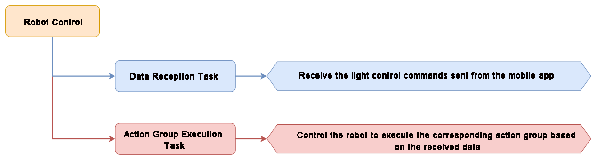

* **Program Download**

For instructions on downloading the vision module and Tonybot program, please refer to the "**[5.5.2 Program Download](#program_download_5_2)**" section.

* **Achieved Effect**

Tonybot includes 16 built-in action groups, and we can call these action groups to make Tonybot perform the corresponding actions. The specific action groups are shown in the table below:

| **Action Group Name** |          **Content**           |
| :-------------------: | :----------------------------: |
|    left_foot_kick     |         Left Foot Kick         |
|    right_foot_kick    |        Right Foot Kick         |
|    stand_four_legs    |       Four-Legged Stand        |
|       sit_dowm        |            Sit Down            |
|       go_prone        |            Lie Down            |
|    stand_two_legs     |        Two-Legged Stand        |
|       handshake       |           Handshake            |
|     scrape_a_bow      |              Bow               |
|    nodding_motion     |              Nod               |
|        boxing         |             Boxing             |
|    stretch_oneself    |            Stretch             |
|          pee          |            Urinate             |
|       press_up        |            Push-up             |
|    rotation_pitch     |          Rotate Pitch          |
|     rotation_roll     |          Rotate Roll           |
|    normal_attitude    | Attention (Stand at Attention) |

**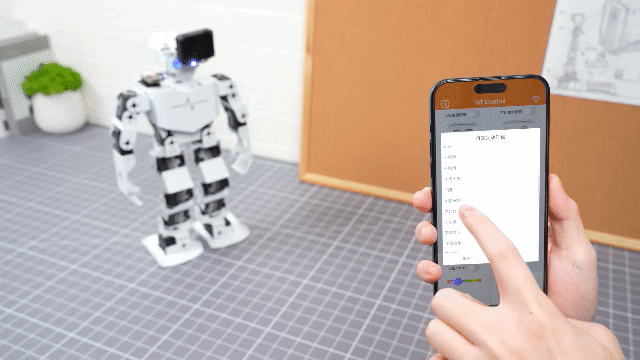Program Analysis**

(1) Import Library Files

Import the required libraries: The Hiwonder library includes sensor functions, low voltage alarm, and more. The time library is used for time-related operations, and the Hiwonder_IIC library facilitates I2C communication with modules.

{lineno-start=1}

```
import Hiwonder
import Hiwonder_IIC
import time
import struct
```

(2) Hardware Initialization

① Instantiate the hardware components, including enabling I2C communication, creating the Tonybot object, and activating the buzzer.

{lineno-start=6}

```
 
iic = Hiwonder_IIC.IIC()
tony = Hiwonder.Tonybot()
sonar = Hiwonder_IIC.I2CSonar(iic)
buzzer = Hiwonder.Buzzer()
imu = Hiwonder_IIC.MPU()
cam = Hiwonder_IIC.ESP32S3Cam(iic)
```

② Set up the Wi-Fi network with the name "**IOT_Tonybot**" and the password "**12345678**".

{lineno-start=14}

```
time.sleep_ms(100)
 
iic.writeto(0x69 , "NIOT_Tonybot|||12345678$$$")
time.sleep_ms(1000)
```

③ Initialize the robot's posture, enable the head servo to rotate to 90°, then disable the servo. Finally, initialize the IMU module.

{lineno-start=19}

```
 
tony.runActionGroup(0, 1)   
tony.attachHead()          
tony.moveHeadAngle(90)
time.sleep_ms(200)             
tony.detachHead()         
time.sleep_ms(1000)           
buzzer.playTone(1500, 100, False)
```

④ Define functions for reading and writing data between the ESP32 and the vision module.

{lineno-start=28}

```
def wifi_send(buf):
  iic.writeto(0x69 , buf)

def wifi_read():
  return iic.readfrom(0x69 , 20)
```

⑤ Create flags and data structures to control function switches and trigger specific actions.

{lineno-start=37}

```
 
onoff_face = False
onoff_undef_obj = False
onoff_hit = False
onoff_color_detec = False
onoff_distance = False

 
warn_face = False
warn_undef_obj = False
warn_hit = False
color_detec_num = 0
sensor_distance = 0
```

* **Remote Robot Control Function Analysis** 

(1) In the Wi-Fi reception task, receive the data sent from the mobile app and parse the command and data.

{lineno-start=147}

```
def wifi_receive_Task():
     
    global onoff_face, onoff_undef_obj, onoff_hit, onoff_color_detec, onoff_distance,last_receive,receive_data,buzzer_flag
    
    receive_data = wifi_read()
    if last_receive != receive_data:
        last_receive = receive_data
        rec = receive_data.decode('utf-8')
        print(rec)
        if rec.find("CMD") != -1 and rec.find("$"):
          cmd = rec.split('|')[1:]
          print(cmd)
```

(2) When the command value is 6, control the robot to execute the corresponding action group. Note that a flag is used to check whether the current action group has finished. A new action group will only be executed if no action group is currently running. Furthermore, if the previous action group involved a crouching motion, the robot must first stand up before executing the new action group.

{lineno-start=186}

```
           elif int(cmd[0]) == 6:  
              action_num = int(cmd[2])
              if not tony.isRunning():
                  if action_num in [16, 30, 77]:   
                      tony.runActionGroup(action_num, 1)
                  else:
                      tony.runActionGroup(19, 1)   
                      time.sleep_ms(600)
                      tony.runActionGroup(action_num, 1)
```

## 6.6 Serial Communication Course

### 6.6.1 Master-Slave Communication Principles

In this section, we'll explore how Tonybot communicates with various devices (like STM32, 51 microcontrollers, Arduino, Raspberry Pi, etc.) in a master-slave relationship. You'll learn how Tonybot functions as a slave device for data exchange, and how other devices act as masters to control Tonybot.  

Throughout this chapter, Tonybot operates as a slave device, using the UART serial port to exchange information with other devices.

* **Master-Slave Relationship**

In the master-slave control system, Tonybot functions as a slave, working alongside other devices (like microcontrollers) that act as the master to control the system.

(1) Tonybot's Functions as a Slave Device

① Receive and Parse Signals from the Master

Tonybot waits for incoming serial signals. Once data is received, it parses the information according to the communication protocol and calls the corresponding function based on the data.

② Execute Actions Triggered by the Received Data

After parsing the signal, Tonybot executes the required action, such as triggering a pre-set action group or reading data from the ultrasonic sensor.

③ Data Packaging and Feedback

When a read command is received, Tonybot calls the appropriate read function, retrieves the data, packages it according to the communication protocol, and sends it back to the master device.

(2) Other Devices as the Master

① Command Packaging and Sending

The master device packages control commands and relevant data into data packets according to the communication protocol and sends them to the device.

② Control Coordination

The master device is responsible for managing the system's operations, ensuring smooth communication between Tonybot and other devices, avoiding conflicts, and keeping the entire system stable.

③ Data Reception

When the master needs to read Tonybot's status, it sends the read command and then receives the status data from Tonybot. The master must ensure the data's integrity and accuracy, parse the data packets, and extract the useful information.

* **Hardware Connection**

For example, connecting Tonybot to a PC:

Connect the TXD, RXD, and GND pins of the USB-to-serial adapter to the D6, D7, and GND pins on Tonybot using DuPont wires, and then connect the USB adapter to the computer. (Note: The 5V connection is optional, but the GND connection is required.)

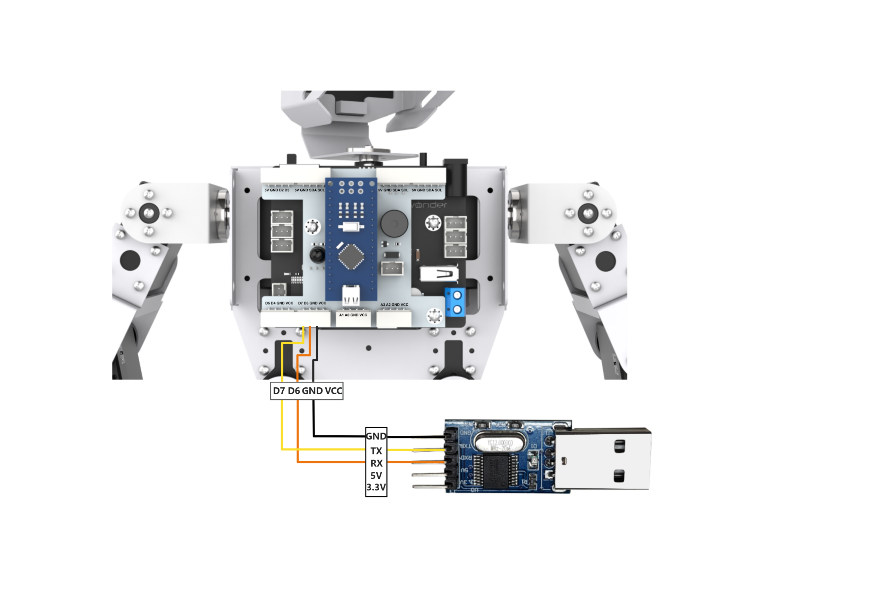

:::{Note}

* The power supplies for the master device and Tonybot can be different, but they must share a common ground to ensure stable communication levels.

* When wiring, ensure that the TX and RX pins of the UART serial port are crossed (TX to RX, RX to TX); otherwise, communication will not be possible.

:::

* **Data Transmission Format**

The default data transmission format for the UART serial port on Tonybot is as follows:

| Baud Rate  | 9600 |
| :--------: | :--: |
| Data Bits  |  8   |
| Parity Bit | None |
|  Stop Bit  |  1   |

* **Communication Protocol**

The command format sent from the master to Tonybot is as follows: it begins with "**CMD**", followed by command parameters separated by "**\|**", and ends with "**\$**".

### 6.6.2 PC Serial Port Control

This document demonstrates how to sequentially control Tonybot's action groups, head servo, read battery levels, capture ultrasonic data, and retrieve IMU data through the PC serial port.

* **Program Logic**

:::{Note}

To proceed with this section, make sure the Tonybot slave-side program is downloaded first. You can find the "**Tonybot Slave-side Program**" in the same directory as this document.

:::

(1) After connecting Tonybot to TTL for serial communication, it can be connected to a PC for UART communication. This enables serial control of Tonybot. The default UART data transmission format is as follows:

| Baud rate  | 9600 |
| :--------: | :--: |
|  Data bit  |  8   |
| Parity bit | None |
|  Stop bit  |  1   |

* **Communication protocol**

Next, we will explain the format of the protocol command packet. The format is as follows: it begins with "**CMD**", parameters are separated by "**\|**", and it ends with "**\$**".

* **Preparation**

**(1) Hardware Preparation**

Connect the TXD, RXD, and GND pins of the USB-to-serial adapter to the IO27, IO19, and GND pins on Tonybot using DuPont wires. Then, plug the USB adapter into the computer. (Note: The 5V connection is optional, but the GND connection is mandatory.)

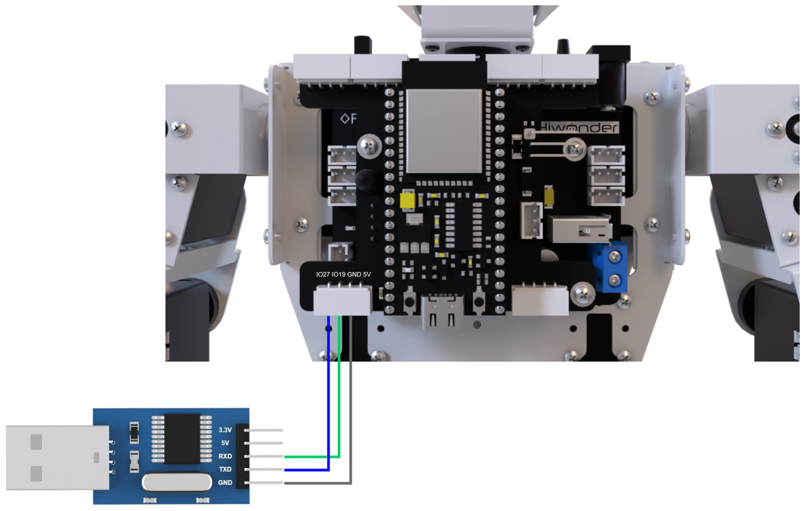

**(2) Software Preparation**

① First, navigate to the [Serial Port Debugging Tool](https://docs.hiwonder.com/projects/Tonybot/en/latest/docs/resources_download.html) in the same folder as this section's content.


② Once you open the tool, make sure to set the baud rate to 9600, choose NONE for the parity bit, set data bits to 8, and stop bits to 1. Don't forget to check the "**Send as ASCII**" option. The configuration should look like the one shown below:

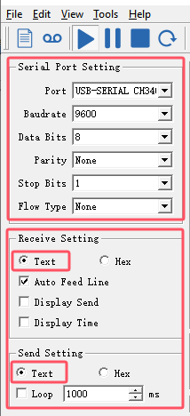

* **Function Implementation**

Control Tonybot by sending protocol commands:

(1) **Command Name:** Action Group Call

**Function Code:** 1

**Command Data:** Action group number, ranging from 0 to 255, corresponding to action groups 0-255.

**Description:** This command is used to instruct Tonybot to execute a specific action group.

**Example:** Sending the command "**CMD\|1\|0\|\$**" will make Tonybot perform the "**Stand at Attention**" action group.

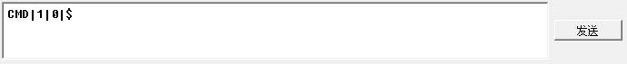

(2) **Command Name:** Head Servo Control

**Function Code:** 2

**Command Data:** Servo angle, ranging from 0 to 180, corresponding to angles from 0° to 180°.

**Description:** This command controls the movement of Tonybot's head servo.  

**Example:** Sending the command "**CMD\|2\|90\|\$**" will rotate the head servo to a 90° position.

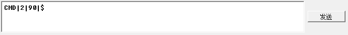

(3) **Command Name:** Battery Voltage

**Function Code:** 3

**Command Data:** This is a read operation, so no command data is needed.

**Description:** This command retrieves Tonybot's battery voltage, in millivolts (mV).  

**Example:** Sending the command "**CMD\|3\|\$**" will request the battery voltage.


After sending the data, Tonybot will return the requested information in the format:  

"**CMD\|Function Code\|data\|\$**", where "**data**" represents the retrieved value.

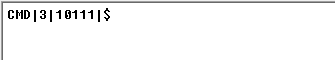

(4) **Command Name:** Ultrasonic Data

**Function Code:** 4

**Command Data:** This is a read operation, so no command data is required.

**Description:** This command retrieves the distance measured by Tonybot's ultrasonic sensor.  

**Example:** Sending the command "**CMD\|4\|\$**" will return the distance detected by the ultrasonic sensor, in millimeters (mm).


After sending the data, Tonybot will return the requested information in the format:  

"**CMD\|Function Code\|data\|\$**", where "**data**" represents the retrieved distance.

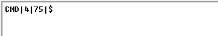

(5) **Command Name:** IMU Data

**Function Code:** 5

**Command Data:** This is a read operation, so no command data is needed.

**Description:** This command retrieves Tonybot's tilt angles along the X and Y axes, measured in degrees.  

**Example:** Sending the command "**CMD\|5\|\$**" will return the IMU data.


After sending the data, Tonybot will return the requested information in the format:  

"**CMD\|Function Code\|x\|y\|\$**", where "**x**" and "**y**" represent the tilt angles on the X and Y axes.

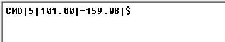


## 6.7 Large AI Model Application Course

### **6.7.1 Large AI Model Module Mode Description**

The large AI model module supports **two working modes**, namely **offline mode** and **online mode**. The functions of the two modes are different, and **the corresponding firmware needs to be flashed**. **The working mode used in this chapter is the online mode**.

> [!NOTE]
>
> **The large AI model module is flashed with the online mode firmware by default. If the offline mode program has been flashed before studying this chapter, please refer to [4. Large AI Model Basic Course -> 4.10 Firmware Download]() to download the firmware again.**

#### 6.7.1.1 Offline Mode

In the offline mode, the module collects images through the built-in camera module and processes the image data using the ESP32-S3 microcontroller to achieve functions such as image transmission, color recognition, and face recognition. The data can also be transmitted through various communication protocols.

To learn more about offline mode applications, please refer to [6.8. Large AI Model Offline Course]().

#### 6.7.1.2 Online Mode

The online mode supports large AI model voice interaction and uses the command wake-up mode. Speak the wake-up word to wake up the large AI model module. Once activated, human-robot interaction can begin. The default wake-up phrase is **Hello Hiwonder**. To change the wake-up word, please refer to [4. Large AI Model Basic Course -> 4.9 Wake-up Word Modification]().

After the module recognizes the wake-up word, the buzzer will beep once, and interaction can begin. The module supports voice communication, automatically recognizing and adapting to the spoken language. If no voice is recognized within one minute, the module enters sleep mode and needs to be woken up again for the next use.

### **6.7.2 Voice Control**

> [!NOTE]
>
> **Before learning this section, ensure that the module is turned on and Wi-Fi and Agent configurations are completed according to [4. Large AI Model Basic Course -> 4.2 Network Configuration and Device Binding]().**

#### 6.7.2.1 Project Introduction

This section controls Tonybot through online voice interaction of the large AI model module. In **Tonybot_AI_MicroPython\main.py**, voice control, App Bluetooth remote control, obstacle avoidance/follow mode, and pose detection are integrated. Therefore, the robot is not only capable of performing an action upon understanding a phrase, but can also work normally when voice control and remote control are used simultaneously.

A total of five categories of capabilities are registered to the large AI model module in the program, including buzzer control, RGB light control, action group execution, running mode switching, and robot status query.

#### 6.7.2.2 Implementation Flow

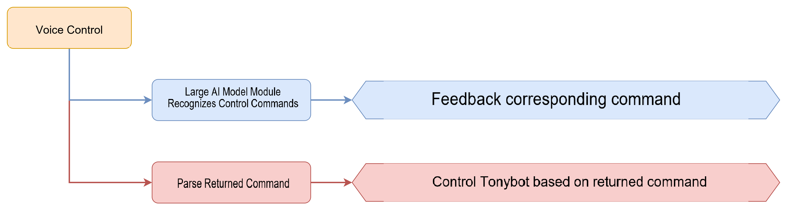

#### 6.7.2.3 Module Description

The large AI model module has a built-in ESP32-S3 high-performance chip and integrates a 2-megapixel high-definition camera, microphone, high-definition display screen, speaker, and CI1302 voice recognition chip. It deeply integrates various models such as language, voice, and vision.

This module is easy to operate and is often paired with robots, making the robot function as if equipped with a super brain. It can deeply understand commands, granting outstanding perception, reasoning, and action capabilities to create a flexible and natural human-robot interaction experience.


<p id="p6-7-2-4"></p>

#### 6.7.2.4 Program Download

> [!NOTE]
> **Before downloading the program, ensure that the serial port driver has been installed.**

1. Connect Tonybot to the computer using a Type-C data cable.


2. Open the [Hiwonder Python Editor](https://drive.google.com/drive/folders/1pfH-KzOe2Q1u1aPb8lNx0cO4O5Fj1m7q?usp=sharing) software.


3. Drag [02 Source Code\01 Large Model Application\main.py](https://drive.google.com/drive/folders/1PzKt-ltIEj1q6Z-_xh1BNX-wfpJdJI6-?usp=sharing) under the same directory as this document into the Hiwonder Python Editor. Note that this is only effective when dragged into the red box area.


4. Click the connection button  on the menu bar. After a successful connection, the icon will turn green .
5. After connecting successfully, click the download button  on the menu bar to download the program into Tonybot, and wait for the message box below to prompt that the download is complete.


#### 6.7.2.5 Program Outcome

After waking up the large AI model module, the following commands can be issued directly via voice:

| Number | Capability             | Corresponding Tool      | Description                                                  |
| ------ | ---------------------- | ----------------------- | ------------------------------------------------------------ |
| 1      | Buzzer control         | `set_buzzer`            | Set the beep count using `count` and the frequency using `freq` ranging from 100 to 5000. |
| 2      | RGB light control      | `set_led_color`         | Set the RGB values for the left and right lights within a range of 0 to 255 respectively. |
| 3      | Action group execution | `set_action_group`      | Specify the action group number `actionNum` and the execution count `executeNum`. |
| 4      | Mode switching         | `set_mode`              | Switch between three running modes: `normal`, `avoid`, and `follow`. |
| 5      | Status query           | `self.robot.get_status` | Query `battery`, `distance`, `running_mode`, and `Bodystate`. |

Typical voice examples are as follows:

| Voice Example                                                | Corresponding Effect         |
| ------------------------------------------------------------ | ---------------------------- |
| Make the Buzzer beep 3 times at a frequency of 2000          | Call `set_buzzer`            |
| Change the left light to red and the right light to blue     | Call `set_led_color`         |
| Wave hands / do push-ups / dance                             | Call `set_action_group`      |
| Switch to obstacle avoidance mode / follow mode / normal mode | Call `set_mode`              |
| What is the current battery level / what is the front distance / what is the current mode / did the robot fall down | Call `self.robot.get_status` |

#### 6.7.2.6 Program Analysis

1. The program simultaneously receives commands sent from the large AI model module via I2C, BLE commands from the mobile App, ultrasonic distance measurement data, and IMU pose data, which are then scheduled for execution by the main control thread. Voice control, App remote control, mode switching, and status query are all completed in this single program.

```python
import _thread
import json
import machine
import time

import Hiwonder
import Hiwonder_IIC
from Hiwonder_BLE import BLE
```

2. Although `clamp` is very short, it is highly useful. The parameters returned by the large model do not always fall within the safe range. Therefore, before controlling the buzzer, RGB lights, and action groups, use it to limit the values to prevent them from exceeding the range.

```python
def clamp(value, low, high):
    if value < low:
        return low
    if value > high:
        return high
    return value
```

3. The `WonderLLMBridge` class is used to handle I2C communication between the robot and the large AI model module. Tool registration, status transmission, data reception, and fragment splicing are all completed here, and the main program receives the organized commands.

```python
class WonderLLMBridge:
    ADDR = 0x55

    def __init__(self, i2c_obj, i2c_mutex):
        self.i2c = i2c_obj
        self.i2c_mutex = i2c_mutex
        self.rx_parts = []
        self.expected_parts = 0
```

4. A total of five MCP tools are defined in the constructor: `set_buzzer`, `set_led_color`, `set_action_group`, `set_mode`, and `self.robot.get_status`. The functions that the large model can call later depend on the tools registered here. Unregistered functions cannot be called regardless of how clearly they are stated.

```python
self.tool_buzzer = {
    "tool_name": "set_buzzer",
    "command": "Call this tool when controlling the robot\'s buzzer. count is the beep count, freq is the buzzer frequency, with a frequency range of 100-5000",
    "params": [["count", "int"], ["freq", "int", 100, 5000]],
    "block": "true",
    "return": "false",
}
```

5. The `set_mode` tool is used to switch between the three running modes: `normal`, `avoid`, and `follow`, which represent normal, obstacle avoidance, and follow modes, respectively.

```python
self.tool_mode = {
    "tool_name": "set_mode",
    "command": "Call this tool when switching robot modes. Mode options: \'avoid\', \'follow\', \'normal\'",
    "params": [["running_mode", "string"]],
    "block": "true",
    "return": "false",
}
```

6. `register_tools` will send these five tools to the large AI model module sequentially after the device goes online. A delay of `20ms` is applied after sending each tool, and finally `{"command": "mcp_setting", "params": "true"}` is sent to indicate the end of tool registration.

```python
def register_tools(self):
    self.send_json(self.tool_buzzer)
    time.sleep_ms(20)
    self.send_json(self.tool_led)
    time.sleep_ms(20)
    self.send_json(self.tool_action_group)
    time.sleep_ms(20)
    self.send_json(self.tool_mode)
    time.sleep_ms(20)
    self.send_json(self.tool_status)
    time.sleep_ms(20)
    self.send_json({"command": "mcp_setting", "params": "true"})
```

7. `ensure_online` is used to confirm whether the large AI model module is online. The function scans the I2C bus repeatedly and continues the subsequent registration process only after detecting the address `0x55`.

```python
def ensure_online(self, timeout_ms=3000):
    end_tick = time.ticks_add(time.ticks_ms(), timeout_ms)
    while time.ticks_diff(end_tick, time.ticks_ms()) > 0:
        try:
            with self.i2c_mutex:
                devices = self.i2c.scan()
            if self.ADDR in devices:
                return True
        except Exception:
            pass
        time.sleep_ms(80)
    return False
```

8. Several auxiliary functions are also defined in `WonderLLMBridge`. `_xor_checksum` is used for validation, `_reset_fragments` is used to clear fragment cache, `_write_raw` is responsible for writing raw bytes to I2C, and `send_json` is responsible for converting the dictionary to JSON and sending it.

```python
def _write_raw(self, raw):
    try:
        with self.i2c_mutex:
            self.i2c.writeto(self.ADDR, raw)
        return True
    except Exception:
        return False

def send_json(self, obj):
    try:
        payload = json.dumps(obj).encode("utf-8")
    except Exception:
        return False
    return self._write_raw(payload)
```

9. `_read_one_payload` is the underlying receiving function. It first reads the 8-byte frame header, confirms that the frame header mark, data length, and fragment ID are correct, and then continues to read the message body and checksum byte. If the format is incorrect, the data will be discarded directly.

```python
if header[0] != 0xAA or header[1] != 0x55:
    self._reset_fragments()
    return None

data_len = (header[2] << 8) | header[3]
part_id = header[4] | (header[5] << 8)
part_num = header[6] | (header[7] << 8)
```

10. When the data sent at one time is long, the module splits it into multiple fragments. The program temporarily stores the fragments in `self.rx_parts` and reconstructs the complete data after the last fragment arrives.

```python
if part_id == 1 or part_num != self.expected_parts:
    self.expected_parts = part_num
    self.rx_parts = [None] * part_num

self.rx_parts[part_id - 1] = data
```

11. The two functions `_find_key` and `_to_int` work with the subsequent parsing logic. The former is responsible for recursively searching for fields in a dictionary or list, while the latter is responsible for converting the value into an integer and returning to the default value if the conversion fails.

```python
def _find_key(self, obj, key):
    if isinstance(obj, dict):
        if key in obj:
            return obj[key]
        for v in obj.values():
            ret = self._find_key(v, key)
            if ret is not None:
                return ret
```

12. `_parse_payload` is used to organize the received data into a unified command. It first converts the byte stream to UTF-8 text, parses it into JSON, and then determines the command type based on fields such as `status_name`, `lr`, `count`, `actionNum`, and `running_mode`.

```python
status_name = self._find_key(obj, "status_name")
if status_name is not None:
    return {"type": "status", "status_name": str(status_name)}

lr = self._find_key(obj, "lr")
if lr is not None:
    return {
        "type": "led",
        "lr": clamp(self._to_int(lr), 0, 255),
        "lg": clamp(self._to_int(self._find_key(obj, "lg")), 0, 255),
        "lb": clamp(self._to_int(self._find_key(obj, "lb")), 0, 255),
        "rr": clamp(self._to_int(self._find_key(obj, "rr")), 0, 255),
        "rg": clamp(self._to_int(self._find_key(obj, "rg")), 0, 255),
        "rb": clamp(self._to_int(self._find_key(obj, "rb")), 0, 255),
    }
```

13. After parsing the parameters, a range check needs to be performed. Parameters such as RGB values, buzzer frequency, action group numbers, and execution counts are first restricted within the specified range before being sent to the hardware for execution.

```python
return {
    "type": "buzzer",
    "count": clamp(self._to_int(count), 0, 30),
    "freq": clamp(self._to_int(self._find_key(obj, "freq"), 1500), 100, 5000),
}
```

14. This section is used to initialize hardware objects, including Bluetooth, robot body, buzzer, I2C bus, ultrasonic sensor, IMU, and `WonderLLMBridge`. Among them, `i2c_lock` is used to protect the I2C bus because the large AI model module, ultrasonic sensor, and RGB lights share the same bus.

```python
ble = BLE(BLE.MODE_BLE_SLAVE, "Tonybot_{:02X}".format(mac[5]))
tonybot = Hiwonder.Tonybot()
beep = Hiwonder.Buzzer()
i2c_lock = _thread.allocate_lock()
i2c = Hiwonder_IIC.IIC(1, 23, 22, 400000)
i2csonar = Hiwonder_IIC.I2CSonar(i2c)
llm_bridge = WonderLLMBridge(i2c, i2c_lock)
```

15. The program divides the running modes into three types: `MODE_NORMAL`, `MODE_AVOID`, and `MODE_FOLLOW`. Equipped with the two mapping tables `MODE_NAME_TO_CODE` and `MODE_CODE_TO_NAME`, conversion between string mode names and internal codes can be achieved.

```python
MODE_NORMAL = 0
MODE_AVOID = 1
MODE_FOLLOW = 2

MODE_NAME_TO_CODE = {
    "normal": MODE_NORMAL,
    "avoid": MODE_AVOID,
    "follow": MODE_FOLLOW
}
```

16. Instead of allowing the receiving thread to control the robot directly, the program prepares a command queue `llm_cmd_queue`. `llm_receive_loop` is only responsible for receiving and queuing, while action execution is still completed in the main control thread `action_run`.

```python
def llm_receive_loop():
    while True:
        cmd = llm_bridge.poll_command()
        if cmd is not None:
            push_llm_cmd(cmd)
        time.sleep_ms(20)
```

17. `push_llm_cmd` and `pop_llm_cmd` are the queue and dequeue interfaces of the command queue. `pop_llm_cmd` with mode and status will preferentially retrieve mode switching and status query commands, shortening the response time of these two types of commands.

```python
def pop_llm_cmd(allowed_types=None):
    with llm_queue_lock:
        if not llm_cmd_queue:
            return None

        if allowed_types is None:
            return llm_cmd_queue.pop(0)
```

18. Many hardware operations are encapsulated into small functions separately, such as `sonar_set_rgb_all`, `sonar_set_rgb_lr`, `sonar_get_distance_mm`, and `play_buzzer`, which makes subsequent calls clearer.

```python
def sonar_get_distance_mm():
    with i2c_lock:
        value = i2csonar.getDistance()
    return int(value * 10)
```

19. `get_llm_status_pairs` is the unified exit for status query. Querying battery level, front distance, current mode, or fall state will eventually lead here to organize return values.

```python
if "distance" in name:
    return [["distance", str(sonar_get_distance_mm())]]
if "battery" in name:
    return [["battery", str(battery_volt)]]
if "running_mode" in name:
    return [["running_mode", MODE_CODE_TO_NAME.get(status_func, "normal")]]
if "bodystate" in name:
    return [["Bodystate", str(body_state)]]
```

20. Mode switching is mainly handled by `parse_running_mode` and `set_running_mode`. The former converts numeric or string mode values into internal codes, and the latter is responsible for modifying the current state, while clearing movement states, action states, and several state machine variables.

```python
def set_running_mode(mode_value):
    global status_func, status_motion, status_action
    global l_stop, r_stop, _obs_step, _walk_step
    global have_move, lastActionIsGoBack

    mode_code = parse_running_mode(mode_value)
    if mode_code is None:
        return False
```

21. `ble_receive` is used to receive commands sent from the app via BLE. These include manual movement control, action groups, ultrasonic queries, RGB settings, mode switching, and battery queries. Switching modes will also invoke `set_running_mode`.

```python
elif (_command == 4) and (len(rec_parse_value) == 2):
    set_running_mode(rec_parse_value[1])
```

22. `imu_state_loop` is a background thread used to continuously update `body_state`. This thread is only responsible for recording pose changes and does not directly execute fall recovery actions.

```python
def imu_state_loop():
    global body_state, front_fall_count, back_fall_count
    while True:
        if imu is None:
            body_state = 0
            time.sleep_ms(200)
            continue
```

23. `handle_llm_command` is used to execute voice commands. Light commands modify RGB here, buzzer commands make sounds here, action group commands execute actions here, mode commands switch modes here, and status commands also return results here.

```python
def handle_llm_command(cmd):
    cmd_type = cmd.get("type", "")

    if cmd_type == "led":
        sonar_set_rgb_lr(cmd["lr"], cmd["lg"], cmd["lb"], cmd["rr"], cmd["rg"], cmd["rb"])
        llm_bridge.send_action_finish()

    elif cmd_type == "mode":
        if set_running_mode(cmd.get("running_mode")):
            llm_bridge.send_action_finish()
```

24. `action_run` is the main loop of the entire program. It first processes commands requiring faster response like `mode` and `status`, then processes other LLM commands, followed by app movement control and action groups, and finally enters the obstacle avoidance or follow processes.

```python
llm_cmd = pop_llm_cmd(("mode", "status"))
if llm_cmd is not None:
    handle_llm_command(llm_cmd)
    continue
```

25. `main` starts the program in a fixed order: first set volume, lights, action speed, and head direction, then make the robot stand, next check if the large AI model module is online and register tools if online, and finally start BLE reception, main control, LLM reception, and IMU threads.

```python
def main():
    beep.setVolume(500)
    sonar_set_rgb_all(0, 240, 0)
    tonybot.setActionGroupSpeed(actturnleft, 150)
    tonybot.setActionGroupSpeed(actturnright, 150)

    tonybot.moveHeadAngle(90)
    tonybot.runActionGroup(0, 1)
    time.sleep_ms(1500)

    if llm_bridge.ensure_online(3000):
        llm_bridge.register_tools()
```

#### 6.7.2.7 Function Extension

* #### What Is MCP

MCP, Model Context Protocol, is an open protocol that enables the calling of various tools by LLM, transforming LLM from a simple conversation or generative AI into an AI capable of calling external tools, reading external states, and driving external devices.

* #### How to Define MCP

1. Each MCP tool is registered in **JSON** format. In the current **main.py**, five tools have been registered: `set_buzzer`, `set_led_color`, `set_action_group`, `set_mode`, and `self.robot.get_status`.

```c
const char tool_buzzer[] = 
	"{\"tool_name\":\"set_buzzer\",\"command\":\"Call this tool when controlling the robot\'s buzzer. count is the beep count, freq is the buzzer frequency, with a frequency range of 100-5000\","
	"\"params\":[[\"count\",\"int\"]],\"block\":\"true\",\"return\":\"false\"}";
```

2. `tool_name` is the tool name. The naming should be as clear and direct as possible, avoiding excessive abbreviations so that the large model can understand the purpose of the tool immediately. In this example, the status query tool is named `self.robot.get_status`, and execution-type tools use names such as `set_buzzer`, `set_led_color`, `set_action_group`, and `set_mode`.

```C
\"tool_name\":\"set_buzzer\"
```

3. `command` is used to tell the large model when to call this tool, and explains the meaning of each parameter. The clearer this field is, the easier it is for the large model to stably select the correct tool and fill in the correct parameters.

```c
\"command\":\"Call this tool when controlling the robot\'s buzzer. count is the beep count, freq is the buzzer frequency, with a frequency range of 100-5000\"
```

4. `params` is used to define the parameter format sent back to the host by the large AI model module. A common format is **[[\"parameter_name\",\"parameter_type\",min_value,max_value]]**. For `string` type parameters, the minimum and maximum values are usually not required.

```C
\"params\":[[\"count\",\"int\"]]
```

5. `block` indicates whether this tool is executed in a blocking manner. If it is `true`, the large AI model module will wait for the host to reply with an execution completion signal before ending this tool call.

`true`: Blocking execution. The host needs to reply with `action_finish` after completing the instruction.

`false`: Non-blocking execution. The module does not wait for the execution result after the tool is issued.

```c
\"block\":\"true\",\"return\":\"false\"
```

6. `return` indicates whether this tool needs the host to return data to the large AI model module.

`true`: Indicates that the result needs to be sent back. For example, the status query tool will return the result to the module through `status` before ending.

`false`: Indicates that there is no need to send back a specific result after execution, and usually only a completion signal needs to be replied in blocking mode.

7. For example, the mode switching tool in the current program uses the string parameter `running_mode`, allowing the large model to directly issue `avoid`, `follow`, or `normal`.

```python
self.tool_mode = {
    "tool_name": "set_mode",
    "params": [["running_mode", "string"]],
    "block": "true",
    "return": "false",
}
```

8. Modify these fields as needed. After modification, refer to [6.7.2.4 Program Download](#p6-7-2-4) to download the program to Tonybot to run.

### **6.7.3 Singing and Dancing**

#### 6.7.3.1 Project Introduction

By saying **play music and dance** to the large AI model, the large AI model module will broadcast a piece of music randomly and call the `set_action_group` tool to make Tonybot execute a dancing action group.

#### 6.7.3.2 Implementation Flow

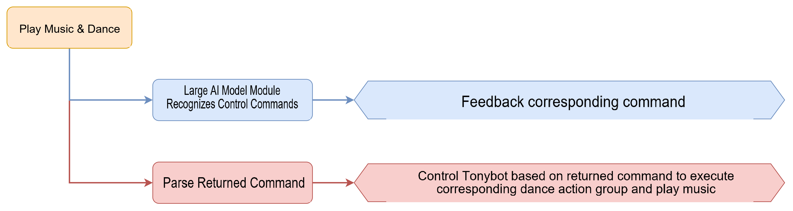

#### 6.7.3.3 Module Description

The large AI model module has a built-in ESP32-S3 high-performance chip and integrates a 2-megapixel high-definition camera, microphone, high-definition display screen, speaker, and CI1302 voice recognition chip. It deeply integrates various models such as language, voice, and vision.


#### 6.7.3.4 Program Download

> [!NOTE]
> **Before downloading the program, ensure that the serial port driver has been installed.**

1. Connect Tonybot to the computer using a Type-C data cable.


2. Open the [Hiwonder Python Editor](https://drive.google.com/drive/folders/1pfH-KzOe2Q1u1aPb8lNx0cO4O5Fj1m7q?usp=sharing) software.


3. Drag [02 Source Code\01 Large Model Application\main.py](https://drive.google.com/drive/folders/1PzKt-ltIEj1q6Z-_xh1BNX-wfpJdJI6-?usp=sharing) under the same directory as this document into the Hiwonder Python Editor. Note that this is only effective when dragged into the red box area.


4. Click the connection button  on the menu bar. After a successful connection, the icon will turn green .
5. After connecting successfully, click the download button  on the menu bar to download the program into Tonybot, and wait for the message box below to prompt that the download is complete.


#### 6.7.3.5 Program Outcome

After entering the voice dialogue, Tonybot can be directly instructed to execute action groups. Common examples are as follows:

| Command     | Description                 | Typical Action Group |
| ----------- | --------------------------- | -------------------- |
| Say hello   | Execute the waving action.  | `9`                  |
| Do push-ups | Execute the push-up action. | `7`                  |
| Do sit-ups  | Execute the sit-up action.  | `8`                  |
| Dance       | Execute the dancing action. | `150~158`            |

#### 6.7.3.6 Program Analysis

1. The entry for action group control is the `set_action_group` tool. Two parameters are defined here: `actionNum` represents the action group number, and `executeNum` represents the execution count.

```python
self.tool_action_group = {
    "tool_name": "set_action_group",
    "command": "Call this tool when controlling the robot to execute action groups. actionNum is the action group number: 0 for stop, 1 for walk forward, 2 for step back, 3 for turn left, 4 for turn right, 7 for bow, 8 for wave, 9 for push-ups, 101 for stand up from falling backward, 102 for stand up from falling forward, 150-158 for dance; executeNum is the execution count",
    "params": [["actionNum", "int", 0, 200], ["executeNum", "int"]],
    "block": "true",
    "return": "false",
}
```

2. The `command` description of the tool specifies the common action numbers and meanings, such as `0` for standing straight, `7` for push-ups, `8` for sit-ups, `9` for waving, `101` for fall recovery from falling backward, `102` for fall recovery from falling forward, and `150~158` for dancing.

```python
"command": "Call this tool when controlling the robot to execute action groups. actionNum is the action group number: 0 for stop, 1 for walk forward, 2 for step back, 3 for turn left, 4 for turn right, 7 for bow, 8 for wave, 9 for push-ups, 101 for stand up from falling backward, 102 for stand up from falling forward, 150-158 for dance; executeNum is the execution count",
```

3. When the `actionNum` field appears in the JSON returned by the large AI model module, `_parse_payload` will identify it as an action group command. If the execution count is not provided, the default value is used. When the action group number and count exceed the range, they are restricted to the valid range first.

```python
action_num = self._find_key(obj, "actionNum")
if action_num is not None:
    return {
        "type": "action_group",
        "action_num": clamp(self._to_int(action_num), 0, 200),
        "execute_num": clamp(self._to_int(self._find_key(obj, "executeNum"), 1), 0, 100),
    }
```

4. After parsing, the action group command will not be executed immediately in the receiving thread. Instead, it is first placed in `llm_cmd_queue` and then processed unifiedly by the main control thread.

```python
def push_llm_cmd(cmd):
    if cmd is None:
        return
    with llm_queue_lock:
        llm_cmd_queue.append(cmd)
```

5. The main loop `action_run` retrieves commands from the queue and passes them to `handle_llm_command`. Action group commands are executed from here.

```python
llm_cmd = pop_llm_cmd()
if llm_cmd is not None:
    handle_llm_command(llm_cmd)
    continue
```

6. Upon receiving the `action_group` command, `handle_llm_command` first sends `send_action_finish` and then executes `tonybot.runActionGroup`.

```python
elif cmd_type == "action_group":
    llm_bridge.send_action_finish()
    tonybot.runActionGroup(cmd["action_num"], cmd["execute_num"])
```

### **6.7.4 Smart Obstacle Avoidance**

#### 6.7.4.1 Project Introduction

This part corresponds to the smart obstacle avoidance function of Tonybot. The obstacle avoidance mode can be switched either through the mobile app or by calling the `set_mode` tool from the large AI model module to switch to `avoid`. After the robot enters the obstacle avoidance mode, it will determine whether to move forward, turn, or move backward based on the ultrasonic distance measurement and the head scanning results.

#### 6.7.4.2 Implementation Flow

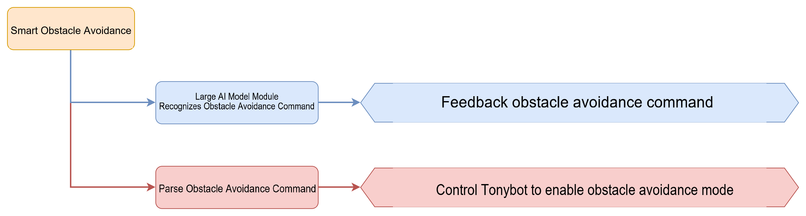

#### 6.7.4.3 Module Description

The large AI model module has a built-in ESP32-S3 high-performance chip and integrates a 2-megapixel high-definition camera, microphone, high-definition display screen, speaker, and CI1302 voice recognition chip. It deeply integrates various models such as language, voice, and vision.


#### 6.7.4.4 Program Download

> [!NOTE]
> **Before downloading the program, ensure that the serial port driver has been installed.**

1. Connect Tonybot to the computer using a Type-C data cable.


2. Open the [Hiwonder Python Editor](https://drive.google.com/drive/folders/1pfH-KzOe2Q1u1aPb8lNx0cO4O5Fj1m7q?usp=sharing) software.


3. Drag [02 Source Code\01 Large Model Application\main.py](https://drive.google.com/drive/folders/1PzKt-ltIEj1q6Z-_xh1BNX-wfpJdJI6-?usp=sharing) under the same directory as this document into the Hiwonder Python Editor. Note that this is only effective when dragged into the red box area.


4. Click the connection button  on the menu bar. After a successful connection, the icon will turn green .
5. After connecting successfully, click the download button  on the menu bar to download the program into Tonybot, and wait for the message box below to prompt that the download is complete.


#### 6.7.4.5 Program Outcome

Typical effects are as follows:

| Command or Status                                      | Robot Response                                               |
| ------------------------------------------------------ | ------------------------------------------------------------ |
| Switch to obstacle avoidance mode                      | The robot enters the `avoid` mode and starts automatic distance measurement and obstacle bypass |
| No obstacle ahead                                      | The robot continues to walk forward                          |
| Obstacle ahead but space is available on one side      | The robot automatically chooses to turn left or right        |
| Both left and right sides are not suitable for passage | The robot moves backward and replans                         |
| Switch to normal mode                                  | The robot exits obstacle avoidance and returns to the normal control state |

#### 6.7.4.6 Program Analysis

1. In the program, three constants, `MODE_NORMAL = 0`, `MODE_AVOID = 1`, and `MODE_FOLLOW = 2`, represent the three running modes, and `status_func` records the current mode.

```python
MODE_NORMAL = 0
MODE_AVOID = 1
MODE_FOLLOW = 2
```

2. The two mapping tables `MODE_NAME_TO_CODE` and `MODE_CODE_TO_NAME` are used to convert between mode strings and internal codes.

```python
MODE_NAME_TO_CODE = {
    "normal": MODE_NORMAL,
    "avoid": MODE_AVOID,
    "follow": MODE_FOLLOW
}
```

3. After registering the `set_mode` tool, the large model can switch the mode directly. This tool only receives one parameter `running_mode`, where `avoid` indicates switching to the obstacle avoidance mode.

```python
self.tool_mode = {
    "tool_name": "set_mode",
    "params": [["running_mode", "string"]],
}
```

4. `parse_running_mode` is compatible with both numeric mode and string mode. Regardless of whether the command comes from BLE or LLM, it is first converted into the internal mode code here.

```python
def parse_running_mode(mode_value):
    if mode_value is None:
        return None
```

5. `set_running_mode` is responsible for switching modes. In addition to modifying `status_func`, it also clears states including `status_motion`, `status_action`, `l_stop`, `r_stop`, `_obs_step`, `_walk_step`, `have_move`, and `lastActionIsGoBack`.

```python
status_func = mode_code
status_motion = 0
status_action = 0xFF
l_stop = False
r_stop = False
```

6. There are two entries for mode switching, but they eventually execute the same logic. Voice switching calls `set_running_mode` and App switching also calls `set_running_mode`.

```python
elif cmd_type == "mode":
    if set_running_mode(cmd.get("running_mode")):
        llm_bridge.send_action_finish()

elif (_command == 4) and (len(rec_parse_value) == 2):
    set_running_mode(rec_parse_value[1])
```

7. In the main loop `action_run`, if `status_func == MODE_AVOID` is detected, the flow branches to `step = 4`, which is the obstacle avoidance branch.

```python
elif status_func == MODE_AVOID:
    flag_first_obs = True
    step = 4
```

8. When entering the obstacle avoidance mode for the first time, the robot will first turn its head back to 90 degrees, clear `_obs_step`, and then execute the stand straight action once.

```python
if flag_first_obs:
    flag_first_obs = False
    tonybot.moveHeadAngle(90)
    _obs_step = 0
    tonybot.runActionGroup(0, 1)
    tonybot.waitForStop(2000)
```

9. `obstacleAvoidance` is responsible for obstacle avoidance judgment. Internally, `_obs_step` is used to split the process into multiple stages, such as checking the front, scanning left and right, and deciding the turn direction.

```python
def obstacleAvoidance():
    global gDistance, gLDistance, gRDistance
    global _obs_step, have_move, lastActionIsGoBack

    distance = sonar_get_distance_mm()
```

10. When `_obs_step == 0`, the front distance `gDistance` is read first. If the front distance is greater than or equal to `MIN_DISTANCE_TURN` of 200mm, or if the distance measurement result is 0, the robot continues to move forward. Otherwise, it enters the scanning process.

```python
if _obs_step == 0:
    gDistance = distance
    if gDistance >= MIN_DISTANCE_TURN or gDistance == 0:
        if not tonybot.isRunning():
            sonar_set_rgb_all(0, 50, 0)
            tonybot.runActionGroup(actfirst, 1)
            tonybot.waitForStop(2000)
            tonybot.runActionGroup(actgo, 0)
            have_move = True
            _obs_step = 1
    else:
        _obs_step = 2
```

11. When `_obs_step == 1`, the robot is already walking forward, but the program continues to detect the front distance. When the distance is too close, the robot stops first, and then switches to scanning and re-judgment.

```python
elif _obs_step == 1:
    gDistance = distance
    if gDistance < MIN_DISTANCE_TURN and gDistance > 0:
        tonybot.runActionGroup(actgo, 1)
        tonybot.waitForStop(2000)
        tonybot.runActionGroup(actfirst, 1)
        tonybot.waitForStop(2000)
        tonybot.runActionGroup(actstandquickly, 1)
        _obs_step = 2
```

12. `getAllDistance` rotates the head to the middle, front-left, leftmost, front-right, and rightmost angles in sequence to measure distances, and finally organizes the results into three groups: front, left side, and right side.

```python
def getAllDistance():
    global gDistance, gLDistance, gRDistance

    sonar_set_rgb_all(0, 50, 50)
    tonybot.moveHeadAngle(90 + BIAS)
    time.sleep_ms(200)
    gDistance = sonar_get_distance_mm()

    tonybot.moveHeadAngle(145 + BIAS)
    time.sleep_ms(400)
    tDistance = sonar_get_distance_mm()

    tonybot.moveHeadAngle(180 + BIAS)
    time.sleep_ms(400)
    gLDistance = sonar_get_distance_mm()
    if tDistance < gLDistance:
        gLDistance = tDistance

    tonybot.moveHeadAngle(45 + BIAS)
    time.sleep_ms(600)
    tDistance = sonar_get_distance_mm()

    tonybot.moveHeadAngle(0 + BIAS)
    time.sleep_ms(400)
    gRDistance = sonar_get_distance_mm()
    if tDistance < gRDistance:
        gRDistance = tDistance

    tonybot.moveHeadAngle(90 + BIAS)
    time.sleep_ms(400)
```

13. After the scan is complete, the robot turns left if there is more space on the left, and turns right if there is more space on the right. If neither side is suitable, it first moves backward and then re-judges. `lastActionIsGoBack` is used to record whether the backward action was just executed in the previous round.

```python
if ((gLDistance > gRDistance and gLDistance > MIN_DISTANCE_TURN) or gLDistance == 0) and gDistance > 50:
    tonybot.runActionGroup(actturnleft, 4)
elif ((gRDistance > gLDistance and gRDistance > MIN_DISTANCE_TURN) or gRDistance == 0) and gDistance > 50:
    tonybot.runActionGroup(actturnright, 4)
else:
    tonybot.runActionGroup(actback, 2)
```

14. The RGB lights also change color during obstacle avoidance. They turn greenish when moving forward, cyan when scanning, and blue when judging direction. The step that the robot is executing can be inferred by observing the lights.

```python
sonar_set_rgb_all(0, 50, 0)
sonar_set_rgb_all(0, 50, 50)
sonar_set_rgb_all(0, 0, 50)
```

15. When the mode is switched back to `normal` or `follow`, the program detects that `status_func != MODE_AVOID`, then stops the current action, resumes standing straight, and returns the head to the middle.

```python
if status_func != MODE_AVOID:
    tonybot.stopActionGroup()
    tonybot.waitForStop(1000)
    tonybot.runActionGroup(0, 1)
    tonybot.moveHeadAngle(90)
    tonybot.waitForStop(2000)
    step = 0
    continue
```

### **6.7.5 Fall Recovery**

#### 6.7.5.1 Project Introduction

This part corresponds to the posture detection and recovery of Tonybot. The program continuously reads IMU posture data, and then transmits whether the robot is currently standing, falling forward, or falling backward to the large AI model module. When recovery is required, recovery actions are executed through action groups.

#### 6.7.5.2 Implementation Flow

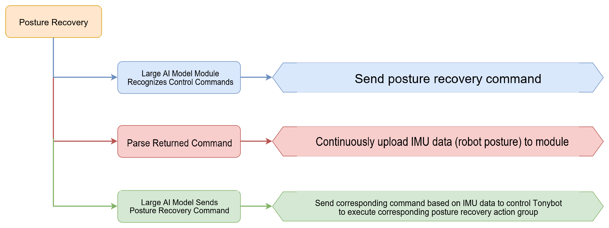

#### 6.7.5.3 Module Description

* **Large AI Model Module**

The large AI model module has a built-in ESP32-S3 high-performance chip and integrates a 2-megapixel high-definition camera, microphone, high-definition display screen, speaker, and CI1302 voice recognition chip. It deeply integrates various models such as language, voice, and vision.


#### 6.7.5.4 Program Download

> [!NOTE]
> **Before downloading the program, ensure that the serial port driver has been installed.**

1. Connect Tonybot to the computer using a Type-C data cable.


2. Open the [Hiwonder Python Editor](https://drive.google.com/drive/folders/1pfH-KzOe2Q1u1aPb8lNx0cO4O5Fj1m7q?usp=sharing) software.


3. Drag [02 Source Code\01 Large Model Application\main.py](https://drive.google.com/drive/folders/1PzKt-ltIEj1q6Z-_xh1BNX-wfpJdJI6-?usp=sharing) under the same directory as this document into the Hiwonder Python Editor. Note that this is only effective when dragged into the red box area.


4. Click the connection button  on the menu bar. After a successful connection, the icon will turn green .
5. After connecting successfully, click the download button  on the menu bar to download the program into Tonybot, and wait for the message box below to prompt that the download is complete.


#### 6.7.5.5 Program Outcome

In this example, the following flow can be realized:

1. Query `Bodystate` to identify whether the current posture is standing, falling forward, or falling backward.
2. Issue action group recovery commands based on the posture result, such as `101` for back fall recovery or `102` for front fall recovery.
3. After executing the recovery action, the robot returns to a state where interaction can continue.

#### 6.7.5.6 Program Analysis

1. The fall recovery part is divided into two sections: posture detection in the first half and recovery action in the second half. Posture detection runs in the background via `imu_state_loop` continuously, while recovery actions are still completed through action group calls.

```python
def imu_state_loop():
    global body_state, front_fall_count, back_fall_count
    while True:
        if imu is None:
            body_state = 0
            time.sleep_ms(200)
            continue

        try:
            angle = imu.read_angle()
            radian_x = angle[0]

            if -30 < radian_x < 60:
                front_fall_count += 1
                back_fall_count = 0
                if front_fall_count > 5:
                    body_state = 1
            elif radian_x > 120 or radian_x < -140:
                back_fall_count += 1
                front_fall_count = 0
                if back_fall_count > 5:
                    body_state = 2
            else:
                front_fall_count = 0
                back_fall_count = 0
                body_state = 0
        except Exception:
            pass

        time.sleep_ms(50)

def handle_llm_command(cmd):
    cmd_type = cmd.get("type", "")

    if cmd_type == "led":
        sonar_set_rgb_lr(cmd["lr"], cmd["lg"], cmd["lb"], cmd["rr"], cmd["rg"], cmd["rb"])
        llm_bridge.send_action_finish()

    elif cmd_type == "buzzer":
        play_buzzer(cmd["freq"], cmd["count"])
        llm_bridge.send_action_finish()

    elif cmd_type == "action_group":
        llm_bridge.send_action_finish()
        tonybot.runActionGroup(cmd["action_num"], cmd["execute_num"])

    elif cmd_type == "mode":
        if set_running_mode(cmd.get("running_mode")):
            llm_bridge.send_action_finish()

    elif cmd_type == "status":
        pairs = get_llm_status_pairs(cmd.get("status_name", ""))
        llm_bridge.send_status(pairs)
```

2. IMU initialization is not forced to succeed. The program first attempts `imu = Hiwonder_IIC.MPU` and sets IMU to `None` upon failure. In this way, the program will not stop directly due to IMU initialization failure.

```python
imu = None
try:
    imu = Hiwonder_IIC.MPU()
except Exception:
    imu = None
```

3. `imu_state_loop` will continuously read the X-axis value in the IMU angle and determine the current posture in coordination with counters. This thread reads once every `50ms` so that the posture status is updated continuously.

```python
angle = imu.read_angle()
radian_x = angle[0]
```

4. When the robot satisfies `-30 < radian_x < 60` continuously for a certain period, the program determines it as falling forward. When the robot satisfies `radian_x > 120 or radian_x < -140` continuously, the program determines it as falling backward. Other cases are processed as normal standing.

```python
if -30 < radian_x < 60:
    front_fall_count += 1
    back_fall_count = 0
    if front_fall_count > 5:
        body_state = 1
elif radian_x > 120 or radian_x < -140:
    back_fall_count += 1
    front_fall_count = 0
    if back_fall_count > 5:
        body_state = 2
else:
    front_fall_count = 0
    back_fall_count = 0
    body_state = 0
```

5. The two counters `front_fall_count` and `back_fall_count` are used for filtering. The program does not determine a fall immediately after one reading, but updates the state only after the conditions are satisfied multiple consecutive times.

```python
if front_fall_count > 5:
    body_state = 1
if back_fall_count > 5:
    body_state = 2
```

6. The final posture result is saved in the global variable `body_state`, where `0` represents standing, `1` represents falling forward, and `2` represents falling backward. This variable is read directly when querying the posture later.

```python
body_state = 0  # 0-stand, 1-front fall(prone), 2-back fall(overturned)
```

7. When the large AI model module queries `Bodystate`, the program organizes the current posture into the format of `[["Bodystate", "value"]]` in `get_llm_status_pairs` and transmits it back to the module.

```python
if "bodystate" in name:
    return [["Bodystate", str(body_state)]]
```

8. No new interface is written for the recovery action. Instead, the action group tool `set_action_group` is reused. For example, front fall recovery uses `102` and back fall recovery uses `101`.

```python
self.tool_action_group = {
    "tool_name": "set_action_group",
    "params": [["actionNum", "int", 0, 200], ["executeNum", "int"]],
}
```

### **6.7.6 Obstacle Detection**

#### 6.7.6.1 Project Introduction

This part corresponds to the ultrasonic distance measurement query capability of Tonybot. After a status query is initiated via voice, the program reads the current distance and transmits it back to the large AI model module for voice broadcasting or subsequent judgment. This function can not only answer how far the obstacle is ahead independently, but is also used continuously in the obstacle avoidance mode.

#### 6.7.6.2 Implementation Flow

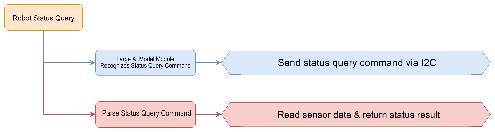

#### 6.7.6.3 Module Description

* **Large AI Model Module**

The large AI model module has a built-in ESP32-S3 high-performance chip and integrates a 2-megapixel high-definition camera, microphone, high-definition display screen, speaker, and CI1302 voice recognition chip. It deeply integrates various models such as language, voice, and vision.


#### 6.7.6.4 Program Download

> [!NOTE]
> **Before downloading the program, ensure that the serial port driver has been installed.**

1. Connect Tonybot to the computer using a Type-C data cable.


2. Open the [Hiwonder Python Editor](https://drive.google.com/drive/folders/1pfH-KzOe2Q1u1aPb8lNx0cO4O5Fj1m7q?usp=sharing) software.


3. Drag [02 Source Code\01 Large Model Application\main.py](https://drive.google.com/drive/folders/1PzKt-ltIEj1q6Z-_xh1BNX-wfpJdJI6-?usp=sharing) under the same directory as this document into the Hiwonder Python Editor. Note that this is only effective when dragged into the red box area.


4. Click the connection button  on the menu bar. After a successful connection, the icon will turn green .
5. After connecting successfully, click the download button  on the menu bar to download the program into Tonybot, and wait for the message box below to prompt that the download is complete.


#### 6.7.6.5 Program Outcome

Typical effects are as follows:

| Function           | Description                                                  | Return Value Example                              |
| ------------------ | ------------------------------------------------------------ | ------------------------------------------------- |
| Distance detection | Read ultrasonic distance measurement and return the millimeter value | `distance = 235`                                  |
| Linkage prompt     | Can combine with the large model to generate voice broadcasting or action suggestions | There is an obstacle about 23.5 centimeters ahead |

#### 6.7.6.6 Program Analysis

1. Ultrasonic distance measurement is completed by `sonar_get_distance_mm`. The function reads the basic distance value from `i2csonar.getDistance`, and then multiplies it by `10` to convert it to millimeters. Therefore, the unit of the returned `distance` here is millimeter.

```python
def sonar_get_distance_mm():
    with i2c_lock:
        value = i2csonar.getDistance()
    return int(value * 10)
```

2. The `i2c_lock` is used here because the ultrasonic sensor, RGB lights, and large AI model module share the same I2C bus. When multiple threads access the bus simultaneously, data conflicts can easily occur.

```python
with i2c_lock:
    value = i2csonar.getDistance()
```

3. When the large model queries the distance, the message passes through `_parse_payload` first. As long as `status_name` appears in the JSON, the program identifies it as a `status` type command, and then passes it to the status query logic for processing.

```python
status_name = self._find_key(obj, "status_name")
if status_name is not None:
    return {"type": "status", "status_name": str(status_name)}
```

4. Reading the distance is completed in `get_llm_status_pairs`. The program first converts `status_name` to lowercase, checks if the keyword `distance` is inside, and then reads the current distance upon matching.

```python
if "distance" in name:
    return [["distance", str(sonar_get_distance_mm())]]
```

5. The return value is not a single integer, but is organized into a list of key-value pairs like `[["distance", "value"]]` according to the protocol, so as to maintain the same format as other status items such as battery level, mode, and posture.

```python
return [["distance", str(sonar_get_distance_mm())]]
```

6. When `handle_llm_command` encounters a `status` type command, it unifiedly calls `send_status` to send the result back to the module. The status query returns status data instead of `action_finish`.

```python
elif cmd_type == "status":
    pairs = get_llm_status_pairs(cmd.get("status_name", ""))
    llm_bridge.send_status(pairs)
```

7. Obstacle detection itself belongs to status query. Therefore, no new tool is defined. Instead, the `self.robot.get_status` interface is reused directly. Querying distance, battery level, mode, and posture all share the same entry.

```python
self.tool_status = {
    "tool_name": "self.robot.get_status",
    "params": [["status_name", "string"]],
    "block": "true",
    "return": "true",
}
```

8. In addition to `distance`, the same status query logic also supports `battery`, `running_mode`, and `Bodystate`. Among them, `running_mode` returns string mode names: `normal`, `avoid`, and `follow`.

```python
if "battery" in name:
    return [["battery", str(battery_volt)]]
if "running_mode" in name:
    return [["running_mode", MODE_CODE_TO_NAME.get(status_func, "normal")]]
if "bodystate" in name:
    return [["Bodystate", str(body_state)]]
```

### **6.7.7 Smart Traffic Driving**

#### 6.7.7.1 Project Introduction

This part mainly realizes line following driving through the ESP32-S3 vision module paired with the Tonybot robot, and uses the chest large AI model module to identify traffic lights to control the robot to stop or proceed.

#### 6.7.7.2 Implementation Flow

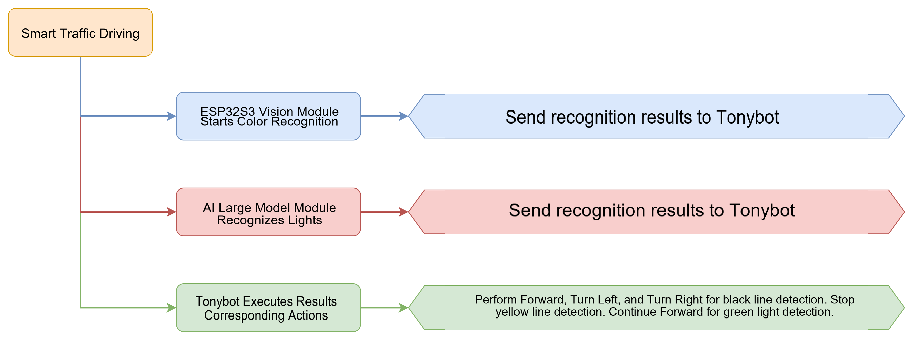

#### 6.7.7.3 Module Description

* **Large AI Model Module**

The large AI model module has a built-in ESP32-S3 high-performance chip and integrates a 2-megapixel high-definition camera, microphone, high-definition display screen, speaker, and CI1302 voice recognition chip. It deeply integrates various models such as language, voice, and vision.


* **ESP32-S3 Vision Module**

The ESP32-S3 camera module is a cost-effective AI vision solution. It is developed based on the ESP32-S3 high-performance chip and supports Wi-Fi video streaming, color recognition, face recognition, and line following recognition. Integrating a 2-megapixel camera, this module uses industrial-grade manufacturing processes, supports C/C++ programming, and is equipped with a Type-C serial port, I2C interface, and customized buttons to provide convenient hardware interaction interfaces.


#### 6.7.7.4 Program Download

> [!NOTE]
> **Before downloading the program, ensure that the serial port driver has been installed.**

1. Connect Tonybot to the computer using a Type-C data cable.


2. Open the [Hiwonder Python Editor](https://drive.google.com/drive/folders/1pfH-KzOe2Q1u1aPb8lNx0cO4O5Fj1m7q?usp=sharing) software.


3. Drag [\02 Program Source Code\02 Smart Traffic Driving Program\main.py]() under the same directory into the Hiwonder Python Editor. Note that this is only effective when dragged into the red box area.


4. Click the connection button  on the menu bar. After a successful connection, the icon will turn green .
5. After connecting successfully, click the download button  on the menu bar to download the program into Tonybot, and wait for the message box below to prompt that the download is complete.


#### 6.7.7.5 Program Outcome

After powering on, the program initializes the robot and I2C peripherals and waits for WonderLLM at address 0x55 to be ready. Then the robot enters the line following mode, continuously reading the line position from the camera to control the robot to move straight or turn for line following. When the yellow line trigger point is recognized and the blue block condition is satisfied, the robot switches to the waiting stage. In this stage, the robot repeatedly sends camera vision requests to WonderLLM and polls the returned results. When the recognition result indicates a green light with `vision` equal to `true`, the robot executes the through action group. After completion, it returns to the initial posture and re-enters line following, with the entire process running in a loop.

#### 6.7.7.6 Program Analysis

1. The program imports dependencies first upon startup, and uses `ticks_ms` and `ticks_diff` for timing to ensure stable timing logic under MicroPython.

```python
import json
import Hiwonder
import Hiwonder_IIC
import time

def _elapsed_ms(start_ticks):
    return time.ticks_diff(time.ticks_ms(), start_ticks)

def _now_ticks():
    return time.ticks_ms()
```

2. Initialize I2C, robot, ultrasonic sensor, and camera objects. The I2C bus works preferentially at a rate of 400k and falls back if not supported. Configure the I2C address of WonderLLM and the initialization waiting parameters.

```python
try:
    iic = Hiwonder_IIC.IIC(1, 23, 22, 400000)
except Exception:
    iic = Hiwonder_IIC.IIC()

tony = Hiwonder.Tonybot()
sonar = Hiwonder_IIC.I2CSonar(iic)
cam = Hiwonder_IIC.ESP32S3Cam(iic)

WONDERLLM_ADDR = 0x55
_LLM_INIT_TIMEOUT_MS = 30000
_LLM_INIT_POLL_MS = 500
```

3. Define action group numbers, line following thresholds, and state machine stage constants. Subsequent line following, waiting, and through actions will branch based on these constants.

```python
TURN_RIGHT = 66
TURN_LEFT = 65
GO_STRAIGHT = 63

LEFT_MIN = 240 // 2 - 40
RIGHT_MAX = 240 // 2 + 40

STAGE_LINETRACKING = 0
STAGE_WAITING = 1
STAGE_CUSTOM = 2
```

4. After powering on, the robot executes the initialization posture and servo angles, sets initial state machine variables, and then prints `start.`, indicating entry into the main process.

```python
tony.runActionGroup(0, 1)
tony.attachHead()
tony.moveHeadAngle(90)
time.sleep_ms(2000)

print("start.")
stage = STAGE_LINETRACKING
tickstart1 = 0
tickstart2 = 0
```

5. `VISION_PROMPT` is the prompt word for calling WonderLLM camera vision. `last_vision_json_raw` caches the most recently parsed `{"vision":"true/false"}`.

```python
VISION_PROMPT = "Identify the front image. If there is a traffic light in front and it is green, return only true. Otherwise, return only false. Do not return any other information."
last_vision_json_raw = None
```

6. `body_follow` represents line-following motion control. Based on whether the recognized line center `x` falls to the left or right of the threshold interval, it executes straight, left turn, or right turn action groups, using `step` as a simple state machine.

```python
def body_follow(x):
    global step
    if not tony.isRunning():
        if LEFT_MIN < x < RIGHT_MAX:
            tony.runActionGroup(GO_STRAIGHT, 1)
        elif 0 < x < LEFT_MIN:
            tony.runActionGroup(TURN_LEFT, 2)
        else:
            tony.runActionGroup(TURN_RIGHT, 2)
```

7. Read the black line block on channel 1 and the yellow line trigger block on channel 3 for line following using `cam.read_color` respectively, which are used for line following control and entering the waiting stage.

```python
def read_black_block():
    result = cam.read_color(1)
    if result is not None and len(result) >= 4:
        return result[0] + result[2] // 2
    return None

def read_yellow_block():
    result = cam.read_color(3)
    if result is not None and len(result) >= 4:
        return result
    return None
```

8. `wonderllm_request_vision` sends MCP requests such as `tool_name=mcu.request` and `command=vision` to WonderLLM via I2C to trigger the LLM to call the camera for recognition.

```python
def wonderllm_request_vision(prompt):
    obj = {"tool_name": "mcu.request", "command": "vision", "params": prompt}
    raw = json.dumps(obj).encode("utf-8")
    iic.writeto(WONDERLLM_ADDR, raw)
```

9. `_parse_llm_header` is used to parse the 8-byte packet header returned by WonderLLM. It is compatible with both `0xAA 0x55` and `0xAB` variant formats to obtain information such as `data_len`, `part_id`, and `part_num`.

```python
def _parse_llm_header(header):
    if header[0] == 0xAA and header[1] == 0x55:
        data_len = (header[2] << 8) | header[3]
        part_id = (header[5] << 8) | header[4]
        part_num = (header[7] << 8) | header[6]
        return (data_len, part_id, part_num, False)
```

10. `_wonderllm_read_one_payload` reads all fragments of a message starting from `part_id==1` and splices them into `payload` for subsequent parsing of vision JSON.

```python
def _wonderllm_read_one_payload():
    header = iic.readfrom(WONDERLLM_ADDR, 8)
    data_len, part_id, part_num, is_ab_fmt = _parse_llm_header(header)
    buffer = []
    for i in range(part_num):
        body = iic.readfrom(WONDERLLM_ADDR, data_len + 1)
        buffer.append(body[:-1])
    return b"".join(buffer)
```

11. `wonderllm_poll_vision_result` accumulates the multiple received `payload` into `_llm_rx_buffer`. After extracting the complete JSON, it parses the `vision` field, accepting only `true`, `false`, or boolean values, and updates `last_vision_json_raw`.

```python
_llm_rx_buffer = b""

def wonderllm_poll_vision_result():
    global last_vision_json_raw, _llm_rx_buffer
    payload = _wonderllm_read_one_payload()
    _llm_rx_buffer += payload
    raw_str = _llm_rx_buffer.decode("utf-8").strip()
    candidate = raw_str[raw_str.find("{"): raw_str.rfind("}") + 1]
    obj = json.loads(candidate)
    if obj.get("vision") in (True, False, "true", "false"):
        last_vision_json_raw = candidate
```

12. `check_green_light_vision` determines the green light only when `vision` is explicitly `True` or `"true"`, which avoids misjudgment caused by long text or abnormal content.

```python
def check_green_light_vision():
    if last_vision_json_raw is None:
        return False
    obj = json.loads(last_vision_json_raw)
    v = obj.get("vision")
    return (v is True) or (isinstance(v, str) and v.lower() == "true")
```

13. Call `wait_llm_ready` to wait for WonderLLM initialization before the main loop starts. In the main loop, perform line following first, and enter the waiting stage to request vision immediately after recognizing the yellow line. During the waiting stage, request once every second and poll once every 50ms. After identifying the green light, execute the through action group and return to the line following loop.

```python
wait_llm_ready()
while True:
    if stage == STAGE_LINETRACKING:
        x = read_black_block()
        if x is not None:
            body_follow(x)
        blue = read_yellow_block()
        if blue is not None and blue[1] >= 120:
            stage = STAGE_WAITING
            _llm_rx_buffer = b""
            last_vision_json_raw = None
            wonderllm_request_vision(VISION_PROMPT)

    elif stage == STAGE_WAITING:
        if _elapsed_ms(tickstart1) >= 1000:
            wonderllm_request_vision(VISION_PROMPT)
        if _elapsed_ms(tickstart2) >= 50:
            wonderllm_poll_vision_result()
            if check_green_light_vision():
                stage = STAGE_CUSTOM
                tony.runActionGroup(1, 4)
```


## 6.8 Large AI Model Offline Course

### 6.8.1 Introduction to Library Files and Registers

This section will analyze the library files related to the Tonybot AI body driving the large AI model module. The `hw_esp32S3cam_ctl` library is responsible for obtaining the face information and color recognition data detected by the large AI model module. This library consists of two files: **hw_esp32S3cam_ctl.h** and **hw_esp32S3cam_ctl.cpp**.

#### 6.8.1.1 Library File Description

* **Member Function `HW_ESP32S3CAM::begin`**

```cpp
void HW_ESP32S3CAM::begin()
{
    Wire.setClock(100000);
    Wire.begin();
}
```

This function is used to initialize the I2C bus configuration, allowing instructions to be sent to and data to be received from the large AI model module through the bus later.

* **Low-Level Function `Wire_Read_Data_Array`**

```cpp
static int Wire_Read_Data_Array(uint8_t reg, 
                                uint8_t *val, 
                                uint16_t len)
{
    uint16_t i = 0;
    
    /* Indicate which register we want to read from */
    if (!Wire_Write_Byte(reg)) {
        return -1;
    }
    
    /* Read block data */
    Wire.requestFrom(ESP32S3_ADDR, len);
    while (Wire.available()) {
        if (i >= len) {
            return -1;
        }
        val[i] = Wire.read();
        i++;
    }   
    return i;
}
```

| Attribute                | Details                                                      |
| :----------------------- | :----------------------------------------------------------- |
| **Function description** | Send data to the large AI model module via the I2C bus       |
| **Parameter list**       | `reg`, `val`, `len`                                          |
| **Return value**         | False: write failed, True: write succeeded                   |
| **Instructions**         | Call `HW_ESP32S3CAM::Init` before using this function. This function is not used in subsequent development, so only a brief understanding is necessary. |

Parameters and meanings:

1. `reg`: The target memory address to write to in the large AI model module

2. `*val`: The address of the data to be sent

3. `len`: The length of the word to be sent

The Arduino primary device first sends the device address via the I2C bus, then sends the target memory address to the large AI model module, and finally sends the data byte by byte based on the word length. After that, `Wire.endTransmission()` is called to check whether the data is successfully sent. If the return value is 0, the data transmission is successful. Otherwise, it fails.

* **Low-Level Function `Wire_Write_Byte`**

```c
static bool Wire_Write_Byte(uint8_t val)
{
    Wire.beginTransmission(ESP32S3_ADDR);
    Wire.write(val);
    if( Wire.endTransmission() != 0 ) {
        return false;
    }
    return true;
}
```

| Attribute                | Details                                                      |
| :----------------------- | :----------------------------------------------------------- |
| **Function description** | Confirm the address of the data register to be read before reading data from the large AI model module |
| **Parameter list**       | `val`                                                        |
| **Return value**         | False: transmission failed, True: transmission succeeded     |
| **Instructions**         | Call `HW_ESP32S3CAM::Init` before using this function. During data transmission or writing, the data register address for writing must also be confirmed with the secondary device. The same implementation statement of this function is also present inside `Wire_Write_Data_Array()`. |

Parameters and meanings:

`val`: The data content to be sent

The Arduino primary device directly sends the device address to the large AI model module and then sends one byte of data to the large AI model module. After that, `Wire.endTransmission()` is called to check whether the data is successfully sent. If the return value is 0, the data transmission is successful. Otherwise, it fails.

* **Low-Level Function `Wire_Read_Data_Array`**

```cpp
static int Wire_Read_Data_Array(uint8_t reg, 
                                uint8_t *val, 
                                uint16_t len)
{
    uint16_t i = 0;
    
    /* Indicate which register we want to read from */
    if (!Wire_Write_Byte(reg)) {
        return -1;
    }
    
    /* Read block data */
    Wire.requestFrom(ESP32S3_ADDR, len);
    while (Wire.available()) {
        if (i >= len) {
            return -1;
        }
        val[i] = Wire.read();
        i++;
    }   
    return i;
}
```

| Attribute                | Details                                                      |
| :----------------------- | :----------------------------------------------------------- |
| **Function description** | Read multi-byte data from the large AI model module via the I2C bus |
| **Parameter list**       | `reg`, `val`, `len`                                          |
| **Return value**         | -1: Reading failed, other: successfully read data length     |
| **Instructions**         | Call `HW_ESP32S3CAM::Init` before using this function. Call `Wire_Write_Byte` to determine the read register address before using this function. |

Parameters and meanings:

1. `reg`: The data address to read from in the large AI model module

2. `*val`: The address in the Arduino primary device used to store the received data

3. `len`: The length of the word to read

The Arduino primary device first sends the read address to the large AI model module. If there is no response, -1 is returned, indicating that the connection to the large AI model module failed. Next, the word length is sent to the large AI model module. The data is read byte by byte through a `while` loop using the variable `i` and is stored in the `val[]` array. If the actual read length exceeds the requested word length during the reading process, -1 is returned to indicate reading failure. Finally, upon successful reading, `i` is returned, representing the actual read word length, which may be less than `len`.

* **Member Function `HW_ESP32S3CAM::Face_Data_Receive`** 

```c
uint16_t HW_ESP32S3CAM::Face_Data_Receive(uint8_t *buf, uint8_t buf_len)
{
    return Wire_Read_Data_Array(FACE_DETECTION_REG, buf, buf_len);
}
```

| Attribute                | Details                                                      |
| :----------------------- | :----------------------------------------------------------- |
| **Function description** | Read the face detection results from the large AI model module |
| **Parameter list**       | `Reg`, `buf`, `buf_len`                                      |
| **Return value**         | None                                                         |
| **Instructions**         | This function is essentially a wrapper that directly calls `Wire_Read_Data_Array`. The physical meanings of the specific parameters are consistent with those in `Wire_Read_Data_Array`. |

When implementing the color recognition and vision-based line following functions, the internal implementation of the functions is highly consistent with that of face recognition. Details are not repeated here. Review the source code and combine it with [6.8.1.2 Device Primary-Secondary Communication Principles (I2C Registers)](#p6-8-1-2) below to understand the physical meaning of the information stored at each address in the functional registers of the large AI model module.

<p id="p6-8-1-2"></p>

#### 6.8.1.2 Device Primary-Secondary Communication Principles (I2C Registers)

Large AI model module I2C secondary data address: 0x51 

Primary address: 0x51

* **Face Recognition**

| Register | Data Format             | Description                                                  |
| :------- | :---------------------- | :----------------------------------------------------------- |
| 0x01     | `unsigned char data[4]` | `data[0]`: X-axis face center point data<br>`data[1]`: Y-axis face center point data<br>`data[2]`: face bounding box width<br>`data[3]`: face bounding box height |

* **Color Detection with Image Resolution of 240x240**

| Register | Data Format             | Description                                                  |
| :------- | :---------------------- | :----------------------------------------------------------- |
| 0x00     | `unsigned char data[4]` | `data[0]`: red center X-axis coordinate<br>`data[1]`: red center Y-axis coordinate<br>`data[2]`: red bounding box width<br>`data[3]`: red bounding box height |
| 0x01     | `unsigned char data[4]` | `data[0]`: green center X-axis coordinate<br>`data[1]`: green center Y-axis coordinate<br>`data[2]`: green bounding box width<br>`data[3]`: green bounding box height |
| 0x02     | `unsigned char data[4]` | `data[0]`: blue center X-axis coordinate<br>`data[1]`: blue center Y-axis coordinate<br>`data[2]`: blue bounding box width<br>`data[3]`: blue bounding box height |
| 0x03     | `unsigned char data[4]` | `data[0]`: purple center X-axis coordinate<br>`data[1]`: purple center Y-axis coordinate<br>`data[2]`: purple bounding box width<br>`data[3]`: purple bounding box height |
| 0x04     | `unsigned char data[4]` | `data[0]`: red ID number<br>`data[1]`: green ID number<br>`data[2]`: blue ID number<br>`data[3]`: purple ID number |

### 6.8.2 Development Board Management

> [!NOTE]
>
> * **Before starting this chapter, ensure that the ESP32 version in the Boards Manager is 3.0.7 or higher. Version 3.0.7 is recommended.**
>
> 

If the version is incorrect, update or download it using the steps below.

1. Click the **BOARDS MANAGER** in the upper-left corner and search for **ESP32**.

   

2. Select version **3.0.7** and click **INSTALL**.

   

3. Wait for the installation to complete.

<p id="p6-8-3"></p>

### 6.8.3 Program Download

#### 6.8.3.1 Large AI Model Module

1. Connect the Type-C port on the left side of the Tonybot chest large AI model module to the computer using a Type-C data cable.


2. Open the program file [6. Python Programming Projects\02 Source Code\6.8 Large AI Model Offline Course\6.8.2 Image Transmission\02 Image Transmission Program\image\image.ino]() under the same directory of this document.


3. Select the development board model **ESP32S3 Dev Module** and choose the corresponding port.


4. Click **Tools** in the menu bar and select the corresponding ESP32-S3 development board configuration according to the image below. This configuration is required for the first use only and is not needed for subsequent operations.


5. Click  to upload the program to the large AI model module on the chest of Tonybot and wait for the upload process to complete.


6. Wait for the message window below to display the corresponding successful upload prompt.


#### 6.8.3.2 Tonybot

1. Connect the ESP32 core board on the back of Tonybot to the computer using a Type-C data cable.


2. Open the [Hiwonder Python Editor](https://drive.google.com/drive/folders/1pfH-KzOe2Q1u1aPb8lNx0cO4O5Fj1m7q?usp=sharing) software.


3. Drag the **main.py** file from the same directory as this document into the Hiwonder Python Editor. It must be dragged into the area outlined in red to take effect.


4. Click the connection button  in the menu bar. The icon will turn green after a successful connection, as shown in .

5. Click the download button  in the menu bar after connecting, download the program into **Tonybot**, and wait for the message box below to prompt that the download is complete.


### 6.8.4 Image Transmission

#### 6.8.4.1 Project Introduction

This section introduces how to view the real-time camera feed by connecting to the hotspot generated by the large AI model module on the chest of Tonybot and logging into a specified URL.


#### 6.8.4.2 Program Download

1. Connect the Type-C port on the left side of the Tonybot chest large AI model module to the computer using a Type-C data cable.


2. Open the program file [6. Python Programming Projects\02 Source Code\6.8 Large AI Model Offline Course\6.8.2 Image Transmission\02 Image Transmission Program\image\image.ino]() under the same directory of this document.


3. Select the development board model **ESP32S3 Dev Module** and choose the corresponding port.


4. Click **Tools** in the menu bar and select the corresponding ESP32-S3 development board configuration according to the image below. This configuration is required for the first use only and is not needed for subsequent operations.


5. Click  to upload the program to the large AI model module on the chest of Tonybot and wait for the upload process to complete.


6. Wait for the message window below to display the corresponding successful upload prompt.


#### 6.8.4.3 Image Transmission Implementation

1. After the program download is complete, search for and connect to the hotspot generated by the WonderLLM module named HW_ESP32S3CAM.


2. Enter `192.168.5.1` into the address bar of any browser. Either mobile or PC browsers can be used, and this document uses a PC browser as an example. Press **Enter**, and then click the  button on the opened page to access the camera stream interface.


#### 6.8.4.4 Program Analysis

* **Large AI Model Module**

1. **image.ino** imports header files related to Wi-Fi, camera, and LCD first. The network services and local display used for image transmission are all accessed from here.

```c
#include <WiFi.h>
#include "camera_setting.h"
#include "lcd_display.h"
```

2. The program defines the hotspot name, password, and static IP address in advance. This allows the video page to be opened directly via `192.168.5.1` after connecting to the hotspot of the module.

```c
const char* ssid = "HW_ESP32S3CAM";
const char* password = "";

IPAddress local_ip(192, 168, 5, 1);
IPAddress gateway(192, 168, 1, 1);
IPAddress subnet(255, 255, 255, 0);
```

3. `startCameraServer()` is implemented in **app_httpd.cpp** and is declared here first. `xQueueAIFrame` is used to transfer image frames between the camera acquisition task and the display task.

```c
void startCameraServer();

static QueueHandle_t xQueueAIFrame = NULL;
```

4. `setup` creates the image queue and registers the camera and LCD display modules at the very beginning. This allows the image to be displayed on the screen and transmitted to the web page.

```cpp
xQueueAIFrame = xQueueCreate(3, sizeof(camera_fb_t *));
register_camera(PIXFORMAT_RGB565, 4, xQueueAIFrame);
register_lcd_display(xQueueAIFrame, NULL, NULL, NULL, true);
```

5. The program then switches the ESP32-S3 to AP mode, configures the static IP, and starts the hotspot. The video stream page can be accessed once a mobile phone or a computer is connected to this hotspot.

```cpp
WiFi.mode(WIFI_AP);
if (!WiFi.softAPConfig(local_ip, gateway, subnet)) {
    Serial.println("Failed to configure IP");
}
WiFi.softAP(ssid, password, 6, false, 4);
WiFi.setSleep(false);
```

6. After the hotspot starts successfully, `setup` continues to call `startCameraServer()` to start the web video streaming service, and finally prints the access URL to the serial port.

```cpp
startCameraServer();

Serial.print("Camera Web Server Ready! Use 'http://");
Serial.print(WiFi.softAPIP());
Serial.println("' to connect");
```

7. `loop` itself does not process specific tasks since image acquisition, display, and web transmission are already running continuously as background tasks. Therefore, only an idle delay is maintained here.

```cpp
void loop() {
    delay(10000);
}
```

8. The function actually responsible for acquiring images in **camera_setting.c** is `task_process_handler()`. It continuously reads frame data from the driver layer and then sends valid frames to the output queue.

```c
static void task_process_handler(void *arg)
{
    int frame_count = 0;
    const int SKIP_FRAMES = 12;

    while (true)
    {
        camera_fb_t *frame = esp_camera_fb_get();
        if (frame)
        {
            frame_count++;
            if (frame_count > SKIP_FRAMES) {
                xQueueSend(xQueueFrameO, &frame, portMAX_DELAY);
            } else {
                esp_camera_fb_return(frame);
            }
        }
    }
}
```

9. The first 12 frames are actively discarded to avoid the startup phase where exposure and white balance are unstable, reducing screen jitter and color distortion after startup.

```c
const int SKIP_FRAMES = 12;

if (frame_count > SKIP_FRAMES) {
    xQueueSend(xQueueFrameO, &frame, portMAX_DELAY);
} else {
    esp_camera_fb_return(frame);
}
```

10. In `register_camera`, the `camera_config_t` structure is assembled to configure data pins, clock pins, frame format, buffer location, and other parameters all at once.

```c
camera_config_t config;
config.ledc_channel = LEDC_CHANNEL_0;
config.ledc_timer = LEDC_TIMER_0;
config.pin_d0 = Y2_GPIO_NUM;
config.pin_d1 = Y3_GPIO_NUM;
config.pin_d2 = Y4_GPIO_NUM;
config.pin_d3 = Y5_GPIO_NUM;
config.pin_d4 = Y6_GPIO_NUM;
config.pin_d5 = Y7_GPIO_NUM;
config.pin_d6 = Y8_GPIO_NUM;
config.pin_d7 = Y9_GPIO_NUM;
config.pin_xclk = XCLK_GPIO_NUM;
config.pin_pclk = PCLK_GPIO_NUM;
config.pin_vsync = VSYNC_GPIO_NUM;
config.pin_href = HREF_GPIO_NUM;
config.pin_sccb_sda = SIOD_GPIO_NUM;
config.pin_sccb_scl = SIOC_GPIO_NUM;
config.pin_pwdn = PWDN_GPIO_NUM;
config.pin_reset = RESET_GPIO_NUM;
config.frame_size = FRAMESIZE_240X240;
config.pixel_format = pixel_fromat;
config.grab_mode = CAMERA_GRAB_WHEN_EMPTY;
config.fb_location = CAMERA_FB_IN_PSRAM;
config.fb_count = fb_count;
```

11. After configuration is completed, the program initializes the camera via `esp_camera_init`, fine-tunes mirroring, flipping, and saturation according to different sensor models, and finally creates the acquisition task.

```c
esp_err_t err = esp_camera_init(&config);
if (err != ESP_OK) {
    ESP_LOGE(TAG, "Camera init failed with error 0x%x", err);
    return;
}

sensor_t *s = esp_camera_sensor_get();
if (s->id.PID == OV3660_PID || s->id.PID == OV2640_PID) {
    s->set_vflip(s, 1);
} else if (s->id.PID == GC0308_PID) {
    s->set_hmirror(s, 0);
}

xQueueFrameO = frame_o;
xTaskCreatePinnedToCore(task_process_handler, TAG, 3 * 1024, NULL, 2, NULL, 1);
```

### 6.8.5 Color Recognition

#### 6.8.5.1 Project Introduction

This section introduces how to recognize colors by connecting to the large AI model module on the chest of Tonybot and control the RGB ultrasonic sensor on the head of the robot to synchronize its color with the recognized color.


#### 6.8.5.2 Program Download

Refer to [6.8.3 Program Download](#p6-8-3) of this chapter to learn how to download the program.

#### 6.8.5.3 Program Outcome

When any of the three colors red, green, or blue is placed in front of the lens of the large AI model module on the chest of Tonybot, the RGB ultrasonic sensor on the head of Tonybot will change to the corresponding color.

#### 6.8.5.4 Program Analysis

* **Large AI Model Module**

1. **color_detection.ino** imports the camera, color recognition, LCD, and I2C transmission modules first. The color recognition process is connected through these four components.

```cpp
#include "camera_setting.h"
#include "color_detection.hpp"
#include "lcd_display.h"
#include "iic_data_send.hpp"
```

2. A total of three sets of queues are created in the main program: the raw image input queue, the LCD display queue, and the I2C result queue. Images and recognition results are transmitted between different tasks through these queues.

```cpp
static QueueHandle_t xQueueAIFrame = NULL;
static QueueHandle_t xQueueLCDFrame = NULL;
static QueueHandle_t xQueueIICData = NULL;
```

3. In `setup`, queues are created first, followed by registering the camera, color recognition, LCD display, and I2C transmission modules sequentially. This connects image acquisition, recognition, display, and transmission.

```cpp
xQueueAIFrame = xQueueCreate(2, sizeof(camera_fb_t *));
xQueueLCDFrame = xQueueCreate(2, sizeof(camera_fb_t *));
xQueueIICData = xQueueCreate(2, sizeof(color_data_t *) * SEND_CLOLOR_NUM);

register_camera(PIXFORMAT_RGB565, 4, xQueueAIFrame);
register_color_detection(xQueueAIFrame, NULL, xQueueIICData, xQueueLCDFrame, false);
register_lcd_display(xQueueLCDFrame, NULL, NULL, NULL, true);
register_iic_data_send(xQueueIICData, NULL);
```

4. The input, output, and result queue handles, as well as the global array `color_data[4]`, are defined in **color_detection.cpp**. The recognition results for each color will be written here later.

```cpp
static QueueHandle_t xQueueFrameI = NULL;
static QueueHandle_t xQueueEvent = NULL;
static QueueHandle_t xQueueFrameO = NULL;
static QueueHandle_t xQueueResult = NULL;

static bool gReturnFB = true;
color_data_t color_data[4];
```

5. The color recognition thresholds are defined in `std_color_info`. Four colors including red, green, blue, and purple are registered by default, and subsequent recognition matches against these thresholds.

```cpp
vector<color_info_t> std_color_info = {
    {{0, 67, 144, 255, 94, 255}, 64, "red"},
    {{69, 88, 144, 197, 108, 255}, 64, "green"},
    {{87, 186, 138, 255, 126, 254}, 64, "blue"},
    {{125, 155, 70, 255, 90, 255}, 64, "purple"}
};
```

6. The function `get_color_detection_result` selects the block with the largest area among multiple detected color blocks of the same color, and writes the center point, width, and height into `color_data`.

```cpp
if (results[i].area > g_max_color_area)
{
    dl::image::draw_hollow_rectangle(image_ptr, image_height, image_width,
                                        results[i].box[0],
                                        results[i].box[1],
                                        results[i].box[2],
                                        results[i].box[3],
                                        color);
    g_max_color_area= results[i].area;
    g_max_color_column_index = i;
}

case COLOR_RED:
  color_data[0].id = 1;
  color_data[0].center_x = (uint8_t)results[g_max_color_column_index].center[0];
  color_data[0].center_y = (uint8_t)results[g_max_color_column_index].center[1];
  color_data[0].width = (uint8_t)(results[g_max_color_column_index].box[2] - results[g_max_color_column_index].box[0]);
  color_data[0].length = (uint8_t)(results[g_max_color_column_index].box[3] - results[g_max_color_column_index].box[1]);
  break;
```

7. `task_process_handler()` is the main task for color recognition. It registers thresholds to `ColorDetector` first, then continuously retrieves frames from the image queue, executes detection, draws the results back onto the image, and writes them to the result queue.

```cpp
ColorDetector detector;
for (int i = 0; i < std_color_info.size(); ++i)
{
  detector.register_color(std_color_info[i].color_thresh, std_color_info[i].area_thresh, std_color_info[i].name);
}

if (xQueueReceive(xQueueFrameI, &frame, portMAX_DELAY))
{
  std::vector<std::vector<color_detect_result_t>> &results =
      detector.detect((uint16_t *)frame->buf, {(int)frame->height, (int)frame->width, 3});
}
```

8. If a color is not detected in the current frame, the program actively clears the corresponding `id`, center point, and dimensions to prevent the main control from retrieving outdated data from the previous frame.

```cpp
for(int i = 0; i < COLOR_NUM; ++i)
{
  if(results[i].size() == 0)
  {
    color_data[i].id = 0;
    color_data[i].center_x = 0;
    color_data[i].center_y = 0;
    color_data[i].width = 0;
    color_data[i].length = 0;
  }
}
```

9. After the recognition task finishes, the program sends the image to the LCD for display, and also puts `color_data` into `xQueueResult` to be transmitted back to Tonybot by the I2C transmission module.

```cpp
if (xQueueFrameO)
{
  xQueueSend(xQueueFrameO, &frame, portMAX_DELAY);
}
else if (gReturnFB)
{
  esp_camera_fb_return(frame);
}

if (xQueueResult)
{
  xQueueSend(xQueueResult, &color_data, portMAX_DELAY);
}
```

10. `register_color_detection` is the external registration entry. It saves the input and output queues to global variables and then creates the color recognition task.

```cpp
void register_color_detection(const QueueHandle_t frame_i,
                                   const QueueHandle_t event,
                                   const QueueHandle_t result,
                                   const QueueHandle_t frame_o,
                                   const bool camera_fb_return)
{
  xQueueFrameI = frame_i;
  xQueueFrameO = frame_o;
  xQueueEvent = event;
  xQueueResult = result;
  gReturnFB = camera_fb_return;

  xTaskCreatePinnedToCore(task_process_handler, TAG, 5 * 1024, NULL, 5, NULL, 1);
}
```

* **Tonybot**

1. **main.py** initializes Tonybot, the local I2C bus, the RGB ultrasonic sensor, and the `machine.I2C` used for communication with the module, where the module address is fixed to `0x51`.

```python
import Hiwonder
import Hiwonder_IIC
import machine
import time

iic = Hiwonder_IIC.IIC()
tony = Hiwonder.Tonybot()
sonar = Hiwonder_IIC.I2CSonar(iic)
sonar.setRGB(0, 0, 0, 0)

i2c = machine.I2C(0, scl=machine.Pin(23), sda=machine.Pin(22), freq=100000)
CAMERA_ADDR = 0x51
```

2. After powering on, the robot returns to the default posture first, turns the head straight ahead, and then waits for the module and the expansion board to finish initialization.

```python
tony.runActionGroup(0, 1)
tony.attachHead()
tony.moveHeadAngle(90)
time.sleep(0.2)
tony.detachHead()

time.sleep(2)
print("start.")
```

3. To prevent the color recognition from flickering, the program adds three state variables `HOLD_TIME`, `last_color`, and `last_seen_time` to keep the LED lit for a short period.

```python
HOLD_TIME = 1.0
last_color = None
last_seen_time = 0
```

4. `color_detection` reads a 4-byte color result from register `0x04` each time. If the first byte contains abnormal values such as 163 or 255, the current data is discarded.

```python
data = i2c.readfrom_mem(CAMERA_ADDR, 0x04, 4)

if data[0] in (163, 255):
    return
```

5. The program then determines whether red, green, or blue is recognized based on the 4-byte return value, and updates the timestamp when the color was last seen.

```python
found_color = None

if data[0] == 1:
    found_color = 1
elif data[1] == 2:
    found_color = 2
elif data[2] == 3:
    found_color = 3

if found_color is not None:
    last_color = found_color
    last_seen_time = now
```

6. Within the `HOLD_TIME` window, even if the color is not recognized in one or two frames, the program maintains the previous LED color to reduce flickering.

```python
if last_color is not None and (now - last_seen_time) <= HOLD_TIME:
    if last_color == 1:
        sonar.setRGB(0 , 255 , 0 , 0)
    elif last_color == 2:
        sonar.setRGB(0 , 0 , 255 , 0)
    elif last_color == 3:
        sonar.setRGB(0 , 0 , 0 , 255)
else:
    sonar.setRGB(0, 0, 0, 0)
    last_color = None
```

7. The main loop calls `color_detection` continuously and refreshes every 0.05 seconds, balancing the recognition response speed and the I2C bus load.

```python
def loop():
    while True:
        color_detection()
        time.sleep(0.05)

if __name__ == '__main__':
    loop()
```

### 6.8.6 Face Recognition

#### 6.8.6.1 Project Introduction

This section introduces how to recognize whether a face is in front of the lens by connecting to the large AI model module on the chest of Tonybot. When a face is detected in front of the lens, the robot executes a waving action group.


#### 6.8.6.2 Program Download

Refer to [6.8.3 Program Download](#p6-8-3) of this chapter to learn how to download the program.

#### 6.8.6.3 Program Outcome

When a face is detected in front of the lens of the large AI model module, Tonybot will execute the waving action group.

#### 6.8.6.4 Program Analysis

* **Large AI Model Module**

1. **face_detection.ino** imports the camera, face detection, LCD, and I2C transmission modules first. The entire face recognition process is connected through these parts.

```cpp
#include "camera_setting.h"
#include "face_detection.hpp"
#include "lcd_display.h"
#include "iic_data_send.hpp"
#include "arduino.h"
```

2. Three sets of queues are similarly defined in the program to store raw images, drawn images, and face result data.

```cpp
static QueueHandle_t xQueueAIFrame = NULL;
static QueueHandle_t xQueueLCDFrame = NULL;
static QueueHandle_t xQueueIICData = NULL;
```

3. In `setup`, queues are created, and the camera, face detection, LCD, and I2C transmission modules are registered in sequence, forming a complete pipeline for image acquisition, detection, and transmission.

```cpp
xQueueAIFrame = xQueueCreate(2, sizeof(camera_fb_t *));
xQueueLCDFrame = xQueueCreate(2, sizeof(camera_fb_t *));
xQueueIICData = xQueueCreate(2, sizeof(target_face_information_t));

register_camera(PIXFORMAT_RGB565, 4, xQueueAIFrame);
register_human_face_detection(xQueueAIFrame, NULL, xQueueIICData, xQueueLCDFrame, false);
register_lcd_display(xQueueLCDFrame, NULL, NULL, NULL, true);
register_iic_data_send(xQueueIICData, NULL);
```

4. Two-stage face models are imported in **face_detection.cpp**, and `detect_result` is defined to save the latest face center point and size information.

```cpp
#include "face_detection.hpp"
#include "human_face_detect_msr01.hpp"
#include "human_face_detect_mnp01.hpp"

#define TWO_STAGE_ON 1

static QueueHandle_t xQueueFrameI = NULL;
static QueueHandle_t xQueueFrameO = NULL;
static QueueHandle_t xQueueResult = NULL;

static target_face_information_t detect_result;
```

5. `save_detection_result` converts the bounding box output by the model into a center point, width, and length, and writes them into `detect_result` for subsequent transmission to the main control via the I2C bus.

```cpp
if(prediction->keypoint.size() == 10)
{
  detect_result.center_x = (uint8_t)(prediction->box[0] + ((prediction->box[2] - prediction->box[0]) / 2));
  detect_result.center_y = (uint8_t)(prediction->box[1] + ((prediction->box[3] - prediction->box[1]) / 2));
  detect_result.width = (uint8_t)(prediction->box[2] - prediction->box[0]);
  detect_result.length = (uint8_t)(prediction->box[3] - prediction->box[1]);
}
```

6. `task_process_handler()` is the main task for face recognition. It first calls `HumanFaceDetectMSR01` to perform the first-stage candidate region detection, and then calls `HumanFaceDetectMNP01` to perform the second-stage fine screening.

```cpp
HumanFaceDetectMSR01 detector(0.3F, 0.3F, 10, 0.3F);
#if TWO_STAGE_ON
HumanFaceDetectMNP01 detector2(0.4F, 0.3F, 10);
#endif

std::list<dl::detect::result_t> &detect_candidates =
    detector.infer((uint16_t *)frame->buf, {(int)frame->height, (int)frame->width, 3});
std::list<dl::detect::result_t> &detect_results =
    detector2.infer((uint16_t *)frame->buf, {(int)frame->height, (int)frame->width, 3}, detect_candidates);
```

7. If a face is detected in the current frame, the program draws a bounding box on the image and updates the result. If no face is detected, the center point and size are cleared.

```cpp
if (detect_results.size() > 0)
{
  draw_detection_result((uint16_t *)frame->buf, frame->height, frame->width, detect_results);
  save_detection_result(detect_results);
}
else
{
  detect_result.center_x = 0;
  detect_result.center_y = 0;
  detect_result.width = 0;
  detect_result.length = 0;
}
```

8. After the recognition process completes, the program sends the image to the LCD for display and also puts `detect_result` into the result queue for the I2C module to transmit to Tonybot.

```cpp
if (xQueueFrameO)
{
  xQueueSend(xQueueFrameO, &frame, portMAX_DELAY);
}
else if (gReturnFB)
{
  esp_camera_fb_return(frame);
}

if (xQueueResult)
{
  xQueueSend(xQueueResult, &detect_result, portMAX_DELAY);
}
```

9. `register_human_face_detection` is responsible for saving the queue handles and creating the background face recognition task.

```cpp
void register_human_face_detection(const QueueHandle_t frame_i,
                                   const QueueHandle_t event,
                                   const QueueHandle_t result,
                                   const QueueHandle_t frame_o,
                                   const bool camera_fb_return)
{
    xQueueFrameI = frame_i;
    xQueueFrameO = frame_o;
    xQueueEvent = event;
    xQueueResult = result;
    gReturnFB = camera_fb_return;

    xTaskCreatePinnedToCore(task_process_handler, TAG, 5 * 1024, NULL, 2, NULL, 1);
}
```

* **Tonybot**

1. **main.py** initializes Tonybot, the local I2C bus, the RGB ultrasonic sensor, and the `machine.I2C` interface used for communication with the large AI model module.

```python
import Hiwonder
import Hiwonder_IIC
import time
import machine

iic = Hiwonder_IIC.IIC()
tony = Hiwonder.Tonybot()
sonar = Hiwonder_IIC.I2CSonar(iic)
sonar.setRGB(0, 0, 0, 0)

i2c = machine.I2C(0, scl=machine.Pin(23), sda=machine.Pin(22), freq=100000)
CAMERA_ADDR = 0x51
```

2. After startup, the robot executes action group 0 first to return to the default posture, and then turns the head straight ahead, waiting for the recognition program to stabilize.

```python
tony.runActionGroup(0, 1)
tony.attachHead()
tony.moveHeadAngle(90)
time.sleep(0.2)
tony.detachHead()

time.sleep(2)
print("start.")
```

3. `face_detection` reads a 4-byte face result from register `0x01` each time. As long as the first byte is not 0, it indicates that a face is detected in the current screen.

```python
def face_detection():
    try:
        data = i2c.readfrom_mem(CAMERA_ADDR, 0x01, 4)

        if data[0] != 0:
            tony.runActionGroup(9, 1)
            time.sleep(5)
    except OSError:
        pass
```

4. Action group 9 is triggered here, representing the waving and greeting action of the robot. The subsequent `time.sleep(5)` is used to avoid duplicate actions being triggered during continuous recognition.

```python
if data[0] != 0:
    tony.runActionGroup(9, 1)
    time.sleep(5)
```

5. The main loop continuously polls the face result, checking whether a face appears in the current screen every `0.1` seconds.

```python
def loop():
    while True:
        face_detection()
        time.sleep(0.1)

if __name__ == '__main__':
    loop()
```

### 6.8.7 QR Code Recognition

#### 6.8.7.1 Project Introduction

This section introduces how to recognize whether a specified QR code is in front of the lens by connecting to the large AI model module. If it is detected, the robot will execute the corresponding action group.


#### 6.8.7.2 Program Download

Refer to [6.8.3 Program Download](#p6-8-3) of this chapter to learn how to download the program.

#### 6.8.7.3 Program Outcome

When a specified QR code appears in front of the lens of the large AI model module on the chest of Tonybot, the robot will execute the corresponding action group.

* Execute action group 17 named `dance`.


* Execute action group 103 named `gymnastics`.


#### 6.8.7.4 Program Analysis

* **Large AI Model Module**

1. The main file on the module side for QR code recognition is **code_recognition.ino**. It imports the camera, QR code recognition, I2C transmission, and global structure definitions first.

```cpp
#include "camera_setting.h"
#include "code_recognition.hpp"
#include "lcd_display.h"
#include "iic_data_send.hpp"
#include "global.h"
```

2. Three sets of queues are similarly prepared in the program to transfer raw images, display images, and QR code recognition results.

```cpp
static QueueHandle_t xQueueAIFrame = NULL;
static QueueHandle_t xQueueLCDFrame = NULL;
static QueueHandle_t xQueueIICData = NULL;
```

3. `setup` creates these queues first, and registers the camera, QR code recognition, and I2C transmission modules in sequence, forming a complete offline recognition link.

```cpp
xQueueAIFrame = xQueueCreate(2, sizeof(camera_fb_t *));
xQueueLCDFrame = xQueueCreate(2, sizeof(camera_fb_t *));
xQueueIICData = xQueueCreate(2, sizeof(I2C_Data_t));

register_camera(PIXFORMAT_RGB565, 4, xQueueAIFrame);
register_code_recognition(xQueueAIFrame, NULL, xQueueIICData, xQueueLCDFrame, false);
register_iic_data_send(xQueueIICData, NULL);
```

4. The I2C return structure `I2C_Data_t` is defined in **global.h**, storing both the string content and the string length.

```cpp
#define MAX_STRING_LEN  20

typedef struct {
    char data[MAX_STRING_LEN];
    uint8_t datalen;
}I2C_Data_t;
```

5. The component responsible for scanning codes in **code_recognition.cpp** is `esp_code_scanner`. Each time an image frame is received, the program creates the code scanner, configures the image format, and starts recognition.

```cpp
esp_image_scanner_t *esp_scn = esp_code_scanner_create();
esp_code_scanner_config_t config = {
    ESP_CODE_SCANNER_MODE_FAST,
    ESP_CODE_SCANNER_IMAGE_RGB565,
    frame->width,
    frame->height
};
esp_code_scanner_set_config(esp_scn, config);
int decoded_num = esp_code_scanner_scan_image(esp_scn, frame->buf);
```

6. If the recognition is successful, the program copies the QR code content into `i2c_data.data` and records `datalen`. If not detected, `"null"` is returned by default.

```cpp
if(decoded_num){
    esp_code_scanner_symbol_t result = esp_code_scanner_result(esp_scn);
    strncpy(i2c_data.data, result.data, sizeof(i2c_data.data));
    i2c_data.datalen = result.datalen;
    vTaskDelay(pdMS_TO_TICKS(20));
}
else {
    strncpy(i2c_data.data, "null", sizeof(i2c_data.data));
    i2c_data.datalen = 5;
}
```

7. After processing the current frame, the program destroys the code scanner, manages the image buffer, and sends the QR code recognition result to `xQueueResult` to be transmitted to the main control by the I2C module.

```cpp
esp_code_scanner_destroy(esp_scn);

if (xQueueFrameO)
{
    xQueueSend(xQueueFrameO, &frame, portMAX_DELAY);
}
else if (gReturnFB)
{
    esp_camera_fb_return(frame);
}

if (xQueueResult)
{
  xQueueSend(xQueueResult, &i2c_data, portMAX_DELAY);
}
```

8. `register_code_recognition` binds the queues and starts the QR code recognition task.

```cpp
void register_code_recognition(const QueueHandle_t frame_i,
                                   const QueueHandle_t event,
                                   const QueueHandle_t result,
                                   const QueueHandle_t frame_o,
                                   const bool camera_fb_return)
{
  xQueueFrameI = frame_i;
  xQueueFrameO = frame_o;
  xQueueEvent = event;
  xQueueResult = result;
  gReturnFB = camera_fb_return;

  xTaskCreatePinnedToCore(task_process_handler, TAG, 5 * 1024, NULL, 2, NULL, 1);
}
```

* **Tonybot**

1. **main.py** initializes Tonybot, the local I2C bus, and the `machine.I2C` used for communication with the large AI model module. The QR code recognition results are also read through the address `0x51`.

```python
import Hiwonder
import Hiwonder_IIC
import time
import machine

iic = Hiwonder_IIC.IIC()
tony = Hiwonder.Tonybot()
sonar = Hiwonder_IIC.I2CSonar(iic)
sonar.setRGB(0, 0, 0, 0)

i2c = machine.I2C(0, scl=machine.Pin(23), sda=machine.Pin(22), freq=100000)
CAMERA_ADDR = 0x51
```

2. After startup, the robot executes action group 0 first to restore its body posture and head direction to the uniform initial state.

```python
tony.runActionGroup(0, 1)
tony.attachHead()
tony.moveHeadAngle(90)
time.sleep(0.2)
tony.detachHead()

time.sleep(2)
print("start.")
```

3. `code_detection` reads 21 bytes of data from register `0x00` each time. The first byte is the string length, and the subsequent bytes are the actual QR code content.

```python
data = i2c.readfrom_mem(CAMERA_ADDR, 0x00, 21)
length = data[0]

if 0 < length < 21:
    raw_val = data[1 : 1 + length].decode('utf-8', 'ignore').strip('\x00')
```

4. After parsing the QR code content, the program decides which action group to execute based on the string content. Here, `dance` corresponds to action group 17, and `gymnastics` corresponds to action group 103.

```python
if 'dance' in raw_val:
    tony.runActionGroup(17, 1)
    time.sleep(2)

elif 'gymnastics' in raw_val:
    tony.runActionGroup(103, 1)
    time.sleep(2)
```

5. If the QR code content is `null`, it indicates that no valid target is currently recognized. The robot will remain in standby mode without executing any action.

```python
elif 'null' in raw_val:
    pass
```

6. The main loop continuously polls the QR code recognition result, checking whether a new QR code is recognized in the current screen every 0.1 seconds.

```python
def loop():
    while True:
        code_detection()
        time.sleep(0.1)

if __name__ == '__main__':
    loop()
```
